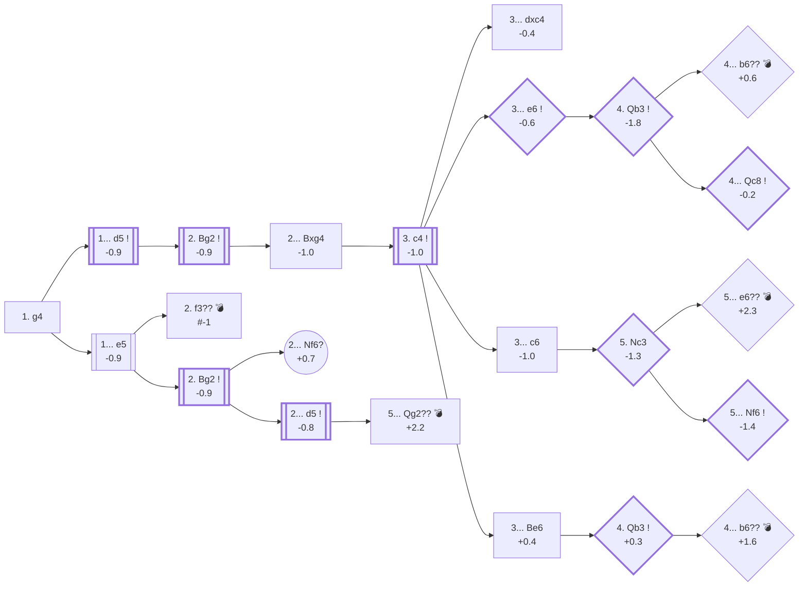

<a name="_TOP_"></a>

# A00 Grob's Attack <br> 1. g4 #

Named after Swiss International Master Henry Grob, who played and analysed it for decades. Widely considered one of the weakest reasonable-looking first moves in chess: the g-pawn advances two squares without developing anything, permanently weakens the long light-square diagonal around the king, and does nothing for the centre. Genuinely dubious rather than merely offbeat — Stockfish already rates it a near-full-pawn worse than any of the main first moves.<br>
<br>
Main ideas in this opening are :
* Bg2 to control the white diagonal
* g4-g5 push to chase Nf6
* trap the opponent to steal the Queen of a careless Black player (see Tip)
<br>

This card goes deeper than most other cards in this repository: **1. g4** is a genuine trap opening, so depth is the actual subject rather than a byproduct to trim (see [start.md](https://github.com/onclemarcel/chess_flashcards/blob/main/start.md#card-depth-and-when-to-split-into-a-new-card)). Seven educational games from [IM Igor Smirnov](https://www.youtube.com/@ChessVideoLessons) (tagged `[IS-1]` through `[IS-7]`, sourced from `transcripts/Smirnov/grob.txt`) are folded in below, each move re-verified against the Lichess explorer and cloud-eval rather than taken at face value from the transcript. Their throughline: at every single fork in the **Fritz Gambit** (2... Bxg4 3. c4), the single *most popular* move among Lichess players is a real, punishable mistake — this isn't a card about rare traps nobody falls for, it's a card about the majority default.

### Overview

*Quick map of every move covered on this card — text and evals match the candidate-move lists below exactly. Node shape is a data-driven category (master-safe / blitz trap / understudied / blunder); see the [shape key](https://github.com/onclemarcel/chess_flashcards/blob/main/start.md#content-diagram-optional) in start.md.*

<!-- content-diagram:start -->

<!-- content-diagram:end -->

<a name="_initial_move_"></a>

[](https://lichess.org/analysis/standard/rnbqkbnr/pppppppp/8/8/6P1/8/PPPPPP1P/RNBQKBNR_b_KQkq_g3_0_1)

*... 1. g4 — Grob's Attack*

```
rnbqkbnr/pppppppp/8/8/6P1/8/PPPPPP1P/RNBQKBNR b KQkq g3 0 1
```

|  | -0.9 |
| --- | --- |

<!-- lichess-stats:start fen="rnbqkbnr/pppppppp/8/8/6P1/8/PPPPPP1P/RNBQKBNR b KQkq g3 0 1" db="lichess,masters" speeds="bullet,blitz" ratings="1800,2000,2200,2500" moves="5" -->
| Move | Online | W/D/B | Masters | W/D/B | |
| :--- | ---: | :--- | ---: | :--- | :-- |
| d5 | 2.8 M (40.4%) | ⬜⬜⬜⬜⬜⬛⬛⬛⬛⬛ 51/4/45 | 121 (66.9%) | ⬜⬜⬜🟫🟫⬛⬛⬛⬛⬛ 26/23/51 |  |
| e5 | 889 k (12.9%) | ⬜⬜⬜⬜⬜⬛⬛⬛⬛⬛ 50/3/46 | 34 (18.8%) | ⬜⬜⬜⬜🟫⬛⬛⬛⬛⬛ 35/15/50 |  |
| c5 | 567 k (8.2%) | ⬜⬜⬜⬜⬜⬛⬛⬛⬛⬛ 48/4/48 | 4 (2.2%) | — | ⚠ |
| e6 | 548 k (8.0%) | ⬜⬜⬜⬜⬜⬛⬛⬛⬛⬛ 49/4/47 | 0 | — | ⚠ |
| c6 | 433 k (6.3%) | ⬜⬜⬜⬜⬜⬛⬛⬛⬛⬛ 49/4/47 | 0 | — | ⚠ |
| d6 | 0 | — | 7 (3.9%) | — |  |
| g6 | 0 | — | 5 (2.8%) | — |  |

*Online: bullet/blitz, 1800+ — 6.9 M games. Masters: 181 games. [Open in the explorer](https://lichess.org/analysis/standard/rnbqkbnr/pppppppp/8/8/6P1/8/PPPPPP1P/RNBQKBNR_b_KQkq_g3_0_1#explorer) — updated 2026-08-24*
<!-- lichess-stats:end -->

### Candidate moves

* [**1... d5**](#_d5_Bg2_) (-0.9, 40.4% online): by far Black's most natural reply, taking the centre immediately — followed in full depth below via the Fritz Gambit.
* [**1... e5**](#_e5_Bg2_) (-0.9, 18.8% masters): also strong, and the move behind both the game's most famous cautionary tale (see the TIP below) and a second cluster of tactical tricks, followed in full depth below.

[*Back to TOP*](#_TOP_)

---

> [!TIP]
> **1. g4?** comes with the game's most famous cautionary tale: the shortest possible loss, if White compounds the mistake.
>
> <a name="_mate_or_trap_"></a>
>
> ### 1. g4 e5 2. f3?? — the shortest game
>
> A typical mate pattern is reached through this sequence: **1. g4? e5 2. f3??**
>
> [](https://lichess.org/analysis/standard/rnbqkbnr/pppp1ppp/8/4p3/6P1/5P2/PPPPP2P/RNBQKBNR_b_KQkq_-_0_2)
>
> *... Shortest game — **Mate in 1** with 2... Qh4#*
>
> ```
> rnbqkbnr/pppp1ppp/8/4p3/6P1/5P2/PPPPP2P/RNBQKBNR b KQkq - 0 2
> ```
>
> |  | #-1 |
> | --- | --- |
>
> <!-- lichess-stats:start fen="rnbqkbnr/pppp1ppp/8/4p3/6P1/5P2/PPPPP2P/RNBQKBNR b KQkq - 0 2" db="lichess,masters" speeds="bullet,blitz" ratings="1800,2000,2200,2500" moves="5" -->
> | Move | Online | W/D/B | Masters | W/D/B | |
> | :--- | ---: | :--- | ---: | :--- | :-- |
> | Qh4# | 5.6 k (42.5%) | ⬛⬛⬛⬛⬛⬛⬛⬛⬛⬛ 0/0/100 | 0 | — | ⚠ |
> | d5 | 3.7 k (27.9%) | ⬜⬜⬛⬛⬛⬛⬛⬛⬛⬛ 20/2/77 | 0 | — | ⚠ |
> | Nc6 | 1.4 k (10.3%) | ⬜⬜⬛⬛⬛⬛⬛⬛⬛⬛ 24/1/75 | 0 | — | ⚠ |
> | d6 | 710 (5.4%) | ⬜⬜⬜⬛⬛⬛⬛⬛⬛⬛ 26/3/72 | 0 | — | ⚠ |
> | Bc5 | 472 (3.6%) | ⬜⬜⬛⬛⬛⬛⬛⬛⬛⬛ 22/1/78 | 0 | — | ⚠ |
> 
> *Online: bullet/blitz, 1800+ — 13 k games. Masters: 0 games. [Open in the explorer](https://lichess.org/analysis/standard/rnbqkbnr/pppp1ppp/8/4p3/6P1/5P2/PPPPP2P/RNBQKBNR_b_KQkq_-_0_2#explorer) — updated 2026-08-24*
> <!-- lichess-stats:end -->
>
> A mirror-image version of this exact trap — reached by the opposite move order, **1. f3 e5 2. g4??**, the same mate-in-1 position — appears on the [Barnes Opening](https://github.com/onclemarcel/chess_flashcards/blob/main/A00_openings/Barnes.md) card.
>
> [*Back to 1. g4*](#_initial_move_)
> [*Back to TOP*](#_TOP_)

---

<a name="_d5_Bg2_"></a>

## 1... d5 2. Bg2

**2. Bg2** is the whole point of **1. g4**: the bishop eyes the long light-square diagonal toward b7/a8, and White is betting Black will grab the free g4 pawn and walk into it.

[](https://lichess.org/analysis/standard/rnbqkbnr/ppp1pppp/8/3p4/6P1/8/PPPPPPBP/RNBQK1NR_b_KQkq_-_1_2)

*... 2. Bg2*

```
rnbqkbnr/ppp1pppp/8/3p4/6P1/8/PPPPPPBP/RNBQK1NR b KQkq - 1 2
```

|  | -0.9 |
| --- | --- |

<!-- lichess-stats:start fen="rnbqkbnr/ppp1pppp/8/3p4/6P1/8/PPPPPPBP/RNBQK1NR b KQkq - 1 2" db="lichess,masters" speeds="bullet,blitz" ratings="1800,2000,2200,2500" moves="6" -->
| Move | Online | W/D/B | Masters | W/D/B | |
| :--- | ---: | :--- | ---: | :--- | :-- |
| Bxg4 | 876 k (38.3%) | ⬜⬜⬜⬜⬜⬜⬛⬛⬛⬛ 56/3/40 | 11 (15.9%) | — |  |
| c6 | 608 k (26.6%) | ⬜⬜⬜⬜⬜⬛⬛⬛⬛⬛ 47/4/49 | 45 (65.2%) | ⬜⬜🟫🟫⬛⬛⬛⬛⬛⬛ 20/18/62 |  |
| e5 | 242 k (10.6%) | ⬜⬜⬜⬜⬜⬛⬛⬛⬛⬛ 52/3/44 | 4 (5.8%) | — | ⚠ |
| e6 | 157 k (6.9%) | ⬜⬜⬜⬜⬜⬛⬛⬛⬛⬛ 50/4/46 | 3 (4.3%) | — | ⚠ |
| c5 | 138 k (6.1%) | ⬜⬜⬜⬜⬜⬛⬛⬛⬛⬛ 49/4/47 | 3 (4.3%) | — | ⚠ |
| Nc6 | 123 k (5.4%) | ⬜⬜⬜⬜⬜⬛⬛⬛⬛⬛ 49/3/47 | 2 (2.9%) | — | ⚠ |

*Online: bullet/blitz, 1800+ — 2.3 M games. Masters: 69 games. [Open in the explorer](https://lichess.org/analysis/standard/rnbqkbnr/ppp1pppp/8/3p4/6P1/8/PPPPPPBP/RNBQK1NR_b_KQkq_-_1_2#explorer) — updated 2026-08-24*
<!-- lichess-stats:end -->

> [!NOTE]
> Masters actually prefer **2... c6** here (65.2%, a small 69-game sample) over grabbing the pawn with **2... Bxg4** (15.9%) — a real online/masters inversion (Bxg4 leads online at 38.3%). c6 stays outside this card's scope for now (no dedicated line built out), but it's worth knowing that declining the pawn *before* it's even offered is the more cautious, more-tested try at the top.

* [**2... Bxg4**](#_Fritz_) (-1.0, 38.3% online): grabs the free pawn — sound, and the line this card follows into the Fritz Gambit below.
* **2... c6**: masters' actual preference (65.2%), not built out further here (backlog).

[*Back to TOP*](#_TOP_)

---

<a name="_Fritz_"></a>

## 2... Bxg4 3. c4 — Fritz Gambit

After **2... Bxg4**, White immediately offers a *second* pawn with **3. c4**, ripping the diagonal open before Black can consolidate the bishop or the extra material. This exact position is tagged live by the Lichess explorer as **"Grob Opening: Grob Gambit, Fritz Gambit"** — a real named sub-line, not an improvisation (confirmed independently by the [Nakamura vs. Mamedyarov](#_real_game_) game at the bottom of this card, played at the very top level).

[](https://lichess.org/analysis/standard/rn1qkbnr/ppp1pppp/8/3p4/2P3b1/8/PP1PPPBP/RNBQK1NR_b_KQkq_c3_0_3)

*... 3. c4 — Fritz Gambit*

```
rn1qkbnr/ppp1pppp/8/3p4/2P3b1/8/PP1PPPBP/RNBQK1NR b KQkq c3 0 3
```

|  | -1.0 |
| --- | --- |

<!-- lichess-stats:start fen="rn1qkbnr/ppp1pppp/8/3p4/2P3b1/8/PP1PPPBP/RNBQK1NR b KQkq c3 0 3" db="lichess,masters" speeds="bullet,blitz" ratings="1800,2000,2200,2500" moves="6" -->
| Move | Online | W/D/B | Masters | W/D/B | |
| :--- | ---: | :--- | ---: | :--- | :-- |
| c6 | 327 k (38.3%) | ⬜⬜⬜⬜⬜⬜⬛⬛⬛⬛ 55/4/41 | 8 (72.7%) | — |  |
| e6 | 180 k (21.0%) | ⬜⬜⬜⬜⬜⬜⬛⬛⬛⬛ 60/3/37 | 0 | — | ⚠ |
| Be6 | 152 k (17.7%) | ⬜⬜⬜⬜⬜⬜⬛⬛⬛⬛ 61/3/36 | 0 | — | ⚠ |
| Nf6 | 96 k (11.2%) | ⬜⬜⬜⬜⬜⬜⬛⬛⬛⬛ 55/3/42 | 2 (18.2%) | — | ⚠ |
| dxc4 | 49 k (5.8%) | ⬜⬜⬜⬜⬜⬛⬛⬛⬛⬛ 52/3/45 | 0 | — | ⚠ |
| Bc8 | 24 k (2.8%) | ⬜⬜⬜⬜⬜⬛⬛⬛⬛⬛ 52/3/45 | 0 | — | ⚠ |
| d4 | 0 | — | 1 (9.1%) | — |  |

*Online: bullet/blitz, 1800+ — 855 k games. Masters: 11 games. [Open in the explorer](https://lichess.org/analysis/standard/rn1qkbnr/ppp1pppp/8/3p4/2P3b1/8/PP1PPPBP/RNBQK1NR_b_KQkq_c3_0_3#explorer) — updated 2026-08-24*
<!-- lichess-stats:end -->

Stockfish confirms this is a real gambit, not a swindle: down two pawns for real compensation, but not full equality — White is playing for practical chances rather than an objective edge. That character holds all the way through every branch below: **declining is more common online than accepting further material** (c6/e6/Be6 combined comfortably outweigh dxc4), and in every single declined branch, the single *most popular* Lichess reply turns out to be a real mistake.

* [**3... dxc4**](#_Fritz_dxc4_) (-0.4, 5.8% online): accepts the second pawn too — see [IS-1] below.
* [**3... e6**](#_Fritz_e6_) (-0.6, 21.0% online): declines, protecting d5 — see [IS-2]/[IS-3] below.
* [**3... c6**](#_Fritz_c6_) (-1.0, 38.3% online): declines, also protecting d5 — see [IS-4]/[IS-5] below.
* [**3... Be6**](#_Fritz_Be6_) (+0.4, 17.7% online): keeps the extra g4 pawn and retreats the bishop to defend d5 directly — see [IS-5] below.

[*Back to TOP*](#_TOP_)

---

<a name="_Fritz_dxc4_"></a>

### 3... dxc4 — Fritz Gambit Accepted [IS-1]

[](https://lichess.org/analysis/standard/rn1qkbnr/ppp1pppp/8/8/2p3b1/8/PP1PPPBP/RNBQK1NR_w_KQkq_-_0_4)

*... 3... dxc4 — Fritz Gambit Accepted*

```
rn1qkbnr/ppp1pppp/8/8/2p3b1/8/PP1PPPBP/RNBQK1NR w KQkq - 0 4
```

|  | -0.4 |
| --- | --- |

Black grabs a second pawn but leaves b7 undefended along White's newly-opened diagonal. A full educational game from [IS-1] shows how sharply this can swing: **4. Bxb7 Nd7 5. h3 Rb8 6. hxg4 Rxb7 7. Na3 Ne5 8. Nxc4** — objectively fine for White (0.0; if Black had recaptured with **8... Nxc4**, **9. Qa4+** wins the knight back via a fork on the 4th rank and the a4-e8 diagonal at once). Instead the sample game continued **8... Qd5 9. Nxe5 Qxh1**, grabbing a whole rook — but White's king is still safe enough to fight on: **10. Qa4+ c6 11. e4 Qxg1+ 12. Ke2 Rb5**, reaching a genuinely messy, roughly balanced material scramble rather than a clean win for either side. This branch is the least sharp of the four — a real fight, not a trap.

[*Back to 3. c4*](#_Fritz_)
[*Back to TOP*](#_TOP_)

---

<a name="_Fritz_e6_"></a>

### 3... e6

[](https://lichess.org/analysis/standard/rn1qkbnr/ppp2ppp/4p3/3p4/2P3b1/8/PP1PPPBP/RNBQK1NR_w_KQkq_-_0_4)

*... 3... e6*

```
rn1qkbnr/ppp2ppp/4p3/3p4/2P3b1/8/PP1PPPBP/RNBQK1NR w KQkq - 0 4
```

|  | -0.6 |
| --- | --- |

<!-- lichess-stats:start fen="rn1qkbnr/ppp2ppp/4p3/3p4/2P3b1/8/PP1PPPBP/RNBQK1NR w KQkq - 0 4" db="lichess,masters" speeds="bullet,blitz" ratings="1800,2000,2200,2500" moves="5" -->
| Move | Online | W/D/B | Masters | W/D/B | |
| :--- | ---: | :--- | ---: | :--- | :-- |
| Qb3 | 86 k (48.1%) | ⬜⬜⬜⬜⬜⬜⬛⬛⬛⬛ 63/3/34 | 0 | — | ⚠ |
| cxd5 | 76 k (42.1%) | ⬜⬜⬜⬜⬜⬜⬛⬛⬛⬛ 58/3/39 | 0 | — | ⚠ |
| Qa4+ | 7.6 k (4.2%) | ⬜⬜⬜⬜⬜⬜⬛⬛⬛⬛ 56/3/41 | 0 | — | ⚠ |
| Nc3 | 6.2 k (3.4%) | ⬜⬜⬜⬜⬜⬛⬛⬛⬛⬛ 51/3/45 | 0 | — | ⚠ |
| c5 | 3.2 k (1.8%) | ⬜⬜⬜⬜⬜⬛⬛⬛⬛⬛ 44/3/53 | 0 | — | ⚠ |

*Online: bullet/blitz, 1800+ — 180 k games. Masters: 0 games. [Open in the explorer](https://lichess.org/analysis/standard/rn1qkbnr/ppp2ppp/4p3/3p4/2P3b1/8/PP1PPPBP/RNBQK1NR_w_KQkq_-_0_4#explorer) — updated 2026-08-24*
<!-- lichess-stats:end -->

**4. Qb3** is the move that causes most of the damage in this whole branch: it eyes b7 *and* the still-undefended d5 pawn at once.

[](https://lichess.org/analysis/standard/rn1qkbnr/ppp2ppp/4p3/3p4/2P3b1/1Q6/PP1PPPBP/RNB1K1NR_b_KQkq_-_1_4)

*... 4. Qb3*

```
rn1qkbnr/ppp2ppp/4p3/3p4/2P3b1/1Q6/PP1PPPBP/RNB1K1NR b KQkq - 1 4
```

|  | -1.8 |
| --- | --- |

<!-- lichess-stats:start fen="rn1qkbnr/ppp2ppp/4p3/3p4/2P3b1/1Q6/PP1PPPBP/RNB1K1NR b KQkq - 1 4" db="lichess,masters" speeds="bullet,blitz" ratings="1800,2000,2200,2500" moves="7" -->
| Move | Online | W/D/B | Masters | W/D/B | |
| :--- | ---: | :--- | ---: | :--- | :-- |
| b6 | 27 k (31.0%) | ⬜⬜⬜⬜⬜⬜⬜⬛⬛⬛ 72/3/25 | 0 | — | ⚠ |
| Nd7 | 16 k (18.0%) | ⬜⬜⬜⬜⬜⬛⬛⬛⬛⬛ 53/3/44 | 0 | — | ⚠ |
| Qc8 | 12 k (14.4%) | ⬜⬜⬜⬜⬜⬜⬜⬛⬛⬛ 69/3/28 | 0 | — | ⚠ |
| Nf6 | 10 k (11.9%) | ⬜⬜⬜⬜⬜⬛⬛⬛⬛⬛ 53/3/44 | 0 | — | ⚠ |
| c6 | 9.5 k (11.0%) | ⬜⬜⬜⬜⬜⬛⬛⬛⬛⬛ 53/3/44 | 0 | — | ⚠ |
| Nc6 | 5.2 k (6.1%) | ⬜⬜⬜⬜⬜⬜⬛⬛⬛⬛ 61/3/35 | 0 | — | ⚠ |
| dxc4 | 3.3 k (3.8%) | ⬜⬜⬜⬜⬜⬜⬜⬜⬛⬛ 79/3/18 | 0 | — | ⚠ |

*Online: bullet/blitz, 1800+ — 86 k games. Masters: 0 games. [Open in the explorer](https://lichess.org/analysis/standard/rn1qkbnr/ppp2ppp/4p3/3p4/2P3b1/1Q6/PP1PPPBP/RNB1K1NR_b_KQkq_-_1_4#explorer) — updated 2026-08-24*
<!-- lichess-stats:end -->

* [**4... b6??**](#_Fritz_e6_b6_) — Black's single *most popular* reply here (31.0% online) — and a real blunder. See the TIP below.
* [**4... Qc8**](#_Fritz_e6_Qc8_) (-0.2, 14.4% online): the accurate defence — see [IS-3] below.

[*Back to 3. c4*](#_Fritz_)
[*Back to TOP*](#_TOP_)

---

> [!TIP]
> **4... b6??** is the single most-played move online at this exact position (31.0%) — and it hands White a two-and-a-half-pawn swing. This is the card's whole thesis in miniature: the "natural-looking" move to defend b7 is the losing one.
>
> <a name="_Fritz_e6_b6_"></a>
>
> ### 3... e6 4. Qb3 b6?? — the most popular move is the losing one [IS-2]
>
> [](https://lichess.org/analysis/standard/rn1qkbnr/p1p2ppp/1p2p3/3p4/2P3b1/1Q6/PP1PPPBP/RNB1K1NR_w_KQkq_-_0_5)
>
> *... 4... b6?? — the b7 pawn's own defender opens the diagonal for White's queen*
>
> ```
> rn1qkbnr/p1p2ppp/1p2p3/3p4/2P3b1/1Q6/PP1PPPBP/RNB1K1NR w KQkq - 0 5
> ```
>
> |  | +0.6 |
> | --- | --- |
>
> The point is **5. cxd5!**, and the b6 pawn no longer covers c5 or supports a recapture the way it looked like it would — White simply keeps rolling with a free extra pawn and the bishop's diagonal wide open. The sample game continued **5... e5 6. Qe3**, and White never looked back. Black's actual problem isn't b7 at all — it's that **b6** does nothing to solve the real issue (the hanging d5 pawn and the open diagonal); the queen on b3 was never truly threatening b7 directly in a way that pawn move fixes.
>
> [*Back to 3... e6*](#_Fritz_e6_)
> [*Back to TOP*](#_TOP_)

---

<a name="_Fritz_e6_Qc8_"></a>

### 3... e6 4. Qb3 Qc8 — the accurate defence [IS-3]

[](https://lichess.org/analysis/standard/rnq1kbnr/ppp2ppp/4p3/3p4/2P3b1/1Q6/PP1PPPBP/RNB1K1NR_w_KQkq_-_2_5)

*... 4... Qc8 — sidesteps b3's pressure without weakening anything*

```
rnq1kbnr/ppp2ppp/4p3/3p4/2P3b1/1Q6/PP1PPPBP/RNB1K1NR w KQkq - 2 5
```

|  | -0.2 |
| --- | --- |

Rather than move a pawn that weakens the queenside, Black simply steps the queen aside. Play stays sharp but stays in Black's favour throughout the sample game: **5. cxd5 c6 6. h3 Bf5 7. Nc3 exd5 8. Nxd5!** — a real piece sacrifice, landing the knight back on d5 with an eye on b7 and f7 again — **8... Be6**, pinning the knight against White's own queen on b3, **9. Qa4** escaping the pin while re-pinning the b7 pawn, **9... b5** trying to break the pin, **10. Qc2** re-establishing it. A genuinely rich middlegame, not a trap — this is what "Black defends correctly" actually looks like in the Fritz Gambit.

[*Back to 3... e6*](#_Fritz_e6_)
[*Back to TOP*](#_TOP_)

---

<a name="_Fritz_c6_"></a>

### 3... c6

[](https://lichess.org/analysis/standard/rn1qkbnr/pp2pppp/2p5/3p4/2P3b1/8/PP1PPPBP/RNBQK1NR_w_KQkq_-_0_4)

*... 3... c6*

```
rn1qkbnr/pp2pppp/2p5/3p4/2P3b1/8/PP1PPPBP/RNBQK1NR w KQkq - 0 4
```

|  | -1.0 |
| --- | --- |

<!-- lichess-stats:start fen="rn1qkbnr/pp2pppp/2p5/3p4/2P3b1/8/PP1PPPBP/RNBQK1NR w KQkq - 0 4" db="lichess,masters" speeds="bullet,blitz" ratings="1800,2000,2200,2500" moves="5" -->
| Move | Online | W/D/B | Masters | W/D/B | |
| :--- | ---: | :--- | ---: | :--- | :-- |
| cxd5 | 327 k (71.5%) | ⬜⬜⬜⬜⬜⬜⬛⬛⬛⬛ 57/4/40 | 4 (50.0%) | — | ⚠ |
| Qb3 | 122 k (26.7%) | ⬜⬜⬜⬜⬜🟫⬛⬛⬛⬛ 52/4/44 | 4 (50.0%) | — | ⚠ |
| Nc3 | 3.5 k (0.8%) | ⬜⬜⬜⬜🟫⬛⬛⬛⬛⬛ 42/4/54 | 0 | — | ⚠ |
| Qa4 | 2.6 k (0.6%) | ⬜⬜⬜⬜⬜⬛⬛⬛⬛⬛ 49/3/48 | 0 | — | ⚠ |
| c5 | 739 (0.2%) | ⬜⬜⬜⬜⬛⬛⬛⬛⬛⬛ 36/3/61 | 0 | — | ⚠ |

*Online: bullet/blitz, 1800+ — 457 k games. Masters: 8 games. [Open in the explorer](https://lichess.org/analysis/standard/rn1qkbnr/pp2pppp/2p5/3p4/2P3b1/8/PP1PPPBP/RNBQK1NR_w_KQkq_-_0_4#explorer) — updated 2026-08-24*
<!-- lichess-stats:end -->

**4. cxd5 cxd5** leaves the d5 pawn isolated.

[](https://lichess.org/analysis/standard/rn1qkbnr/pp2pppp/8/3p4/6b1/8/PP1PPPBP/RNBQK1NR_w_KQkq_-_0_5)

*... 4. cxd5 cxd5*

```
rn1qkbnr/pp2pppp/8/3p4/6b1/8/PP1PPPBP/RNBQK1NR w KQkq - 0 5
```

<!-- lichess-stats:start fen="rn1qkbnr/pp2pppp/8/3p4/6b1/8/PP1PPPBP/RNBQK1NR w KQkq - 0 5" db="lichess,masters" speeds="bullet,blitz" ratings="1800,2000,2200,2500" moves="4" -->
| Move | Online | W/D/B | Masters | W/D/B | |
| :--- | ---: | :--- | ---: | :--- | :-- |
| Qb3 | 221 k (77.3%) | ⬜⬜⬜⬜⬜⬜⬛⬛⬛⬛ 59/3/38 | 4 (100.0%) | — | ⚠ |
| Nc3 | 52 k (18.2%) | ⬜⬜⬜⬜⬜⬜⬛⬛⬛⬛ 58/4/38 | 0 | — | ⚠ |
| Qa4+ | 12 k (4.1%) | ⬜⬜⬜⬜⬜⬛⬛⬛⬛⬛ 46/4/50 | 0 | — | ⚠ |
| d4 | 335 (0.1%) | ⬜⬜⬜⬜⬛⬛⬛⬛⬛⬛ 39/4/56 | 0 | — | ⚠ |

*Online: bullet/blitz, 1800+ — 286 k games. Masters: 4 games. [Open in the explorer](https://lichess.org/analysis/standard/rn1qkbnr/pp2pppp/8/3p4/6b1/8/PP1PPPBP/RNBQK1NR_w_KQkq_-_0_5#explorer) — updated 2026-08-24*
<!-- lichess-stats:end -->

White's own most popular follow-up here is actually **5. Qb3** (77.3% online, transposing toward the same b7/d5 pressure already seen in the 3... e6 and 3... Be6 branches above) — not built out separately here. **5. Nc3** (18.2% online) is a real, well-tested alternative move order, and it's the one this card's educational example follows: it develops a piece first, and this is where the sharpest trap on the whole card lives.

[](https://lichess.org/analysis/standard/rn1qkbnr/pp2pppp/8/3p4/6b1/2N5/PP1PPPBP/R1BQK1NR_b_KQkq_-_1_5)

*... 4. cxd5 cxd5 5. Nc3*

```
rn1qkbnr/pp2pppp/8/3p4/6b1/2N5/PP1PPPBP/R1BQK1NR b KQkq - 1 5
```

|  | -1.3 |
| --- | --- |

<!-- lichess-stats:start fen="rn1qkbnr/pp2pppp/8/3p4/6b1/2N5/PP1PPPBP/R1BQK1NR b KQkq - 1 5" db="lichess,masters" speeds="bullet,blitz" ratings="1800,2000,2200,2500" moves="6" -->
| Move | Online | W/D/B | Masters | W/D/B | |
| :--- | ---: | :--- | ---: | :--- | :-- |
| e6 | 25 k (48.1%) | ⬜⬜⬜⬜⬜⬜⬜⬛⬛⬛ 65/3/32 | 0 | — | ⚠ |
| Nf6 | 20 k (38.7%) | ⬜⬜⬜⬜⬜⬛⬛⬛⬛⬛ 51/4/45 | 0 | — | ⚠ |
| Be6 | 3.2 k (6.2%) | ⬜⬜⬜⬜⬜⬜⬛⬛⬛⬛ 58/5/37 | 0 | — | ⚠ |
| Nc6 | 1.9 k (3.7%) | ⬜⬜⬜⬜⬜⬛⬛⬛⬛⬛ 48/3/48 | 0 | — | ⚠ |
| d4 | 759 (1.5%) | ⬜⬜⬜⬜⬜⬛⬛⬛⬛⬛ 52/4/44 | 0 | — | ⚠ |
| Bd7 | 506 (1.0%) | ⬜⬜⬜⬜⬜⬛⬛⬛⬛⬛ 50/3/47 | 0 | — | ⚠ |

*Online: bullet/blitz, 1800+ — 52 k games. Masters: 0 games. [Open in the explorer](https://lichess.org/analysis/standard/rn1qkbnr/pp2pppp/8/3p4/6b1/2N5/PP1PPPBP/R1BQK1NR_b_KQkq_-_1_5#explorer) — updated 2026-08-24*
<!-- lichess-stats:end -->

* [**5... e6??**](#_Fritz_c6_e6_) — Black's single *most popular* reply here (48.1% online), and by far the worst mistake on this whole card. See the TIP below.
* [**5... Nf6**](#_Fritz_c6_Nf6_) (-1.4, 38.7% online): the accurate defence — see [IS-5] below.

[*Back to 3. c4*](#_Fritz_)
[*Back to TOP*](#_TOP_)

---

> [!TIP]
> **5... e6??** looks like the most natural move on the board — it develops, defends d5's neighbourhood, prepares to castle — and it's the single most-played reply here online (48.1%). It also swings the evaluation by over three and a half pawns.
>
> <a name="_Fritz_c6_e6_"></a>
>
> ### 3... c6 4. cxd5 cxd5 5. Nc3 e6?? — the biggest swing on this card [IS-4]
>
> [](https://lichess.org/analysis/standard/rn1qkbnr/pp3ppp/4p3/3p4/6b1/2N5/PP1PPPBP/R1BQK1NR_w_KQkq_-_0_6)
>
> *... 5... e6?? — a completely normal-looking move that loses material by force*
>
> ```
> rn1qkbnr/pp3ppp/4p3/3p4/6b1/2N5/PP1PPPBP/R1BQK1NR w KQkq - 0 6
> ```
>
> |  | +2.3 |
> | --- | --- |
>
> The point is **6. Qa4+**: this single check does double duty, since **a4** also sits on the same rank as the bishop on g4 — the king must move or block, and the bishop stays hanging on g4 with nothing defending it (no black pawn or piece covers that square). Whatever Black plays next, White simply follows up by winning the bishop, cashing in a full piece for nothing.
>
> [*Back to 3... c6*](#_Fritz_c6_)
> [*Back to TOP*](#_TOP_)

---

<a name="_Fritz_c6_Nf6_"></a>

### 3... c6 4. cxd5 cxd5 5. Nc3 Nf6 — the accurate defence [IS-5]

[](https://lichess.org/analysis/standard/rn1qkb1r/pp2pppp/5n2/3p4/6b1/2N5/PP1PPPBP/R1BQK1NR_w_KQkq_-_2_6)

*... 5... Nf6 — defends d5 with a piece rather than a pawn*

```
rn1qkb1r/pp2pppp/5n2/3p4/6b1/2N5/PP1PPPBP/R1BQK1NR w KQkq - 2 6
```

|  | -1.4 |
| --- | --- |

Avoiding the e6?? trap doesn't mean Black escapes clean, though — it's worth knowing White still has real practical chances even here. The sample game continued **6. Qb3 e6** (safe now that the knight, not a pawn, covers d5) **7. Qxb7!** — White simply grabs the b7 pawn anyway, since it was never really defended — **7... Nbd7 8. Nb5**, eyeing a fork on c7, **8... Rc8 9. h3**, still hunting for more with the bishop hanging on g4. Black stays clearly better throughout (matching the evaluation on this whole branch), but White keeps generating threats move after move — exactly the practical, low-risk-for-White character this whole gambit is built around.

[*Back to 3... c6*](#_Fritz_c6_)
[*Back to TOP*](#_TOP_)

---

<a name="_Fritz_Be6_"></a>

### 3... Be6

Rather than decline the second pawn offer, Black keeps the g4 pawn already grabbed and retreats the bishop to defend d5 directly instead of leaving it on g4.

[](https://lichess.org/analysis/standard/rn1qkbnr/ppp1pppp/4b3/3p4/2P5/8/PP1PPPBP/RNBQK1NR_w_KQkq_-_1_4)

*... 3... Be6 — keeps the pawn, defends d5 with the bishop*

```
rn1qkbnr/ppp1pppp/4b3/3p4/2P5/8/PP1PPPBP/RNBQK1NR w KQkq - 1 4
```

|  | +0.4 |
| --- | --- |

<!-- lichess-stats:start fen="rn1qkbnr/ppp1pppp/4b3/3p4/2P5/8/PP1PPPBP/RNBQK1NR w KQkq - 1 4" db="lichess,masters" speeds="bullet,blitz" ratings="1800,2000,2200,2500" moves="5" -->
| Move | Online | W/D/B | Masters | W/D/B | |
| :--- | ---: | :--- | ---: | :--- | :-- |
| Qb3 | 130 k (85.7%) | ⬜⬜⬜⬜⬜⬜⬛⬛⬛⬛ 62/3/35 | 0 | — | ⚠ |
| Nc3 | 11 k (7.3%) | ⬜⬜⬜⬜⬜⬜⬛⬛⬛⬛ 55/4/40 | 0 | — | ⚠ |
| cxd5 | 9.3 k (6.1%) | ⬜⬜⬜⬜⬜⬛⬛⬛⬛⬛ 47/5/48 | 0 | — | ⚠ |
| Qa4+ | 1.0 k (0.7%) | ⬜⬜⬜⬜⬜⬛⬛⬛⬛⬛ 46/4/50 | 0 | — | ⚠ |
| d4 | 129 (0.1%) | ⬜⬜⬜⬜⬜🟫⬛⬛⬛⬛ 48/6/46 | 0 | — | ⚠ |

*Online: bullet/blitz, 1800+ — 152 k games. Masters: 0 games. [Open in the explorer](https://lichess.org/analysis/standard/rn1qkbnr/ppp1pppp/4b3/3p4/2P5/8/PP1PPPBP/RNBQK1NR_w_KQkq_-_1_4#explorer) — updated 2026-08-24*
<!-- lichess-stats:end -->

This is the one branch of the four where holding onto the extra pawn actually costs Black the advantage — Stockfish already prefers White slightly. **4. Qb3** repeats the exact same idea as the 3... e6 branch above, attacking b7 and d5 at once.

[](https://lichess.org/analysis/standard/rn1qkbnr/ppp1pppp/4b3/3p4/2P5/1Q6/PP1PPPBP/RNB1K1NR_b_KQkq_-_2_4)

*... 4. Qb3*

```
rn1qkbnr/ppp1pppp/4b3/3p4/2P5/1Q6/PP1PPPBP/RNB1K1NR b KQkq - 2 4
```

|  | +0.3 |
| --- | --- |

<!-- lichess-stats:start fen="rn1qkbnr/ppp1pppp/4b3/3p4/2P5/1Q6/PP1PPPBP/RNB1K1NR b KQkq - 2 4" db="lichess,masters" speeds="bullet,blitz" ratings="1800,2000,2200,2500" moves="6" -->
| Move | Online | W/D/B | Masters | W/D/B | |
| :--- | ---: | :--- | ---: | :--- | :-- |
| b6 | 35 k (26.9%) | ⬜⬜⬜⬜⬜⬜⬛⬛⬛⬛ 61/3/36 | 0 | — | ⚠ |
| c6 | 24 k (18.7%) | ⬜⬜⬜⬜⬜⬜⬛⬛⬛⬛ 57/4/39 | 0 | — | ⚠ |
| Bc8 | 20 k (15.1%) | ⬜⬜⬜⬜⬜⬜⬛⬛⬛⬛ 56/4/41 | 0 | — | ⚠ |
| dxc4 | 16 k (12.5%) | ⬜⬜⬜⬜⬜⬜⬜⬜⬛⬛ 80/3/17 | 0 | — | ⚠ |
| Qc8 | 13 k (9.7%) | ⬜⬜⬜⬜⬜⬜⬛⬛⬛⬛ 60/3/37 | 0 | — | ⚠ |
| Nf6 | 8.4 k (6.4%) | ⬜⬜⬜⬜⬜⬜⬛⬛⬛⬛ 62/3/35 | 0 | — | ⚠ |

*Online: bullet/blitz, 1800+ — 130 k games. Masters: 0 games. [Open in the explorer](https://lichess.org/analysis/standard/rn1qkbnr/ppp1pppp/4b3/3p4/2P5/1Q6/PP1PPPBP/RNB1K1NR_b_KQkq_-_2_4#explorer) — updated 2026-08-24*
<!-- lichess-stats:end -->

[**4... b6??**](#_Fritz_Be6_b6_) is once again the single *most popular* reply online (26.9%) — the exact same idea recurring for a third time in this gambit. See the TIP below.

[*Back to 3. c4*](#_Fritz_)
[*Back to TOP*](#_TOP_)

---

> [!TIP]
> The same **b6??** idea that punished 3... e6 recurs here, one more time — and it's still the single most popular online reply (26.9%).
>
> <a name="_Fritz_Be6_b6_"></a>
>
> ### 3... Be6 4. Qb3 b6?? — the same trap, a third time [IS-5]
>
> [](https://lichess.org/analysis/standard/rn1qkbnr/p1p1pppp/1p2b3/3p4/2P5/1Q6/PP1PPPBP/RNB1K1NR_w_KQkq_-_0_5)
>
> *... 4... b6?? — the bishop on e6 will now have to retreat again*
>
> ```
> rn1qkbnr/p1p1pppp/1p2b3/3p4/2P5/1Q6/PP1PPPBP/RNB1K1NR w KQkq - 0 5
> ```
>
> |  | +1.6 |
> | --- | --- |
>
> **5. cxd5** chases the bishop off e6, and Black has to spend yet another tempo retreating it: **5... Bd7** (played in the sample game — **5... Bc8** is more accurate, simply undoing the whole manoeuvre, but still a lost tempo either way) **6. Nf3 Nf6 7. Ne5**, and White's development lead has become a real, lasting asset rather than just gambit-style practical chances.
>
> [*Back to 3... Be6*](#_Fritz_Be6_)
> [*Back to TOP*](#_TOP_)

---

<a name="_e5_Bg2_"></a>

## 1... e5 2. Bg2

Away from the d5/Fritz Gambit complex entirely, **1... e5** sidesteps White's whole light-square diagonal plan — until White plays **2. Bg2** anyway and aims the bishop at a different long diagonal instead (a1-h8 this time, via the coming d4 break).

[](https://lichess.org/analysis/standard/rnbqkbnr/pppp1ppp/8/4p3/6P1/8/PPPPPPBP/RNBQK1NR_b_KQkq_-_1_2)

*... 2. Bg2*

```
rnbqkbnr/pppp1ppp/8/4p3/6P1/8/PPPPPPBP/RNBQK1NR b KQkq - 1 2
```

|  | -0.9 |
| --- | --- |

<!-- lichess-stats:start fen="rnbqkbnr/pppp1ppp/8/4p3/6P1/8/PPPPPPBP/RNBQK1NR b KQkq - 1 2" db="lichess,masters" speeds="bullet,blitz" ratings="1800,2000,2200,2500" moves="6" -->
| Move | Online | W/D/B | Masters | W/D/B | |
| :--- | ---: | :--- | ---: | :--- | :-- |
| d5 | 361 k (50.3%) | ⬜⬜⬜⬜⬜⬛⬛⬛⬛⬛ 52/3/44 | 3 (18.8%) | — | ⚠ |
| Nc6 | 122 k (17.0%) | ⬜⬜⬜⬜⬜⬛⬛⬛⬛⬛ 48/4/49 | 4 (25.0%) | — | ⚠ |
| d6 | 78 k (10.9%) | ⬜⬜⬜⬜⬜⬛⬛⬛⬛⬛ 51/4/45 | 0 | — | ⚠ |
| Bc5 | 48 k (6.6%) | ⬜⬜⬜⬜⬜⬛⬛⬛⬛⬛ 50/3/47 | 1 (6.2%) | — | ⚠ |
| c6 | 34 k (4.8%) | ⬜⬜⬜⬜⬜⬛⬛⬛⬛⬛ 50/4/46 | 0 | — | ⚠ |
| h5 | 17 k (2.4%) | ⬜⬜⬜⬜⬛⬛⬛⬛⬛⬛ 41/4/55 | 6 (37.5%) | — |  |
| Ne7 | 0 | — | 2 (12.5%) | — |  |

*Online: bullet/blitz, 1800+ — 717 k games. Masters: 16 games. [Open in the explorer](https://lichess.org/analysis/standard/rnbqkbnr/pppp1ppp/8/4p3/6P1/8/PPPPPPBP/RNBQK1NR_b_KQkq_-_1_2#explorer) — updated 2026-08-24*
<!-- lichess-stats:end -->

* [**2... Nf6?**](#_e5_Nf6_) (+0.7, 2.1% online): natural-looking development that actually walks into a tactical trick — see [IS-6] below.
* [**2... d5**](#_e5_d5_) (-0.8, 50.3% online): by far the most popular and soundest try, threatening g4 directly — see [IS-7] below.

[*Back to TOP*](#_TOP_)

---

> [!TIP]
> **2... Nf6?** looks like normal development, but it ignores that White's g-pawn can simply chase it — and the knight has nowhere good to go from there.
>
> <a name="_e5_Nf6_"></a>
>
> ### 1... e5 2. Bg2 Nf6? — the knight gets chased into trouble [IS-6]
>
> [](https://lichess.org/analysis/standard/rnbqkb1r/pppp1ppp/5n2/4p3/6P1/8/PPPPPPBP/RNBQK1NR_w_KQkq_-_2_3)
>
> *... 2... Nf6? — g5 is coming*
>
> ```
> rnbqkb1r/pppp1ppp/5n2/4p3/6P1/8/PPPPPPBP/RNBQK1NR w KQkq - 2 3
> ```
>
> |  | +0.7 |
> | --- | --- |
>
> **3. g5** chases the knight immediately, and **3... Nh5** is already awkward: the knight has no good square to retreat to next (h3 and f4 are both covered or unavailable), so it risks getting trapped outright a move or two later. Then **4. d4** strikes at the centre while defending g5 at the same time — and if Black grabs the pawn with **4... exd4?**, the point is that **5. Bf3** hits the stranded knight on h5 directly, while **Qxd4** would simultaneously threaten the rook on h8. Evaluation swings to +1.6 for White. The lesson isn't really about one move — it's that **2... Nf6?** commits to a square White can attack for free, and every follow-up compounds it.
>
> [*Back to 1... e5 2. Bg2*](#_e5_Bg2_)
> [*Back to TOP*](#_TOP_)

---

<a name="_e5_d5_"></a>

### 1... e5 2. Bg2 d5 [IS-7]

[](https://lichess.org/analysis/standard/rnbqkbnr/ppp2ppp/8/3pp3/6P1/8/PPPPPPBP/RNBQK1NR_w_KQkq_d6_0_3)

*... 2... d5 — directly threatens g4*

```
rnbqkbnr/ppp2ppp/8/3pp3/6P1/8/PPPPPPBP/RNBQK1NR w KQkq d6 0 3
```

|  | -0.8 |
| --- | --- |

Sound and the most popular try by a wide margin — but it opens the door to one more sharp trick if White is willing to sacrifice a pawn back: **3. g5** drags the queen forward, **3... Qxg5 4. Bxd5**, recapturing while eyeing f7, **4... Nf6**, developing with tempo on the bishop, **5. Nf3**, quietly setting a trap of its own rather than simply retreating.

[](https://lichess.org/analysis/standard/rnb1kb1r/ppp2ppp/5n2/3Bp1q1/8/5N2/PPPPPP1P/RNBQK2R_b_KQkq_-_2_5)

*... 5. Nf3 — the queen looks safe, but g2 is a trap*

```
rnb1kb1r/ppp2ppp/5n2/3Bp1q1/8/5N2/PPPPPP1P/RNBQK2R b KQkq - 2 5
```

|  | -0.7 |
| --- | --- |

[*Back to 1... e5 2. Bg2*](#_e5_Bg2_)
[*Back to TOP*](#_TOP_)

---

> [!TIP]
> **5... Qg2??** grabs a seemingly free pawn on an open square — but the queen has just walked into a net with no square in the top-right corner of the board to escape to.
>
> <a name="_e5_d5_Qg2_"></a>
>
> ### 1... e5 2. Bg2 d5 3. g5 Qxg5 4. Bxd5 Nf6 5. Nf3 Qg2?? — the queen trap
>
> [](https://lichess.org/analysis/standard/rnb1kb1r/ppp2ppp/5n2/3Bp3/8/5N2/PPPPPPqP/RNBQK2R_w_KQkq_-_3_6)
>
> *... 5... Qg2?? — looks like a free pawn, is actually the losing move*
>
> ```
> rnb1kb1r/ppp2ppp/5n2/3Bp3/8/5N2/PPPPPPqP/RNBQK2R w KQkq - 3 6
> ```
>
> |  | +2.2 |
> | --- | --- |
>
> The point is **6. Bxf7+!** first — a zwischenzug, forcing the king to recapture (**6... Kxf7**) before White springs the real trap — **7. Rg1**, and the queen on g2 has nowhere safe left to go: the rook attacks it directly down the g-file, h2 and h1 are covered by White's own pieces, and every other escape square runs straight into the rook, the knight on f3, or the king. The queen is simply lost.
>
> [*Back to 1... e5 2. Bg2 d5*](#_e5_d5_)
> [*Back to TOP*](#_TOP_)

---

<a name="_real_game_"></a>

## A real example: Nakamura vs Mamedyarov, 2019

Even players in the actual world top 10 have opened with 1. g4 in serious competition — not as a joke, but as a deliberate surprise weapon against elite preparation. **Hikaru Nakamura** (White, 2749, world #2 at the time) played it against **Shakhriyar Mamedyarov** (Black, 2817, also world #2 that same month) in the 2019 PRO Chess League Group Stage, reaching the exact Fritz Gambit tabiya covered above.

[](https://lichess.org/analysis/standard/rn1qkbnr/ppp1pppp/8/3p4/2P3b1/8/PP1PPPBP/RNBQK1NR_b_KQkq_c3_0_3)

*... 1. g4 d5 2. Bg2 Bxg4 3. c4 — Grob Gambit, Fritz Gambit*

```
rn1qkbnr/ppp1pppp/8/3p4/2P3b1/8/PP1PPPBP/RNBQK1NR b KQkq c3 0 3
```

|  | -1.0 |
| --- | --- |

The game itself lived up to the gambit's character: sharp play on both sides, a rook-and-opposite-coloured-pieces middlegame skirmish, and a draw by move 43.

The full game, move by move:

```
[Event "PRO League Group Stage"]
[Site "chess.com INT"]
[Date "2019.03.13"]
[Round "10"]
[White "Nakamura, Hi"]
[Black "Mamedyarov, S."]
[Result "1/2-1/2"]
[WhiteElo "2749"]
[BlackElo "2817"]
[ECO "A00"]
[Opening "Grob Opening: Grob Gambit, Fritz Gambit"]

1. g4 d5 2. Bg2 Bxg4 3. c4 c6 4. Qb3 Qd7 5. cxd5 Nf6 6. Nc3 cxd5 7. Nxd5 Nc6
8. d3 Nxd5 9. Qxd5 e5 10. Qxd7+ Kxd7 11. Nf3 Bxf3 12. exf3 Bd6 13. Be3 Nb4
14. Kd2 f5 15. f4 exf4 16. Bd4 Nc6 17. Bc3 Rhe8 18. h4 g6 19. Rag1 Bc5
20. Rh2 Kc7 21. Bxc6 Kxc6 22. h5 Re6 23. hxg6 hxg6 24. Rh6 Bxf2 25. Rgxg6
Rxg6 26. Rxg6+ Kd5 27. Rf6 Be3+ 28. Ke2 Rg8 29. Rxf5+ Ke6 30. Rf6+ Kd5
31. Rf5+ Ke6 32. Re5+ Kd6 33. Kf3 Bd2 34. Bd4 Be3 35. Bc3 Bd2 36. Ra5 Rg3+
37. Ke4 Re3+ 38. Kd4 Re2 39. Bxd2 Rxd2 40. Kc3 Rd1 41. Rf5 Rf1 42. Kd4 Rf2
43. b3 1/2-1/2
```

For the full interactive board — every move clickable, engine bar included — see the [live game on Lichess](https://lichess.org/63pcIJI1), sourced straight from the Lichess masters database (`topGames` on the explorer query for this exact position) rather than reconstructed from a screenshot or a secondary source.

[*Back to 1. g4*](#_initial_move_)
[*Back to TOP*](#_TOP_)
