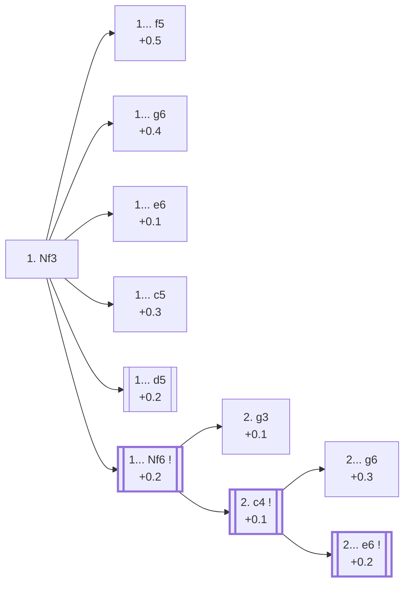

<a name="_TOP_"></a>

# A04 Zukertort Opening <br> 1. Nf3 #

**1. Nf3**, the Zukertort Opening (commonly called the Réti Opening once White follows up with c4/g3/b3 rather than d4), develops a piece before committing any central pawn. It is the third most popular first move at master level (10.2%, see [A00 Start Position](https://github.com/onclemarcel/chess_flashcards/blob/main/A00_Start.md)) precisely because it is so flexible: most lines simply transpose into 1. d4 or 1. c4 territory once White's second move is played, while keeping the option to swerve into an independent King's Indian Attack setup instead.

### Overview

*Quick map of every move covered on this card — text and evals match the candidate-move lists below exactly. Node shape is a data-driven category (master-safe / blitz trap / understudied / blunder); see the [shape key](https://github.com/onclemarcel/chess_flashcards/blob/main/start.md#content-diagram-optional) in start.md. Hover a node for its ECO code and variation name; click to jump to its section.*

<!-- content-diagram:start -->

<!-- content-diagram:end -->

<a name="_Nf3_"></a>

[](https://lichess.org/analysis/standard/rnbqkbnr/pppppppp/8/8/8/5N2/PPPPPPPP/RNBQKB1R_b_KQkq_-_1_1)

*... 1. Nf3 — Zukertort Opening*

```
rnbqkbnr/pppppppp/8/8/8/5N2/PPPPPPPP/RNBQKB1R b KQkq - 1 1
```

<!-- lichess-stats:start fen="rnbqkbnr/pppppppp/8/8/8/5N2/PPPPPPPP/RNBQKB1R b KQkq - 1 1" db="lichess,masters" speeds="bullet,blitz" ratings="1800,2000,2200,2500" moves="10" -->
| Move | Online | W/D/B | Masters | W/D/B | |
| :--- | ---: | :--- | ---: | :--- | :-- |
| d5 | 36.0 M (28.2%) | ⬜⬜⬜⬜⬜🟫⬛⬛⬛⬛ 52/5/43 | 89 k (30.2%) | ⬜⬜⬜🟫🟫🟫🟫🟫⬛⬛ 32/46/22 |  |
| Nf6 | 26.1 M (20.4%) | ⬜⬜⬜⬜⬜🟫⬛⬛⬛⬛ 50/6/44 | 136 k (46.4%) | ⬜⬜⬜🟫🟫🟫🟫🟫⬛⬛ 34/46/21 |  |
| c5 | 14.1 M (11.1%) | ⬜⬜⬜⬜⬜🟫⬛⬛⬛⬛ 51/5/44 | 33 k (11.4%) | ⬜⬜⬜🟫🟫🟫🟫⬛⬛⬛ 31/44/25 |  |
| e6 | 11.4 M (8.9%) | ⬜⬜⬜⬜⬜🟫⬛⬛⬛⬛ 53/5/42 | 4.3 k (1.5%) | ⬜⬜⬜⬜🟫🟫🟫🟫⬛⬛ 39/40/21 |  |
| g6 | 8.3 M (6.5%) | ⬜⬜⬜⬜⬜🟫⬛⬛⬛⬛ 50/5/45 | 13 k (4.6%) | ⬜⬜⬜🟫🟫🟫🟫⬛⬛⬛ 34/38/29 |  |
| c6 | 7.8 M (6.1%) | ⬜⬜⬜⬜⬜🟫⬛⬛⬛⬛ 51/5/44 | 0 | — | ⚠ |
| d6 | 7.6 M (6.0%) | ⬜⬜⬜⬜⬜🟫⬛⬛⬛⬛ 51/5/44 | 6.7 k (2.3%) | ⬜⬜⬜⬜🟫🟫🟫⬛⬛⬛ 36/36/28 |  |
| Nc6 | 4.7 M (3.7%) | ⬜⬜⬜⬜⬜🟫⬛⬛⬛⬛ 53/4/43 | 1.6 k (0.5%) | ⬜⬜⬜⬜🟫🟫🟫🟫⬛⬛ 39/38/23 |  |
| e5 | 4.3 M (3.3%) | ⬜⬜⬜⬜⬜⬛⬛⬛⬛⬛ 52/4/44 | 0 | — | ⚠ |
| b6 | 3.4 M (2.6%) | ⬜⬜⬜⬜⬜🟫⬛⬛⬛⬛ 53/5/43 | 1.2 k (0.4%) | ⬜⬜⬜🟫🟫🟫🟫⬛⬛⬛ 33/40/27 |  |
| f5 | 0 | — | 6.9 k (2.4%) | ⬜⬜⬜⬜🟫🟫🟫🟫⬛⬛ 40/37/23 |  |
| b5 | 0 | — | 465 (0.2%) | ⬜⬜⬜⬜🟫🟫🟫⬛⬛⬛ 38/36/26 |  |

*Online: bullet/blitz, 1800+ — 127.8 M games. Masters: 293 k games. [Open in the explorer](https://lichess.org/analysis/standard/rnbqkbnr/pppppppp/8/8/8/5N2/PPPPPPPP/RNBQKB1R_b_KQkq_-_1_1#explorer) — updated 2026-08-23*
<!-- lichess-stats:end -->

### Candidate moves

* [**1... f5**](#_f5_) (+0.5): a Dutch-style try — rare, and White's extra flexibility (no committed d-pawn yet) makes it less testing than against 1. d4 f5
* [**1... g6**](#_g6_) (+0.4): flexible, keeping King's Indian/Grünfeld/Modern move orders open
* [**1... c5**](#_c5_) (+0.3): the "Sicilian Invitation" — a real try (11.4% masters) daring White into a reversed-Sicilian-flavoured game
* [**1... d5**](#_d5_) (+0.2): the classical, most thematic reply to the Réti idea — masters' clear #2 (30.2%)
* [**1... e6**](#_e6_) (+0.1): flexible, keeps French/QGD/Nimzo-style setups available — played far more online (8.9%) than in masters (1.5%)
* [**1... Nf6**](#_Nf6_) (+0.2): masters' top choice (46.4%) — covered below

[*Back to TOP*](#_TOP_)

---

> [!NOTE]
> **1... d5** is the move most identified with the Réti idea proper: Black occupies the centre immediately and White can choose whether to challenge it with c4, fianchetto with g3, or transpose into 1. d4 lines with d4 itself.
>
> <a name="_d5_"></a>
>
> ### 1... d5
>
> [](https://lichess.org/analysis/standard/rnbqkbnr/ppp1pppp/8/3p4/8/5N2/PPPPPPPP/RNBQKB1R_w_KQkq_d6_0_2)
>
> *... 1. Nf3 d5*
>
> ```
> rnbqkbnr/ppp1pppp/8/3p4/8/5N2/PPPPPPPP/RNBQKB1R w KQkq d6 0 2
> ```
>
> |  | +0.2 |
> | --- | --- |
>
> <!-- lichess-stats:start fen="rnbqkbnr/ppp1pppp/8/3p4/8/5N2/PPPPPPPP/RNBQKB1R w KQkq d6 0 2" db="lichess,masters" speeds="bullet,blitz" ratings="1800,2000,2200,2500" moves="5" -->
> | Move | Online | W/D/B | Masters | W/D/B | |
> | :--- | ---: | :--- | ---: | :--- | :-- |
> | g3 | 11.1 M (30.8%) | ⬜⬜⬜⬜⬜🟫⬛⬛⬛⬛ 53/5/41 | 35 k (39.7%) | ⬜⬜⬜⬜🟫🟫🟫🟫⬛⬛ 34/44/22 |  |
> | d4 | 10.1 M (28.0%) | ⬜⬜⬜⬜⬜🟫⬛⬛⬛⬛ 51/5/44 | 26 k (29.7%) | ⬜⬜⬜🟫🟫🟫🟫🟫⬛⬛ 28/53/20 |  |
> | c4 | 6.0 M (16.6%) | ⬜⬜⬜⬜⬜🟫⬛⬛⬛⬛ 53/5/42 | 18 k (19.8%) | ⬜⬜⬜⬜🟫🟫🟫🟫⬛⬛ 34/42/24 |  |
> | e3 | 2.3 M (6.4%) | ⬜⬜⬜⬜⬜🟫⬛⬛⬛⬛ 52/5/43 | 5.3 k (6.0%) | ⬜⬜⬜⬜🟫🟫🟫🟫⬛⬛ 37/42/21 |  |
> | b3 | 2.0 M (5.5%) | ⬜⬜⬜⬜⬜🟫⬛⬛⬛⬛ 52/5/43 | 3.7 k (4.2%) | ⬜⬜⬜🟫🟫🟫🟫⬛⬛⬛ 32/42/27 |  |
> 
> *Online: bullet/blitz, 1800+ — 36.0 M games. Masters: 89 k games. [Open in the explorer](https://lichess.org/analysis/standard/rnbqkbnr/ppp1pppp/8/3p4/8/5N2/PPPPPPPP/RNBQKB1R_w_KQkq_d6_0_2#explorer) — updated 2026-08-23*
> <!-- lichess-stats:end -->
>
> [*Back to 1. Nf3*](#_Nf3_)
> [*Back to TOP*](#_TOP_)

---

> [!NOTE]
> **1... c5**, the "Sicilian Invitation", most often continues 2. c4 (a genuine Symmetrical English) or 2. e4 (transposing straight into an actual Sicilian Defense).
>
> <a name="_c5_"></a>
>
> ### 1... c5 — Sicilian Invitation
>
> [](https://lichess.org/analysis/standard/rnbqkbnr/pp1ppppp/8/2p5/8/5N2/PPPPPPPP/RNBQKB1R_w_KQkq_c6_0_2)
>
> *... 1. Nf3 c5 — Sicilian Invitation*
>
> ```
> rnbqkbnr/pp1ppppp/8/2p5/8/5N2/PPPPPPPP/RNBQKB1R w KQkq c6 0 2
> ```
>
> |  | +0.3 |
> | --- | --- |
>
> <!-- lichess-stats:start fen="rnbqkbnr/pp1ppppp/8/2p5/8/5N2/PPPPPPPP/RNBQKB1R w KQkq c6 0 2" db="lichess,masters" speeds="bullet,blitz" ratings="1800,2000,2200,2500" moves="5" -->
> | Move | Online | W/D/B | Masters | W/D/B | |
> | :--- | ---: | :--- | ---: | :--- | :-- |
> | g3 | 4.7 M (33.0%) | ⬜⬜⬜⬜⬜🟫⬛⬛⬛⬛ 52/5/42 | 6.8 k (20.4%) | ⬜⬜⬜🟫🟫🟫🟫⬛⬛⬛ 31/39/30 |  |
> | c4 | 2.8 M (19.8%) | ⬜⬜⬜⬜⬜🟫⬛⬛⬛⬛ 51/6/43 | 20 k (59.1%) | ⬜⬜⬜🟫🟫🟫🟫🟫⬛⬛ 31/45/23 |  |
> | d4 | 1.9 M (13.7%) | ⬜⬜⬜⬜⬜⬛⬛⬛⬛⬛ 49/4/47 | 0 | — | ⚠ |
> | e4 | 1.2 M (8.6%) | ⬜⬜⬜⬜⬜⬛⬛⬛⬛⬛ 48/5/47 | 3.8 k (11.2%) | ⬜⬜⬜🟫🟫🟫🟫🟫⬛⬛ 34/45/21 |  |
> | e3 | 1.0 M (7.3%) | ⬜⬜⬜⬜⬜🟫⬛⬛⬛⬛ 50/5/44 | 865 (2.6%) | ⬜⬜⬜🟫🟫🟫🟫⬛⬛⬛ 34/39/28 |  |
> | b3 | 0 | — | 1.7 k (5.1%) | ⬜⬜⬜🟫🟫🟫🟫⬛⬛⬛ 30/40/29 |  |
> 
> *Online: bullet/blitz, 1800+ — 14.1 M games. Masters: 33 k games. [Open in the explorer](https://lichess.org/analysis/standard/rnbqkbnr/pp1ppppp/8/2p5/8/5N2/PPPPPPPP/RNBQKB1R_w_KQkq_c6_0_2#explorer) — updated 2026-08-23*
> <!-- lichess-stats:end -->
>
> [*Back to 1. Nf3*](#_Nf3_)
> [*Back to TOP*](#_TOP_)

---

> [!NOTE]
> **1... g6** stays flexible, ready to meet either c4 or d4 with a King's Indian/Grünfeld/Modern-style fianchetto.
>
> <a name="_g6_"></a>
>
> ### 1... g6
>
> [](https://lichess.org/analysis/standard/rnbqkbnr/pppppp1p/6p1/8/8/5N2/PPPPPPPP/RNBQKB1R_w_KQkq_-_0_2)
>
> *... 1. Nf3 g6*
>
> ```
> rnbqkbnr/pppppp1p/6p1/8/8/5N2/PPPPPPPP/RNBQKB1R w KQkq - 0 2
> ```
>
> |  | +0.4 |
> | --- | --- |
>
> <!-- lichess-stats:start fen="rnbqkbnr/pppppp1p/6p1/8/8/5N2/PPPPPPPP/RNBQKB1R w KQkq - 0 2" db="lichess,masters" speeds="bullet,blitz" ratings="1800,2000,2200,2500" moves="5" -->
> | Move | Online | W/D/B | Masters | W/D/B | |
> | :--- | ---: | :--- | ---: | :--- | :-- |
> | g3 | 2.8 M (33.7%) | ⬜⬜⬜⬜⬜🟫⬛⬛⬛⬛ 51/5/44 | 2.8 k (20.7%) | ⬜⬜⬜🟫🟫🟫⬛⬛⬛⬛ 30/35/35 |  |
> | d4 | 2.3 M (27.2%) | ⬜⬜⬜⬜⬜⬛⬛⬛⬛⬛ 50/5/45 | 4.3 k (31.8%) | ⬜⬜⬜🟫🟫🟫🟫⬛⬛⬛ 35/39/26 |  |
> | c4 | 993 k (11.9%) | ⬜⬜⬜⬜⬜🟫⬛⬛⬛⬛ 50/5/45 | 3.3 k (24.8%) | ⬜⬜⬜🟫🟫🟫🟫⬛⬛⬛ 32/38/30 |  |
> | e4 | 587 k (7.0%) | ⬜⬜⬜⬜⬜⬛⬛⬛⬛⬛ 50/5/46 | 3.0 k (22.2%) | ⬜⬜⬜⬜🟫🟫🟫🟫⬛⬛ 37/39/24 |  |
> | e3 | 448 k (5.4%) | ⬜⬜⬜⬜⬜⬛⬛⬛⬛⬛ 49/5/46 | 24 (0.2%) | ⬜⬜⬜🟫🟫🟫🟫⬛⬛⬛ 25/42/33 |  |
> 
> *Online: bullet/blitz, 1800+ — 8.3 M games. Masters: 13 k games. [Open in the explorer](https://lichess.org/analysis/standard/rnbqkbnr/pppppp1p/6p1/8/8/5N2/PPPPPPPP/RNBQKB1R_w_KQkq_-_0_2#explorer) — updated 2026-08-23*
> <!-- lichess-stats:end -->
>
> [*Back to 1. Nf3*](#_Nf3_)
> [*Back to TOP*](#_TOP_)

---

> [!NOTE]
> **1... f5** invites a Dutch-style game, but White has not yet committed the d-pawn and can meet it flexibly (2. g3, 2. c4 or 2. d4 all transpose favourably).
>
> <a name="_f5_"></a>
>
> ### 1... f5
>
> [](https://lichess.org/analysis/standard/rnbqkbnr/ppppp1pp/8/5p2/8/5N2/PPPPPPPP/RNBQKB1R_w_KQkq_f6_0_2)
>
> *... 1. Nf3 f5*
>
> ```
> rnbqkbnr/ppppp1pp/8/5p2/8/5N2/PPPPPPPP/RNBQKB1R w KQkq f6 0 2
> ```
>
> |  | +0.5 |
> | --- | --- |
>
> <!-- lichess-stats:start fen="rnbqkbnr/ppppp1pp/8/5p2/8/5N2/PPPPPPPP/RNBQKB1R w KQkq f6 0 2" db="lichess,masters" speeds="bullet,blitz" ratings="1800,2000,2200,2500" moves="5" -->
> | Move | Online | W/D/B | Masters | W/D/B | |
> | :--- | ---: | :--- | ---: | :--- | :-- |
> | g3 | 670 k (28.7%) | ⬜⬜⬜⬜⬜🟫⬛⬛⬛⬛ 52/5/43 | 2.6 k (37.8%) | ⬜⬜⬜⬜🟫🟫🟫🟫⬛⬛ 40/40/20 |  |
> | d4 | 622 k (26.6%) | ⬜⬜⬜⬜⬜⬛⬛⬛⬛⬛ 49/5/46 | 1.5 k (22.3%) | ⬜⬜⬜⬜🟫🟫🟫🟫⬛⬛ 37/40/23 |  |
> | c4 | 276 k (11.8%) | ⬜⬜⬜⬜⬜🟫⬛⬛⬛⬛ 50/5/45 | 999 (14.5%) | ⬜⬜⬜⬜🟫🟫🟫🟫⬛⬛ 38/37/25 |  |
> | d3 | 249 k (10.7%) | ⬜⬜⬜⬜⬜🟫⬛⬛⬛⬛ 53/5/42 | 1.0 k (14.8%) | ⬜⬜⬜⬜⬜🟫🟫🟫⬛⬛ 45/32/23 |  |
> | e4 | 161 k (6.9%) | ⬜⬜⬜⬜⬜🟫⬛⬛⬛⬛ 54/4/42 | 0 | — | ⚠ |
> | b3 | 0 | — | 346 (5.0%) | ⬜⬜⬜⬜🟫🟫🟫⬛⬛⬛ 43/32/25 |  |
> 
> *Online: bullet/blitz, 1800+ — 2.3 M games. Masters: 6.9 k games. [Open in the explorer](https://lichess.org/analysis/standard/rnbqkbnr/ppppp1pp/8/5p2/8/5N2/PPPPPPPP/RNBQKB1R_w_KQkq_f6_0_2#explorer) — updated 2026-08-23*
> <!-- lichess-stats:end -->
>
> [*Back to 1. Nf3*](#_Nf3_)
> [*Back to TOP*](#_TOP_)

---

> [!NOTE]
> **1... e6**, played far more online (8.9%) than in masters play (1.5%), keeps French/QGD/Nimzo move orders flexible without yet revealing which one Black is aiming for.
>
> <a name="_e6_"></a>
>
> ### 1... e6
>
> [](https://lichess.org/analysis/standard/rnbqkbnr/pppp1ppp/4p3/8/8/5N2/PPPPPPPP/RNBQKB1R_w_KQkq_-_0_2)
>
> *... 1. Nf3 e6*
>
> ```
> rnbqkbnr/pppp1ppp/4p3/8/8/5N2/PPPPPPPP/RNBQKB1R w KQkq - 0 2
> ```
>
> |  | +0.1 |
> | --- | --- |
>
> <!-- lichess-stats:start fen="rnbqkbnr/pppp1ppp/4p3/8/8/5N2/PPPPPPPP/RNBQKB1R w KQkq - 0 2" db="lichess,masters" speeds="bullet,blitz" ratings="1800,2000,2200,2500" moves="5" -->
> | Move | Online | W/D/B | Masters | W/D/B | |
> | :--- | ---: | :--- | ---: | :--- | :-- |
> | g3 | 3.6 M (32.1%) | ⬜⬜⬜⬜⬜⬜⬛⬛⬛⬛ 55/5/40 | 1.6 k (37.0%) | ⬜⬜⬜⬜🟫🟫🟫🟫⬛⬛ 44/37/20 |  |
> | d4 | 2.9 M (25.6%) | ⬜⬜⬜⬜⬜🟫⬛⬛⬛⬛ 52/5/43 | 375 (8.7%) | ⬜⬜⬜🟫🟫🟫🟫🟫⬛⬛ 31/46/24 |  |
> | c4 | 1.6 M (14.3%) | ⬜⬜⬜⬜⬜🟫⬛⬛⬛⬛ 53/5/42 | 2.0 k (47.1%) | ⬜⬜⬜⬜🟫🟫🟫🟫⬛⬛ 38/41/20 |  |
> | e4 | 779 k (6.8%) | ⬜⬜⬜⬜⬜⬛⬛⬛⬛⬛ 49/4/47 | 102 (2.4%) | ⬜⬜⬜⬜🟫🟫🟫🟫⬛⬛ 37/43/20 |  |
> | d3 | 638 k (5.6%) | ⬜⬜⬜⬜⬜🟫⬛⬛⬛⬛ 54/4/42 | 0 | — | ⚠ |
> | b3 | 0 | — | 154 (3.6%) | ⬜⬜⬜🟫🟫🟫🟫⬛⬛⬛ 34/38/27 |  |
> 
> *Online: bullet/blitz, 1800+ — 11.4 M games. Masters: 4.3 k games. [Open in the explorer](https://lichess.org/analysis/standard/rnbqkbnr/pppp1ppp/4p3/8/8/5N2/PPPPPPPP/RNBQKB1R_w_KQkq_-_0_2#explorer) — updated 2026-08-23*
> <!-- lichess-stats:end -->
>
> [*Back to 1. Nf3*](#_Nf3_)
> [*Back to TOP*](#_TOP_)

---

<a name="_Nf6_"></a>

## 1... Nf6

Masters' top choice (46.4%): Black mirrors White's flexible development rather than committing a central pawn yet.

[](https://lichess.org/analysis/standard/rnbqkb1r/pppppppp/5n2/8/8/5N2/PPPPPPPP/RNBQKB1R_w_KQkq_-_2_2)

*... 1. Nf3 Nf6 — Zukertort Opening*

```
rnbqkb1r/pppppppp/5n2/8/8/5N2/PPPPPPPP/RNBQKB1R w KQkq - 2 2
```

<!-- lichess-stats:start fen="rnbqkb1r/pppppppp/5n2/8/8/5N2/PPPPPPPP/RNBQKB1R w KQkq - 2 2" db="lichess,masters" speeds="bullet,blitz" ratings="1800,2000,2200,2500" moves="8" -->
| Move | Online | W/D/B | Masters | W/D/B | |
| :--- | ---: | :--- | ---: | :--- | :-- |
| g3 | 9.0 M (34.4%) | ⬜⬜⬜⬜⬜🟫⬛⬛⬛⬛ 51/6/43 | 37 k (27.1%) | ⬜⬜⬜⬜🟫🟫🟫🟫⬛⬛ 35/43/22 |  |
| d4 | 6.3 M (24.3%) | ⬜⬜⬜⬜⬜🟫⬛⬛⬛⬛ 49/6/45 | 12 k (8.8%) | ⬜⬜⬜🟫🟫🟫🟫🟫⬛⬛ 29/49/22 |  |
| c4 | 5.1 M (19.5%) | ⬜⬜⬜⬜⬜🟫⬛⬛⬛⬛ 51/6/43 | 81 k (59.6%) | ⬜⬜⬜🟫🟫🟫🟫🟫⬛⬛ 34/46/19 |  |
| b3 | 1.6 M (6.1%) | ⬜⬜⬜⬜⬜🟫⬛⬛⬛⬛ 50/6/44 | 4.5 k (3.3%) | ⬜⬜⬜🟫🟫🟫🟫⬛⬛⬛ 31/42/26 |  |
| e3 | 1.3 M (4.9%) | ⬜⬜⬜⬜⬜🟫⬛⬛⬛⬛ 49/6/45 | 1.1 k (0.8%) | ⬜⬜⬜🟫🟫🟫🟫⬛⬛⬛ 33/41/26 |  |
| d3 | 1.2 M (4.6%) | ⬜⬜⬜⬜⬜⬛⬛⬛⬛⬛ 50/5/45 | 212 (0.2%) | ⬜⬜⬜🟫🟫🟫⬛⬛⬛⬛ 30/31/39 |  |
| Nc3 | 788 k (3.0%) | ⬜⬜⬜⬜⬜⬛⬛⬛⬛⬛ 49/5/47 | 39 (0.0%) | ⬜⬜⬜🟫🟫🟫🟫🟫⬛⬛ 31/54/15 |  |
| e4 | 370 k (1.4%) | ⬜⬜⬜⬜⬜⬛⬛⬛⬛⬛ 50/4/46 | 0 | — | ⚠ |
| b4 | 0 | — | 208 (0.2%) | ⬜⬜⬜🟫🟫🟫🟫⬛⬛⬛ 29/45/26 |  |

*Online: bullet/blitz, 1800+ — 26.1 M games. Masters: 136 k games. [Open in the explorer](https://lichess.org/analysis/standard/rnbqkb1r/pppppppp/5n2/8/8/5N2/PPPPPPPP/RNBQKB1R_w_KQkq_-_2_2#explorer) — updated 2026-08-23*
<!-- lichess-stats:end -->

* [**2. c4**](#_Nf6_c4_) (+0.1): masters' clear favourite (59.6%) — transposes toward English/Indian territory, covered below
* [**2. g3**](#_Nf6_g3_) (+0.1): the more distinctly "Réti" try (27.1% of masters games) — King's Indian Attack-style fianchetto, keeping c4 in reserve

[*Back to 1. Nf3*](#_Nf3_)
[*Back to TOP*](#_TOP_)

---

> [!NOTE]
> **2. g3** is the try most true to the original Réti idea: White fianchettoes first and only later decides between c4 and d4 (or neither, in a genuine King's Indian Attack setup with e4 instead).
>
> <a name="_Nf6_g3_"></a>
>
> ### 1... Nf6 2. g3
>
> [](https://lichess.org/analysis/standard/rnbqkb1r/pppppppp/5n2/8/8/5NP1/PPPPPP1P/RNBQKB1R_b_KQkq_-_0_2)
>
> *... 1. Nf3 Nf6 2. g3*
>
> ```
> rnbqkb1r/pppppppp/5n2/8/8/5NP1/PPPPPP1P/RNBQKB1R b KQkq - 0 2
> ```
>
> |  | +0.1 |
> | --- | --- |
>
> [*Back to 1... Nf6*](#_Nf6_)
> [*Back to TOP*](#_TOP_)

---

<a name="_Nf6_c4_"></a>

## 1... Nf6 2. c4

White's most tested try (59.6% of masters games), transposing toward the same English/Indian tabiyas reached from 1. c4 or 1. d4.

[](https://lichess.org/analysis/standard/rnbqkb1r/pppppppp/5n2/8/2P5/5N2/PP1PPPPP/RNBQKB1R_b_KQkq_c3_0_2)

*... 1. Nf3 Nf6 2. c4 — English Opening: Anglo-Indian Defense, King's Knight Variation*

```
rnbqkb1r/pppppppp/5n2/8/2P5/5N2/PP1PPPPP/RNBQKB1R b KQkq c3 0 2
```

<!-- lichess-stats:start fen="rnbqkb1r/pppppppp/5n2/8/2P5/5N2/PP1PPPPP/RNBQKB1R b KQkq c3 0 2" db="lichess,masters" speeds="bullet,blitz" ratings="1800,2000,2200,2500" moves="8" -->
| Move | Online | W/D/B | Masters | W/D/B | |
| :--- | ---: | :--- | ---: | :--- | :-- |
| g6 | 2.8 M (42.3%) | ⬜⬜⬜⬜⬜🟫⬛⬛⬛⬛ 50/6/44 | 31 k (34.6%) | ⬜⬜⬜⬜🟫🟫🟫🟫⬛⬛ 37/42/21 |  |
| e6 | 1.6 M (24.1%) | ⬜⬜⬜⬜⬜🟫⬛⬛⬛⬛ 51/6/43 | 32 k (35.4%) | ⬜⬜⬜🟫🟫🟫🟫🟫⬛⬛ 32/50/18 |  |
| c5 | 737 k (11.3%) | ⬜⬜⬜⬜⬜🟫⬛⬛⬛⬛ 51/7/42 | 13 k (14.8%) | ⬜⬜⬜🟫🟫🟫🟫🟫⬛⬛ 32/50/18 |  |
| d6 | 388 k (5.9%) | ⬜⬜⬜⬜⬜🟫⬛⬛⬛⬛ 52/6/43 | 1.9 k (2.1%) | ⬜⬜⬜⬜🟫🟫🟫🟫⬛⬛ 42/35/23 |  |
| d5 | 340 k (5.2%) | ⬜⬜⬜⬜⬜🟫⬛⬛⬛⬛ 54/5/41 | 104 (0.1%) | ⬜⬜⬜⬜⬜🟫🟫🟫⬛⬛ 53/33/14 |  |
| c6 | 322 k (4.9%) | ⬜⬜⬜⬜⬜🟫⬛⬛⬛⬛ 51/7/43 | 5.3 k (5.8%) | ⬜⬜⬜🟫🟫🟫🟫🟫⬛⬛ 34/47/19 |  |
| b6 | 175 k (2.7%) | ⬜⬜⬜⬜⬜🟫⬛⬛⬛⬛ 49/7/43 | 6.1 k (6.8%) | ⬜⬜⬜🟫🟫🟫🟫🟫⬛⬛ 28/49/22 |  |
| Nc6 | 155 k (2.4%) | ⬜⬜⬜⬜⬜🟫⬛⬛⬛⬛ 54/5/41 | 285 (0.3%) | ⬜⬜⬜⬜🟫🟫🟫⬛⬛⬛ 41/33/26 |  |

*Online: bullet/blitz, 1800+ — 6.5 M games. Masters: 91 k games. [Open in the explorer](https://lichess.org/analysis/standard/rnbqkb1r/pppppppp/5n2/8/2P5/5N2/PP1PPPPP/RNBQKB1R_b_KQkq_c3_0_2#explorer) — updated 2026-08-23*
<!-- lichess-stats:end -->

* [**2... e6**](#_Nf6_c4_e6_) (+0.2): masters' top choice, virtually tied with g6 (35.4% vs 34.6%) — covered below
* [**2... g6**](#_Nf6_c4_g6_) (+0.3): essentially co-main (34.6%) — the King's Indian-style fianchetto

[*Back to 1... Nf6*](#_Nf6_)
[*Back to TOP*](#_TOP_)

---

> [!NOTE]
> **2... g6** and 2... e6 are close enough at master level (34.6% vs 35.4%) to be treated as a genuine coin-flip rather than a clear main line vs sideline.
>
> <a name="_Nf6_c4_g6_"></a>
>
> ### 1... Nf6 2. c4 g6
>
> [](https://lichess.org/analysis/standard/rnbqkb1r/pppppp1p/5np1/8/2P5/5N2/PP1PPPPP/RNBQKB1R_w_KQkq_-_0_3)
>
> *... 1. Nf3 Nf6 2. c4 g6 — English Opening: Anglo-Indian Defense, King's Indian Formation*
>
> ```
> rnbqkb1r/pppppp1p/5np1/8/2P5/5N2/PP1PPPPP/RNBQKB1R w KQkq - 0 3
> ```
>
> |  | +0.3 |
> | --- | --- |
>
> [*Back to 1... Nf6 2. c4*](#_Nf6_c4_)
> [*Back to TOP*](#_TOP_)

---

<a name="_Nf6_c4_e6_"></a>

### 1... Nf6 2. c4 e6

Black's (barely) most tested try, keeping ... d5, ... Bb4 and ... b6 all available depending on White's next move.

[](https://lichess.org/analysis/standard/rnbqkb1r/pppp1ppp/4pn2/8/2P5/5N2/PP1PPPPP/RNBQKB1R_w_KQkq_-_0_3)

*... 1. Nf3 Nf6 2. c4 e6*

```
rnbqkb1r/pppp1ppp/4pn2/8/2P5/5N2/PP1PPPPP/RNBQKB1R w KQkq - 0 3
```

|  | +0.2 |
| --- | --- |

Play typically continues 3. d4, transposing directly into the [1. d4 Nf6 2. c4 e6](https://github.com/onclemarcel/chess_flashcards/blob/main/d4_openings/A40_d4_QPG.md#_Nf6_c4_e6_) tabiya — the two cards meet here.

[*Back to 1... Nf6 2. c4*](#_Nf6_c4_)
[*Back to TOP*](#_TOP_)
