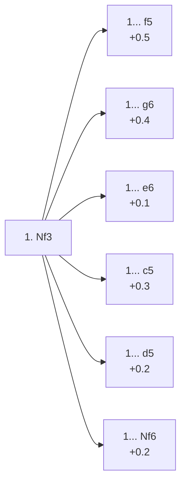

<a name="_TOP_"></a>

# A04 Zukertort Opening <br> 1. Nf3 #

**1. Nf3**, the Zukertort Opening (commonly called the Réti Opening once White follows up with c4/g3/b3 rather than d4), develops a piece before committing any central pawn. It is the third most popular first move at master level (10.2%, see [A00 Start Position](https://github.com/onclemarcel/chess_flashcards/blob/main/A00_Start.md)) precisely because it is so flexible: most lines simply transpose into 1. d4 or 1. c4 territory once White's second move is played, while keeping the option to swerve into an independent King's Indian Attack setup instead.

**Corrected 2026-08-25**: this card used to build out **1... Nf6** and **1... d5** in full, but both — masters' top two replies (46.4% and 30.2%) — are live-tagged **A05** and **A06** respectively, not A04 (the same pattern first found on `D04_Colle_System.md`/`D05_Colle_System.md`) — split off into [`A05_Zukertort_Nf6.md`](https://github.com/onclemarcel/chess_flashcards/blob/main/Nf3_openings/A05_Zukertort_Nf6.md) and [`A06_Zukertort_d5.md`](https://github.com/onclemarcel/chess_flashcards/blob/main/Nf3_openings/A06_Zukertort_d5.md). A04 itself stays the correct code for every *other* reply below — which, after both splits, means the five real A04-coded siblings (c5, e6, g6, c6, d6, f5, and the rest of the long tail) now make up the *entire* content of this card.

### Overview

*Quick map of every move covered on this card — text and evals match the candidate-move lists below exactly. Node shape is a data-driven category (master-safe / blitz trap / understudied / blunder); see the [shape key](https://github.com/onclemarcel/chess_flashcards/blob/main/start.md#content-diagram-optional) in start.md. Hover a node for its ECO code and variation name; click to jump to its section.*

<!-- content-diagram:start -->

<!-- content-diagram:end -->

<a name="_Nf3_"></a>

[](https://lichess.org/analysis/standard/rnbqkbnr/pppppppp/8/8/8/5N2/PPPPPPPP/RNBQKB1R_b_KQkq_-_1_1)

*... 1. Nf3 — Zukertort Opening*

```
rnbqkbnr/pppppppp/8/8/8/5N2/PPPPPPPP/RNBQKB1R b KQkq - 1 1
```

<!-- lichess-stats:start fen="rnbqkbnr/pppppppp/8/8/8/5N2/PPPPPPPP/RNBQKB1R b KQkq - 1 1" db="lichess,masters" speeds="bullet,blitz" ratings="1800,2000,2200,2500" moves="10" -->
| Move | Online | W/D/B | Masters | W/D/B | |
| :--- | ---: | :--- | ---: | :--- | :-- |
| d5 | 36.0 M (28.2%) | ⬜⬜⬜⬜⬜🟫⬛⬛⬛⬛ 52/5/43 | 89 k (30.2%) | ⬜⬜⬜🟫🟫🟫🟫🟫⬛⬛ 32/46/22 |  |
| Nf6 | 26.1 M (20.4%) | ⬜⬜⬜⬜⬜🟫⬛⬛⬛⬛ 50/6/44 | 136 k (46.4%) | ⬜⬜⬜🟫🟫🟫🟫🟫⬛⬛ 34/46/21 |  |
| c5 | 14.1 M (11.1%) | ⬜⬜⬜⬜⬜🟫⬛⬛⬛⬛ 51/5/44 | 33 k (11.4%) | ⬜⬜⬜🟫🟫🟫🟫⬛⬛⬛ 31/44/25 |  |
| e6 | 11.4 M (8.9%) | ⬜⬜⬜⬜⬜🟫⬛⬛⬛⬛ 53/5/42 | 4.3 k (1.5%) | ⬜⬜⬜⬜🟫🟫🟫🟫⬛⬛ 39/40/21 |  |
| g6 | 8.3 M (6.5%) | ⬜⬜⬜⬜⬜🟫⬛⬛⬛⬛ 50/5/45 | 13 k (4.6%) | ⬜⬜⬜🟫🟫🟫🟫⬛⬛⬛ 34/38/29 |  |
| c6 | 7.8 M (6.1%) | ⬜⬜⬜⬜⬜🟫⬛⬛⬛⬛ 51/5/44 | 0 | — | ⚠ |
| d6 | 7.6 M (6.0%) | ⬜⬜⬜⬜⬜🟫⬛⬛⬛⬛ 51/5/44 | 6.7 k (2.3%) | ⬜⬜⬜⬜🟫🟫🟫⬛⬛⬛ 36/36/28 |  |
| Nc6 | 4.7 M (3.7%) | ⬜⬜⬜⬜⬜🟫⬛⬛⬛⬛ 53/4/43 | 1.6 k (0.5%) | ⬜⬜⬜⬜🟫🟫🟫🟫⬛⬛ 39/38/23 |  |
| e5 | 4.3 M (3.3%) | ⬜⬜⬜⬜⬜⬛⬛⬛⬛⬛ 52/4/44 | 0 | — | ⚠ |
| b6 | 3.4 M (2.6%) | ⬜⬜⬜⬜⬜🟫⬛⬛⬛⬛ 53/5/43 | 1.2 k (0.4%) | ⬜⬜⬜🟫🟫🟫🟫⬛⬛⬛ 33/40/27 |  |
| f5 | 0 | — | 6.9 k (2.4%) | ⬜⬜⬜⬜🟫🟫🟫🟫⬛⬛ 40/37/23 |  |
| b5 | 0 | — | 465 (0.2%) | ⬜⬜⬜⬜🟫🟫🟫⬛⬛⬛ 38/36/26 |  |

*Online: bullet/blitz, 1800+ — 127.8 M games. Masters: 293 k games. [Open in the explorer](https://lichess.org/analysis/standard/rnbqkbnr/pppppppp/8/8/8/5N2/PPPPPPPP/RNBQKB1R_b_KQkq_-_1_1#explorer) — updated 2026-08-25*
<!-- lichess-stats:end -->

### Candidate moves

* [**1... f5**](#_f5_) (+0.5): a Dutch-style try — rare, and White's extra flexibility (no committed d-pawn yet) makes it less testing than against 1. d4 f5
* [**1... g6**](#_g6_) (+0.4): flexible, keeping King's Indian/Grünfeld/Modern move orders open
* [**1... c5**](#_c5_) (+0.3): the "Sicilian Invitation" — a real try (11.4% masters) daring White into a reversed-Sicilian-flavoured game
* [**1... d5**](https://github.com/onclemarcel/chess_flashcards/blob/main/Nf3_openings/A06_Zukertort_d5.md) (+0.2, 30.2% masters): the classical, most thematic reply to the Réti idea — this is **A06**, not A04, covered on its own card.
* [**1... e6**](#_e6_) (+0.1): flexible, keeps French/QGD/Nimzo-style setups available — played far more online (8.9%) than in masters (1.5%)
* [**1... Nf6**](https://github.com/onclemarcel/chess_flashcards/blob/main/Nf3_openings/A05_Zukertort_Nf6.md) (+0.2, 46.4% masters): masters' top choice — this is **A05**, not A04, covered on its own card.

[*Back to TOP*](#_TOP_)

---

> [!NOTE]
> **1... c5**, the "Sicilian Invitation", most often continues 2. c4 (a genuine Symmetrical English) or 2. e4 (transposing straight into an actual Sicilian Defense).
>
> <a name="_c5_"></a>
>
> ### 1... c5 — Sicilian Invitation
>
> [](https://lichess.org/analysis/standard/rnbqkbnr/pp1ppppp/8/2p5/8/5N2/PPPPPPPP/RNBQKB1R_w_KQkq_c6_0_2)
>
> *... 1. Nf3 c5 — Sicilian Invitation*
>
> ```
> rnbqkbnr/pp1ppppp/8/2p5/8/5N2/PPPPPPPP/RNBQKB1R w KQkq c6 0 2
> ```
>
> |  | +0.3 |
> | --- | --- |
>
> <!-- lichess-stats:start fen="rnbqkbnr/pp1ppppp/8/2p5/8/5N2/PPPPPPPP/RNBQKB1R w KQkq c6 0 2" db="lichess,masters" speeds="bullet,blitz" ratings="1800,2000,2200,2500" moves="5" -->
> | Move | Online | W/D/B | Masters | W/D/B | |
> | :--- | ---: | :--- | ---: | :--- | :-- |
> | g3 | 4.7 M (33.0%) | ⬜⬜⬜⬜⬜🟫⬛⬛⬛⬛ 52/5/42 | 6.8 k (20.4%) | ⬜⬜⬜🟫🟫🟫🟫⬛⬛⬛ 31/39/30 |  |
> | c4 | 2.8 M (19.8%) | ⬜⬜⬜⬜⬜🟫⬛⬛⬛⬛ 51/6/43 | 20 k (59.1%) | ⬜⬜⬜🟫🟫🟫🟫🟫⬛⬛ 31/45/23 |  |
> | d4 | 1.9 M (13.7%) | ⬜⬜⬜⬜⬜⬛⬛⬛⬛⬛ 49/4/47 | 0 | — | ⚠ |
> | e4 | 1.2 M (8.6%) | ⬜⬜⬜⬜⬜⬛⬛⬛⬛⬛ 48/5/47 | 3.8 k (11.2%) | ⬜⬜⬜🟫🟫🟫🟫🟫⬛⬛ 34/45/21 |  |
> | e3 | 1.0 M (7.3%) | ⬜⬜⬜⬜⬜🟫⬛⬛⬛⬛ 50/5/44 | 865 (2.6%) | ⬜⬜⬜🟫🟫🟫🟫⬛⬛⬛ 34/39/28 |  |
> | b3 | 0 | — | 1.7 k (5.1%) | ⬜⬜⬜🟫🟫🟫🟫⬛⬛⬛ 30/40/29 |  |
> 
> *Online: bullet/blitz, 1800+ — 14.1 M games. Masters: 33 k games. [Open in the explorer](https://lichess.org/analysis/standard/rnbqkbnr/pp1ppppp/8/2p5/8/5N2/PPPPPPPP/RNBQKB1R_w_KQkq_c6_0_2#explorer) — updated 2026-08-25*
> <!-- lichess-stats:end -->
>
> [*Back to 1. Nf3*](#_Nf3_)
> [*Back to TOP*](#_TOP_)

---

> [!NOTE]
> **1... g6** stays flexible, ready to meet either c4 or d4 with a King's Indian/Grünfeld/Modern-style fianchetto.
>
> <a name="_g6_"></a>
>
> ### 1... g6
>
> [](https://lichess.org/analysis/standard/rnbqkbnr/pppppp1p/6p1/8/8/5N2/PPPPPPPP/RNBQKB1R_w_KQkq_-_0_2)
>
> *... 1. Nf3 g6*
>
> ```
> rnbqkbnr/pppppp1p/6p1/8/8/5N2/PPPPPPPP/RNBQKB1R w KQkq - 0 2
> ```
>
> |  | +0.4 |
> | --- | --- |
>
> <!-- lichess-stats:start fen="rnbqkbnr/pppppp1p/6p1/8/8/5N2/PPPPPPPP/RNBQKB1R w KQkq - 0 2" db="lichess,masters" speeds="bullet,blitz" ratings="1800,2000,2200,2500" moves="5" -->
> | Move | Online | W/D/B | Masters | W/D/B | |
> | :--- | ---: | :--- | ---: | :--- | :-- |
> | g3 | 2.8 M (33.7%) | ⬜⬜⬜⬜⬜🟫⬛⬛⬛⬛ 51/5/44 | 2.8 k (20.7%) | ⬜⬜⬜🟫🟫🟫⬛⬛⬛⬛ 30/35/35 |  |
> | d4 | 2.3 M (27.2%) | ⬜⬜⬜⬜⬜⬛⬛⬛⬛⬛ 50/5/45 | 4.3 k (31.8%) | ⬜⬜⬜🟫🟫🟫🟫⬛⬛⬛ 35/39/26 |  |
> | c4 | 993 k (11.9%) | ⬜⬜⬜⬜⬜🟫⬛⬛⬛⬛ 50/5/45 | 3.3 k (24.8%) | ⬜⬜⬜🟫🟫🟫🟫⬛⬛⬛ 32/38/30 |  |
> | e4 | 587 k (7.0%) | ⬜⬜⬜⬜⬜⬛⬛⬛⬛⬛ 50/5/46 | 3.0 k (22.2%) | ⬜⬜⬜⬜🟫🟫🟫🟫⬛⬛ 37/39/24 |  |
> | e3 | 448 k (5.4%) | ⬜⬜⬜⬜⬜⬛⬛⬛⬛⬛ 49/5/46 | 24 (0.2%) | ⬜⬜⬜🟫🟫🟫🟫⬛⬛⬛ 25/42/33 |  |
> 
> *Online: bullet/blitz, 1800+ — 8.3 M games. Masters: 13 k games. [Open in the explorer](https://lichess.org/analysis/standard/rnbqkbnr/pppppp1p/6p1/8/8/5N2/PPPPPPPP/RNBQKB1R_w_KQkq_-_0_2#explorer) — updated 2026-08-25*
> <!-- lichess-stats:end -->
>
> [*Back to 1. Nf3*](#_Nf3_)
> [*Back to TOP*](#_TOP_)

---

> [!NOTE]
> **1... f5** invites a Dutch-style game, but White has not yet committed the d-pawn and can meet it flexibly (2. g3, 2. c4 or 2. d4 all transpose favourably).
>
> <a name="_f5_"></a>
>
> ### 1... f5
>
> [](https://lichess.org/analysis/standard/rnbqkbnr/ppppp1pp/8/5p2/8/5N2/PPPPPPPP/RNBQKB1R_w_KQkq_f6_0_2)
>
> *... 1. Nf3 f5*
>
> ```
> rnbqkbnr/ppppp1pp/8/5p2/8/5N2/PPPPPPPP/RNBQKB1R w KQkq f6 0 2
> ```
>
> |  | +0.5 |
> | --- | --- |
>
> <!-- lichess-stats:start fen="rnbqkbnr/ppppp1pp/8/5p2/8/5N2/PPPPPPPP/RNBQKB1R w KQkq f6 0 2" db="lichess,masters" speeds="bullet,blitz" ratings="1800,2000,2200,2500" moves="5" -->
> | Move | Online | W/D/B | Masters | W/D/B | |
> | :--- | ---: | :--- | ---: | :--- | :-- |
> | g3 | 670 k (28.7%) | ⬜⬜⬜⬜⬜🟫⬛⬛⬛⬛ 52/5/43 | 2.6 k (37.8%) | ⬜⬜⬜⬜🟫🟫🟫🟫⬛⬛ 40/40/20 |  |
> | d4 | 622 k (26.6%) | ⬜⬜⬜⬜⬜⬛⬛⬛⬛⬛ 49/5/46 | 1.5 k (22.3%) | ⬜⬜⬜⬜🟫🟫🟫🟫⬛⬛ 37/40/23 |  |
> | c4 | 276 k (11.8%) | ⬜⬜⬜⬜⬜🟫⬛⬛⬛⬛ 50/5/45 | 999 (14.5%) | ⬜⬜⬜⬜🟫🟫🟫🟫⬛⬛ 38/37/25 |  |
> | d3 | 249 k (10.7%) | ⬜⬜⬜⬜⬜🟫⬛⬛⬛⬛ 53/5/42 | 1.0 k (14.8%) | ⬜⬜⬜⬜⬜🟫🟫🟫⬛⬛ 45/32/23 |  |
> | e4 | 161 k (6.9%) | ⬜⬜⬜⬜⬜🟫⬛⬛⬛⬛ 54/4/42 | 0 | — | ⚠ |
> | b3 | 0 | — | 346 (5.0%) | ⬜⬜⬜⬜🟫🟫🟫⬛⬛⬛ 43/32/25 |  |
> 
> *Online: bullet/blitz, 1800+ — 2.3 M games. Masters: 6.9 k games. [Open in the explorer](https://lichess.org/analysis/standard/rnbqkbnr/ppppp1pp/8/5p2/8/5N2/PPPPPPPP/RNBQKB1R_w_KQkq_f6_0_2#explorer) — updated 2026-08-25*
> <!-- lichess-stats:end -->
>
> [*Back to 1. Nf3*](#_Nf3_)
> [*Back to TOP*](#_TOP_)

---

> [!NOTE]
> **1... e6**, played far more online (8.9%) than in masters play (1.5%), keeps French/QGD/Nimzo move orders flexible without yet revealing which one Black is aiming for.
>
> <a name="_e6_"></a>
>
> ### 1... e6
>
> [](https://lichess.org/analysis/standard/rnbqkbnr/pppp1ppp/4p3/8/8/5N2/PPPPPPPP/RNBQKB1R_w_KQkq_-_0_2)
>
> *... 1. Nf3 e6*
>
> ```
> rnbqkbnr/pppp1ppp/4p3/8/8/5N2/PPPPPPPP/RNBQKB1R w KQkq - 0 2
> ```
>
> |  | +0.1 |
> | --- | --- |
>
> <!-- lichess-stats:start fen="rnbqkbnr/pppp1ppp/4p3/8/8/5N2/PPPPPPPP/RNBQKB1R w KQkq - 0 2" db="lichess,masters" speeds="bullet,blitz" ratings="1800,2000,2200,2500" moves="5" -->
> | Move | Online | W/D/B | Masters | W/D/B | |
> | :--- | ---: | :--- | ---: | :--- | :-- |
> | g3 | 3.6 M (32.1%) | ⬜⬜⬜⬜⬜⬜⬛⬛⬛⬛ 55/5/40 | 1.6 k (37.0%) | ⬜⬜⬜⬜🟫🟫🟫🟫⬛⬛ 44/37/20 |  |
> | d4 | 2.9 M (25.6%) | ⬜⬜⬜⬜⬜🟫⬛⬛⬛⬛ 52/5/43 | 375 (8.7%) | ⬜⬜⬜🟫🟫🟫🟫🟫⬛⬛ 31/46/24 |  |
> | c4 | 1.6 M (14.3%) | ⬜⬜⬜⬜⬜🟫⬛⬛⬛⬛ 53/5/42 | 2.0 k (47.1%) | ⬜⬜⬜⬜🟫🟫🟫🟫⬛⬛ 38/41/20 |  |
> | e4 | 779 k (6.8%) | ⬜⬜⬜⬜⬜⬛⬛⬛⬛⬛ 49/4/47 | 102 (2.4%) | ⬜⬜⬜⬜🟫🟫🟫🟫⬛⬛ 37/43/20 |  |
> | d3 | 638 k (5.6%) | ⬜⬜⬜⬜⬜🟫⬛⬛⬛⬛ 54/4/42 | 0 | — | ⚠ |
> | b3 | 0 | — | 154 (3.6%) | ⬜⬜⬜🟫🟫🟫🟫⬛⬛⬛ 34/38/27 |  |
> 
> *Online: bullet/blitz, 1800+ — 11.4 M games. Masters: 4.3 k games. [Open in the explorer](https://lichess.org/analysis/standard/rnbqkbnr/pppp1ppp/4p3/8/8/5N2/PPPPPPPP/RNBQKB1R_w_KQkq_-_0_2#explorer) — updated 2026-08-25*
> <!-- lichess-stats:end -->
>
> [*Back to 1. Nf3*](#_Nf3_)
> [*Back to TOP*](#_TOP_)
