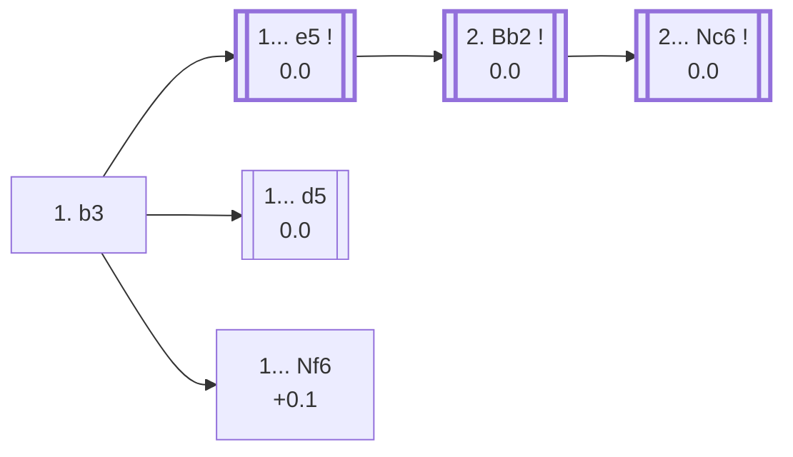

<a name="_TOP_"></a>

# A01 Nimzo-Larsen Attack <br> 1. b3 #

Named after Aron Nimzowitsch, who pioneered hypermodern flank-development ideas in the 1920s, and Danish grandmaster Bent Larsen, who used it as a serious weapon against the world's best for decades — including a famous win over Boris Spassky at the 1970 USSR vs Rest of the World match. The bishop fianchettoes to b2, aiming down the long diagonal at e5/g7, before White commits any central pawn at all. Fully sound and still a real practical weapon today: Magnus Carlsen has used it repeatedly at the very top level.

### Overview

*Quick map of every move covered on this card — see the [shape key](https://github.com/onclemarcel/chess_flashcards/blob/main/start.md#content-diagram-optional) in start.md.*

<!-- content-diagram:start -->

<!-- content-diagram:end -->

<a name="_initial_move_"></a>

[](https://lichess.org/analysis/standard/rnbqkbnr/pppppppp/8/8/8/1P6/P1PPPPPP/RNBQKBNR_b_KQkq_-_0_1)

*... 1. b3 — Nimzo-Larsen Attack*

```
rnbqkbnr/pppppppp/8/8/8/1P6/P1PPPPPP/RNBQKBNR b KQkq - 0 1
```

|  | 0.0 |
| --- | --- |

<!-- lichess-stats:start fen="rnbqkbnr/pppppppp/8/8/8/1P6/P1PPPPPP/RNBQKBNR b KQkq - 0 1" db="lichess,masters" speeds="bullet,blitz" ratings="1800,2000,2200,2500" moves="6" -->
| Move | Online | W/D/B | Masters | W/D/B | |
| :--- | ---: | :--- | ---: | :--- | :-- |
| d5 | 12.2 M (23.0%) | ⬜⬜⬜⬜⬜⬛⬛⬛⬛⬛ 50/4/45 | 3.1 k (27.3%) | ⬜⬜⬜🟫🟫🟫🟫⬛⬛⬛ 33/37/30 |  |
| e5 | 9.6 M (18.2%) | ⬜⬜⬜⬜⬜⬛⬛⬛⬛⬛ 50/4/46 | 5.0 k (44.4%) | ⬜⬜⬜🟫🟫🟫🟫⬛⬛⬛ 31/40/29 |  |
| Nf6 | 8.2 M (15.5%) | ⬜⬜⬜⬜⬜⬛⬛⬛⬛⬛ 49/5/46 | 1.7 k (15.0%) | ⬜⬜⬜🟫🟫🟫🟫⬛⬛⬛ 36/36/28 |  |
| e6 | 5.0 M (9.5%) | ⬜⬜⬜⬜⬜⬛⬛⬛⬛⬛ 52/4/44 | 0 | — | ⚠ |
| c5 | 4.3 M (8.2%) | ⬜⬜⬜⬜⬜⬛⬛⬛⬛⬛ 50/4/46 | 595 (5.3%) | ⬜⬜⬜⬜🟫🟫🟫⬛⬛⬛ 36/34/30 |  |
| c6 | 3.1 M (5.9%) | ⬜⬜⬜⬜⬜⬛⬛⬛⬛⬛ 50/4/46 | 0 | — | ⚠ |
| b6 | 0 | — | 244 (2.2%) | ⬜⬜⬜🟫🟫🟫🟫⬛⬛⬛ 32/40/28 |  |
| g6 | 0 | — | 239 (2.1%) | ⬜⬜⬜🟫🟫🟫🟫⬛⬛⬛ 30/40/30 |  |

*Online: bullet/blitz, 1800+ — 53.0 M games. Masters: 11 k games. [Open in the explorer](https://lichess.org/analysis/standard/rnbqkbnr/pppppppp/8/8/8/1P6/P1PPPPPP/RNBQKBNR_b_KQkq_-_0_1#explorer) — updated 2026-08-31*
<!-- lichess-stats:end -->

### Candidate moves

* [**1... e5**](#_e5_) (0.0): the *Modern Variation* — masters' clear main try (44.4%), meeting the long diagonal head-on and covered below.
* [**1... d5**](#_d5_) (0.0): a real second choice (27.3% masters), simply taking the centre.
* [**1... Nf6**](#_Nf6_) (+0.1): also common (15.0% masters), developing before committing any pawn.

[*Back to TOP*](#_TOP_)

---

<a name="_e5_"></a>

## 1... e5 — Modern Variation

[](https://lichess.org/analysis/standard/rnbqkbnr/pppp1ppp/8/4p3/8/1P6/P1PPPPPP/RNBQKBNR_w_KQkq_e6_0_2)

*... 1... e5 — Modern Variation*

```
rnbqkbnr/pppp1ppp/8/4p3/8/1P6/P1PPPPPP/RNBQKBNR w KQkq e6 0 2
```

|  | 0.0 |
| --- | --- |

<!-- lichess-stats:start fen="rnbqkbnr/pppp1ppp/8/4p3/8/1P6/P1PPPPPP/RNBQKBNR w KQkq e6 0 2" db="lichess,masters" speeds="bullet,blitz" ratings="1800,2000,2200,2500" moves="4" -->
| Move | Online | W/D/B | Masters | W/D/B | |
| :--- | ---: | :--- | ---: | :--- | :-- |
| Bb2 | 9.1 M (95.0%) | ⬜⬜⬜⬜⬜⬛⬛⬛⬛⬛ 50/4/45 | 4.9 k (98.8%) | ⬜⬜⬜🟫🟫🟫🟫⬛⬛⬛ 31/40/29 |  |
| e3 | 119 k (1.2%) | ⬜⬜⬜⬜⬜⬛⬛⬛⬛⬛ 50/4/45 | 22 (0.4%) | ⬜⬜⬜🟫🟫🟫⬛⬛⬛⬛ 32/32/36 |  |
| Ba3 | 86 k (0.9%) | ⬜⬜⬜⬜⬜⬛⬛⬛⬛⬛ 46/5/49 | 0 | — | ⚠ |
| g3 | 54 k (0.6%) | ⬜⬜⬜⬜⬜⬛⬛⬛⬛⬛ 47/4/49 | 4 (0.1%) | — | ⚠ |
| c4 | 0 | — | 29 (0.6%) | ⬜🟫🟫🟫🟫⬛⬛⬛⬛⬛ 14/38/48 |  |

*Online: bullet/blitz, 1800+ — 9.6 M games. Masters: 5.0 k games. [Open in the explorer](https://lichess.org/analysis/standard/rnbqkbnr/pppp1ppp/8/4p3/8/1P6/P1PPPPPP/RNBQKBNR_w_KQkq_e6_0_2#explorer) — updated 2026-08-31*
<!-- lichess-stats:end -->

**2. Bb2** is close to automatic (98.8% of masters games) — the whole point of 1. b3, pressuring e5 down the long diagonal before Black can shore it up.

[*Back to 1. b3*](#_initial_move_)
[*Back to TOP*](#_TOP_)

---

<a name="_Bb2_"></a>

### 2. Bb2

[](https://lichess.org/analysis/standard/rnbqkbnr/pppp1ppp/8/4p3/8/1P6/PBPPPPPP/RN1QKBNR_b_KQkq_-_1_2)

*... 2. Bb2*

```
rnbqkbnr/pppp1ppp/8/4p3/8/1P6/PBPPPPPP/RN1QKBNR b KQkq - 1 2
```

|  | 0.0 |
| --- | --- |

<!-- lichess-stats:start fen="rnbqkbnr/pppp1ppp/8/4p3/8/1P6/PBPPPPPP/RN1QKBNR b KQkq - 1 2" db="lichess,masters" speeds="bullet,blitz" ratings="1800,2000,2200,2500" moves="4" -->
| Move | Online | W/D/B | Masters | W/D/B | |
| :--- | ---: | :--- | ---: | :--- | :-- |
| Nc6 | 5.1 M (56.1%) | ⬜⬜⬜⬜⬜⬛⬛⬛⬛⬛ 50/4/46 | 4.0 k (81.3%) | ⬜⬜⬜🟫🟫🟫🟫⬛⬛⬛ 30/41/29 |  |
| d6 | 2.4 M (26.5%) | ⬜⬜⬜⬜⬜🟫⬛⬛⬛⬛ 51/5/45 | 900 (18.3%) | ⬜⬜⬜🟫🟫🟫🟫⬛⬛⬛ 34/36/30 |  |
| f6 | 396 k (4.3%) | ⬜⬜⬜⬜⬜⬛⬛⬛⬛⬛ 50/4/46 | 11 (0.2%) | — |  |
| d5 | 307 k (3.4%) | ⬜⬜⬜⬜⬜🟫⬛⬛⬛⬛ 53/3/43 | 0 | — | ⚠ |
| e4 | 0 | — | 5 (0.1%) | — |  |

*Online: bullet/blitz, 1800+ — 9.1 M games. Masters: 4.9 k games. [Open in the explorer](https://lichess.org/analysis/standard/rnbqkbnr/pppp1ppp/8/4p3/8/1P6/PBPPPPPP/RN1QKBNR_b_KQkq_-_1_2#explorer) — updated 2026-08-31*
<!-- lichess-stats:end -->

**2... Nc6** is masters' clear main try (81.3%) — defending e5 a second time before White can add more pressure with Nf3 or an eventual f4.

[*Back to 1... e5*](#_e5_)
[*Back to TOP*](#_TOP_)

---

<a name="_Nc6_"></a>

### 2... Nc6

[](https://lichess.org/analysis/standard/r1bqkbnr/pppp1ppp/2n5/4p3/8/1P6/PBPPPPPP/RN1QKBNR_w_KQkq_-_2_3)

*... 2... Nc6 — reaching the main Nimzo-Larsen tabiya*

```
r1bqkbnr/pppp1ppp/2n5/4p3/8/1P6/PBPPPPPP/RN1QKBNR w KQkq - 2 3
```

|  | 0.0 |
| --- | --- |

From here **3. e3** is masters' clear main try (74.8%), preparing a timely Bb5 pin on the c6 knight or simply finishing development — the point where the Nimzo-Larsen settles into its characteristic slow manoeuvring middlegame. Deeper theory past this point is its own body of work, not covered further here.

[*Back to 2. Bb2*](#_Bb2_)
[*Back to TOP*](#_TOP_)

---

> [!NOTE]
> **1... d5** simply takes the centre while White has committed only a flank pawn — a real, fully sound alternative to 1... e5, without the immediate pressure on the long diagonal.
>
> <a name="_d5_"></a>
>
> ### 1... d5
>
> [](https://lichess.org/analysis/standard/rnbqkbnr/ppp1pppp/8/3p4/8/1P6/P1PPPPPP/RNBQKBNR_w_KQkq_d6_0_2)
>
> *... 1... d5*
>
> ```
> rnbqkbnr/ppp1pppp/8/3p4/8/1P6/P1PPPPPP/RNBQKBNR w KQkq d6 0 2
> ```
>
> |  | 0.0 |
> | --- | --- |
>
> Not built out further here (backlog).
>
> [*Back to 1. b3*](#_initial_move_)
> [*Back to TOP*](#_TOP_)

---

> [!NOTE]
> **1... Nf6** develops first, keeping every central option (a later ... d5, ... e5, or ... g6) available.
>
> <a name="_Nf6_"></a>
>
> ### 1... Nf6
>
> [](https://lichess.org/analysis/standard/rnbqkb1r/pppppppp/5n2/8/8/1P6/P1PPPPPP/RNBQKBNR_w_KQkq_-_1_2)
>
> *... 1... Nf6*
>
> ```
> rnbqkb1r/pppppppp/5n2/8/8/1P6/P1PPPPPP/RNBQKBNR w KQkq - 1 2
> ```
>
> |  | +0.1 |
> | --- | --- |
>
> Not built out further here (backlog).
>
> [*Back to 1. b3*](#_initial_move_)
> [*Back to TOP*](#_TOP_)

---

> [!NOTE]
> **1... c5** — the *English Variation*, meeting the flank fianchetto with a flank pawn of its own.
>
> <a name="_c5_"></a>
>
> ### 1... c5
>
> [](https://lichess.org/analysis/standard/rnbqkbnr/pp1ppppp/8/2p5/8/1P6/P1PPPPPP/RNBQKBNR_w_KQkq_c6_0_2)
>
> *... 1... c5 — English Variation*
>
> ```
> rnbqkbnr/pp1ppppp/8/2p5/8/1P6/P1PPPPPP/RNBQKBNR w KQkq c6 0 2
> ```
>
> |  | 0.0 |
> | --- | --- |
>
> Not built out further here (backlog).
>
> [*Back to 1. b3*](#_initial_move_)
> [*Back to TOP*](#_TOP_)

---

> [!NOTE]
> **1... f5** — the *Dutch Variation*, staking out kingside space before White's own bishop gets to bear on the long diagonal.
>
> <a name="_f5_"></a>
>
> ### 1... f5
>
> [](https://lichess.org/analysis/standard/rnbqkbnr/ppppp1pp/8/5p2/8/1P6/P1PPPPPP/RNBQKBNR_w_KQkq_f6_0_2)
>
> *... 1... f5 — Dutch Variation*
>
> ```
> rnbqkbnr/ppppp1pp/8/5p2/8/1P6/P1PPPPPP/RNBQKBNR w KQkq f6 0 2
> ```
>
> |  | +0.5 |
> | --- | --- |
>
> Not built out further here (backlog).
>
> [*Back to 1. b3*](#_initial_move_)
> [*Back to TOP*](#_TOP_)

---

> [!NOTE]
> **1... b5** — the *Polish Variation*, grabbing queenside space and eyeing an eventual ... Bb7 fight for the long diagonal.
>
> <a name="_b5_"></a>
>
> ### 1... b5
>
> [](https://lichess.org/analysis/standard/rnbqkbnr/p1pppppp/8/1p6/8/1P6/P1PPPPPP/RNBQKBNR_w_KQkq_b6_0_2)
>
> *... 1... b5 — Polish Variation*
>
> ```
> rnbqkbnr/p1pppppp/8/1p6/8/1P6/P1PPPPPP/RNBQKBNR w KQkq b6 0 2
> ```
>
> |  | +0.4 |
> | --- | --- |
>
> Not built out further here (backlog).
>
> [*Back to 1. b3*](#_initial_move_)
> [*Back to TOP*](#_TOP_)

---

> [!NOTE]
> **1... b6** — the *Symmetrical Variation*, mirroring White's own fianchetto plan.
>
> <a name="_b6_"></a>
>
> ### 1... b6
>
> [](https://lichess.org/analysis/standard/rnbqkbnr/p1pppppp/1p6/8/8/1P6/P1PPPPPP/RNBQKBNR_w_KQkq_-_0_2)
>
> *... 1... b6 — Symmetrical Variation*
>
> ```
> rnbqkbnr/p1pppppp/1p6/8/8/1P6/P1PPPPPP/RNBQKBNR w KQkq - 0 2
> ```
>
> |  | +0.2 |
> | --- | --- |
>
> Not built out further here (backlog).
>
> [*Back to 1. b3*](#_initial_move_)
> [*Back to TOP*](#_TOP_)

---

<a name="_real_game_"></a>

## A real example: Nakamura vs Carlsen, 2024

The Nimzo-Larsen is a genuine top-level weapon, not a surprise-only trick. **Hikaru Nakamura** (White, 2802) played it against **Magnus Carlsen** (Black, 2831, world #1) in the 2024 Global Chess League — reaching, move for move, the exact main line built out above: **1. b3 e5 2. Bb2 Nc6 3. e3**.

```
[Event "TechM GCL 2024"]
[Site "London ENG"]
[Date "2024.10.09"]
[White "Nakamura, Hi"]
[Black "Carlsen, M."]
[Result "1/2-1/2"]
[WhiteElo "2802"]
[BlackElo "2831"]
[ECO "A01"]
[Opening "Nimzo-Larsen Attack: Modern Variation"]

1. b3 e5 2. Bb2 Nc6 3. e3 g6 4. d4 exd4 5. Nf3 Bb4+ 6. Nbd2 Nf6 7. Nxd4 Ne4
8. Nf3 O-O 9. Qc1 d5 10. c3 Be7 11. c4 Nxd2 12. Qxd2 dxc4 13. Bxc4 Bb4
14. Bc3 Qxd2+ 15. Bxd2 Bg4 16. a3 Bxd2+ 17. Kxd2 Na5 18. Ne5 Nxc4+ 19. bxc4
Bf5 20. Kc3 f6 21. Nf3 c5 22. Rhd1 Rfd8 23. Ne1 b6 24. f3 Kf7 25. e4 Be6
26. Nc2 f5 27. exf5 gxf5 28. f4 Rxd1 29. Rxd1 Re8 30. Rd3 h5 31. g3 Rh8
32. Ne1 Ke7 33. Nf3 Rd8 34. Re3 Kf6 35. Rd3 Rxd3+ 36. Kxd3 Ke7 37. Kc3 a6
38. a4 Kd6 39. Nh4 Bd7 40. Kb3 Ke6 41. Ng2 Kd6 42. Ne3 Be6 43. Kc3 Kc6
44. h3 Kd6 45. Kb2 Kc6 46. Kc3 Kd6 47. Kb2 Kc6 48. Kc3 1/2-1/2
```

A long, technical draw between two of the strongest players alive — exactly the kind of game 1. b3 is meant to produce: a real fight from move one, without either side leaning on memorised theory. For the full interactive board, see the [live game on Lichess](https://lichess.org/JB5IPFFh).

[*Back to TOP*](#_TOP_)
