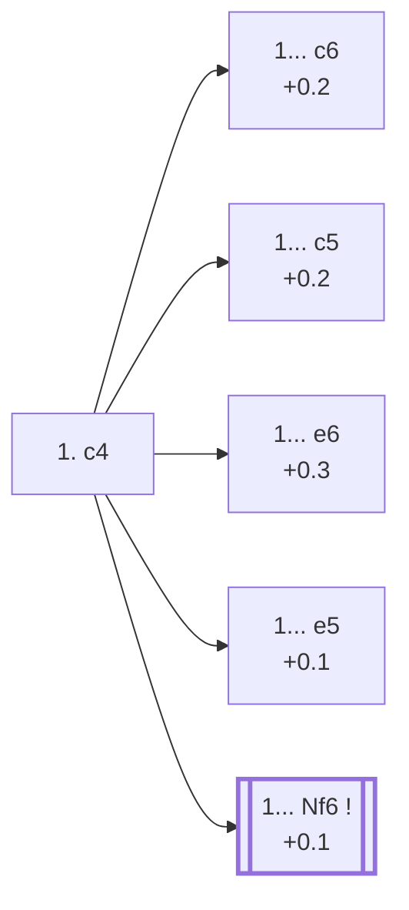

<a name="_TOP_"></a>

# A10 English Opening <br> 1. c4 #

**1. c4**, the English Opening, is the fourth most popular first move at master level (6.9%, see [A00 Start Position](https://github.com/onclemarcel/chess_flashcards/blob/main/A00_Start.md)). Like 1. Nf3, it claims a central square without yet committing the d-pawn — but from the *other* side of the board, often transposing into a "reversed Sicilian" (after ... e5) or into Queen's Gambit/Indian structures with colours swapped a tempo up.

**Corrected 2026-08-25**: every one of Black's five main replies now has its own dedicated card — [`A11_Caro_Kann_System.md`](https://github.com/onclemarcel/chess_flashcards/blob/main/c4_openings/A11_Caro_Kann_System.md) (1... c6), [`A13_Agincourt_Defense.md`](https://github.com/onclemarcel/chess_flashcards/blob/main/c4_openings/A13_Agincourt_Defense.md) (1... e6), [`A15_Anglo_Indian_Defense.md`](https://github.com/onclemarcel/chess_flashcards/blob/main/c4_openings/A15_Anglo_Indian_Defense.md) (1... Nf6), [`A20_Kings_English_Variation.md`](https://github.com/onclemarcel/chess_flashcards/blob/main/c4_openings/A20_Kings_English_Variation.md) (1... e5) and [`A30_Symmetrical_Variation.md`](https://github.com/onclemarcel/chess_flashcards/blob/main/c4_openings/A30_Symmetrical_Variation.md) (1... c5) — mirroring the same split the A04 Zukertort hub went through for A05-A09. A10 itself stays the root/hub card: it keeps the top-level stats and points to each child.

### Overview

*Quick map of every move covered on this card — text and evals match the candidate-move lists below exactly. Node shape is a data-driven category (master-safe / blitz trap / understudied / blunder); see the [shape key](https://github.com/onclemarcel/chess_flashcards/blob/main/start.md#content-diagram-optional) in start.md. Hover a node for its ECO code and variation name; click to jump to its section.*

<!-- content-diagram:start -->

<!-- content-diagram:end -->

<a name="_c4_"></a>

[](https://lichess.org/analysis/standard/rnbqkbnr/pppppppp/8/8/2P5/8/PP1PPPPP/RNBQKBNR_b_KQkq_c3_0_1)

*... 1. c4 — English Opening*

```
rnbqkbnr/pppppppp/8/8/2P5/8/PP1PPPPP/RNBQKBNR b KQkq c3 0 1
```

<!-- lichess-stats:start fen="rnbqkbnr/pppppppp/8/8/2P5/8/PP1PPPPP/RNBQKBNR b KQkq c3 0 1" db="lichess,masters" speeds="bullet,blitz" ratings="1800,2000,2200,2500" moves="10" -->
| Move | Online | W/D/B | Masters | W/D/B | |
| :--- | ---: | :--- | ---: | :--- | :-- |
| Nf6 | 23.0 M (21.3%) | ⬜⬜⬜⬜⬜🟫⬛⬛⬛⬛ 50/5/45 | 55 k (27.7%) | ⬜⬜⬜⬜🟫🟫🟫🟫⬛⬛ 35/43/21 |  |
| e5 | 21.7 M (20.1%) | ⬜⬜⬜⬜⬜🟫⬛⬛⬛⬛ 51/5/44 | 50 k (25.1%) | ⬜⬜⬜🟫🟫🟫🟫🟫⬛⬛ 29/48/23 |  |
| e6 | 13.5 M (12.5%) | ⬜⬜⬜⬜⬜⬛⬛⬛⬛⬛ 50/5/45 | 31 k (15.5%) | ⬜⬜⬜⬜🟫🟫🟫🟫⬛⬛ 36/42/22 |  |
| c5 | 13.1 M (12.1%) | ⬜⬜⬜⬜⬜🟫⬛⬛⬛⬛ 51/5/44 | 22 k (11.1%) | ⬜⬜⬜🟫🟫🟫🟫🟫⬛⬛ 34/45/21 |  |
| c6 | 8.9 M (8.3%) | ⬜⬜⬜⬜⬜⬛⬛⬛⬛⬛ 48/5/46 | 16 k (8.0%) | ⬜⬜⬜⬜🟫🟫🟫🟫⬛⬛ 36/45/20 |  |
| d5 | 8.5 M (7.9%) | ⬜⬜⬜⬜⬜🟫⬛⬛⬛⬛ 52/4/44 | 0 | — | ⚠ |
| g6 | 7.2 M (6.6%) | ⬜⬜⬜⬜⬜⬛⬛⬛⬛⬛ 50/5/46 | 15 k (7.7%) | ⬜⬜⬜🟫🟫🟫🟫⬛⬛⬛ 33/39/28 |  |
| d6 | 4.6 M (4.3%) | ⬜⬜⬜⬜⬜⬛⬛⬛⬛⬛ 50/4/45 | 1.3 k (0.7%) | ⬜⬜⬜⬜🟫🟫🟫⬛⬛⬛ 39/32/29 |  |
| b6 | 2.7 M (2.5%) | ⬜⬜⬜⬜⬜⬛⬛⬛⬛⬛ 50/4/46 | 3.1 k (1.6%) | ⬜⬜⬜🟫🟫🟫🟫⬛⬛⬛ 33/35/32 |  |
| f5 | 2.3 M (2.1%) | ⬜⬜⬜⬜⬜⬛⬛⬛⬛⬛ 50/5/45 | 4.7 k (2.3%) | ⬜⬜⬜⬜🟫🟫🟫🟫⬛⬛ 37/38/25 |  |
| Nc6 | 0 | — | 484 (0.2%) | ⬜⬜⬜⬜🟫🟫🟫⬛⬛⬛ 42/32/26 |  |

*Online: bullet/blitz, 1800+ — 107.9 M games. Masters: 199 k games. [Open in the explorer](https://lichess.org/analysis/standard/rnbqkbnr/pppppppp/8/8/2P5/8/PP1PPPPP/RNBQKBNR_b_KQkq_c3_0_1#explorer) — updated 2026-08-25*
<!-- lichess-stats:end -->

> [!NOTE]
> **1... Nf6** (27.7%) and **1... e5** (25.1%) are close enough at master level to both be considered main tries — unlike most other opening forks on this site, this one stays genuinely undecided rather than tipping clearly to one side.

### Candidate moves

* [**1... c6**](https://github.com/onclemarcel/chess_flashcards/blob/main/c4_openings/A11_Caro_Kann_System.md) (+0.2, 8.0% masters): the **A11** Caro-Kann Defensive System — a reversed Slav-style structure, keeping ... d5 in reserve
* [**1... c5**](https://github.com/onclemarcel/chess_flashcards/blob/main/c4_openings/A30_Symmetrical_Variation.md) (+0.2, 11.1% masters): the **A30** Symmetrical Variation — Black mirrors White's own idea
* [**1... e6**](https://github.com/onclemarcel/chess_flashcards/blob/main/c4_openings/A13_Agincourt_Defense.md) (+0.3, 15.5% masters): the **A13** Agincourt Defense — flexible, often transposing into Queen's Gambit Declined or Nimzo-Indian structures
* [**1... e5**](https://github.com/onclemarcel/chess_flashcards/blob/main/c4_openings/A20_Kings_English_Variation.md) (+0.1, 25.1% masters): the **A20** King's English Variation — a "reversed Sicilian", masters' close second
* [**1... Nf6**](https://github.com/onclemarcel/chess_flashcards/blob/main/c4_openings/A15_Anglo_Indian_Defense.md) (+0.1, 27.7% masters): the **A15** Anglo-Indian Defense — masters' (barely) top choice

[*Back to TOP*](#_TOP_)
