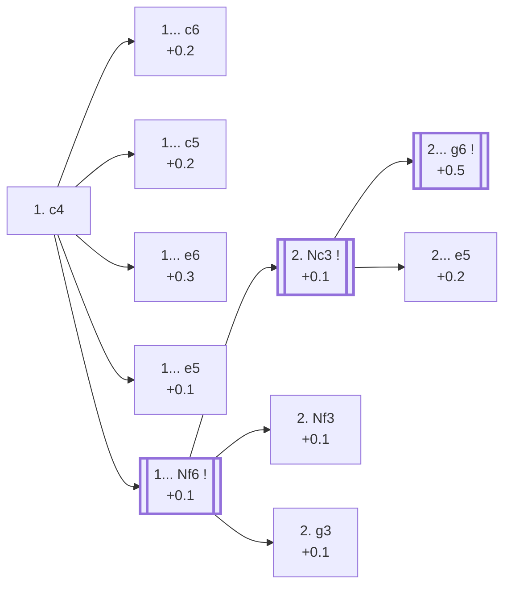

<a name="_TOP_"></a>

# A10 English Opening <br> 1. c4 #

**1. c4**, the English Opening, is the fourth most popular first move at master level (6.9%, see [A00 Start Position](https://github.com/onclemarcel/chess_flashcards/blob/main/A00_Start.md)). Like 1. Nf3, it claims a central square without yet committing the d-pawn — but from the *other* side of the board, often transposing into a "reversed Sicilian" (after ... e5) or into Queen's Gambit/Indian structures with colours swapped a tempo up.

### Overview

*Quick map of every move covered on this card — text and evals match the candidate-move lists below exactly. Node shape is a data-driven category (master-safe / blitz trap / understudied / blunder); see the [shape key](https://github.com/onclemarcel/chess_flashcards/blob/main/start.md#content-diagram-optional) in start.md. Hover a node for its ECO code and variation name; click to jump to its section.*

<!-- content-diagram:start -->

<!-- content-diagram:end -->

<a name="_c4_"></a>

[](https://lichess.org/analysis/standard/rnbqkbnr/pppppppp/8/8/2P5/8/PP1PPPPP/RNBQKBNR_b_KQkq_c3_0_1)

*... 1. c4 — English Opening*

```
rnbqkbnr/pppppppp/8/8/2P5/8/PP1PPPPP/RNBQKBNR b KQkq c3 0 1
```

<!-- lichess-stats:start fen="rnbqkbnr/pppppppp/8/8/2P5/8/PP1PPPPP/RNBQKBNR b KQkq c3 0 1" db="lichess,masters" speeds="bullet,blitz" ratings="1800,2000,2200,2500" moves="10" -->
| Move | Online | W/D/B | Masters | W/D/B | |
| :--- | ---: | :--- | ---: | :--- | :-- |
| Nf6 | 23.0 M (21.3%) | ⬜⬜⬜⬜⬜🟫⬛⬛⬛⬛ 50/5/45 | 55 k (27.7%) | ⬜⬜⬜⬜🟫🟫🟫🟫⬛⬛ 35/43/21 |  |
| e5 | 21.7 M (20.1%) | ⬜⬜⬜⬜⬜🟫⬛⬛⬛⬛ 51/5/44 | 50 k (25.1%) | ⬜⬜⬜🟫🟫🟫🟫🟫⬛⬛ 29/48/23 |  |
| e6 | 13.5 M (12.5%) | ⬜⬜⬜⬜⬜⬛⬛⬛⬛⬛ 50/5/45 | 31 k (15.5%) | ⬜⬜⬜⬜🟫🟫🟫🟫⬛⬛ 36/42/22 |  |
| c5 | 13.1 M (12.1%) | ⬜⬜⬜⬜⬜🟫⬛⬛⬛⬛ 51/5/44 | 22 k (11.1%) | ⬜⬜⬜🟫🟫🟫🟫🟫⬛⬛ 34/45/21 |  |
| c6 | 8.9 M (8.3%) | ⬜⬜⬜⬜⬜⬛⬛⬛⬛⬛ 48/5/46 | 16 k (8.0%) | ⬜⬜⬜⬜🟫🟫🟫🟫⬛⬛ 36/45/20 |  |
| d5 | 8.5 M (7.9%) | ⬜⬜⬜⬜⬜🟫⬛⬛⬛⬛ 52/4/44 | 0 | — | ⚠ |
| g6 | 7.2 M (6.6%) | ⬜⬜⬜⬜⬜⬛⬛⬛⬛⬛ 50/5/46 | 15 k (7.7%) | ⬜⬜⬜🟫🟫🟫🟫⬛⬛⬛ 33/39/28 |  |
| d6 | 4.6 M (4.3%) | ⬜⬜⬜⬜⬜⬛⬛⬛⬛⬛ 50/4/45 | 1.3 k (0.7%) | ⬜⬜⬜⬜🟫🟫🟫⬛⬛⬛ 39/32/29 |  |
| b6 | 2.7 M (2.5%) | ⬜⬜⬜⬜⬜⬛⬛⬛⬛⬛ 50/4/46 | 3.1 k (1.6%) | ⬜⬜⬜🟫🟫🟫🟫⬛⬛⬛ 33/35/32 |  |
| f5 | 2.3 M (2.1%) | ⬜⬜⬜⬜⬜⬛⬛⬛⬛⬛ 50/5/45 | 4.7 k (2.3%) | ⬜⬜⬜⬜🟫🟫🟫🟫⬛⬛ 37/38/25 |  |
| Nc6 | 0 | — | 484 (0.2%) | ⬜⬜⬜⬜🟫🟫🟫⬛⬛⬛ 42/32/26 |  |

*Online: bullet/blitz, 1800+ — 107.9 M games. Masters: 199 k games. [Open in the explorer](https://lichess.org/analysis/standard/rnbqkbnr/pppppppp/8/8/2P5/8/PP1PPPPP/RNBQKBNR_b_KQkq_c3_0_1#explorer) — updated 2026-08-23*
<!-- lichess-stats:end -->

> [!NOTE]
> **1... Nf6** (27.7%) and **1... e5** (25.1%) are close enough at master level to both be considered main tries — unlike most other opening forks on this site, this one stays genuinely undecided rather than tipping clearly to one side.

### Candidate moves

* [**1... c6**](#_c6_) (+0.2): a reversed Slav-style structure, keeping ... d5 in reserve
* [**1... c5**](#_c5_) (+0.2): the [Symmetrical Variation](#_c5_) — Black mirrors White's own idea
* [**1... e6**](#_e6_) (+0.3): the [Agincourt Defense](#_e6_) — flexible, often transposing into Queen's Gambit Declined or Nimzo-Indian structures
* [**1... e5**](#_e5_) (+0.1): a "reversed Sicilian" — masters' close second (25.1%)
* [**1... Nf6**](#_Nf6_) (+0.1): masters' (barely) top choice (27.7%) — covered below

[*Back to TOP*](#_TOP_)

---

> [!NOTE]
> **1... c6** aims for a Slav-style structure with an extra option: Black can still meet 2. d4 with ... d5, transposing into Queen's Gambit territory a tempo down for White compared with the normal move order.
>
> <a name="_c6_"></a>
>
> ### 1... c6
>
> [](https://lichess.org/analysis/standard/rnbqkbnr/pp1ppppp/2p5/8/2P5/8/PP1PPPPP/RNBQKBNR_w_KQkq_-_0_2)
>
> *... 1. c4 c6*
>
> ```
> rnbqkbnr/pp1ppppp/2p5/8/2P5/8/PP1PPPPP/RNBQKBNR w KQkq - 0 2
> ```
>
> |  | +0.2 |
> | --- | --- |
>
> <!-- lichess-stats:start fen="rnbqkbnr/pp1ppppp/2p5/8/2P5/8/PP1PPPPP/RNBQKBNR w KQkq - 0 2" db="lichess,masters" speeds="bullet,blitz" ratings="1800,2000,2200,2500" moves="5" -->
> | Move | Online | W/D/B | Masters | W/D/B | |
> | :--- | ---: | :--- | ---: | :--- | :-- |
> | Nc3 | 4.5 M (50.6%) | ⬜⬜⬜⬜⬜⬛⬛⬛⬛⬛ 48/5/47 | 939 (5.9%) | ⬜⬜⬜🟫🟫🟫🟫🟫⬛⬛ 32/46/21 |  |
> | g3 | 1.3 M (14.9%) | ⬜⬜⬜⬜⬜🟫⬛⬛⬛⬛ 50/6/45 | 1.0 k (6.3%) | ⬜⬜⬜🟫🟫🟫🟫⬛⬛⬛ 29/44/27 |  |
> | d4 | 849 k (9.5%) | ⬜⬜⬜⬜⬜⬛⬛⬛⬛⬛ 48/5/46 | 3.3 k (20.5%) | ⬜⬜⬜🟫🟫🟫🟫🟫⬛⬛ 34/48/17 |  |
> | Nf3 | 793 k (8.9%) | ⬜⬜⬜⬜⬜🟫⬛⬛⬛⬛ 50/6/44 | 6.5 k (40.8%) | ⬜⬜⬜⬜🟫🟫🟫🟫⬛⬛ 37/43/20 |  |
> | e4 | 521 k (5.8%) | ⬜⬜⬜⬜⬜🟫⬛⬛⬛⬛ 50/5/44 | 3.9 k (24.3%) | ⬜⬜⬜⬜🟫🟫🟫🟫⬛⬛ 39/43/18 |  |
> 
> *Online: bullet/blitz, 1800+ — 8.9 M games. Masters: 16 k games. [Open in the explorer](https://lichess.org/analysis/standard/rnbqkbnr/pp1ppppp/2p5/8/2P5/8/PP1PPPPP/RNBQKBNR_w_KQkq_-_0_2#explorer) — updated 2026-08-23*
> <!-- lichess-stats:end -->
>
> [*Back to 1. c4*](#_c4_)
> [*Back to TOP*](#_TOP_)

---

> [!NOTE]
> **1... c5**, the Symmetrical Variation, keeps the position balanced for longer than almost any other reply — both sides usually fight for the first meaningful imbalance via d4 or Nf3/g3 setups.
>
> <a name="_c5_"></a>
>
> ### 1... c5 — Symmetrical Variation
>
> [](https://lichess.org/analysis/standard/rnbqkbnr/pp1ppppp/8/2p5/2P5/8/PP1PPPPP/RNBQKBNR_w_KQkq_c6_0_2)
>
> *... 1. c4 c5 — Symmetrical Variation*
>
> ```
> rnbqkbnr/pp1ppppp/8/2p5/2P5/8/PP1PPPPP/RNBQKBNR w KQkq c6 0 2
> ```
>
> |  | +0.2 |
> | --- | --- |
>
> <!-- lichess-stats:start fen="rnbqkbnr/pp1ppppp/8/2p5/2P5/8/PP1PPPPP/RNBQKBNR w KQkq c6 0 2" db="lichess,masters" speeds="bullet,blitz" ratings="1800,2000,2200,2500" moves="5" -->
> | Move | Online | W/D/B | Masters | W/D/B | |
> | :--- | ---: | :--- | ---: | :--- | :-- |
> | Nc3 | 7.8 M (59.4%) | ⬜⬜⬜⬜⬜🟫⬛⬛⬛⬛ 51/5/44 | 6.3 k (28.3%) | ⬜⬜⬜🟫🟫🟫🟫⬛⬛⬛ 31/44/25 |  |
> | g3 | 2.2 M (16.7%) | ⬜⬜⬜⬜⬜🟫⬛⬛⬛⬛ 52/5/43 | 4.8 k (21.5%) | ⬜⬜⬜🟫🟫🟫🟫⬛⬛⬛ 32/42/25 |  |
> | Nf3 | 1.4 M (10.6%) | ⬜⬜⬜⬜⬜🟫⬛⬛⬛⬛ 52/6/42 | 11 k (48.9%) | ⬜⬜⬜🟫🟫🟫🟫🟫⬛⬛ 36/47/17 |  |
> | e3 | 847 k (6.5%) | ⬜⬜⬜⬜⬜⬛⬛⬛⬛⬛ 49/4/47 | 45 (0.2%) | ⬜⬜⬜⬜🟫🟫🟫🟫🟫⬛ 38/47/16 |  |
> | b3 | 246 k (1.9%) | ⬜⬜⬜⬜⬜🟫⬛⬛⬛⬛ 51/5/45 | 214 (1.0%) | ⬜⬜⬜🟫🟫🟫🟫🟫⬛⬛ 34/45/21 |  |
> 
> *Online: bullet/blitz, 1800+ — 13.1 M games. Masters: 22 k games. [Open in the explorer](https://lichess.org/analysis/standard/rnbqkbnr/pp1ppppp/8/2p5/2P5/8/PP1PPPPP/RNBQKBNR_w_KQkq_c6_0_2#explorer) — updated 2026-08-23*
> <!-- lichess-stats:end -->
>
> [*Back to 1. c4*](#_c4_)
> [*Back to TOP*](#_TOP_)

---

> [!NOTE]
> **1... e6**, the Agincourt Defense, is a pure waiting move: Black can still steer toward a Queen's Gambit Declined, a Nimzo-Indian, or even a French-style structure depending on White's answer.
>
> <a name="_e6_"></a>
>
> ### 1... e6 — Agincourt Defense
>
> [](https://lichess.org/analysis/standard/rnbqkbnr/pppp1ppp/4p3/8/2P5/8/PP1PPPPP/RNBQKBNR_w_KQkq_-_0_2)
>
> *... 1. c4 e6 — Agincourt Defense*
>
> ```
> rnbqkbnr/pppp1ppp/4p3/8/2P5/8/PP1PPPPP/RNBQKBNR w KQkq - 0 2
> ```
>
> |  | +0.3 |
> | --- | --- |
>
> <!-- lichess-stats:start fen="rnbqkbnr/pppp1ppp/4p3/8/2P5/8/PP1PPPPP/RNBQKBNR w KQkq - 0 2" db="lichess,masters" speeds="bullet,blitz" ratings="1800,2000,2200,2500" moves="5" -->
> | Move | Online | W/D/B | Masters | W/D/B | |
> | :--- | ---: | :--- | ---: | :--- | :-- |
> | Nc3 | 7.3 M (54.3%) | ⬜⬜⬜⬜⬜⬛⬛⬛⬛⬛ 49/5/46 | 9.7 k (31.3%) | ⬜⬜⬜⬜🟫🟫🟫🟫⬛⬛ 37/43/20 |  |
> | g3 | 2.2 M (16.5%) | ⬜⬜⬜⬜⬜🟫⬛⬛⬛⬛ 52/6/43 | 7.1 k (22.9%) | ⬜⬜⬜⬜🟫🟫🟫🟫⬛⬛ 36/42/22 |  |
> | Nf3 | 1.1 M (7.9%) | ⬜⬜⬜⬜⬜🟫⬛⬛⬛⬛ 52/6/43 | 11 k (34.5%) | ⬜⬜⬜⬜🟫🟫🟫🟫⬛⬛ 35/42/23 |  |
> | d4 | 1.0 M (7.6%) | ⬜⬜⬜⬜⬜⬛⬛⬛⬛⬛ 48/5/47 | 2.6 k (8.4%) | ⬜⬜⬜⬜🟫🟫🟫🟫⬛⬛ 36/45/19 |  |
> | e3 | 785 k (5.8%) | ⬜⬜⬜⬜⬜⬛⬛⬛⬛⬛ 50/4/47 | 0 | — | ⚠ |
> | e4 | 0 | — | 758 (2.5%) | ⬜⬜⬜⬜🟫🟫🟫🟫⬛⬛ 35/42/22 |  |
> 
> *Online: bullet/blitz, 1800+ — 13.5 M games. Masters: 31 k games. [Open in the explorer](https://lichess.org/analysis/standard/rnbqkbnr/pppp1ppp/4p3/8/2P5/8/PP1PPPPP/RNBQKBNR_w_KQkq_-_0_2#explorer) — updated 2026-08-23*
> <!-- lichess-stats:end -->
>
> [*Back to 1. c4*](#_c4_)
> [*Back to TOP*](#_TOP_)

---

> [!NOTE]
> **1... e5** hands White the extra tempo of a Sicilian Defense where the colours are reversed — the "closest rival" to 1... Nf6 in popularity (25.1% vs 27.7% of masters games).
>
> <a name="_e5_"></a>
>
> ### 1... e5 — reversed Sicilian
>
> [](https://lichess.org/analysis/standard/rnbqkbnr/pppp1ppp/8/4p3/2P5/8/PP1PPPPP/RNBQKBNR_w_KQkq_e6_0_2)
>
> *... 1. c4 e5*
>
> ```
> rnbqkbnr/pppp1ppp/8/4p3/2P5/8/PP1PPPPP/RNBQKBNR w KQkq e6 0 2
> ```
>
> |  | +0.1 |
> | --- | --- |
>
> <!-- lichess-stats:start fen="rnbqkbnr/pppp1ppp/8/4p3/2P5/8/PP1PPPPP/RNBQKBNR w KQkq e6 0 2" db="lichess,masters" speeds="bullet,blitz" ratings="1800,2000,2200,2500" moves="5" -->
> | Move | Online | W/D/B | Masters | W/D/B | |
> | :--- | ---: | :--- | ---: | :--- | :-- |
> | Nc3 | 14.1 M (65.1%) | ⬜⬜⬜⬜⬜🟫⬛⬛⬛⬛ 51/5/44 | 31 k (62.2%) | ⬜⬜⬜🟫🟫🟫🟫🟫⬛⬛ 28/48/23 |  |
> | g3 | 3.8 M (17.5%) | ⬜⬜⬜⬜⬜🟫⬛⬛⬛⬛ 52/5/43 | 17 k (33.3%) | ⬜⬜⬜🟫🟫🟫🟫🟫⬛⬛ 30/48/23 |  |
> | e3 | 1.4 M (6.3%) | ⬜⬜⬜⬜⬜⬛⬛⬛⬛⬛ 51/4/45 | 524 (1.0%) | ⬜⬜⬜🟫🟫🟫🟫⬛⬛⬛ 35/38/27 |  |
> | Nf3 | 743 k (3.4%) | ⬜⬜⬜⬜⬜🟫⬛⬛⬛⬛ 52/4/43 | 571 (1.1%) | ⬜⬜⬜🟫🟫🟫🟫🟫⬛⬛ 29/49/23 |  |
> | d3 | 472 k (2.2%) | ⬜⬜⬜⬜⬜⬛⬛⬛⬛⬛ 49/5/47 | 730 (1.5%) | ⬜⬜⬜⬜🟫🟫🟫🟫⬛⬛ 40/39/21 |  |
> 
> *Online: bullet/blitz, 1800+ — 21.6 M games. Masters: 50 k games. [Open in the explorer](https://lichess.org/analysis/standard/rnbqkbnr/pppp1ppp/8/4p3/2P5/8/PP1PPPPP/RNBQKBNR_w_KQkq_e6_0_2#explorer) — updated 2026-08-23*
> <!-- lichess-stats:end -->
>
> [*Back to 1. c4*](#_c4_)
> [*Back to TOP*](#_TOP_)

---

<a name="_Nf6_"></a>

## 1... Nf6

Masters' top choice, if only barely (27.7%): the Anglo-Indian Defense — Black mirrors White's flexible development.

[](https://lichess.org/analysis/standard/rnbqkb1r/pppppppp/5n2/8/2P5/8/PP1PPPPP/RNBQKBNR_w_KQkq_-_1_2)

*... 1. c4 Nf6 — Anglo-Indian Defense*

```
rnbqkb1r/pppppppp/5n2/8/2P5/8/PP1PPPPP/RNBQKBNR w KQkq - 1 2
```

<!-- lichess-stats:start fen="rnbqkb1r/pppppppp/5n2/8/2P5/8/PP1PPPPP/RNBQKBNR w KQkq - 1 2" db="lichess,masters" speeds="bullet,blitz" ratings="1800,2000,2200,2500" moves="8" -->
| Move | Online | W/D/B | Masters | W/D/B | |
| :--- | ---: | :--- | ---: | :--- | :-- |
| Nc3 | 14.2 M (61.7%) | ⬜⬜⬜⬜⬜🟫⬛⬛⬛⬛ 50/5/45 | 33 k (59.2%) | ⬜⬜⬜⬜🟫🟫🟫🟫⬛⬛ 37/42/21 |  |
| g3 | 3.9 M (16.9%) | ⬜⬜⬜⬜⬜🟫⬛⬛⬛⬛ 51/6/43 | 9.7 k (17.5%) | ⬜⬜⬜🟫🟫🟫🟫⬛⬛⬛ 33/42/26 |  |
| Nf3 | 1.5 M (6.4%) | ⬜⬜⬜⬜⬜🟫⬛⬛⬛⬛ 51/6/43 | 9.7 k (17.6%) | ⬜⬜⬜🟫🟫🟫🟫🟫⬛⬛ 34/46/20 |  |
| d4 | 1.4 M (6.3%) | ⬜⬜⬜⬜⬜⬛⬛⬛⬛⬛ 47/5/48 | 3.0 k (5.3%) | ⬜⬜⬜🟫🟫🟫🟫🟫🟫⬛ 29/57/14 |  |
| e3 | 1.1 M (4.8%) | ⬜⬜⬜⬜⬜⬛⬛⬛⬛⬛ 48/4/48 | 32 (0.1%) | ⬜⬜⬜🟫🟫🟫🟫⬛⬛⬛ 31/44/25 |  |
| b3 | 376 k (1.6%) | ⬜⬜⬜⬜⬜⬛⬛⬛⬛⬛ 49/5/46 | 100 (0.2%) | ⬜⬜⬜🟫🟫🟫🟫⬛⬛⬛ 35/36/29 |  |
| d3 | 317 k (1.4%) | ⬜⬜⬜⬜⬜⬛⬛⬛⬛⬛ 47/5/48 | 11 (0.0%) | — |  |
| a3 | 46 k (0.2%) | ⬜⬜⬜⬜⬜⬛⬛⬛⬛⬛ 46/4/49 | 0 | — | ⚠ |
| b4 | 0 | — | 7 (0.0%) | — |  |

*Online: bullet/blitz, 1800+ — 23.0 M games. Masters: 55 k games. [Open in the explorer](https://lichess.org/analysis/standard/rnbqkb1r/pppppppp/5n2/8/2P5/8/PP1PPPPP/RNBQKBNR_w_KQkq_-_1_2#explorer) — updated 2026-08-23*
<!-- lichess-stats:end -->

* [**2. Nc3**](#_Nf6_Nc3_) (+0.1): White's clear favourite (59.2% of masters games) — covered below
* [**2. Nf3 / 2. g3**](#_Nf6_alt_) (+0.1 each): quieter developing tries, each still a real 17-18% of masters games

[*Back to 1. c4*](#_c4_)
[*Back to TOP*](#_TOP_)

---

> [!NOTE]
> **2. Nf3** and **2. g3** both simply develop rather than committing the queen's knight yet — real tries (17.6% and 17.5% of masters games respectively) but each well behind 2. Nc3's 59.2%.
>
> <a name="_Nf6_alt_"></a>
>
> ### 1... Nf6 2. Nf3 / 2. g3
>
> [](https://lichess.org/analysis/standard/rnbqkb1r/pppppppp/5n2/8/2P5/5N2/PP1PPPPP/RNBQKB1R_b_KQkq_-_2_2)
>
> *... 1. c4 Nf6 2. Nf3*
>
> ```
> rnbqkb1r/pppppppp/5n2/8/2P5/5N2/PP1PPPPP/RNBQKB1R b KQkq - 2 2
> ```
>
> |  | +0.1 |
> | --- | --- |
>
> Both usually transpose back into 2. Nc3 lines, or into 1. Nf3/1. d4 territory if White later adds d4.
>
> [*Back to 1... Nf6*](#_Nf6_)
> [*Back to TOP*](#_TOP_)

---

<a name="_Nf6_Nc3_"></a>

## 1... Nf6 2. Nc3

White's clear favourite (59.2% of masters games): the most natural developing move, preparing e4 or g3 next.

[](https://lichess.org/analysis/standard/rnbqkb1r/pppppppp/5n2/8/2P5/2N5/PP1PPPPP/R1BQKBNR_b_KQkq_-_2_2)

*... 1. c4 Nf6 2. Nc3 — Anglo-Indian Defense: Queen's Knight Variation*

```
rnbqkb1r/pppppppp/5n2/8/2P5/2N5/PP1PPPPP/R1BQKBNR b KQkq - 2 2
```

<!-- lichess-stats:start fen="rnbqkb1r/pppppppp/5n2/8/2P5/2N5/PP1PPPPP/R1BQKBNR b KQkq - 2 2" db="lichess,masters" speeds="bullet,blitz" ratings="1800,2000,2200,2500" moves="8" -->
| Move | Online | W/D/B | Masters | W/D/B | |
| :--- | ---: | :--- | ---: | :--- | :-- |
| g6 | 5.2 M (36.5%) | ⬜⬜⬜⬜⬜🟫⬛⬛⬛⬛ 50/5/45 | 9.4 k (28.7%) | ⬜⬜⬜⬜🟫🟫🟫🟫⬛⬛ 41/37/22 |  |
| e6 | 4.0 M (28.1%) | ⬜⬜⬜⬜⬜🟫⬛⬛⬛⬛ 50/5/45 | 6.3 k (19.3%) | ⬜⬜⬜⬜🟫🟫🟫🟫⬛⬛ 39/42/19 |  |
| e5 | 1.2 M (8.7%) | ⬜⬜⬜⬜⬜🟫⬛⬛⬛⬛ 51/5/44 | 7.3 k (22.4%) | ⬜⬜⬜🟫🟫🟫🟫🟫⬛⬛ 29/50/21 |  |
| c5 | 1.0 M (7.1%) | ⬜⬜⬜⬜⬜🟫⬛⬛⬛⬛ 50/6/45 | 5.2 k (16.0%) | ⬜⬜⬜⬜🟫🟫🟫🟫⬛⬛ 37/41/21 |  |
| d5 | 1.0 M (7.1%) | ⬜⬜⬜⬜⬜🟫⬛⬛⬛⬛ 48/6/46 | 2.9 k (8.9%) | ⬜⬜⬜⬜🟫🟫🟫🟫⬛⬛ 41/39/19 |  |
| d6 | 789 k (5.6%) | ⬜⬜⬜⬜⬜🟫⬛⬛⬛⬛ 51/5/45 | 577 (1.8%) | ⬜⬜⬜⬜🟫🟫🟫🟫⬛⬛ 41/37/21 |  |
| c6 | 595 k (4.2%) | ⬜⬜⬜⬜⬜🟫⬛⬛⬛⬛ 50/5/45 | 794 (2.4%) | ⬜⬜⬜⬜🟫🟫🟫🟫⬛⬛ 42/42/16 |  |
| b6 | 174 k (1.2%) | ⬜⬜⬜⬜⬜🟫⬛⬛⬛⬛ 50/5/45 | 93 (0.3%) | ⬜⬜⬜⬜🟫🟫🟫⬛⬛⬛ 38/35/27 |  |

*Online: bullet/blitz, 1800+ — 14.2 M games. Masters: 33 k games. [Open in the explorer](https://lichess.org/analysis/standard/rnbqkb1r/pppppppp/5n2/8/2P5/2N5/PP1PPPPP/R1BQKBNR_b_KQkq_-_2_2#explorer) — updated 2026-08-23*
<!-- lichess-stats:end -->

* [**2... g6**](#_Nf6_Nc3_g6_) (+0.5): masters' top choice (28.7%) — a King's Indian-style fianchetto against the English, covered below
* [**2... e5**](#_Nf6_Nc3_e5_) (+0.2): the Two Knights Variation (22.4%) — Black claims the centre instead

[*Back to 1... Nf6*](#_Nf6_)
[*Back to TOP*](#_TOP_)

---

> [!NOTE]
> **2... e5**, the Two Knights Variation, is the second-most common try (22.4%) — genuinely close behind 2... g6, alongside 2... e6 (19.3%) and 2... c5 (16.0%), none of which are built out on this card yet.
>
> <a name="_Nf6_Nc3_e5_"></a>
>
> ### 1... Nf6 2. Nc3 e5
>
> [](https://lichess.org/analysis/standard/rnbqkb1r/pppp1ppp/5n2/4p3/2P5/2N5/PP1PPPPP/R1BQKBNR_w_KQkq_e6_0_3)
>
> *... 1. c4 Nf6 2. Nc3 e5 — King's English Variation: Two Knights Variation*
>
> ```
> rnbqkb1r/pppp1ppp/5n2/4p3/2P5/2N5/PP1PPPPP/R1BQKBNR w KQkq e6 0 3
> ```
>
> |  | +0.2 |
> | --- | --- |
>
> [*Back to 1... Nf6 2. Nc3*](#_Nf6_Nc3_)
> [*Back to TOP*](#_TOP_)

---

<a name="_Nf6_Nc3_g6_"></a>

### 1... Nf6 2. Nc3 g6

Masters' top try (28.7%): Black meets the English with a King's Indian-style fianchetto rather than an immediate central pawn move.

[](https://lichess.org/analysis/standard/rnbqkb1r/pppppp1p/5np1/8/2P5/2N5/PP1PPPPP/R1BQKBNR_w_KQkq_-_0_3)

*... 1. c4 Nf6 2. Nc3 g6*

```
rnbqkb1r/pppppp1p/5np1/8/2P5/2N5/PP1PPPPP/R1BQKBNR w KQkq - 0 3
```

|  | +0.5 |
| --- | --- |

White usually continues 3. Nf3 or 3. g3, both aiming at a King's Indian/Grünfeld-style middlegame — none of it built out yet in this repository (backlog).

[*Back to 1... Nf6 2. Nc3*](#_Nf6_Nc3_)
[*Back to TOP*](#_TOP_)
