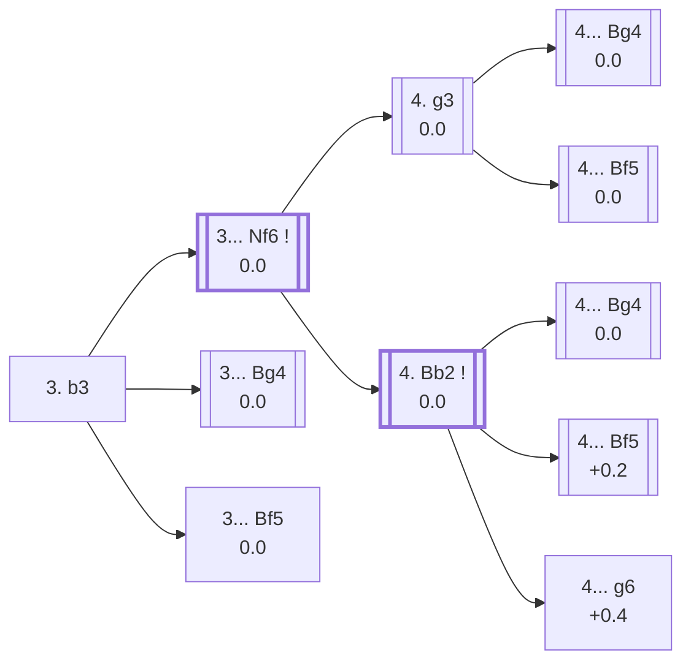

<a name="_TOP_"></a>

# A12 English Opening: Caro-Kann Defensive System <br> 1. c4 c6 2. Nf3 d5 3. b3 #

Spun off from [A11_Caro_Kann_System.md](https://github.com/onclemarcel/chess_flashcards/blob/main/c4_openings/A11_Caro_Kann_System.md), where **3. b3** used to live as a mention-only NOTE. Live-confirmed via the Lichess explorer's own `opening` field, cross-checked against [chessopenings.com's ECO reference](https://chessopenings.com/eco/A12): the bare position right after 3. b3, before Black has even replied, is already **A12** — the same class of "wrong root code" split already applied elsewhere in this repo (A02/A04/A15, see `memory.md`). White fianchettoes the queen's bishop instead of committing the centre, and this single position turns out to carry seven of `eco.md`'s named A12 sub-variations underneath it — more than several codes that already had their own dedicated card.

### Overview

*Quick map of every move covered on this card — text and evals match the candidate-move lists below exactly. Node shape is a data-driven category (master-safe / blitz trap / understudied / blunder); see the [shape key](https://github.com/onclemarcel/chess_flashcards/blob/main/start.md#content-diagram-optional) in start.md. Hover a node for its ECO code and variation name; click to jump to its section.*

<!-- content-diagram:start -->

<!-- content-diagram:end -->

<a name="_initial_move_"></a>

[](https://lichess.org/analysis/standard/rnbqkbnr/pp2pppp/2p5/3p4/2P5/1P3N2/P2PPPPP/RNBQKB1R_b_KQkq_-_0_3)

*... 1. c4 c6 2. Nf3 d5 3. b3 — Réti Opening: Anglo-Slav Variation, Bogoljubow Variation*

```
rnbqkbnr/pp2pppp/2p5/3p4/2P5/1P3N2/P2PPPPP/RNBQKB1R b KQkq - 0 3
```

|  | 0.0 |
| --- | --- |

<!-- lichess-stats:start fen="rnbqkbnr/pp2pppp/2p5/3p4/2P5/1P3N2/P2PPPPP/RNBQKB1R b KQkq - 0 3" db="lichess,masters" speeds="bullet,blitz" ratings="1800,2000,2200,2500" moves="5" -->
| Move | Online | W/D/B | Masters | W/D/B | |
| :--- | ---: | :--- | ---: | :--- | :-- |
| Nf6 | 215 k (62.3%) | ⬜⬜⬜⬜⬜🟫⬛⬛⬛⬛ 50/6/44 | 680 (44.8%) | ⬜⬜⬜🟫🟫🟫🟫⬛⬛⬛ 32/42/26 |  |
| e6 | 35 k (10.3%) | ⬜⬜⬜⬜⬜🟫⬛⬛⬛⬛ 55/5/40 | 10 (0.7%) | — |  |
| Bf5 | 27 k (7.9%) | ⬜⬜⬜⬜⬜🟫⬛⬛⬛⬛ 51/6/43 | 238 (15.7%) | ⬜⬜⬜🟫🟫🟫🟫⬛⬛⬛ 30/35/35 |  |
| dxc4 | 24 k (7.1%) | ⬜⬜⬜⬜⬜🟫⬛⬛⬛⬛ 54/5/42 | 42 (2.8%) | ⬜⬜🟫🟫🟫🟫⬛⬛⬛⬛ 24/36/40 |  |
| Bg4 | 19 k (5.4%) | ⬜⬜⬜⬜⬜🟫⬛⬛⬛⬛ 48/6/46 | 532 (35.0%) | ⬜⬜⬜🟫🟫🟫🟫⬛⬛⬛ 25/43/32 |  |

*Online: bullet/blitz, 1800+ — 345 k games. Masters: 1.5 k games. [Open in the explorer](https://lichess.org/analysis/standard/rnbqkbnr/pp2pppp/2p5/3p4/2P5/1P3N2/P2PPPPP/RNBQKB1R_b_KQkq_-_0_3#explorer) — updated 2026-08-26*
<!-- lichess-stats:end -->

**Naming note, verified against `eco.md` rather than assumed**: Lichess's own live opening-name field repeats "Bogoljubow Variation" for this bare position (per `start.md`'s documented convention, a position with no distinct name of its own just repeats its nearest *named* ancestor). `eco.md`'s own finer per-line naming shows that name really belongs to **3... Bg4** specifically — see below.

### Candidate moves

* [**3... Nf6**](#_Nf6_) (0.0, 44.8% masters): keeps options open, developing before committing the bishop — covered below
* [**3... Bg4**](#_Bg4_) (0.0, 35.0% masters): the *Bogolyubov Variation* — pins the knight immediately, covered below
* [**3... Bf5**](#_Bf5_) (0.0, 15.7% masters): a real third try, developing the bishop to the other natural square

[*Back to TOP*](#_TOP_)

---

<a name="_Bg4_"></a>

## 3... Bg4 — Bogolyubov Variation

Masters' second choice (35.0%): Black pins the knight at once, before White's own bishop or knight can add support.

[](https://lichess.org/analysis/standard/rn1qkbnr/pp2pppp/2p5/3p4/2P3b1/1P3N2/P2PPPPP/RNBQKB1R_w_KQkq_-_1_4)

*... 3... Bg4 — Bogolyubov Variation*

```
rn1qkbnr/pp2pppp/2p5/3p4/2P3b1/1P3N2/P2PPPPP/RNBQKB1R w KQkq - 1 4
```

|  | 0.0 |
| --- | --- |

Not built out further here (backlog) — White most often continues with e3/Be2 or Bb2, transposing toward similar structures as the ... Nf6 lines below.

[*Back to 3. b3*](#_initial_move_)
[*Back to TOP*](#_TOP_)

---

<a name="_Bf5_"></a>

## 3... Bf5

[](https://lichess.org/analysis/standard/rn1qkbnr/pp2pppp/2p5/3p1b2/2P5/1P3N2/P2PPPPP/RNBQKB1R_w_KQkq_-_1_4)

*... 3... Bf5*

```
rn1qkbnr/pp2pppp/2p5/3p1b2/2P5/1P3N2/P2PPPPP/RNBQKB1R w KQkq - 1 4
```

|  | 0.0 |
| --- | --- |

Not built out further here (backlog).

[*Back to 3. b3*](#_initial_move_)
[*Back to TOP*](#_TOP_)

---

<a name="_Nf6_"></a>

## 3... Nf6

Masters' top try (44.8%): Black develops before committing the bishop, keeping both ... Bg4 and ... Bf5 in reserve.

[](https://lichess.org/analysis/standard/rnbqkb1r/pp2pppp/2p2n2/3p4/2P5/1P3N2/P2PPPPP/RNBQKB1R_w_KQkq_-_1_4)

*... 3... Nf6*

```
rnbqkb1r/pp2pppp/2p2n2/3p4/2P5/1P3N2/P2PPPPP/RNBQKB1R w KQkq - 1 4
```

|  | 0.0 |
| --- | --- |

<!-- lichess-stats:start fen="rnbqkb1r/pp2pppp/2p2n2/3p4/2P5/1P3N2/P2PPPPP/RNBQKB1R w KQkq - 1 4" db="lichess,masters" speeds="bullet,blitz" ratings="1800,2000,2200,2500" moves="4" -->
| Move | Online | W/D/B | Masters | W/D/B | |
| :--- | ---: | :--- | ---: | :--- | :-- |
| Bb2 | 200 k (81.2%) | ⬜⬜⬜⬜⬜🟫⬛⬛⬛⬛ 50/6/43 | 840 (76.5%) | ⬜⬜⬜⬜🟫🟫🟫🟫⬛⬛ 35/42/23 |  |
| g3 | 31 k (12.7%) | ⬜⬜⬜⬜⬜🟫⬛⬛⬛⬛ 50/7/43 | 222 (20.2%) | ⬜⬜⬜🟫🟫🟫🟫⬛⬛⬛ 26/45/29 |  |
| e3 | 7.0 k (2.9%) | ⬜⬜⬜⬜⬜🟫⬛⬛⬛⬛ 48/6/46 | 29 (2.6%) | ⬜⬜⬜🟫🟫🟫🟫⬛⬛⬛ 28/41/31 |  |
| cxd5 | 3.7 k (1.5%) | ⬜⬜⬜⬜⬜🟫⬛⬛⬛⬛ 48/6/46 | 0 | — | ⚠ |
| Qc2 | 0 | — | 3 (0.3%) | — |  |

*Online: bullet/blitz, 1800+ — 246 k games. Masters: 1.1 k games. [Open in the explorer](https://lichess.org/analysis/standard/rnbqkb1r/pp2pppp/2p2n2/3p4/2P5/1P3N2/P2PPPPP/RNBQKB1R_w_KQkq_-_1_4#explorer) — updated 2026-08-26*
<!-- lichess-stats:end -->

* [**4. Bb2**](#_Nf6_Bb2_) (0.0): masters' clear favourite (76.5%) — covered below
* [**4. g3**](#_Nf6_g3_) (0.0): a real second try (20.2% masters) — covered below

[*Back to 3. b3*](#_initial_move_)
[*Back to TOP*](#_TOP_)

---

<a name="_Nf6_g3_"></a>

### 4. g3

White fianchettoes the king's bishop as well, before deciding where the c1-bishop belongs.

[](https://lichess.org/analysis/standard/rnbqkb1r/pp2pppp/2p2n2/3p4/2P5/1P3NP1/P2PPP1P/RNBQKB1R_b_KQkq_-_0_4)

*... 4. g3*

```
rnbqkb1r/pp2pppp/2p2n2/3p4/2P5/1P3NP1/P2PPP1P/RNBQKB1R b KQkq - 0 4
```

|  | 0.0 |
| --- | --- |

<!-- lichess-stats:start fen="rnbqkb1r/pp2pppp/2p2n2/3p4/2P5/1P3NP1/P2PPP1P/RNBQKB1R b KQkq - 0 4" db="lichess,masters" speeds="bullet,blitz" ratings="1800,2000,2200,2500" moves="4" -->
| Move | Online | W/D/B | Masters | W/D/B | |
| :--- | ---: | :--- | ---: | :--- | :-- |
| Bf5 | 24 k (34.3%) | ⬜⬜⬜⬜⬜🟫⬛⬛⬛⬛ 49/7/44 | 287 (33.3%) | ⬜⬜⬜🟫🟫🟫🟫⬛⬛⬛ 26/41/33 |  |
| Bg4 | 14 k (19.8%) | ⬜⬜⬜⬜⬜🟫⬛⬛⬛⬛ 49/7/44 | 371 (43.0%) | ⬜⬜⬜🟫🟫🟫🟫⬛⬛⬛ 26/44/30 |  |
| g6 | 13 k (18.9%) | ⬜⬜⬜⬜⬜🟫⬛⬛⬛⬛ 51/8/42 | 89 (10.3%) | ⬜⬜⬜🟫🟫🟫🟫🟫⬛⬛ 27/52/21 |  |
| e6 | 10 k (14.9%) | ⬜⬜⬜⬜⬜🟫⬛⬛⬛⬛ 53/6/40 | 0 | — | ⚠ |
| dxc4 | 0 | — | 53 (6.1%) | ⬜⬜🟫🟫⬛⬛⬛⬛⬛⬛ 23/21/57 |  |

*Online: bullet/blitz, 1800+ — 71 k games. Masters: 863 games. [Open in the explorer](https://lichess.org/analysis/standard/rnbqkb1r/pp2pppp/2p2n2/3p4/2P5/1P3NP1/P2PPP1P/RNBQKB1R_b_KQkq_-_0_4#explorer) — updated 2026-08-26*
<!-- lichess-stats:end -->

* [**4... Bg4**](#_Nf6_g3_Bg4_) (0.0, 43.0% masters): the *Torre defensive System* — covered below
* [**4... Bf5**](#_Nf6_g3_Bf5_) (0.0, 33.3% masters): the *London defensive System* — covered below

[*Back to 3... Nf6*](#_Nf6_)
[*Back to TOP*](#_TOP_)

---

<a name="_Nf6_g3_Bg4_"></a>

#### 4... Bg4 — Torre defensive System

[](https://lichess.org/analysis/standard/rn1qkb1r/pp2pppp/2p2n2/3p4/2P3b1/1P3NP1/P2PPP1P/RNBQKB1R_w_KQkq_-_1_5)

*... 4... Bg4 — Torre defensive System*

```
rn1qkb1r/pp2pppp/2p2n2/3p4/2P3b1/1P3NP1/P2PPP1P/RNBQKB1R w KQkq - 1 5
```

|  | 0.0 |
| --- | --- |

Not built out further here (backlog).

[*Back to 4. g3*](#_Nf6_g3_)
[*Back to TOP*](#_TOP_)

---

<a name="_Nf6_g3_Bf5_"></a>

#### 4... Bf5 — London defensive System

[](https://lichess.org/analysis/standard/rn1qkb1r/pp2pppp/2p2n2/3p1b2/2P5/1P3NP1/P2PPP1P/RNBQKB1R_w_KQkq_-_1_5)

*... 4... Bf5 — London defensive System*

```
rn1qkb1r/pp2pppp/2p2n2/3p1b2/2P5/1P3NP1/P2PPP1P/RNBQKB1R w KQkq - 1 5
```

|  | 0.0 |
| --- | --- |

Not built out further here (backlog).

[*Back to 4. g3*](#_Nf6_g3_)
[*Back to TOP*](#_TOP_)

---

<a name="_Nf6_Bb2_"></a>

### 4. Bb2

Masters' clear favourite (76.5%): the queen's bishop takes up its most natural fianchetto square at once, without committing the king's bishop yet.

[](https://lichess.org/analysis/standard/rnbqkb1r/pp2pppp/2p2n2/3p4/2P5/1P3N2/PB1PPPPP/RN1QKB1R_b_KQkq_-_2_4)

*... 4. Bb2*

```
rnbqkb1r/pp2pppp/2p2n2/3p4/2P5/1P3N2/PB1PPPPP/RN1QKB1R b KQkq - 2 4
```

|  | 0.0 |
| --- | --- |

<!-- lichess-stats:start fen="rnbqkb1r/pp2pppp/2p2n2/3p4/2P5/1P3N2/PB1PPPPP/RN1QKB1R b KQkq - 2 4" db="lichess,masters" speeds="bullet,blitz" ratings="1800,2000,2200,2500" moves="4" -->
| Move | Online | W/D/B | Masters | W/D/B | |
| :--- | ---: | :--- | ---: | :--- | :-- |
| Bf5 | 86 k (35.7%) | ⬜⬜⬜⬜⬜🟫⬛⬛⬛⬛ 49/7/45 | 352 (38.1%) | ⬜⬜⬜⬜🟫🟫🟫🟫⬛⬛ 36/40/23 |  |
| e6 | 51 k (21.0%) | ⬜⬜⬜⬜⬜🟫⬛⬛⬛⬛ 54/6/40 | 108 (11.7%) | ⬜⬜⬜⬜🟫🟫🟫🟫⬛⬛ 43/41/17 |  |
| Bg4 | 44 k (18.2%) | ⬜⬜⬜⬜⬜🟫⬛⬛⬛⬛ 48/6/46 | 355 (38.5%) | ⬜⬜⬜🟫🟫🟫🟫⬛⬛⬛ 27/46/27 |  |
| g6 | 36 k (15.0%) | ⬜⬜⬜⬜⬜🟫⬛⬛⬛⬛ 50/7/43 | 74 (8.0%) | ⬜⬜⬜⬜⬜🟫🟫🟫⬛⬛ 53/28/19 |  |

*Online: bullet/blitz, 1800+ — 242 k games. Masters: 923 games. [Open in the explorer](https://lichess.org/analysis/standard/rnbqkb1r/pp2pppp/2p2n2/3p4/2P5/1P3N2/PB1PPPPP/RN1QKB1R_b_KQkq_-_2_4#explorer) — updated 2026-08-26*
<!-- lichess-stats:end -->

* [**4... Bg4**](#_Nf6_Bb2_Bg4_) (0.0, 38.5% masters): *Capablanca's Variation* — covered below
* [**4... Bf5**](#_Nf6_Bb2_Bf5_) (+0.2, 38.1% masters): the *New York (London) defensive System* — covered below
* [**4... g6**](#_Nf6_Bb2_g6_) (+0.4, 8.0% masters): the *Bled Variation* — covered below

[*Back to 3... Nf6*](#_Nf6_)
[*Back to TOP*](#_TOP_)

---

<a name="_Nf6_Bb2_Bg4_"></a>

#### 4... Bg4 — Capablanca's Variation

[](https://lichess.org/analysis/standard/rn1qkb1r/pp2pppp/2p2n2/3p4/2P3b1/1P3N2/PB1PPPPP/RN1QKB1R_w_KQkq_-_3_5)

*... 4... Bg4 — Capablanca's Variation*

```
rn1qkb1r/pp2pppp/2p2n2/3p4/2P3b1/1P3N2/PB1PPPPP/RN1QKB1R w KQkq - 3 5
```

|  | 0.0 |
| --- | --- |

Not built out further here (backlog).

[*Back to 4. Bb2*](#_Nf6_Bb2_)
[*Back to TOP*](#_TOP_)

---

<a name="_Nf6_Bb2_Bf5_"></a>

#### 4... Bf5 — New York (London) defensive System

[](https://lichess.org/analysis/standard/rn1qkb1r/pp2pppp/2p2n2/3p1b2/2P5/1P3N2/PB1PPPPP/RN1QKB1R_w_KQkq_-_3_5)

*... 4... Bf5 — New York (London) defensive System*

```
rn1qkb1r/pp2pppp/2p2n2/3p1b2/2P5/1P3N2/PB1PPPPP/RN1QKB1R w KQkq - 3 5
```

|  | +0.2 |
| --- | --- |

Not built out further here (backlog).

[*Back to 4. Bb2*](#_Nf6_Bb2_)
[*Back to TOP*](#_TOP_)

---

<a name="_Nf6_Bb2_g6_"></a>

#### 4... g6 — Bled Variation

[](https://lichess.org/analysis/standard/rnbqkb1r/pp2pp1p/2p2np1/3p4/2P5/1P3N2/PB1PPPPP/RN1QKB1R_w_KQkq_-_0_5)

*... 4... g6 — Bled Variation*

```
rnbqkb1r/pp2pp1p/2p2np1/3p4/2P5/1P3N2/PB1PPPPP/RN1QKB1R w KQkq - 0 5
```

|  | +0.4 |
| --- | --- |

Not built out further here (backlog) — a King's Indian-style fianchetto against the reversed structure.

[*Back to 4. Bb2*](#_Nf6_Bb2_)
[*Back to TOP*](#_TOP_)
