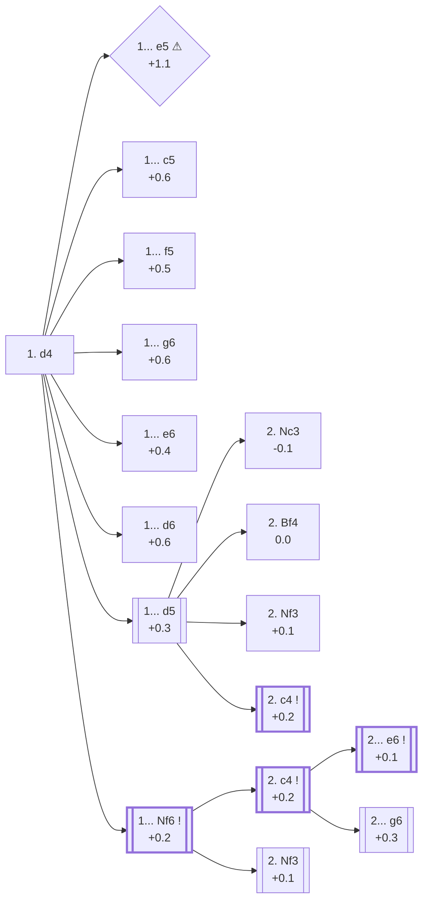

<a name="_TOP_"></a>

# A40 Queen's Pawn Game <br> 1. d4 #

**1. d4**, the Queen's Pawn Opening, is White's second most popular try after 1. e4 (35.8% of masters games, 28.3% online — see [A00 Start Position](https://github.com/onclemarcel/chess_flashcards/blob/main/A00_Start.md)). It stakes the same central claim as 1. e4 without leaving a pawn undefended, and keeps the light-squared bishop's diagonal open rather than the dark-squared one. Its own trade-off is speed: d4-based openings tend to delay direct kingside confrontation in favour of long manoeuvring battles over the centre.

### Overview

*Quick map of every move covered on this card — text and evals match the candidate-move lists below exactly. Node shape is a data-driven category (master-safe / blitz trap / understudied / blunder); see the [shape key](https://github.com/onclemarcel/chess_flashcards/blob/main/start.md#content-diagram-optional) in start.md. Hover a node for its ECO code and variation name; click to jump to its section.*

<!-- content-diagram:start -->

<!-- content-diagram:end -->

<a name="_d4_"></a>

[](https://lichess.org/analysis/standard/rnbqkbnr/pppppppp/8/8/3P4/8/PPP1PPPP/RNBQKBNR_b_KQkq_d3_0_1)

*... 1. d4 — Queen's Pawn Game*

```
rnbqkbnr/pppppppp/8/8/3P4/8/PPP1PPPP/RNBQKBNR b KQkq d3 0 1
```

<!-- lichess-stats:start fen="rnbqkbnr/pppppppp/8/8/3P4/8/PPP1PPPP/RNBQKBNR b KQkq d3 0 1" db="lichess,masters" speeds="bullet,blitz" ratings="1800,2000,2200,2500" moves="10" -->
| Move | Online | W/D/B | Masters | W/D/B | |
| :--- | ---: | :--- | ---: | :--- | :-- |
| d5 | 214.2 M (31.3%) | ⬜⬜⬜⬜⬜🟫⬛⬛⬛⬛ 51/5/44 | 266 k (25.8%) | ⬜⬜⬜🟫🟫🟫🟫🟫⬛⬛ 32/49/19 |  |
| Nf6 | 183.0 M (26.7%) | ⬜⬜⬜⬜⬜⬛⬛⬛⬛⬛ 49/5/46 | 627 k (60.9%) | ⬜⬜⬜🟫🟫🟫🟫🟫⬛⬛ 32/45/23 |  |
| e6 | 67.2 M (9.8%) | ⬜⬜⬜⬜⬜🟫⬛⬛⬛⬛ 51/4/44 | 42 k (4.0%) | ⬜⬜⬜🟫🟫🟫🟫⬛⬛⬛ 34/41/25 |  |
| c5 | 46.5 M (6.8%) | ⬜⬜⬜⬜⬜⬛⬛⬛⬛⬛ 48/4/48 | 8.8 k (0.9%) | ⬜⬜⬜⬜🟫🟫🟫⬛⬛⬛ 42/31/27 |  |
| g6 | 36.8 M (5.4%) | ⬜⬜⬜⬜⬜⬛⬛⬛⬛⬛ 49/4/46 | 25 k (2.4%) | ⬜⬜⬜⬜🟫🟫🟫⬛⬛⬛ 37/34/29 |  |
| c6 | 33.8 M (4.9%) | ⬜⬜⬜⬜⬜⬛⬛⬛⬛⬛ 50/5/45 | 1.7 k (0.2%) | ⬜⬜⬜🟫🟫🟫🟫🟫⬛⬛ 33/50/18 |  |
| d6 | 31.3 M (4.6%) | ⬜⬜⬜⬜⬜⬛⬛⬛⬛⬛ 49/5/47 | 28 k (2.8%) | ⬜⬜⬜🟫🟫🟫🟫⬛⬛⬛ 35/36/28 |  |
| e5 | 31.1 M (4.5%) | ⬜⬜⬜⬜⬜⬛⬛⬛⬛⬛ 49/4/47 | 0 | — | ⚠ |
| f5 | 15.0 M (2.2%) | ⬜⬜⬜⬜⬜⬛⬛⬛⬛⬛ 50/5/46 | 28 k (2.8%) | ⬜⬜⬜⬜🟫🟫🟫🟫⬛⬛ 36/41/23 |  |
| b6 | 13.8 M (2.0%) | ⬜⬜⬜⬜⬜⬛⬛⬛⬛⬛ 51/4/45 | 987 (0.1%) | ⬜⬜⬜⬜🟫🟫🟫⬛⬛⬛ 44/30/26 |  |
| Nc6 | 0 | — | 1.7 k (0.2%) | ⬜⬜⬜⬜🟫🟫🟫⬛⬛⬛ 44/30/26 |  |

*Online: bullet/blitz, 1800+ — 684.3 M games. Masters: 1.0 M games. [Open in the explorer](https://lichess.org/analysis/standard/rnbqkbnr/pppppppp/8/8/3P4/8/PPP1PPPP/RNBQKBNR_b_KQkq_d3_0_1#explorer) — updated 2026-08-25*
<!-- lichess-stats:end -->

> [!NOTE]
> Online, **1... d5** is actually the single most played reply (31.3%), edging out **1... Nf6** (26.7%) — but at master level the order flips hard: Nf6 leads by more than 2:1 (60.9% vs 25.8%). Strong players overwhelmingly prefer to develop the knight and decide on the central pawn structure one move later.

### Candidate moves

* [**1... e5**](#_e5_) (+1.1 ⚠): the [Englund Gambit](#_e5_) — a real online/masters gap, the mark of a blitz trap
* [**1... c5**](#_c5_) (+0.6): the [Old Benoni](#_c5_) — playable but rare, White simply keeps a healthy space edge
* [**1... f5**](#_f5_) (+0.5): the [Dutch Defense](#_f5_) — Black stakes a claim on e4 at the cost of a kingside weakening
* [**1... g6**](#_g6_) (+0.6): the [Modern Defense](#_g6_) move order — flexible, but concedes the centre for now
* [**1... e6**](#_e6_) (+0.4): keeps options for the French, Queen's Gambit Declined or Nimzo-Indian open
* [**1... d6**](https://github.com/onclemarcel/chess_flashcards/blob/main/d4_openings/A41_Queens_Pawn_Game.md) (+0.6, 2.8% masters): delays every commitment, transposing toward the [Old Indian Defense](https://github.com/onclemarcel/chess_flashcards/blob/main/d4_openings/A41_Queens_Pawn_Game.md) (after 2. c4), the [Pirc Defense](https://github.com/onclemarcel/chess_flashcards/blob/main/e4_openings/B07_Pirc_Defense.md) (after 2. e4), or staying flexible — covered on its own card
* [**1... d5**](#_d5_) (+0.3): masters' clear #2 choice (25.8%) — opens the [Queen's Gambit](https://github.com/onclemarcel/chess_flashcards/blob/main/d4_openings/D06_Queens_Gambit.md) complex after 2. c4, or the sound-but-rarely-faced [Richter-Veresov](https://github.com/onclemarcel/chess_flashcards/blob/main/d4_openings/D01_Richter_Veresov_Attack.md)/[Zukertort](https://github.com/onclemarcel/chess_flashcards/blob/main/d4_openings/D02_Zukertort_Variation.md) sidesteps if White delays c4
* [**1... Nf6**](#_Nf6_) (+0.2): the main line by far (60.9% of masters games) — covered below
* [**1... Nc6**](https://github.com/onclemarcel/chess_flashcards/blob/main/d4_openings/A40_Mikenas_Defense.md) (+0.6, 0.2% masters): the [Mikenas Defense](https://github.com/onclemarcel/chess_flashcards/blob/main/d4_openings/A40_Mikenas_Defense.md) — a rare piece-first try, covered on its own card
* [**1... b5**](https://github.com/onclemarcel/chess_flashcards/blob/main/d4_openings/A40_Polish_Defense.md) (+1.1, 0.1% masters): the [Polish Defense](https://github.com/onclemarcel/chess_flashcards/blob/main/d4_openings/A40_Polish_Defense.md) — queenside space for nothing in the centre, covered on its own card

[*Back to TOP*](#_TOP_)

---

> [!TIP]
> **1. d4 e5?!** the [Englund Gambit](https://en.wikipedia.org/wiki/Englund_Gambit) offers a pawn for a quick attack on White's centre — but White is not obliged to grab any tactics and can simply consolidate the extra pawn.
>
> <a name="_e5_"></a>
>
> ### 1... e5 — Englund Gambit
>
> *After the simple **2. dxe5**, engines already rate the position +1.1 for White — nearly a full pawn better than any of Black's other tries on this page. Black's only real practical chance is if White later drops the pawn back carelessly (e.g. ... Nc6 and ... Qe7 pressuring e5), so accuracy matters more than material here.*
>
> [](https://lichess.org/analysis/standard/rnbqkbnr/pppp1ppp/8/4p3/3P4/8/PPP1PPPP/RNBQKBNR_w_KQkq_e6_0_2)
>
> *... 1. d4 e5 — Englund Gambit*
>
> ```
> rnbqkbnr/pppp1ppp/8/4p3/3P4/8/PPP1PPPP/RNBQKBNR w KQkq e6 0 2
> ```
>
> |  | +1.1 |
> | --- | --- |
>
> <!-- lichess-stats:start fen="rnbqkbnr/pppp1ppp/8/4p3/3P4/8/PPP1PPPP/RNBQKBNR w KQkq e6 0 2" db="lichess,masters" speeds="bullet,blitz" ratings="1800,2000,2200,2500" moves="5" -->
> | Move | Online | W/D/B | Masters | W/D/B | |
> | :--- | ---: | :--- | ---: | :--- | :-- |
> | dxe5 | 14.4 M (46.4%) | ⬜⬜⬜⬜⬜⬛⬛⬛⬛⬛ 50/4/46 | 104 (90.4%) | ⬜⬜⬜⬜⬜⬜🟫🟫⬛⬛ 62/22/15 |  |
> | c4 | 5.3 M (17.1%) | ⬜⬜⬜⬜⬜⬛⬛⬛⬛⬛ 50/4/46 | 2 (1.7%) | — | ⚠ |
> | Nf3 | 3.5 M (11.2%) | ⬜⬜⬜⬜⬜⬛⬛⬛⬛⬛ 49/4/47 | 0 | — | ⚠ |
> | e3 | 2.4 M (7.8%) | ⬜⬜⬜⬜⬜⬛⬛⬛⬛⬛ 50/4/47 | 2 (1.7%) | — | ⚠ |
> | d5 | 1.9 M (6.2%) | ⬜⬜⬜⬜⬜⬛⬛⬛⬛⬛ 46/3/50 | 0 | — | ⚠ |
> | e4 | 0 | — | 2 (1.7%) | — |  |
> | g3 | 0 | — | 2 (1.7%) | — |  |
> 
> *Online: bullet/blitz, 1800+ — 31.1 M games. Masters: 115 games. [Open in the explorer](https://lichess.org/analysis/standard/rnbqkbnr/pppp1ppp/8/4p3/3P4/8/PPP1PPPP/RNBQKBNR_w_KQkq_e6_0_2#explorer) — updated 2026-08-25*
> <!-- lichess-stats:end -->
>
> [*Back to 1. d4*](#_d4_)
> [*Back to TOP*](#_TOP_)

---

> [!NOTE]
> **1... c5** invites an Old Benoni structure a tempo down for Black compared with lines starting 1. d4 Nf6 2. c4 c5 — White is not forced to advance the d-pawn, and simply enjoys a comfortable space advantage. See the [dedicated card](https://github.com/onclemarcel/chess_flashcards/blob/main/d4_openings/A43_Old_Benoni.md) for the theory past this point, including a real surprise: masters' own most popular try there is objectively the *worst* of Black's realistic options per Stockfish.
>
> <a name="_c5_"></a>
>
> ### 1... c5 — Old Benoni
>
> [](https://lichess.org/analysis/standard/rnbqkbnr/pp1ppppp/8/2p5/3P4/8/PPP1PPPP/RNBQKBNR_w_KQkq_c6_0_2)
>
> *... 1. d4 c5 — Old Benoni*
>
> ```
> rnbqkbnr/pp1ppppp/8/2p5/3P4/8/PPP1PPPP/RNBQKBNR w KQkq c6 0 2
> ```
>
> |  | +0.6 |
> | --- | --- |
>
> [*Back to 1. d4*](#_d4_)
> [*Back to TOP*](#_TOP_)

---

> [!NOTE]
> **1... f5** — the Dutch Defense — fights for e4 immediately, at the cost of a permanent kingside light-square weakening (especially around e6/g6/h7 once the king castles short).
>
> <a name="_f5_"></a>
>
> ### 1... f5 — Dutch Defense
>
> [](https://lichess.org/analysis/standard/rnbqkbnr/ppppp1pp/8/5p2/3P4/8/PPP1PPPP/RNBQKBNR_w_KQkq_f6_0_2)
>
> *... 1. d4 f5 — Dutch Defense*
>
> ```
> rnbqkbnr/ppppp1pp/8/5p2/3P4/8/PPP1PPPP/RNBQKBNR w KQkq f6 0 2
> ```
>
> |  | +0.5 |
> | --- | --- |
>
> <!-- lichess-stats:start fen="rnbqkbnr/ppppp1pp/8/5p2/3P4/8/PPP1PPPP/RNBQKBNR w KQkq f6 0 2" db="lichess,masters" speeds="bullet,blitz" ratings="1800,2000,2200,2500" moves="5" -->
> | Move | Online | W/D/B | Masters | W/D/B | |
> | :--- | ---: | :--- | ---: | :--- | :-- |
> | c4 | 5.2 M (34.5%) | ⬜⬜⬜⬜⬜⬛⬛⬛⬛⬛ 48/5/47 | 4.4 k (15.5%) | ⬜⬜⬜⬜🟫🟫🟫🟫⬛⬛ 35/39/25 |  |
> | Nf3 | 2.9 M (19.2%) | ⬜⬜⬜⬜⬜⬛⬛⬛⬛⬛ 50/5/45 | 4.5 k (15.8%) | ⬜⬜⬜⬜🟫🟫🟫🟫⬛⬛ 37/38/26 |  |
> | Bf4 | 1.5 M (10.0%) | ⬜⬜⬜⬜⬜⬛⬛⬛⬛⬛ 49/4/47 | 0 | — | ⚠ |
> | Nc3 | 1.2 M (7.8%) | ⬜⬜⬜⬜⬜🟫⬛⬛⬛⬛ 52/5/44 | 3.3 k (11.5%) | ⬜⬜⬜⬜🟫🟫🟫⬛⬛⬛ 39/34/26 |  |
> | e3 | 988 k (6.6%) | ⬜⬜⬜⬜⬜⬛⬛⬛⬛⬛ 48/4/48 | 0 | — | ⚠ |
> | g3 | 0 | — | 12 k (40.9%) | ⬜⬜⬜⬜🟫🟫🟫🟫⬛⬛ 35/45/20 |  |
> | Bg5 | 0 | — | 2.6 k (9.3%) | ⬜⬜⬜⬜🟫🟫🟫🟫⬛⬛ 39/39/22 |  |
> 
> *Online: bullet/blitz, 1800+ — 15.0 M games. Masters: 28 k games. [Open in the explorer](https://lichess.org/analysis/standard/rnbqkbnr/ppppp1pp/8/5p2/3P4/8/PPP1PPPP/RNBQKBNR_w_KQkq_f6_0_2#explorer) — updated 2026-08-25*
> <!-- lichess-stats:end -->
>
> **2. g3** (40.9% masters, but only 3.8% online — a sharp inversion) is masters' clear favourite here, the Fianchetto Attack — see the [dedicated card](https://github.com/onclemarcel/chess_flashcards/blob/main/d4_openings/A81_Dutch.md), built out to the Semi-Leningrad Variation.
>
> [*Back to 1. d4*](#_d4_)
> [*Back to TOP*](#_TOP_)

---

> [!NOTE]
> **1... g6** delays committing the central pawns, keeping King's Indian, Grünfeld and pure Modern Defense move orders all on the table.
>
> <a name="_g6_"></a>
>
> ### 1... g6 — Modern Defense move order
>
> [](https://lichess.org/analysis/standard/rnbqkbnr/pppppp1p/6p1/8/3P4/8/PPP1PPPP/RNBQKBNR_w_KQkq_-_0_2)
>
> *... 1. d4 g6 — Modern Defense move order*
>
> ```
> rnbqkbnr/pppppp1p/6p1/8/3P4/8/PPP1PPPP/RNBQKBNR w KQkq - 0 2
> ```
>
> |  | +0.6 |
> | --- | --- |
>
> <!-- lichess-stats:start fen="rnbqkbnr/pppppp1p/6p1/8/3P4/8/PPP1PPPP/RNBQKBNR w KQkq - 0 2" db="lichess,masters" speeds="bullet,blitz" ratings="1800,2000,2200,2500" moves="5" -->
> | Move | Online | W/D/B | Masters | W/D/B | |
> | :--- | ---: | :--- | ---: | :--- | :-- |
> | c4 | 14.0 M (38.2%) | ⬜⬜⬜⬜⬜⬛⬛⬛⬛⬛ 49/4/47 | 11 k (45.0%) | ⬜⬜⬜⬜🟫🟫🟫⬛⬛⬛ 37/33/30 |  |
> | Nf3 | 7.6 M (20.6%) | ⬜⬜⬜⬜⬜⬛⬛⬛⬛⬛ 50/5/45 | 4.1 k (16.7%) | ⬜⬜⬜🟫🟫🟫🟫⬛⬛⬛ 32/36/32 |  |
> | Bf4 | 3.8 M (10.4%) | ⬜⬜⬜⬜⬜⬛⬛⬛⬛⬛ 49/5/47 | 146 (0.6%) | ⬜⬜🟫🟫🟫⬛⬛⬛⬛⬛ 24/30/46 |  |
> | e4 | 3.4 M (9.1%) | ⬜⬜⬜⬜⬜⬛⬛⬛⬛⬛ 50/4/46 | 8.2 k (33.3%) | ⬜⬜⬜⬜🟫🟫🟫⬛⬛⬛ 40/34/26 |  |
> | e3 | 2.8 M (7.5%) | ⬜⬜⬜⬜⬜⬛⬛⬛⬛⬛ 47/4/48 | 0 | — | ⚠ |
> | g3 | 0 | — | 684 (2.8%) | ⬜⬜⬜🟫🟫🟫🟫⬛⬛⬛ 35/37/28 |  |
> 
> *Online: bullet/blitz, 1800+ — 36.8 M games. Masters: 25 k games. [Open in the explorer](https://lichess.org/analysis/standard/rnbqkbnr/pppppp1p/6p1/8/3P4/8/PPP1PPPP/RNBQKBNR_w_KQkq_-_0_2#explorer) — updated 2026-08-25*
> <!-- lichess-stats:end -->
>
> [*Back to 1. d4*](#_d4_)
> [*Back to TOP*](#_TOP_)

---

> [!NOTE]
> **1... e6** keeps three families of theory alive at once: a French Defense move order if White later plays e4, a Queen's Gambit Declined if Black follows with ... d5, or a Nimzo-/Queen's-Indian setup if Black adds ... Nf6 first.
>
> <a name="_e6_"></a>
>
> ### 1... e6
>
> [](https://lichess.org/analysis/standard/rnbqkbnr/pppp1ppp/4p3/8/3P4/8/PPP1PPPP/RNBQKBNR_w_KQkq_-_0_2)
>
> *... 1. d4 e6*
>
> ```
> rnbqkbnr/pppp1ppp/4p3/8/3P4/8/PPP1PPPP/RNBQKBNR w KQkq - 0 2
> ```
>
> |  | +0.4 |
> | --- | --- |
>
> <!-- lichess-stats:start fen="rnbqkbnr/pppp1ppp/4p3/8/3P4/8/PPP1PPPP/RNBQKBNR w KQkq - 0 2" db="lichess,masters" speeds="bullet,blitz" ratings="1800,2000,2200,2500" moves="5" -->
> | Move | Online | W/D/B | Masters | W/D/B | |
> | :--- | ---: | :--- | ---: | :--- | :-- |
> | c4 | 27.4 M (40.8%) | ⬜⬜⬜⬜⬜⬛⬛⬛⬛⬛ 51/5/45 | 26 k (61.6%) | ⬜⬜⬜⬜🟫🟫🟫🟫⬛⬛ 35/40/25 |  |
> | Nf3 | 14.8 M (22.0%) | ⬜⬜⬜⬜⬜🟫⬛⬛⬛⬛ 52/5/43 | 9.8 k (23.6%) | ⬜⬜⬜🟫🟫🟫🟫⬛⬛⬛ 34/39/27 |  |
> | Bf4 | 7.9 M (11.7%) | ⬜⬜⬜⬜⬜⬛⬛⬛⬛⬛ 50/5/45 | 456 (1.1%) | ⬜⬜⬜🟫🟫🟫🟫⬛⬛⬛ 29/39/32 |  |
> | e3 | 5.2 M (7.7%) | ⬜⬜⬜⬜⬜⬛⬛⬛⬛⬛ 51/4/45 | 0 | — | ⚠ |
> | e4 | 4.7 M (7.0%) | ⬜⬜⬜⬜⬜⬛⬛⬛⬛⬛ 50/4/46 | 4.4 k (10.6%) | ⬜⬜⬜🟫🟫🟫🟫🟫⬛⬛ 32/48/20 |  |
> | g3 | 0 | — | 953 (2.3%) | ⬜⬜⬜⬜🟫🟫🟫🟫⬛⬛ 36/41/24 |  |
> 
> *Online: bullet/blitz, 1800+ — 67.2 M games. Masters: 42 k games. [Open in the explorer](https://lichess.org/analysis/standard/rnbqkbnr/pppp1ppp/4p3/8/3P4/8/PPP1PPPP/RNBQKBNR_w_KQkq_-_0_2#explorer) — updated 2026-08-25*
> <!-- lichess-stats:end -->
>
> [*Back to 1. d4*](#_d4_)
> [*Back to TOP*](#_TOP_)

---

> [!NOTE]
> **1... d5** opens the biggest single body of theory after 1. d4, on a par with the Sicilian after 1. e4 — this NOTE only covers White's second move; each reply below fans out into its own vast complex.
>
> <a name="_d5_"></a>
>
> ### 1... d5
>
> [](https://lichess.org/analysis/standard/rnbqkbnr/ppp1pppp/8/3p4/3P4/8/PPP1PPPP/RNBQKBNR_w_KQkq_d6_0_2)
>
> *... 1. d4 d5*
>
> ```
> rnbqkbnr/ppp1pppp/8/3p4/3P4/8/PPP1PPPP/RNBQKBNR w KQkq d6 0 2
> ```
>
> |  | +0.3 |
> | --- | --- |
>
> <!-- lichess-stats:start fen="rnbqkbnr/ppp1pppp/8/3p4/3P4/8/PPP1PPPP/RNBQKBNR w KQkq d6 0 2" db="lichess,masters" speeds="bullet,blitz" ratings="1800,2000,2200,2500" moves="5" -->
> | Move | Online | W/D/B | Masters | W/D/B | |
> | :--- | ---: | :--- | ---: | :--- | :-- |
> | c4 | 93.3 M (43.6%) | ⬜⬜⬜⬜⬜🟫⬛⬛⬛⬛ 51/5/44 | 204 k (76.9%) | ⬜⬜⬜🟫🟫🟫🟫🟫⬛⬛ 32/50/18 |  |
> | Nf3 | 47.3 M (22.1%) | ⬜⬜⬜⬜⬜🟫⬛⬛⬛⬛ 52/5/43 | 48 k (17.9%) | ⬜⬜⬜🟫🟫🟫🟫🟫⬛⬛ 31/46/22 |  |
> | Bf4 | 27.9 M (13.0%) | ⬜⬜⬜⬜⬜🟫⬛⬛⬛⬛ 50/5/44 | 7.1 k (2.7%) | ⬜⬜⬜🟫🟫🟫🟫🟫⬛⬛ 31/45/24 |  |
> | e3 | 16.1 M (7.5%) | ⬜⬜⬜⬜⬜⬛⬛⬛⬛⬛ 51/5/45 | 0 | — | ⚠ |
> | Nc3 | 10.6 M (5.0%) | ⬜⬜⬜⬜⬜🟫⬛⬛⬛⬛ 52/4/44 | 2.6 k (1.0%) | ⬜⬜⬜🟫🟫🟫🟫⬛⬛⬛ 30/40/30 |  |
> | Bg5 | 0 | — | 2.8 k (1.0%) | ⬜⬜⬜🟫🟫🟫🟫⬛⬛⬛ 35/38/27 |  |
> 
> *Online: bullet/blitz, 1800+ — 214.1 M games. Masters: 266 k games. [Open in the explorer](https://lichess.org/analysis/standard/rnbqkbnr/ppp1pppp/8/3p4/3P4/8/PPP1PPPP/RNBQKBNR_w_KQkq_d6_0_2#explorer) — updated 2026-08-25*
> <!-- lichess-stats:end -->
>
> * [**2. c4**](https://github.com/onclemarcel/chess_flashcards/blob/main/d4_openings/D06_Queens_Gambit.md) (+0.2): by far White's most tested try (76.9% of masters games) — the [Queen's Gambit](https://github.com/onclemarcel/chess_flashcards/blob/main/d4_openings/D06_Queens_Gambit.md), covered on its own card (Slav / Queen's Gambit Declined / Queen's Gambit Accepted)
> * [**2. Nf3**](https://github.com/onclemarcel/chess_flashcards/blob/main/d4_openings/D02_Zukertort_Variation.md) (+0.1): a quieter developing move (17.9% of masters games) that mostly just delays c4 by a move — the [Zukertort Variation](https://github.com/onclemarcel/chess_flashcards/blob/main/d4_openings/D02_Zukertort_Variation.md), covered on its own card (Torre Attack / [London System](https://github.com/onclemarcel/chess_flashcards/blob/main/d4_openings/D02_London_System.md))
> * **2. Bf4** (0.0): the *Accelerated* London System — rare in masters (2.7%) but a real online favourite (13.0%), and likely under-represented even here since it is best known below the 1800+ rating floor these tables use, similarly to the Blackmar-Diemer Gambit. Transposes toward the same structures as the full [London System](https://github.com/onclemarcel/chess_flashcards/blob/main/d4_openings/D02_London_System.md) card if White follows up with Nf3 next.
> * [**2. Nc3**](https://github.com/onclemarcel/chess_flashcards/blob/main/d4_openings/D01_Richter_Veresov_Attack.md) (-0.1): the [Richter-Veresov Attack](https://github.com/onclemarcel/chess_flashcards/blob/main/d4_openings/D01_Richter_Veresov_Attack.md) — a minor, rarely-tested try (1.0% masters), covered on its own card
>
> [*Back to 1. d4*](#_d4_)
> [*Back to TOP*](#_TOP_)

---

<a name="_Nf6_"></a>

## 1... Nf6

The overwhelmingly preferred try at master level (60.9%): Black develops first and keeps every central structure (King's Indian, Grünfeld, Nimzo-Indian, Queen's Indian, Queen's Gambit Declined via a later ... d5) available depending on White's own next move.

[](https://lichess.org/analysis/standard/rnbqkb1r/pppppppp/5n2/8/3P4/8/PPP1PPPP/RNBQKBNR_w_KQkq_-_1_2)

*... 1. d4 Nf6 — Indian Defense*

```
rnbqkb1r/pppppppp/5n2/8/3P4/8/PPP1PPPP/RNBQKBNR w KQkq - 1 2
```

<!-- lichess-stats:start fen="rnbqkb1r/pppppppp/5n2/8/3P4/8/PPP1PPPP/RNBQKBNR w KQkq - 1 2" db="lichess,masters" speeds="bullet,blitz" ratings="1800,2000,2200,2500" moves="8" -->
| Move | Online | W/D/B | Masters | W/D/B | |
| :--- | ---: | :--- | ---: | :--- | :-- |
| c4 | 81.0 M (44.3%) | ⬜⬜⬜⬜⬜⬛⬛⬛⬛⬛ 48/5/46 | 454 k (72.4%) | ⬜⬜⬜🟫🟫🟫🟫🟫⬛⬛ 32/46/22 |  |
| Nf3 | 42.0 M (23.0%) | ⬜⬜⬜⬜⬜🟫⬛⬛⬛⬛ 49/6/45 | 129 k (20.6%) | ⬜⬜⬜🟫🟫🟫🟫⬛⬛⬛ 32/42/26 |  |
| Bf4 | 20.4 M (11.1%) | ⬜⬜⬜⬜⬜⬛⬛⬛⬛⬛ 48/5/47 | 8.3 k (1.3%) | ⬜⬜⬜🟫🟫🟫🟫⬛⬛⬛ 29/42/30 |  |
| Nc3 | 11.4 M (6.2%) | ⬜⬜⬜⬜⬜⬛⬛⬛⬛⬛ 51/4/45 | 6.7 k (1.1%) | ⬜⬜⬜🟫🟫🟫🟫⬛⬛⬛ 30/36/34 |  |
| e3 | 10.8 M (5.9%) | ⬜⬜⬜⬜⬜⬛⬛⬛⬛⬛ 48/5/47 | 377 (0.1%) | ⬜⬜🟫🟫🟫⬛⬛⬛⬛⬛ 21/34/46 |  |
| Bg5 | 8.3 M (4.5%) | ⬜⬜⬜⬜⬜🟫⬛⬛⬛⬛ 50/5/45 | 23 k (3.7%) | ⬜⬜⬜🟫🟫🟫🟫⬛⬛⬛ 34/38/28 |  |
| c3 | 3.8 M (2.1%) | ⬜⬜⬜⬜⬜⬛⬛⬛⬛⬛ 49/5/46 | 1.2 k (0.2%) | ⬜⬜⬜🟫🟫🟫🟫⬛⬛⬛ 28/37/35 |  |
| g3 | 1.3 M (0.7%) | ⬜⬜⬜⬜⬜⬛⬛⬛⬛⬛ 48/6/46 | 3.6 k (0.6%) | ⬜⬜⬜⬜🟫🟫🟫🟫⬛⬛ 36/39/25 |  |

*Online: bullet/blitz, 1800+ — 182.9 M games. Masters: 627 k games. [Open in the explorer](https://lichess.org/analysis/standard/rnbqkb1r/pppppppp/5n2/8/3P4/8/PPP1PPPP/RNBQKBNR_w_KQkq_-_1_2#explorer) — updated 2026-08-25*
<!-- lichess-stats:end -->

* [**2. c4**](#_Nf6_c4_) (+0.2): by far White's most tested try (72.4% of masters games) — covered below
* [**2. Nf3**](#_Nf6_Nf3_) (+0.1): develops first and keeps c4 in reserve — a real second choice (20.6% of masters games), usually transposing back into the same complex
* [**2. Bg5**](https://github.com/onclemarcel/chess_flashcards/blob/main/d4_openings/A45_Trompowsky_Attack.md) (0.0): the [Trompowsky Attack](https://github.com/onclemarcel/chess_flashcards/blob/main/d4_openings/A45_Trompowsky_Attack.md) — sidesteps the whole Indian Defense complex entirely (3.7% masters), covered on its own card

[*Back to 1. d4*](#_d4_)
[*Back to TOP*](#_TOP_)

---

> [!NOTE]
> **2. Nf3** keeps the same central options open while developing a piece first — it very often simply transposes back into the 2. c4 lines below once White commits to c4 a move later.
>
> <a name="_Nf6_Nf3_"></a>
>
> ### 1... Nf6 2. Nf3
>
> [](https://lichess.org/analysis/standard/rnbqkb1r/pppppppp/5n2/8/3P4/5N2/PPP1PPPP/RNBQKB1R_b_KQkq_-_2_2)
>
> *... 1. d4 Nf6 2. Nf3*
>
> ```
> rnbqkb1r/pppppppp/5n2/8/3P4/5N2/PPP1PPPP/RNBQKB1R b KQkq - 2 2
> ```
>
> |  | +0.1 |
> | --- | --- |
>
> <!-- lichess-stats:start fen="rnbqkb1r/pppppppp/5n2/8/3P4/5N2/PPP1PPPP/RNBQKB1R b KQkq - 2 2" db="lichess,masters" speeds="bullet,blitz" ratings="1800,2000,2200,2500" moves="6" -->
> | Move | Online | W/D/B | Masters | W/D/B | |
> | :--- | ---: | :--- | ---: | :--- | :-- |
> | g6 | 16.6 M (34.3%) | ⬜⬜⬜⬜⬜🟫⬛⬛⬛⬛ 49/6/46 | 53 k (37.8%) | ⬜⬜⬜🟫🟫🟫🟫⬛⬛⬛ 34/40/26 |  |
> | e6 | 13.3 M (27.6%) | ⬜⬜⬜⬜⬜🟫⬛⬛⬛⬛ 50/6/44 | 49 k (34.9%) | ⬜⬜⬜🟫🟫🟫🟫⬛⬛⬛ 30/44/25 |  |
> | d5 | 8.7 M (18.1%) | ⬜⬜⬜⬜⬜🟫⬛⬛⬛⬛ 51/6/43 | 20 k (13.8%) | ⬜⬜⬜🟫🟫🟫🟫🟫⬛⬛ 26/51/23 |  |
> | c5 | 4.7 M (9.6%) | ⬜⬜⬜⬜⬜⬛⬛⬛⬛⬛ 47/6/47 | 11 k (7.9%) | ⬜⬜⬜⬜🟫🟫🟫⬛⬛⬛ 37/34/29 |  |
> | d6 | 2.9 M (6.0%) | ⬜⬜⬜⬜⬜🟫⬛⬛⬛⬛ 50/5/45 | 3.8 k (2.7%) | ⬜⬜⬜🟫🟫🟫🟫⬛⬛⬛ 35/37/28 |  |
> | b6 | 956 k (2.0%) | ⬜⬜⬜⬜⬜🟫⬛⬛⬛⬛ 49/6/45 | 3.1 k (2.2%) | ⬜⬜⬜🟫🟫🟫🟫⬛⬛⬛ 30/39/31 |  |
> 
> *Online: bullet/blitz, 1800+ — 48.4 M games. Masters: 141 k games. [Open in the explorer](https://lichess.org/analysis/standard/rnbqkb1r/pppppppp/5n2/8/3P4/5N2/PPP1PPPP/RNBQKB1R_b_KQkq_-_2_2#explorer) — updated 2026-08-25*
> <!-- lichess-stats:end -->
>
> * [**2... b6**](https://github.com/onclemarcel/chess_flashcards/blob/main/d4_openings/A47_Pseudo_Queens_Indian.md): the [Pseudo Queen's Indian Defense](https://github.com/onclemarcel/chess_flashcards/blob/main/d4_openings/A47_Pseudo_Queens_Indian.md) — covered on its own card
> * [**2... Ne4**](https://github.com/onclemarcel/chess_flashcards/blob/main/d4_openings/A46_Dory_Defense.md): the [Döry Defense](https://github.com/onclemarcel/chess_flashcards/blob/main/d4_openings/A46_Dory_Defense.md) — a rare provocative knight hop, covered on its own card
>
> [*Back to 1... Nf6*](#_Nf6_)
> [*Back to TOP*](#_TOP_)

---

<a name="_Nf6_c4_"></a>

## 1... Nf6 2. c4

White grabs a second central pawn and prepares Nc3, the tabiya from which every major Indian system branches.

[](https://lichess.org/analysis/standard/rnbqkb1r/pppppppp/5n2/8/2PP4/8/PP2PPPP/RNBQKBNR_b_KQkq_c3_0_2)

*... 1. d4 Nf6 2. c4 — Indian Defense: Normal Variation*

```
rnbqkb1r/pppppppp/5n2/8/2PP4/8/PP2PPPP/RNBQKBNR b KQkq c3 0 2
```

<!-- lichess-stats:start fen="rnbqkb1r/pppppppp/5n2/8/2PP4/8/PP2PPPP/RNBQKBNR b KQkq c3 0 2" db="lichess,masters" speeds="bullet,blitz" ratings="1800,2000,2200,2500" moves="8" -->
| Move | Online | W/D/B | Masters | W/D/B | |
| :--- | ---: | :--- | ---: | :--- | :-- |
| e6 | 28.7 M (34.8%) | ⬜⬜⬜⬜⬜⬛⬛⬛⬛⬛ 49/5/46 | 247 k (54.2%) | ⬜⬜⬜🟫🟫🟫🟫🟫⬛⬛ 28/51/21 |  |
| g6 | 25.8 M (31.2%) | ⬜⬜⬜⬜⬜⬛⬛⬛⬛⬛ 48/5/47 | 150 k (32.8%) | ⬜⬜⬜⬜🟫🟫🟫🟫⬛⬛ 35/43/22 |  |
| c5 | 11.0 M (13.4%) | ⬜⬜⬜⬜⬜⬛⬛⬛⬛⬛ 46/5/49 | 38 k (8.3%) | ⬜⬜⬜⬜🟫🟫🟫⬛⬛⬛ 40/34/26 |  |
| e5 | 6.6 M (8.0%) | ⬜⬜⬜⬜⬜⬛⬛⬛⬛⬛ 48/5/47 | 3.4 k (0.7%) | ⬜⬜⬜⬜🟫🟫🟫🟫⬛⬛ 44/35/20 |  |
| d6 | 3.9 M (4.8%) | ⬜⬜⬜⬜⬜⬛⬛⬛⬛⬛ 48/5/47 | 9.8 k (2.2%) | ⬜⬜⬜⬜🟫🟫🟫⬛⬛⬛ 39/35/26 |  |
| d5 | 3.5 M (4.3%) | ⬜⬜⬜⬜⬜🟫⬛⬛⬛⬛ 52/4/43 | 0 | — | ⚠ |
| c6 | 1.3 M (1.5%) | ⬜⬜⬜⬜⬜🟫⬛⬛⬛⬛ 50/5/45 | 4.4 k (1.0%) | ⬜⬜⬜🟫🟫🟫🟫🟫⬛⬛ 30/50/20 |  |
| b6 | 679 k (0.8%) | ⬜⬜⬜⬜⬜⬛⬛⬛⬛⬛ 49/5/46 | 1.8 k (0.4%) | ⬜⬜⬜⬜🟫🟫🟫⬛⬛⬛ 36/31/33 |  |
| Nc6 | 0 | — | 2.0 k (0.4%) | ⬜⬜⬜⬜🟫🟫🟫⬛⬛⬛ 39/33/28 |  |

*Online: bullet/blitz, 1800+ — 82.4 M games. Masters: 457 k games. [Open in the explorer](https://lichess.org/analysis/standard/rnbqkb1r/pppppppp/5n2/8/2PP4/8/PP2PPPP/RNBQKBNR_b_KQkq_c3_0_2#explorer) — updated 2026-08-25*
<!-- lichess-stats:end -->

* [**2... e6**](#_Nf6_c4_e6_) (+0.1): masters' top choice (54.2%) — Queen's Gambit Declined / Nimzo-Indian / Queen's Indian family, covered below
* [**2... g6**](#_Nf6_c4_g6_) (+0.3): a very close second (32.8% of masters games) — the King's Indian / Grünfeld family
* [**2... b6**](https://github.com/onclemarcel/chess_flashcards/blob/main/d4_openings/A50_Queens_Indian_Accelerated.md) (+0.2, 0.1% masters): the [Queen's Indian Accelerated](https://github.com/onclemarcel/chess_flashcards/blob/main/d4_openings/A50_Queens_Indian_Accelerated.md) — the Queen's Indian idea before White commits Nf3, covered on its own card
* **2... c5** (0.0, 8.3% masters): after 3. d5 (88.8% masters), forks hard into two real gambit/defence tries — the [**Benko Gambit**](https://github.com/onclemarcel/chess_flashcards/blob/main/d4_openings/A57_Benko_Gambit.md) (3... b5, actually masters' *more* popular pick here at 48.5%) and the [**Modern Benoni**](https://github.com/onclemarcel/chess_flashcards/blob/main/d4_openings/A60_Modern_Benoni.md) (3... e6, 26.5%) — both covered on their own cards, plus a much rarer tactical try, the [**Vulture Defense**](https://github.com/onclemarcel/chess_flashcards/blob/main/d4_openings/A56_Vulture_Defense.md) (3... Ne4, 0.4%)
* [**2... e5**](https://github.com/onclemarcel/chess_flashcards/blob/main/d4_openings/A51_Budapest_Gambit.md) (+0.9, 0.7% masters): the [**Budapest Gambit**](https://github.com/onclemarcel/chess_flashcards/blob/main/d4_openings/A51_Budapest_Gambit.md) — a real, named pawn sacrifice for quick piece activity, covered on its own card
* [**2... d6**](https://github.com/onclemarcel/chess_flashcards/blob/main/d4_openings/A53_Old_Indian_Defense.md) (+0.5, 4.8% masters): the [**Old Indian Defense**](https://github.com/onclemarcel/chess_flashcards/blob/main/d4_openings/A53_Old_Indian_Defense.md) — a solid, King's-Indian-flavoured setup without the fianchetto, covered on its own card

[*Back to 1... Nf6*](#_Nf6_)
[*Back to TOP*](#_TOP_)

---

> [!NOTE]
> **2... g6** is not a minor sideline — at 32.8% of masters games it is a genuine co-main try, opening the King's Indian Defense (after a later ... d6) or the Grünfeld Defense (after a later ... d5).
>
> <a name="_Nf6_c4_g6_"></a>
>
> ### 1... Nf6 2. c4 g6
>
> [](https://lichess.org/analysis/standard/rnbqkb1r/pppppp1p/5np1/8/2PP4/8/PP2PPPP/RNBQKBNR_w_KQkq_-_0_3)
>
> *... 1. d4 Nf6 2. c4 g6 — Indian Defense: West Indian Defense*
>
> ```
> rnbqkb1r/pppppp1p/5np1/8/2PP4/8/PP2PPPP/RNBQKBNR w KQkq - 0 3
> ```
>
> |  | +0.3 |
> | --- | --- |
>
> <!-- lichess-stats:start fen="rnbqkb1r/pppppp1p/5np1/8/2PP4/8/PP2PPPP/RNBQKBNR w KQkq - 0 3" db="lichess,masters" speeds="bullet,blitz" ratings="1800,2000,2200,2500" moves="4" -->
> | Move | Online | W/D/B | Masters | W/D/B | |
> | :--- | ---: | :--- | ---: | :--- | :-- |
> | Nc3 | 20.8 M (80.0%) | ⬜⬜⬜⬜⬜⬛⬛⬛⬛⬛ 48/5/47 | 121 k (80.0%) | ⬜⬜⬜⬜🟫🟫🟫🟫⬛⬛ 35/43/23 |  |
> | Nf3 | 2.9 M (11.2%) | ⬜⬜⬜⬜⬜⬛⬛⬛⬛⬛ 48/6/46 | 12 k (7.8%) | ⬜⬜⬜🟫🟫🟫🟫🟫⬛⬛ 33/46/21 |  |
> | g3 | 707 k (2.7%) | ⬜⬜⬜⬜⬜🟫⬛⬛⬛⬛ 49/6/44 | 13 k (8.7%) | ⬜⬜⬜🟫🟫🟫🟫🟫⬛⬛ 34/47/19 |  |
> | e3 | 629 k (2.4%) | ⬜⬜⬜⬜🟫⬛⬛⬛⬛⬛ 44/5/51 | 0 | — | ⚠ |
> | f3 | 0 | — | 4.2 k (2.8%) | ⬜⬜⬜🟫🟫🟫🟫🟫⬛⬛ 33/45/22 |  |
> 
> *Online: bullet/blitz, 1800+ — 26.1 M games. Masters: 151 k games. [Open in the explorer](https://lichess.org/analysis/standard/rnbqkb1r/pppppp1p/5np1/8/2PP4/8/PP2PPPP/RNBQKBNR_w_KQkq_-_0_3#explorer) — updated 2026-08-25*
> <!-- lichess-stats:end -->
>
> White's near-automatic **3. Nc3** (80.0% of masters games) forks into the King's Indian (3... Bg7) and Grünfeld (3... d5) Defenses — see the [dedicated hub card](https://github.com/onclemarcel/chess_flashcards/blob/main/d4_openings/E61_KID_Grunfeld_Fork.md). **3. g3** (8.7%) is a real second choice, fianchettoing before committing the queen's knight — see the [Neo-Grünfeld Defense](https://github.com/onclemarcel/chess_flashcards/blob/main/d4_openings/D71_Neo_Grunfeld_Defense.md), covered on its own card.
>
> [*Back to 1... Nf6 2. c4*](#_Nf6_c4_)
> [*Back to TOP*](#_TOP_)

---

<a name="_Nf6_c4_e6_"></a>

### 1... Nf6 2. c4 e6

Black's most tested reply (54.2% of masters games), keeping the option of pinning Nc3 with ... Bb4 (Nimzo-Indian) or fianchettoing with ... b6 (Queen's Indian) once White commits to Nc3 or Nf3.

[](https://lichess.org/analysis/standard/rnbqkb1r/pppp1ppp/4pn2/8/2PP4/8/PP2PPPP/RNBQKBNR_w_KQkq_-_0_3)

*... 1. d4 Nf6 2. c4 e6*

```
rnbqkb1r/pppp1ppp/4pn2/8/2PP4/8/PP2PPPP/RNBQKBNR w KQkq - 0 3
```

|  | +0.1 |
| --- | --- |

White's 3rd move here is close at master level (47.5% Nf3 vs 40.1% Nc3) but inverts online, where Nc3 leads by nearly 3:1 (65.1% vs 22.6%) — see the [dedicated hub card](https://github.com/onclemarcel/chess_flashcards/blob/main/d4_openings/E20_Nimzo_QI_Fork.md) for both branches (Nimzo-Indian / Queen's Indian / Bogo-Indian).

[*Back to 1... Nf6 2. c4*](#_Nf6_c4_)
[*Back to TOP*](#_TOP_)
