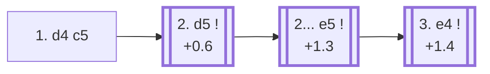

<a name="_TOP_"></a>

# A43 Benoni Defense: Old Benoni <br> 1. d4 c5 #

Spun off from [A40's 1... c5](https://github.com/onclemarcel/chess_flashcards/blob/main/d4_openings/A40_d4_QPG.md#_c5_): Black strikes at the centre from the flank a tempo down compared with the Modern Benoni (which needs 1. d4 Nf6 2. c4 c5 3. d5 first). White isn't forced to advance the d-pawn at all, and simply enjoys a comfortable space advantage if it's declined — but **2. d5** is by far the most tested reply, and this card follows the resulting Old Benoni structure.

### Overview

*Quick map of every move covered on this card — see the [shape key](https://github.com/onclemarcel/chess_flashcards/blob/main/start.md#content-diagram-optional) in start.md. 2... Nf6/d6/g6 are discussed below but have no anchor of their own, so they're left off this map rather than pointing nowhere.*

<!-- content-diagram:start -->

<!-- content-diagram:end -->

<a name="_initial_move_"></a>

[](https://lichess.org/analysis/standard/rnbqkbnr/pp1ppppp/8/2p5/3P4/8/PPP1PPPP/RNBQKBNR_w_KQkq_c6_0_2)

*... 1. d4 c5 — Old Benoni*

```
rnbqkbnr/pp1ppppp/8/2p5/3P4/8/PPP1PPPP/RNBQKBNR w KQkq c6 0 2
```

|  | +0.6 |
| --- | --- |

<!-- lichess-stats:start fen="rnbqkbnr/pp1ppppp/8/2p5/3P4/8/PPP1PPPP/RNBQKBNR w KQkq c6 0 2" db="lichess,masters" speeds="bullet,blitz" ratings="1800,2000,2200,2500" moves="5" -->
| Move | Online | W/D/B | Masters | W/D/B | |
| :--- | ---: | :--- | ---: | :--- | :-- |
| d5 | 13.2 M (28.4%) | ⬜⬜⬜⬜⬜⬛⬛⬛⬛⬛ 49/4/46 | 6.7 k (76.3%) | ⬜⬜⬜⬜⬜🟫🟫🟫⬛⬛ 45/29/25 |  |
| c4 | 7.8 M (16.7%) | ⬜⬜⬜⬜⬜⬛⬛⬛⬛⬛ 46/4/50 | 0 | — | ⚠ |
| Nf3 | 7.3 M (15.7%) | ⬜⬜⬜⬜⬜⬛⬛⬛⬛⬛ 47/4/48 | 0 | — | ⚠ |
| e3 | 5.5 M (11.9%) | ⬜⬜⬜⬜⬜⬛⬛⬛⬛⬛ 48/4/47 | 660 (7.5%) | ⬜⬜⬜🟫🟫🟫🟫⬛⬛⬛ 31/37/32 |  |
| c3 | 4.2 M (8.9%) | ⬜⬜⬜⬜⬜⬛⬛⬛⬛⬛ 49/5/46 | 703 (8.0%) | ⬜⬜⬜🟫🟫🟫🟫⬛⬛⬛ 29/41/30 |  |
| dxc5 | 0 | — | 331 (3.8%) | ⬜⬜⬜🟫🟫🟫🟫⬛⬛⬛ 33/34/34 |  |
| e4 | 0 | — | 183 (2.1%) | ⬜⬜⬜⬜🟫🟫🟫⬛⬛⬛ 40/35/25 |  |

*Online: bullet/blitz, 1800+ — 46.5 M games. Masters: 8.8 k games. [Open in the explorer](https://lichess.org/analysis/standard/rnbqkbnr/pp1ppppp/8/2p5/3P4/8/PPP1PPPP/RNBQKBNR_w_KQkq_c6_0_2#explorer) — updated 2026-08-24*
<!-- lichess-stats:end -->

### Candidate moves

* [**2. d5**](#_d5_) (+0.6): masters' clear main try (76.3%), gaining space and covered below.

[*Back to TOP*](#_TOP_)

---

<a name="_d5_"></a>

## 2. d5

[](https://lichess.org/analysis/standard/rnbqkbnr/pp1ppppp/8/2pP4/8/8/PPP1PPPP/RNBQKBNR_b_KQkq_-_0_2)

*... 2. d5*

```
rnbqkbnr/pp1ppppp/8/2pP4/8/8/PPP1PPPP/RNBQKBNR b KQkq - 0 2
```

|  | +0.6 |
| --- | --- |

<!-- lichess-stats:start fen="rnbqkbnr/pp1ppppp/8/2pP4/8/8/PPP1PPPP/RNBQKBNR b KQkq - 0 2" db="lichess,masters" speeds="bullet,blitz" ratings="1800,2000,2200,2500" moves="5" -->
| Move | Online | W/D/B | Masters | W/D/B | |
| :--- | ---: | :--- | ---: | :--- | :-- |
| d6 | 5.4 M (41.1%) | ⬜⬜⬜⬜⬜⬛⬛⬛⬛⬛ 50/4/46 | 834 (12.5%) | ⬜⬜⬜⬜🟫🟫🟫⬛⬛⬛ 40/32/28 |  |
| e6 | 2.5 M (19.1%) | ⬜⬜⬜⬜⬜⬛⬛⬛⬛⬛ 50/4/46 | 652 (9.7%) | ⬜⬜⬜⬜⬜🟫🟫🟫⬛⬛ 46/29/25 |  |
| Nf6 | 2.2 M (16.6%) | ⬜⬜⬜⬜⬜⬛⬛⬛⬛⬛ 47/4/48 | 1.6 k (24.5%) | ⬜⬜⬜⬜🟫🟫🟫⬛⬛⬛ 42/32/26 |  |
| e5 | 1.9 M (14.4%) | ⬜⬜⬜⬜⬜⬛⬛⬛⬛⬛ 48/5/48 | 2.3 k (35.0%) | ⬜⬜⬜⬜⬜🟫🟫🟫⬛⬛ 51/27/23 |  |
| g6 | 564 k (4.3%) | ⬜⬜⬜⬜⬜⬛⬛⬛⬛⬛ 49/4/47 | 857 (12.8%) | ⬜⬜⬜⬜🟫🟫🟫⬛⬛⬛ 42/31/28 |  |

*Online: bullet/blitz, 1800+ — 13.2 M games. Masters: 6.7 k games. [Open in the explorer](https://lichess.org/analysis/standard/rnbqkbnr/pp1ppppp/8/2pP4/8/8/PPP1PPPP/RNBQKBNR_b_KQkq_-_0_2#explorer) — updated 2026-08-24*
<!-- lichess-stats:end -->

> [!NOTE]
> Masters' most popular try, **2... e5** (35.0%), is the move that gives this line its "Old Benoni" name — but it's also the *worst* of Black's realistic options here per Stockfish (+1.3, a real 0.7-pawn swing worse than the alternatives below). **2... Nf6** (+0.6, 24.5% masters), **2... d6** (+0.6, 12.5%) and **2... g6** (+0.7, 12.8%) are all objectively sounder, keeping the option of a later ... e6 to challenge d5 without permanently locking the centre and burying the dark-squared bishop behind its own e5 pawn. A recurring pattern in this repository: the historically "classical" line and the engine's own preference don't always agree, even among masters.

* [**2... e5**](#_e5_) (+1.3): the *Old Benoni* proper — masters' plurality choice (35.0%) despite being objectively the weakest — see the note above, and the section below.
* **2... Nf6 / 2... d6 / 2... g6**: all objectively better (+0.6, +0.6, +0.7), none built out further here (backlog).

[*Back to 1. d4 c5*](#_initial_move_)
[*Back to TOP*](#_TOP_)

---

<a name="_e5_"></a>

### 2... e5 — the Old Benoni proper

[](https://lichess.org/analysis/standard/rnbqkbnr/pp1p1ppp/8/2pPp3/8/8/PPP1PPPP/RNBQKBNR_w_KQkq_e6_0_3)

*... 2... e5 — locking the centre, the move the whole line is named for*

```
rnbqkbnr/pp1p1ppp/8/2pPp3/8/8/PPP1PPPP/RNBQKBNR w KQkq e6 0 3
```

|  | +1.3 |
| --- | --- |

<!-- lichess-stats:start fen="rnbqkbnr/pp1p1ppp/8/2pPp3/8/8/PPP1PPPP/RNBQKBNR w KQkq e6 0 3" db="lichess,masters" speeds="bullet,blitz" ratings="1800,2000,2200,2500" moves="4" -->
| Move | Online | W/D/B | Masters | W/D/B | |
| :--- | ---: | :--- | ---: | :--- | :-- |
| c4 | 911 k (48.1%) | ⬜⬜⬜⬜⬜⬛⬛⬛⬛⬛ 47/4/49 | 449 (19.2%) | ⬜⬜⬜⬜🟫🟫🟫⬛⬛⬛ 40/29/31 |  |
| e4 | 419 k (22.1%) | ⬜⬜⬜⬜⬜⬛⬛⬛⬛⬛ 50/5/46 | 1.7 k (71.0%) | ⬜⬜⬜⬜⬜🟫🟫🟫⬛⬛ 54/26/20 |  |
| dxe6 | 271 k (14.3%) | ⬜⬜⬜⬜⬜⬛⬛⬛⬛⬛ 45/4/51 | 42 (1.8%) | ⬜⬜⬜⬜🟫🟫🟫🟫⬛⬛ 40/36/24 |  |
| Nc3 | 250 k (13.2%) | ⬜⬜⬜⬜⬜🟫⬛⬛⬛⬛ 53/5/42 | 173 (7.4%) | ⬜⬜⬜⬜⬜🟫🟫🟫⬛⬛ 50/27/23 |  |

*Online: bullet/blitz, 1800+ — 1.9 M games. Masters: 2.3 k games. [Open in the explorer](https://lichess.org/analysis/standard/rnbqkbnr/pp1p1ppp/8/2pPp3/8/8/PPP1PPPP/RNBQKBNR_w_KQkq_e6_0_3#explorer) — updated 2026-08-24*
<!-- lichess-stats:end -->

**3. e4** is masters' clear main try (71.0%) — completing a broad pawn centre while Black's own centre is already fixed and the dark-squared bishop stays boxed in behind the e5 pawn for a long time.

[*Back to 2. d5*](#_d5_)
[*Back to TOP*](#_TOP_)

---

<a name="_e4_"></a>

### 3. e4

[](https://lichess.org/analysis/standard/rnbqkbnr/pp1p1ppp/8/2pPp3/4P3/8/PPP2PPP/RNBQKBNR_b_KQkq_e3_0_3)

*... 3. e4 — reaching the main Old Benoni tabiya*

```
rnbqkbnr/pp1p1ppp/8/2pPp3/4P3/8/PPP2PPP/RNBQKBNR b KQkq e3 0 3
```

|  | +1.4 |
| --- | --- |

From here Black typically continues **... d6** and **... g6/... Nf6**, aiming for a King's-Indian-like setup with a permanently cramped position — playable at club level but rarely seen at the top today, which is exactly why the Modern Benoni (delaying ... e5, or avoiding it) superseded this line in serious practice. Deeper theory past this point is its own body of work, not covered further here.

[*Back to 2... e5*](#_e5_)
[*Back to TOP*](#_TOP_)
