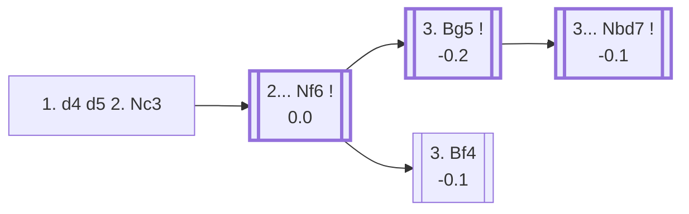

<a name="_TOP_"></a>

# D01 Richter-Veresov Attack <br> 1. d4 d5 2. Nc3 #

Spun off from [A40's 1... d5](https://github.com/onclemarcel/chess_flashcards/blob/main/d4_openings/A40_d4_QPG.md#_d5_): rather than commit to c4 immediately, White develops the queen's knight first, keeping options open between a quick e4 push or the sharper Bg5 pin that gives this line its name. A real sidestep for club and blitz players — sound, rarely faced, and often steering the game away from mainstream Queen's Gambit/Slav theory within two moves.

### Overview

*Quick map of every move covered on this card — see the [shape key](https://github.com/onclemarcel/chess_flashcards/blob/main/start.md#content-diagram-optional) in start.md.*

<!-- content-diagram:start -->

<!-- content-diagram:end -->

<a name="_initial_move_"></a>

[](https://lichess.org/analysis/standard/rnbqkbnr/ppp1pppp/8/3p4/3P4/2N5/PPP1PPPP/R1BQKBNR_b_KQkq_-_1_2)

*... 1. d4 d5 2. Nc3*

```
rnbqkbnr/ppp1pppp/8/3p4/3P4/2N5/PPP1PPPP/R1BQKBNR b KQkq - 1 2
```

|  | -0.1 |
| --- | --- |

<!-- lichess-stats:start fen="rnbqkbnr/ppp1pppp/8/3p4/3P4/2N5/PPP1PPPP/R1BQKBNR b KQkq - 1 2" db="lichess,masters" speeds="bullet,blitz" ratings="1800,2000,2200,2500" moves="6" -->
| Move | Online | W/D/B | Masters | W/D/B | |
| :--- | ---: | :--- | ---: | :--- | :-- |
| Nf6 | 4.8 M (40.3%) | ⬜⬜⬜⬜⬜🟫⬛⬛⬛⬛ 51/4/44 | 2.3 k (73.3%) | ⬜⬜⬜🟫🟫🟫🟫⬛⬛⬛ 28/44/28 |  |
| e6 | 2.5 M (21.1%) | ⬜⬜⬜⬜⬜🟫⬛⬛⬛⬛ 52/4/43 | 192 (6.2%) | ⬜⬜⬜⬜🟫🟫🟫⬛⬛⬛ 36/36/28 |  |
| c6 | 2.1 M (17.2%) | ⬜⬜⬜⬜⬜🟫⬛⬛⬛⬛ 52/4/44 | 192 (6.2%) | ⬜⬜⬜🟫🟫🟫🟫⬛⬛⬛ 25/42/33 |  |
| Bf5 | 730 k (6.1%) | ⬜⬜⬜⬜⬜⬛⬛⬛⬛⬛ 51/4/44 | 264 (8.6%) | ⬜⬜⬜🟫🟫🟫🟫⬛⬛⬛ 29/38/33 |  |
| Nc6 | 641 k (5.4%) | ⬜⬜⬜⬜⬜🟫⬛⬛⬛⬛ 52/4/44 | 0 | — | ⚠ |
| c5 | 614 k (5.1%) | ⬜⬜⬜⬜⬜⬛⬛⬛⬛⬛ 49/4/47 | 75 (2.4%) | ⬜⬜⬜🟫🟫🟫🟫⬛⬛⬛ 28/41/31 |  |
| g6 | 0 | — | 42 (1.4%) | ⬜⬜⬜⬜⬜🟫🟫🟫⬛⬛ 52/29/19 |  |

*Online: bullet/blitz, 1800+ — 11.9 M games. Masters: 3.1 k games. [Open in the explorer](https://lichess.org/analysis/standard/rnbqkbnr/ppp1pppp/8/3p4/3P4/2N5/PPP1PPPP/R1BQKBNR_b_KQkq_-_1_2#explorer) — updated 2026-08-24*
<!-- lichess-stats:end -->

### Candidate moves

* [**2... Nf6**](#_Nf6_) (0.0): develops naturally, keeping every central option open — masters' clear main try (73.3%).
* **2... Bf5 / 2... c6 / 2... e6**: all sound minor alternatives (well under 10% masters each), each simply transposing toward other d4 structures a move or two later — not covered further here.

[*Back to TOP*](#_TOP_)

---

<a name="_Nf6_"></a>

## 2... Nf6

[](https://lichess.org/analysis/standard/rnbqkb1r/ppp1pppp/5n2/3p4/3P4/2N5/PPP1PPPP/R1BQKBNR_w_KQkq_-_2_3)

*... 2... Nf6*

```
rnbqkb1r/ppp1pppp/5n2/3p4/3P4/2N5/PPP1PPPP/R1BQKBNR w KQkq - 2 3
```

|  | 0.0 |
| --- | --- |

<!-- lichess-stats:start fen="rnbqkb1r/ppp1pppp/5n2/3p4/3P4/2N5/PPP1PPPP/R1BQKBNR w KQkq - 2 3" db="lichess,masters" speeds="bullet,blitz" ratings="1800,2000,2200,2500" moves="4" -->
| Move | Online | W/D/B | Masters | W/D/B | |
| :--- | ---: | :--- | ---: | :--- | :-- |
| Bf4 | 3.8 M (43.8%) | ⬜⬜⬜⬜⬜🟫⬛⬛⬛⬛ 51/5/44 | 3.7 k (47.4%) | ⬜⬜⬜🟫🟫🟫🟫⬛⬛⬛ 30/43/28 |  |
| Bg5 | 2.0 M (22.4%) | ⬜⬜⬜⬜⬜🟫⬛⬛⬛⬛ 51/5/44 | 3.9 k (48.9%) | ⬜⬜⬜🟫🟫🟫🟫⬛⬛⬛ 28/36/36 |  |
| e4 | 1.3 M (15.1%) | ⬜⬜⬜⬜⬜⬛⬛⬛⬛⬛ 52/4/45 | 145 (1.8%) | ⬜⬜🟫🟫🟫⬛⬛⬛⬛⬛ 21/33/46 |  |
| Nf3 | 849 k (9.7%) | ⬜⬜⬜⬜⬜⬛⬛⬛⬛⬛ 47/5/48 | 89 (1.1%) | ⬜⬜🟫🟫🟫🟫⬛⬛⬛⬛ 25/37/38 |  |

*Online: bullet/blitz, 1800+ — 8.8 M games. Masters: 7.9 k games. [Open in the explorer](https://lichess.org/analysis/standard/rnbqkb1r/ppp1pppp/5n2/3p4/3P4/2N5/PPP1PPPP/R1BQKBNR_w_KQkq_-_2_3#explorer) — updated 2026-08-24*
<!-- lichess-stats:end -->

White's 3rd move here is a genuine near-even fork — **3. Bg5** (48.9% masters) and **3. Bf4** (47.4%) are essentially tied, unlike most of this repository's forks. Only 3. Bg5 carries the Veresov name.

* [**3. Bg5**](#_Bg5_) (-0.2): the *Richter-Veresov Attack* proper — pins the knight immediately, the line this card follows.
* <a name="_Bf4_"></a>**3. Bf4** (-0.1): an equally common try (47.4% masters) that develops the bishop actively without committing to the pin — no distinct name attached to this exact position by the explorer, and not covered further here.

[*Back to 1. d4 d5 2. Nc3*](#_initial_move_)
[*Back to TOP*](#_TOP_)

---

<a name="_Bg5_"></a>

## 3. Bg5 — Richter-Veresov Attack

[](https://lichess.org/analysis/standard/rnbqkb1r/ppp1pppp/5n2/3p2B1/3P4/2N5/PPP1PPPP/R2QKBNR_b_KQkq_-_3_3)

*... 3. Bg5 — Richter-Veresov Attack*

```
rnbqkb1r/ppp1pppp/5n2/3p2B1/3P4/2N5/PPP1PPPP/R2QKBNR b KQkq - 3 3
```

|  | -0.2 |
| --- | --- |

<!-- lichess-stats:start fen="rnbqkb1r/ppp1pppp/5n2/3p2B1/3P4/2N5/PPP1PPPP/R2QKBNR b KQkq - 3 3" db="lichess,masters" speeds="bullet,blitz" ratings="1800,2000,2200,2500" moves="6" -->
| Move | Online | W/D/B | Masters | W/D/B | |
| :--- | ---: | :--- | ---: | :--- | :-- |
| e6 | 648 k (31.3%) | ⬜⬜⬜⬜⬜🟫⬛⬛⬛⬛ 53/5/42 | 386 (9.6%) | ⬜⬜⬜🟫🟫🟫🟫⬛⬛⬛ 33/38/29 |  |
| Bf5 | 297 k (14.4%) | ⬜⬜⬜⬜⬜🟫⬛⬛⬛⬛ 53/5/43 | 543 (13.5%) | ⬜⬜⬜⬜🟫🟫🟫⬛⬛⬛ 34/32/34 |  |
| Nbd7 | 293 k (14.2%) | ⬜⬜⬜⬜⬜⬛⬛⬛⬛⬛ 47/6/47 | 2.0 k (50.2%) | ⬜⬜🟫🟫🟫🟫⬛⬛⬛⬛ 26/37/37 |  |
| c6 | 252 k (12.2%) | ⬜⬜⬜⬜⬜⬛⬛⬛⬛⬛ 49/5/46 | 402 (10.0%) | ⬜⬜🟫🟫🟫🟫⬛⬛⬛⬛ 24/39/37 |  |
| Ne4 | 171 k (8.3%) | ⬜⬜⬜⬜⬜🟫⬛⬛⬛⬛ 52/5/44 | 0 | — | ⚠ |
| c5 | 134 k (6.5%) | ⬜⬜⬜⬜⬜⬛⬛⬛⬛⬛ 48/5/47 | 342 (8.5%) | ⬜⬜⬜🟫🟫🟫⬛⬛⬛⬛ 27/29/44 |  |
| g6 | 0 | — | 149 (3.7%) | ⬜⬜⬜🟫🟫🟫🟫⬛⬛⬛ 26/42/33 |  |

*Online: bullet/blitz, 1800+ — 2.1 M games. Masters: 4.0 k games. [Open in the explorer](https://lichess.org/analysis/standard/rnbqkb1r/ppp1pppp/5n2/3p2B1/3P4/2N5/PPP1PPPP/R2QKBNR_b_KQkq_-_3_3#explorer) — updated 2026-08-24*
<!-- lichess-stats:end -->

**3... Nbd7** is masters' clear main try (50.2%) — a flexible developing move that avoids committing the light-squared bishop or the c-pawn just yet, and sidesteps 3... Ne4 tactics against the loose Bg5.

[*Back to 2... Nf6*](#_Nf6_)
[*Back to TOP*](#_TOP_)

---

<a name="_Nbd7_"></a>

## 3... Nbd7 — the Veresov tabiya

[](https://lichess.org/analysis/standard/r1bqkb1r/pppnpppp/5n2/3p2B1/3P4/2N5/PPP1PPPP/R2QKBNR_w_KQkq_-_4_4)

*... 3... Nbd7 — reaching the main Veresov tabiya*

```
r1bqkb1r/pppnpppp/5n2/3p2B1/3P4/2N5/PPP1PPPP/R2QKBNR w KQkq - 4 4
```

|  | -0.1 |
| --- | --- |

From here White typically continues **4. Nf3** or **4. f3**, preparing e4 with a broad centre while Black completes development with ... e6/... c6 and ... Be7 or ... h6-... Bf5 ideas against the Bg5 bishop — a compact, well-tested body of theory in its own right, not covered further here. Fully sound (Stockfish keeps it within 0.2 of equal at every step above), and rare enough at club level that most opponents will be reasoning it out at the board rather than from preparation.

[*Back to 3. Bg5*](#_Bg5_)
[*Back to TOP*](#_TOP_)
