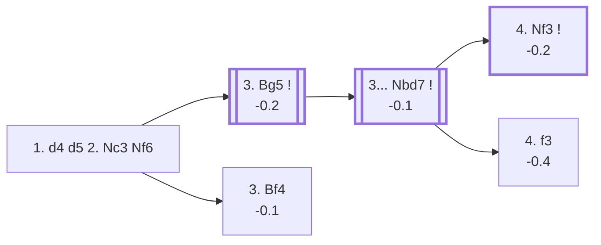

<a name="_TOP_"></a>

# D01 Richter-Veresov Attack <br> 1. d4 d5 2. Nc3 Nf6 #

**Restructured 2026-08-26**: this card used to root at "1. d4 d5 2. Nc3" and explain the D00 mismatch as an inline caveat. Live-confirmed via the Lichess explorer's own `opening` field, cross-checked against [chessopenings.com's ECO reference](https://chessopenings.com/eco/D01): the bare 2. Nc3 position is properly **D00**'s own *Chigorin Variation*, now covered on its own card, [`D00_Queens_Pawn_Game.md`](https://github.com/onclemarcel/chess_flashcards/blob/main/d4_openings/D00_Queens_Pawn_Game.md). This card now roots where its real content actually starts: **2... Nf6**, a position carrying its own genuine oddity — live-tagged **A45** (reusing the "Chigorin Variation" name from an unrelated branch of the ECO tree), one ply before White's 3rd move splits into two real, evenly-matched **D01**-coded systems.

### Overview

*Quick map of every move covered on this card — see the [shape key](https://github.com/onclemarcel/chess_flashcards/blob/main/start.md#content-diagram-optional) in start.md.*

<!-- content-diagram:start -->

<!-- content-diagram:end -->

<a name="_initial_move_"></a>

[](https://lichess.org/analysis/standard/rnbqkb1r/ppp1pppp/5n2/3p4/3P4/2N5/PPP1PPPP/R1BQKBNR_w_KQkq_-_2_3)

*... 1. d4 d5 2. Nc3 Nf6*

```
rnbqkb1r/ppp1pppp/5n2/3p4/3P4/2N5/PPP1PPPP/R1BQKBNR w KQkq - 2 3
```

|  | 0.0 |
| --- | --- |

<!-- lichess-stats:start fen="rnbqkb1r/ppp1pppp/5n2/3p4/3P4/2N5/PPP1PPPP/R1BQKBNR w KQkq - 2 3" db="lichess,masters" speeds="bullet,blitz" ratings="1800,2000,2200,2500" moves="4" -->
| Move | Online | W/D/B | Masters | W/D/B | |
| :--- | ---: | :--- | ---: | :--- | :-- |
| Bf4 | 3.8 M (43.8%) | ⬜⬜⬜⬜⬜🟫⬛⬛⬛⬛ 51/5/44 | 3.7 k (47.4%) | ⬜⬜⬜🟫🟫🟫🟫⬛⬛⬛ 30/43/28 |  |
| Bg5 | 2.0 M (22.4%) | ⬜⬜⬜⬜⬜🟫⬛⬛⬛⬛ 51/5/44 | 3.9 k (48.9%) | ⬜⬜⬜🟫🟫🟫🟫⬛⬛⬛ 28/36/36 |  |
| e4 | 1.3 M (15.1%) | ⬜⬜⬜⬜⬜⬛⬛⬛⬛⬛ 52/4/45 | 145 (1.8%) | ⬜⬜🟫🟫🟫⬛⬛⬛⬛⬛ 21/33/46 |  |
| Nf3 | 849 k (9.7%) | ⬜⬜⬜⬜⬜⬛⬛⬛⬛⬛ 47/5/48 | 89 (1.1%) | ⬜⬜🟫🟫🟫🟫⬛⬛⬛⬛ 25/37/38 |  |

*Online: bullet/blitz, 1800+ — 8.8 M games. Masters: 7.9 k games. [Open in the explorer](https://lichess.org/analysis/standard/rnbqkb1r/ppp1pppp/5n2/3p4/3P4/2N5/PPP1PPPP/R1BQKBNR_w_KQkq_-_2_3#explorer) — updated 2026-09-02*
<!-- lichess-stats:end -->

White's 3rd move here is a genuine near-even fork — **3. Bg5** (48.9% masters) and **3. Bf4** (47.4%) are essentially tied, unlike most of this repository's forks. Only 3. Bg5 carries the Veresov name; 3. Bf4 is its own distinctly-coded, distinctly-named system.

* [**3. Bg5**](#_Bg5_) (-0.2): the *Richter-Veresov Attack* proper — pins the knight immediately, the line this card follows.
* <a name="_Bf4_"></a>**3. Bf4** (-0.1): an equally common try (47.4% masters) that develops the bishop actively without committing to the pin — this is the **Rapport-Jobava System**, its own distinct D01-coded line, not covered further here.

[*Back to TOP*](#_TOP_)

---

<a name="_Bg5_"></a>

## 3. Bg5 — Richter-Veresov Attack

[](https://lichess.org/analysis/standard/rnbqkb1r/ppp1pppp/5n2/3p2B1/3P4/2N5/PPP1PPPP/R2QKBNR_b_KQkq_-_3_3)

*... 3. Bg5 — Richter-Veresov Attack*

```
rnbqkb1r/ppp1pppp/5n2/3p2B1/3P4/2N5/PPP1PPPP/R2QKBNR b KQkq - 3 3
```

|  | -0.2 |
| --- | --- |

<!-- lichess-stats:start fen="rnbqkb1r/ppp1pppp/5n2/3p2B1/3P4/2N5/PPP1PPPP/R2QKBNR b KQkq - 3 3" db="lichess,masters" speeds="bullet,blitz" ratings="1800,2000,2200,2500" moves="6" -->
| Move | Online | W/D/B | Masters | W/D/B | |
| :--- | ---: | :--- | ---: | :--- | :-- |
| e6 | 648 k (31.3%) | ⬜⬜⬜⬜⬜🟫⬛⬛⬛⬛ 53/5/42 | 386 (9.6%) | ⬜⬜⬜🟫🟫🟫🟫⬛⬛⬛ 33/38/29 |  |
| Bf5 | 297 k (14.4%) | ⬜⬜⬜⬜⬜🟫⬛⬛⬛⬛ 53/5/43 | 543 (13.5%) | ⬜⬜⬜⬜🟫🟫🟫⬛⬛⬛ 34/32/34 |  |
| Nbd7 | 293 k (14.2%) | ⬜⬜⬜⬜⬜⬛⬛⬛⬛⬛ 47/6/47 | 2.0 k (50.2%) | ⬜⬜🟫🟫🟫🟫⬛⬛⬛⬛ 26/37/37 |  |
| c6 | 252 k (12.2%) | ⬜⬜⬜⬜⬜⬛⬛⬛⬛⬛ 49/5/46 | 402 (10.0%) | ⬜⬜🟫🟫🟫🟫⬛⬛⬛⬛ 24/39/37 |  |
| Ne4 | 171 k (8.3%) | ⬜⬜⬜⬜⬜🟫⬛⬛⬛⬛ 52/5/44 | 0 | — | ⚠ |
| c5 | 134 k (6.5%) | ⬜⬜⬜⬜⬜⬛⬛⬛⬛⬛ 48/5/47 | 342 (8.5%) | ⬜⬜⬜🟫🟫🟫⬛⬛⬛⬛ 27/29/44 |  |
| g6 | 0 | — | 149 (3.7%) | ⬜⬜⬜🟫🟫🟫🟫⬛⬛⬛ 26/42/33 |  |

*Online: bullet/blitz, 1800+ — 2.1 M games. Masters: 4.0 k games. [Open in the explorer](https://lichess.org/analysis/standard/rnbqkb1r/ppp1pppp/5n2/3p2B1/3P4/2N5/PPP1PPPP/R2QKBNR_b_KQkq_-_3_3#explorer) — updated 2026-09-02*
<!-- lichess-stats:end -->

**3... Nbd7** is masters' clear main try (50.2%) — a flexible developing move that avoids committing the light-squared bishop or the c-pawn just yet, and sidesteps 3... Ne4 tactics against the loose Bg5.

[*Back to 2... Nf6*](#_initial_move_)
[*Back to TOP*](#_TOP_)

---

<a name="_Nbd7_"></a>

## 3... Nbd7 — the Veresov tabiya

[](https://lichess.org/analysis/standard/r1bqkb1r/pppnpppp/5n2/3p2B1/3P4/2N5/PPP1PPPP/R2QKBNR_w_KQkq_-_4_4)

*... 3... Nbd7 — reaching the main Veresov tabiya*

```
r1bqkb1r/pppnpppp/5n2/3p2B1/3P4/2N5/PPP1PPPP/R2QKBNR w KQkq - 4 4
```

|  | -0.1 |
| --- | --- |

White's 4th move here is genuinely spread out: **4. Nf3** (42.3% masters) is the plurality choice, but **4. Qd3** (21.4%) is a real second option — a touch more common than **4. f3** (17.2%) — with **4. e3** (13.4%) also seen. Fully sound throughout (Stockfish keeps every line within half a pawn of equal), and rare enough at club level that most opponents will be reasoning it out at the board rather than from preparation.

* [**4. Nf3**](#_Nf3v_) (-0.2): the plurality choice (42.3% masters) — see below.
* [**4. f3**](#_f3v_) (-0.4): a real alternative (17.2% masters) — see below.
* **4. Qd3 / 4. e3**: also genuinely played (21.4%/13.4% masters) — not covered further here.

[*Back to 3. Bg5*](#_Bg5_)
[*Back to TOP*](#_TOP_)

---

> [!NOTE]
> **4. Nf3**, tagged the *Two Knights System* by the explorer, develops naturally and prepares to castle before committing to e4.
>
> <a name="_Nf3v_"></a>
>
> ### 4. Nf3 — Two Knights System
>
> [](https://lichess.org/analysis/standard/r1bqkb1r/pppnpppp/5n2/3p2B1/3P4/2N2N2/PPP1PPPP/R2QKB1R_b_KQkq_-_5_4)
>
> *... 4. Nf3 — Two Knights System*
>
> ```
> r1bqkb1r/pppnpppp/5n2/3p2B1/3P4/2N2N2/PPP1PPPP/R2QKB1R b KQkq - 5 4
> ```
>
> |  | -0.2 |
> | --- | --- |
>
> <!-- lichess-stats:start fen="r1bqkb1r/pppnpppp/5n2/3p2B1/3P4/2N2N2/PPP1PPPP/R2QKB1R b KQkq - 5 4" db="lichess,masters" speeds="bullet,blitz" ratings="1800,2000,2200,2500" moves="4" -->
> | Move | Online | W/D/B | Masters | W/D/B | |
> | :--- | ---: | :--- | ---: | :--- | :-- |
> | h6 | 27 k (28.5%) | ⬜⬜⬜⬜⬜⬛⬛⬛⬛⬛ 47/6/47 | 261 (30.4%) | ⬜⬜⬜🟫🟫🟫🟫⬛⬛⬛ 25/42/33 |  |
> | e6 | 27 k (27.6%) | ⬜⬜⬜⬜⬜🟫⬛⬛⬛⬛ 47/7/46 | 165 (19.2%) | ⬜⬜🟫🟫🟫🟫🟫⬛⬛⬛ 21/45/33 |  |
> | c6 | 22 k (22.6%) | ⬜⬜⬜⬜⬜🟫⬛⬛⬛⬛ 48/6/46 | 140 (16.3%) | ⬜⬜⬜⬜🟫🟫🟫⬛⬛⬛ 36/34/31 |  |
> | g6 | 9.6 k (10.0%) | ⬜⬜⬜⬜🟫⬛⬛⬛⬛⬛ 44/7/49 | 257 (29.9%) | ⬜⬜🟫🟫🟫🟫⬛⬛⬛⬛ 24/42/34 |  |
> 
> *Online: bullet/blitz, 1800+ — 96 k games. Masters: 859 games. [Open in the explorer](https://lichess.org/analysis/standard/r1bqkb1r/pppnpppp/5n2/3p2B1/3P4/2N2N2/PPP1PPPP/R2QKB1R_b_KQkq_-_5_4#explorer) — updated 2026-09-02*
> <!-- lichess-stats:end -->
>
> Black's reply is a genuine near-even four-way split — **4... h6** (30.4% masters) and **4... g6** (29.9%) are essentially tied, with **4... e6** (19.2%) and **4... c6** (16.3%) both real too. Deeper Two Knights System theory is its own extensive body of work, not covered further here.
>
> [*Back to 3... Nbd7*](#_Nbd7_)
> [*Back to TOP*](#_TOP_)

---

> [!NOTE]
> **4. f3** supports an eventual e4 push with the f-pawn instead of the knight, keeping the option of a broader kingside pawn storm later.
>
> <a name="_f3v_"></a>
>
> ### 4. f3
>
> [](https://lichess.org/analysis/standard/r1bqkb1r/pppnpppp/5n2/3p2B1/3P4/2N2P2/PPP1P1PP/R2QKBNR_b_KQkq_-_0_4)
>
> *... 4. f3*
>
> ```
> r1bqkb1r/pppnpppp/5n2/3p2B1/3P4/2N2P2/PPP1P1PP/R2QKBNR b KQkq - 0 4
> ```
>
> |  | -0.4 |
> | --- | --- |
>
> <!-- lichess-stats:start fen="r1bqkb1r/pppnpppp/5n2/3p2B1/3P4/2N2P2/PPP1P1PP/R2QKBNR b KQkq - 0 4" db="lichess,masters" speeds="bullet,blitz" ratings="1800,2000,2200,2500" moves="4" -->
> | Move | Online | W/D/B | Masters | W/D/B | |
> | :--- | ---: | :--- | ---: | :--- | :-- |
> | h6 | 33 k (34.1%) | ⬜⬜⬜⬜⬜⬛⬛⬛⬛⬛ 49/5/46 | 97 (28.0%) | ⬜⬜🟫🟫🟫⬛⬛⬛⬛⬛ 25/28/47 |  |
> | c6 | 23 k (24.2%) | ⬜⬜⬜⬜⬜⬛⬛⬛⬛⬛ 45/5/49 | 109 (31.4%) | ⬜⬜⬜🟫🟫⬛⬛⬛⬛⬛ 26/26/49 |  |
> | c5 | 21 k (21.6%) | ⬜⬜⬜⬜🟫⬛⬛⬛⬛⬛ 45/6/49 | 119 (34.3%) | ⬜⬜⬜🟫🟫🟫⬛⬛⬛⬛ 30/34/36 |  |
> | e6 | 14 k (14.3%) | ⬜⬜⬜⬜⬜🟫⬛⬛⬛⬛ 52/5/43 | 22 (6.3%) | ⬜⬜⬜🟫🟫🟫🟫🟫⬛⬛ 27/55/18 |  |
> 
> *Online: bullet/blitz, 1800+ — 96 k games. Masters: 347 games. [Open in the explorer](https://lichess.org/analysis/standard/r1bqkb1r/pppnpppp/5n2/3p2B1/3P4/2N2P2/PPP1P1PP/R2QKBNR_b_KQkq_-_0_4#explorer) — updated 2026-09-02*
> <!-- lichess-stats:end -->
>
> Another close three-way split — **4... c5** (34.3% masters), **4... c6** (31.4%) and **4... h6** (28.0%) are all within a few points of each other. Deeper theory past this point is its own extensive body of work, not covered further here.
>
> [*Back to 3... Nbd7*](#_Nbd7_)
> [*Back to TOP*](#_TOP_)
