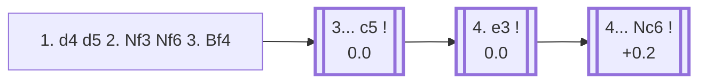

<a name="_TOP_"></a>

# D02 Queen's Pawn Game: London System <br> 1. d4 d5 2. Nf3 Nf6 3. Bf4 #

Spun off from [D02_QPG_Nf3's 3... Bf4 bullet](https://github.com/onclemarcel/chess_flashcards/blob/main/d4_openings/D02_QPG_Nf3.md#_Bf4_), where it had previously been mislabelled "Accelerated London System" — the explorer's own `opening` field confirms this exact position (Nf3 played *before* Bf4) is the real, standard **London System**; the *Accelerated* London specifically means playing 2. Bf4 immediately, skipping Nf3 first (already covered as a NOTE on [A40](https://github.com/onclemarcel/chess_flashcards/blob/main/d4_openings/A40_d4_QPG.md) and [D02](https://github.com/onclemarcel/chess_flashcards/blob/main/d4_openings/D02_QPG_Nf3.md)). Like the Colle System, White commits to a fixed plan almost regardless of Black's setup — Bf4, e3, c3/Nbd2, Bd3/Be2, O-O — trading a small amount of theoretical bite for a position that's easy to play from memory. Genuinely one of the most commonly *faced* club-level d4 systems today, despite this repo having no dedicated card for it until now.

### Overview

*Quick map of every move covered on this card — see the [shape key](https://github.com/onclemarcel/chess_flashcards/blob/main/start.md#content-diagram-optional) in start.md.*

<!-- content-diagram:start -->

<!-- content-diagram:end -->

<a name="_initial_move_"></a>

[](https://lichess.org/analysis/standard/rnbqkb1r/ppp1pppp/5n2/3p4/3P1B2/5N2/PPP1PPPP/RN1QKB1R_b_KQkq_-_3_3)

*... 3. Bf4 — London System*

```
rnbqkb1r/ppp1pppp/5n2/3p4/3P1B2/5N2/PPP1PPPP/RN1QKB1R b KQkq - 3 3
```

|  | 0.0 |
| --- | --- |

<!-- lichess-stats:start fen="rnbqkb1r/ppp1pppp/5n2/3p4/3P1B2/5N2/PPP1PPPP/RN1QKB1R b KQkq - 3 3" db="lichess,masters" speeds="bullet,blitz" ratings="1800,2000,2200,2500" moves="6" -->
| Move | Online | W/D/B | Masters | W/D/B | |
| :--- | ---: | :--- | ---: | :--- | :-- |
| e6 | 2.9 M (29.0%) | ⬜⬜⬜⬜⬜🟫⬛⬛⬛⬛ 51/6/43 | 1.8 k (20.7%) | ⬜⬜⬜🟫🟫🟫🟫🟫⬛⬛ 31/49/20 |  |
| c5 | 2.1 M (20.9%) | ⬜⬜⬜⬜🟫⬛⬛⬛⬛⬛ 46/6/48 | 5.2 k (59.2%) | ⬜⬜🟫🟫🟫🟫🟫⬛⬛⬛ 25/49/26 |  |
| Bf5 | 1.8 M (18.3%) | ⬜⬜⬜⬜⬜🟫⬛⬛⬛⬛ 50/6/44 | 711 (8.1%) | ⬜⬜⬜🟫🟫🟫🟫🟫⬛⬛ 27/55/17 |  |
| c6 | 844 k (8.4%) | ⬜⬜⬜⬜⬜🟫⬛⬛⬛⬛ 51/6/43 | 591 (6.7%) | ⬜⬜⬜🟫🟫🟫🟫🟫⬛⬛ 30/49/21 |  |
| Nc6 | 749 k (7.5%) | ⬜⬜⬜⬜⬜🟫⬛⬛⬛⬛ 53/5/42 | 0 | — | ⚠ |
| Bg4 | 684 k (6.8%) | ⬜⬜⬜⬜⬜🟫⬛⬛⬛⬛ 52/5/43 | 44 (0.5%) | ⬜⬜⬜🟫🟫🟫🟫🟫⬛⬛ 27/48/25 |  |
| g6 | 0 | — | 371 (4.2%) | ⬜⬜⬜🟫🟫🟫🟫🟫⬛⬛ 28/47/25 |  |

*Online: bullet/blitz, 1800+ — 10.0 M games. Masters: 8.8 k games. [Open in the explorer](https://lichess.org/analysis/standard/rnbqkb1r/ppp1pppp/5n2/3p4/3P1B2/5N2/PPP1PPPP/RN1QKB1R_b_KQkq_-_3_3#explorer) — updated 2026-08-25*
<!-- lichess-stats:end -->

> [!NOTE]
> Masters and online players agree on very little else in this repository quite as strongly as they disagree here: masters play **3... c5** in 59.2% of games, while online it's the *least* popular of Black's top three tries (20.9%, behind 3... e6's 29.0%). Bf5 (the "Anti-London," getting the bishop out before ... e6 blocks it in) is a real, sound try either way.

### Candidate moves

* [**3... c5**](#_c5_) (0.0): masters' clear main try (59.2%) — strikes at the centre immediately, the line this card follows.
* **3... e6** (+0.1): online's most popular try (29.0%) — solid, but locks in the light-squared bishop the way 3... Bf5 avoids.
* **3... Bf5** (0.0): the "Anti-London" — develops the bishop *before* playing ... e6, since London's whole point against a normal setup is exploiting the fact Black's bishop gets stuck behind its own pawn chain. A real, well-regarded try at every level (8.1% masters, 18.3% online).
* **3... c6 / 3... g6**: also played (6.7%/4.2% masters) — c6 keeps options for a Slav-like structure, g6 invites a King's-Indian-style fianchetto against London's own bishop.

[*Back to TOP*](#_TOP_)

---

<a name="_c5_"></a>

## 3... c5

[](https://lichess.org/analysis/standard/rnbqkb1r/pp2pppp/5n2/2pp4/3P1B2/5N2/PPP1PPPP/RN1QKB1R_w_KQkq_c6_0_4)

*... 3... c5*

```
rnbqkb1r/pp2pppp/5n2/2pp4/3P1B2/5N2/PPP1PPPP/RN1QKB1R w KQkq c6 0 4
```

|  | 0.0 |
| --- | --- |

<!-- lichess-stats:start fen="rnbqkb1r/pp2pppp/5n2/2pp4/3P1B2/5N2/PPP1PPPP/RN1QKB1R w KQkq c6 0 4" db="lichess,masters" speeds="bullet,blitz" ratings="1800,2000,2200,2500" moves="5" -->
| Move | Online | W/D/B | Masters | W/D/B | |
| :--- | ---: | :--- | ---: | :--- | :-- |
| e3 | 1.6 M (72.8%) | ⬜⬜⬜⬜⬜⬛⬛⬛⬛⬛ 46/6/48 | 4.4 k (84.6%) | ⬜⬜⬜🟫🟫🟫🟫🟫⬛⬛ 25/50/24 |  |
| c3 | 438 k (20.3%) | ⬜⬜⬜⬜🟫⬛⬛⬛⬛⬛ 45/7/48 | 677 (13.0%) | ⬜⬜🟫🟫🟫🟫⬛⬛⬛⬛ 23/42/36 |  |
| dxc5 | 45 k (2.1%) | ⬜⬜⬜⬜⬜⬛⬛⬛⬛⬛ 46/5/49 | 120 (2.3%) | ⬜⬜⬜🟫🟫🟫🟫⬛⬛⬛ 27/39/34 |  |
| Bg3 | 31 k (1.4%) | ⬜⬜⬜⬜⬜⬛⬛⬛⬛⬛ 49/4/47 | 0 | — | ⚠ |
| Nbd2 | 18 k (0.8%) | ⬜⬜⬜⬜⬜⬛⬛⬛⬛⬛ 46/5/49 | 0 | — | ⚠ |
| Bxb8 | 0 | — | 6 (0.1%) | — |  |
| Nc3 | 0 | — | 2 (0.0%) | — |  |

*Online: bullet/blitz, 1800+ — 2.2 M games. Masters: 5.2 k games. [Open in the explorer](https://lichess.org/analysis/standard/rnbqkb1r/pp2pppp/5n2/2pp4/3P1B2/5N2/PPP1PPPP/RN1QKB1R_w_KQkq_c6_0_4#explorer) — updated 2026-08-25*
<!-- lichess-stats:end -->

**4. e3** is masters' clear main try (84.6%) — supports the Bf4 bishop and opens the f1-bishop's diagonal, the classic London setup move.

[*Back to 3. Bf4*](#_initial_move_)
[*Back to TOP*](#_TOP_)

---

<a name="_e3_"></a>

## 4. e3

[](https://lichess.org/analysis/standard/rnbqkb1r/pp2pppp/5n2/2pp4/3P1B2/4PN2/PPP2PPP/RN1QKB1R_b_KQkq_-_0_4)

*... 4. e3*

```
rnbqkb1r/pp2pppp/5n2/2pp4/3P1B2/4PN2/PPP2PPP/RN1QKB1R b KQkq - 0 4
```

|  | 0.0 |
| --- | --- |

<!-- lichess-stats:start fen="rnbqkb1r/pp2pppp/5n2/2pp4/3P1B2/4PN2/PPP2PPP/RN1QKB1R b KQkq - 0 4" db="lichess,masters" speeds="bullet,blitz" ratings="1800,2000,2200,2500" moves="6" -->
| Move | Online | W/D/B | Masters | W/D/B | |
| :--- | ---: | :--- | ---: | :--- | :-- |
| Nc6 | 1.5 M (73.1%) | ⬜⬜⬜⬜⬜⬛⬛⬛⬛⬛ 46/6/48 | 4.4 k (85.3%) | ⬜⬜⬜🟫🟫🟫🟫🟫⬛⬛ 25/50/24 |  |
| cxd4 | 182 k (8.6%) | ⬜⬜⬜⬜⬜⬛⬛⬛⬛⬛ 47/6/47 | 125 (2.4%) | ⬜⬜⬜🟫🟫🟫🟫🟫⬛⬛ 32/50/18 |  |
| Qb6 | 179 k (8.5%) | ⬜⬜⬜⬜⬜⬛⬛⬛⬛⬛ 46/5/49 | 246 (4.8%) | ⬜⬜⬜🟫🟫🟫🟫⬛⬛⬛ 27/38/35 |  |
| e6 | 120 k (5.7%) | ⬜⬜⬜⬜⬜🟫⬛⬛⬛⬛ 50/6/44 | 351 (6.8%) | ⬜⬜⬜🟫🟫🟫🟫🟫⬛⬛ 30/49/20 |  |
| Bg4 | 28 k (1.3%) | ⬜⬜⬜⬜⬜🟫⬛⬛⬛⬛ 50/6/44 | 18 (0.4%) | — |  |
| Bf5 | 26 k (1.2%) | ⬜⬜⬜⬜⬜🟫⬛⬛⬛⬛ 49/6/45 | 6 (0.1%) | — |  |

*Online: bullet/blitz, 1800+ — 2.1 M games. Masters: 5.1 k games. [Open in the explorer](https://lichess.org/analysis/standard/rnbqkb1r/pp2pppp/5n2/2pp4/3P1B2/4PN2/PPP2PPP/RN1QKB1R_b_KQkq_-_0_4#explorer) — updated 2026-08-25*
<!-- lichess-stats:end -->

**4... Nc6** is masters' clear main try (85.3%) — simple development, preparing ... Bd6/... Be7 and eyeing the d4 pawn.

[*Back to 3... c5*](#_c5_)
[*Back to TOP*](#_TOP_)

---

<a name="_Nc6_"></a>

## 4... Nc6 — the London tabiya

[](https://lichess.org/analysis/standard/r1bqkb1r/pp2pppp/2n2n2/2pp4/3P1B2/4PN2/PPP2PPP/RN1QKB1R_w_KQkq_-_1_5)

*... 4... Nc6 — reaching the main London tabiya*

```
r1bqkb1r/pp2pppp/2n2n2/2pp4/3P1B2/4PN2/PPP2PPP/RN1QKB1R w KQkq - 1 5
```

|  | +0.2 |
| --- | --- |

Another sharp online/masters inversion at White's 5th move: masters actually prefer **5. Nbd2** (63.6%) — keeping the c-pawn flexible for a later c4 — over **5. c3** (27.9%, the "pure" solid structure), while online it's the reverse (c3 63.0%, Nbd2 only 14.7%). Either way White follows up with Bd3/Be2, O-O, and typically Ne5 or c4 to fight for the centre; not built out further here (backlog), matching the same "system opening, move order barely matters" logic as the [Colle System](https://github.com/onclemarcel/chess_flashcards/blob/main/d4_openings/D04_Colle_System.md#_c5_).

> [!TIP]
> A real elite example of this exact tabiya's spirit: [Carlsen vs. Ding Liren, Tata Steel Masters 2023](https://lichess.org/cJsGI6A4) (1. d4 Nf6 2. Nf3 d5 3. Bf4 c5 4. e3 e6 5. c3 Bd6 — a small move-order twist, same structure) — a 37-move draw where White never got more than a small, stable edge, a fair picture of what to expect from London System play at the top level: solid, low-risk, rarely more than +0.2.

[*Back to 4. e3*](#_e3_)
[*Back to TOP*](#_TOP_)
