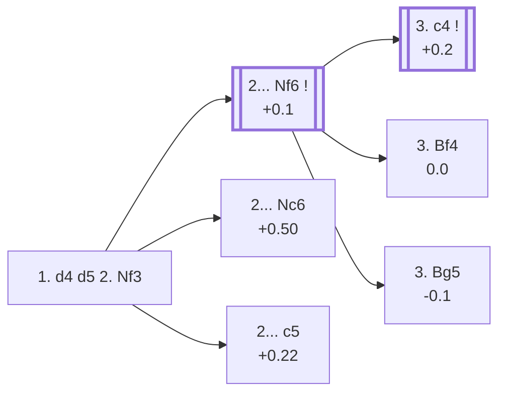

<a name="_TOP_"></a>

# D02 Queen's Pawn Game: Zukertort Variation <br> 1. d4 d5 2. Nf3 #

Spun off from [A40's 1... d5](https://github.com/onclemarcel/chess_flashcards/blob/main/d4_openings/A40_QPG.md#_d5_): White develops the king's knight before deciding anything about the c-pawn. Unlike 2. Nc3 ([Veresov](https://github.com/onclemarcel/chess_flashcards/blob/main/d4_openings/D01_Richter_Veresov_Attack.md)), this mostly isn't an attempt to sidestep known theory — it's a flexible move order that transposes into the Queen's Gambit complex in the large majority of games, with two genuine independent tries (the Torre Attack and the Accelerated London System) as the real "escape hatch" content.

### Overview

*Quick map of every move covered on this card — see the [shape key](https://github.com/onclemarcel/chess_flashcards/blob/main/start.md#content-diagram-optional) in start.md.*

<!-- content-diagram:start -->

<!-- content-diagram:end -->

<a name="_initial_move_"></a>

[](https://lichess.org/analysis/standard/rnbqkbnr/ppp1pppp/8/3p4/3P4/5N2/PPP1PPPP/RNBQKB1R_b_KQkq_-_1_2)

*... 1. d4 d5 2. Nf3 — Zukertort Variation*

```
rnbqkbnr/ppp1pppp/8/3p4/3P4/5N2/PPP1PPPP/RNBQKB1R b KQkq - 1 2
```

|  | +0.1 |
| --- | --- |

<!-- lichess-stats:start fen="rnbqkbnr/ppp1pppp/8/3p4/3P4/5N2/PPP1PPPP/RNBQKB1R b KQkq - 1 2" db="lichess,masters" speeds="bullet,blitz" ratings="1800,2000,2200,2500" moves="6" -->
| Move | Online | W/D/B | Masters | W/D/B | |
| :--- | ---: | :--- | ---: | :--- | :-- |
| Nf6 | 21.5 M (37.4%) | ⬜⬜⬜⬜⬜🟫⬛⬛⬛⬛ 51/6/44 | 54 k (72.5%) | ⬜⬜⬜🟫🟫🟫🟫🟫⬛⬛ 29/51/21 |  |
| e6 | 10.6 M (18.4%) | ⬜⬜⬜⬜⬜🟫⬛⬛⬛⬛ 53/5/42 | 6.2 k (8.4%) | ⬜⬜⬜🟫🟫🟫🟫🟫⬛⬛ 34/45/21 |  |
| c6 | 8.5 M (14.9%) | ⬜⬜⬜⬜⬜🟫⬛⬛⬛⬛ 51/6/44 | 7.7 k (10.4%) | ⬜⬜⬜🟫🟫🟫🟫🟫⬛⬛ 31/45/24 |  |
| Nc6 | 5.2 M (9.1%) | ⬜⬜⬜⬜⬜🟫⬛⬛⬛⬛ 54/5/41 | 1.9 k (2.6%) | ⬜⬜⬜⬜🟫🟫🟫🟫⬛⬛ 38/38/24 |  |
| c5 | 3.9 M (6.9%) | ⬜⬜⬜⬜⬜🟫⬛⬛⬛⬛ 50/5/45 | 2.5 k (3.3%) | ⬜⬜⬜🟫🟫🟫🟫🟫⬛⬛ 33/44/23 |  |
| Bf5 | 3.9 M (6.8%) | ⬜⬜⬜⬜⬜🟫⬛⬛⬛⬛ 52/5/43 | 1.6 k (2.1%) | ⬜⬜⬜⬜🟫🟫🟫🟫⬛⬛ 35/43/22 |  |

*Online: bullet/blitz, 1800+ — 57.3 M games. Masters: 74 k games. [Open in the explorer](https://lichess.org/analysis/standard/rnbqkbnr/ppp1pppp/8/3p4/3P4/5N2/PPP1PPPP/RNBQKB1R_b_KQkq_-_1_2#explorer) — updated 2026-09-14*
<!-- lichess-stats:end -->

### Candidate moves

* [**2... Nf6**](#_Nf6_) (+0.1): mirrors White's development — masters' clear main try (72.5%).
* **2... c6 / 2... e6**: solid minor alternatives (10.4% and 8.4% masters), each simply transposing toward Slav/QGD structures — not covered further here.
* [**2... Nc6**](#_Chigorin_) (+0.50, 2.6% masters): the *Chigorin Variation* — covered below.
* [**2... c5**](#_Krause_) (+0.22, 3.3% masters): the *Krause Variation* — covered below.

[*Back to TOP*](#_TOP_)

---

<a name="_Chigorin_"></a>

## 2... Nc6 — Chigorin Variation

[](https://lichess.org/analysis/standard/r1bqkbnr/ppp1pppp/2n5/3p4/3P4/5N2/PPP1PPPP/RNBQKB1R_w_KQkq_-_2_3)

*... 2... Nc6 — Chigorin Variation*

```
r1bqkbnr/ppp1pppp/2n5/3p4/3P4/5N2/PPP1PPPP/RNBQKB1R w KQkq - 2 3
```

|  | +0.50 |
| --- | --- |

<!-- lichess-stats:start fen="r1bqkbnr/ppp1pppp/2n5/3p4/3P4/5N2/PPP1PPPP/RNBQKB1R w KQkq - 2 3" db="lichess,masters" speeds="bullet,blitz" ratings="1800,2000,2200,2500" moves="4" -->
| Move | Online | W/D/B | Masters | W/D/B | |
| :--- | ---: | :--- | ---: | :--- | :-- |
| Bf4 | 1.7 M (25.3%) | ⬜⬜⬜⬜⬜🟫⬛⬛⬛⬛ 53/5/42 | 1.1 k (33.9%) | ⬜⬜⬜⬜🟫🟫🟫🟫⬛⬛ 36/40/24 |  |
| c4 | 1.7 M (25.0%) | ⬜⬜⬜⬜⬜⬜⬛⬛⬛⬛ 57/4/39 | 1.1 k (33.6%) | ⬜⬜⬜⬜🟫🟫🟫🟫⬛⬛ 42/38/20 |  |
| e3 | 1.2 M (17.5%) | ⬜⬜⬜⬜⬜🟫⬛⬛⬛⬛ 52/5/43 | 279 (8.9%) | ⬜⬜⬜⬜🟫🟫🟫🟫⬛⬛ 43/37/20 |  |
| g3 | 865 k (12.6%) | ⬜⬜⬜⬜⬜⬜⬛⬛⬛⬛ 55/5/40 | 616 (19.6%) | ⬜⬜⬜⬜🟫🟫🟫🟫⬛⬛ 42/37/21 |  |

*Online: bullet/blitz, 1800+ — 6.9 M games. Masters: 3.1 k games. [Open in the explorer](https://lichess.org/analysis/standard/r1bqkbnr/ppp1pppp/2n5/3p4/3P4/5N2/PPP1PPPP/RNBQKB1R_w_KQkq_-_2_3#explorer) — updated 2026-09-14*
<!-- lichess-stats:end -->

Develops the queen's knight actively rather than mirroring White's own development — a genuine minority try (2.6% masters), and the engine already prefers White somewhat more than after the main 2...Nf6. Masters split between **3. Bf4** (33.9%) and **3. c4** (33.6%, transposing toward Queen's Gambit structures where Black's knight is developed a tempo early). Not built out further here (backlog).

[*Back to 1. d4 d5 2. Nf3*](#_initial_move_)
[*Back to TOP*](#_TOP_)

---

<a name="_Krause_"></a>

## 2... c5 — Krause Variation

[](https://lichess.org/analysis/standard/rnbqkbnr/pp2pppp/8/2pp4/3P4/5N2/PPP1PPPP/RNBQKB1R_w_KQkq_c6_0_3)

*... 2... c5 — Krause Variation*

```
rnbqkbnr/pp2pppp/8/2pp4/3P4/5N2/PPP1PPPP/RNBQKB1R w KQkq c6 0 3
```

|  | +0.22 |
| --- | --- |

<!-- lichess-stats:start fen="rnbqkbnr/pp2pppp/8/2pp4/3P4/5N2/PPP1PPPP/RNBQKB1R w KQkq c6 0 3" db="lichess,masters" speeds="bullet,blitz" ratings="1800,2000,2200,2500" moves="5" -->
| Move | Online | W/D/B | Masters | W/D/B | |
| :--- | ---: | :--- | ---: | :--- | :-- |
| e3 | 912 k (22.2%) | ⬜⬜⬜⬜⬜⬛⬛⬛⬛⬛ 49/5/46 | 465 (18.8%) | ⬜⬜⬜🟫🟫🟫🟫⬛⬛⬛ 27/43/30 |  |
| c4 | 837 k (20.4%) | ⬜⬜⬜⬜⬜🟫⬛⬛⬛⬛ 54/5/41 | 1.3 k (51.4%) | ⬜⬜⬜🟫🟫🟫🟫🟫⬛⬛ 36/47/17 |  |
| c3 | 663 k (16.2%) | ⬜⬜⬜⬜⬜🟫⬛⬛⬛⬛ 50/5/45 | 251 (10.1%) | ⬜⬜⬜🟫🟫🟫🟫⬛⬛⬛ 28/41/31 |  |
| Bf4 | 490 k (11.9%) | ⬜⬜⬜⬜⬜⬛⬛⬛⬛⬛ 49/4/46 | 0 | — | ⚠ |
| g3 | 413 k (10.1%) | ⬜⬜⬜⬜⬜🟫⬛⬛⬛⬛ 52/5/42 | 167 (6.8%) | ⬜⬜⬜🟫🟫🟫🟫⬛⬛⬛ 33/36/31 |  |
| dxc5 | 0 | — | 296 (12.0%) | ⬜⬜⬜🟫🟫🟫🟫⬛⬛⬛ 34/41/25 |  |

*Online: bullet/blitz, 1800+ — 4.1 M games. Masters: 2.5 k games. [Open in the explorer](https://lichess.org/analysis/standard/rnbqkbnr/pp2pppp/8/2pp4/3P4/5N2/PPP1PPPP/RNBQKB1R_w_KQkq_c6_0_3#explorer) — updated 2026-09-14*
<!-- lichess-stats:end -->

Strikes at the centre immediately, Symmetrical-Defence-style, rather than developing a piece first — a real, if secondary, try (3.3% masters). Masters' clear main try is **3. c4** (51.4%), transposing toward Queen's Gambit territory with colours reversed in spirit; **3. e3** (18.8%) and **3. dxc5** (12.0%) are both real alternatives. Not built out further here (backlog).

[*Back to 1. d4 d5 2. Nf3*](#_initial_move_)
[*Back to TOP*](#_TOP_)

---

<a name="_Nf6_"></a>

## 2... Nf6

[](https://lichess.org/analysis/standard/rnbqkb1r/ppp1pppp/5n2/3p4/3P4/5N2/PPP1PPPP/RNBQKB1R_w_KQkq_-_2_3)

*... 2... Nf6 — Symmetrical Variation*

```
rnbqkb1r/ppp1pppp/5n2/3p4/3P4/5N2/PPP1PPPP/RNBQKB1R w KQkq - 2 3
```

|  | +0.1 |
| --- | --- |

<!-- lichess-stats:start fen="rnbqkb1r/ppp1pppp/5n2/3p4/3P4/5N2/PPP1PPPP/RNBQKB1R w KQkq - 2 3" db="lichess,masters" speeds="bullet,blitz" ratings="1800,2000,2200,2500" moves="6" -->
| Move | Online | W/D/B | Masters | W/D/B | |
| :--- | ---: | :--- | ---: | :--- | :-- |
| c4 | 8.0 M (26.4%) | ⬜⬜⬜⬜⬜🟫⬛⬛⬛⬛ 52/6/42 | 51 k (70.4%) | ⬜⬜⬜🟫🟫🟫🟫🟫⬛⬛ 28/52/19 |  |
| Bf4 | 7.3 M (24.1%) | ⬜⬜⬜⬜⬜🟫⬛⬛⬛⬛ 50/6/44 | 8.4 k (11.5%) | ⬜⬜⬜🟫🟫🟫🟫🟫⬛⬛ 27/49/24 |  |
| e3 | 5.0 M (16.5%) | ⬜⬜⬜⬜⬜🟫⬛⬛⬛⬛ 50/6/45 | 5.4 k (7.4%) | ⬜⬜🟫🟫🟫🟫🟫⬛⬛⬛ 26/47/28 |  |
| g3 | 3.8 M (12.5%) | ⬜⬜⬜⬜⬜🟫⬛⬛⬛⬛ 51/6/42 | 4.4 k (6.0%) | ⬜⬜🟫🟫🟫🟫🟫⬛⬛⬛ 26/46/28 |  |
| Bg5 | 3.3 M (10.8%) | ⬜⬜⬜⬜⬜🟫⬛⬛⬛⬛ 50/5/44 | 1.8 k (2.4%) | ⬜⬜⬜🟫🟫🟫🟫⬛⬛⬛ 29/43/28 |  |
| c3 | 1.1 M (3.6%) | ⬜⬜⬜⬜⬜🟫⬛⬛⬛⬛ 50/6/44 | 1.4 k (1.9%) | ⬜⬜⬜🟫🟫🟫🟫⬛⬛⬛ 32/44/24 |  |

*Online: bullet/blitz, 1800+ — 30.2 M games. Masters: 73 k games. [Open in the explorer](https://lichess.org/analysis/standard/rnbqkb1r/ppp1pppp/5n2/3p4/3P4/5N2/PPP1PPPP/RNBQKB1R_w_KQkq_-_2_3#explorer) — updated 2026-09-14*
<!-- lichess-stats:end -->

* **3. c4** (+0.2, 70.4% masters): by far White's most common choice — transposes straight into the [Queen's Gambit](https://github.com/onclemarcel/chess_flashcards/blob/main/d4_openings/D06_Queens_Gambit.md) (2... c6/e6 there), the "known path" this whole card exists to sidestep from.
* [**3. Bf4**](https://github.com/onclemarcel/chess_flashcards/blob/main/d4_openings/D02_London_System.md) (0.0, 11.5% masters): the [***London System***](https://github.com/onclemarcel/chess_flashcards/blob/main/d4_openings/D02_London_System.md) — a fully independent system with its own card.
* **3. Bg5** (-0.1, 2.4% masters): the [***Torre Attack***](https://github.com/onclemarcel/chess_flashcards/blob/main/d4_openings/D03_Torre_Attack.md) — rare, but a fully independent system with its own card.
* **3. e3** (7.4% masters): the [Colle System](https://github.com/onclemarcel/chess_flashcards/blob/main/d4_openings/D04_Colle_System.md) — covered on its own card.
* **3. g3** (6.0% masters): Catalan-adjacent, though the [Catalan Opening](https://github.com/onclemarcel/chess_flashcards/blob/main/d4_openings/E00_Catalan.md) proper is reached by a different move order (1. d4 Nf6 2. c4 e6 3. g3) — not covered further here.

[*Back to 1. d4 d5 2. Nf3*](#_initial_move_)
[*Back to TOP*](#_TOP_)

---

> [!NOTE]
> **3. Bf4** is the real, standard **London System** — despite an earlier draft of this note calling it "Accelerated," that name actually belongs to a different move order (2. Bf4 *before* Nf3, flagged on [A40's own note](https://github.com/onclemarcel/chess_flashcards/blob/main/d4_openings/A40_QPG.md#_d5_)); the explorer's own `opening` field confirms the distinction. It's masters' clear second choice here (11.5%, well ahead of the Torre's 2.4%), and a genuine "sound-but-not-learned" path: extremely popular at club level, rarely deeply prepared against. Covered in full on its own card: [**D02 London System**](https://github.com/onclemarcel/chess_flashcards/blob/main/d4_openings/D02_London_System.md).
>
> [*Back to 2... Nf6*](#_Nf6_)
> [*Back to TOP*](#_TOP_)
