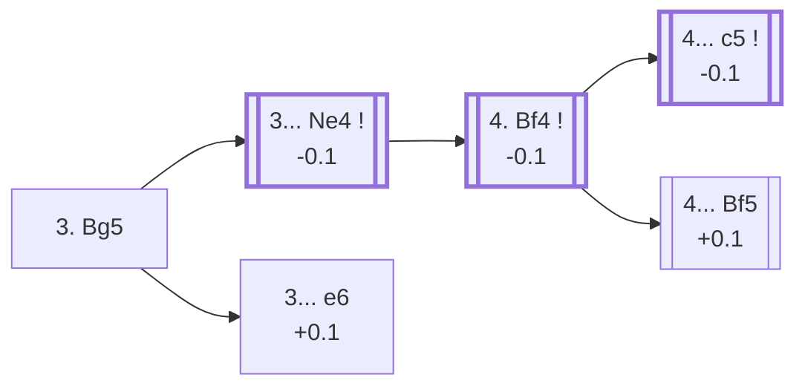

<a name="_TOP_"></a>

# D03 Queen's Pawn Game: Torre Attack <br> 1. d4 d5 2. Nf3 Nf6 3. Bg5 #

Spun off from [D02's 2... Nf6](https://github.com/onclemarcel/chess_flashcards/blob/main/d4_openings/D02_Zukertort_Variation.md#_Nf6_): named after Mexican master Carlos Torre, who used it to famously beat Emanuel Lasker in 1925. White pins the f6 knight before committing the c-pawn anywhere — rare at this exact move order (2.4% of masters games, versus 70.4% simply transposing into the Queen's Gambit via 3. c4), but a fully independent, well-tested system rather than a trick.

### Overview

*Quick map of every move covered on this card — see the [shape key](https://github.com/onclemarcel/chess_flashcards/blob/main/start.md#content-diagram-optional) in start.md.*

<!-- content-diagram:start -->

<!-- content-diagram:end -->

<a name="_initial_move_"></a>

[](https://lichess.org/analysis/standard/rnbqkb1r/ppp1pppp/5n2/3p2B1/3P4/5N2/PPP1PPPP/RN1QKB1R_b_KQkq_-_3_3)

*... 3. Bg5 — Torre Attack*

```
rnbqkb1r/ppp1pppp/5n2/3p2B1/3P4/5N2/PPP1PPPP/RN1QKB1R b KQkq - 3 3
```

|  | -0.1 |
| --- | --- |

<!-- lichess-stats:start fen="rnbqkb1r/ppp1pppp/5n2/3p2B1/3P4/5N2/PPP1PPPP/RN1QKB1R b KQkq - 3 3" db="lichess,masters" speeds="bullet,blitz" ratings="1800,2000,2200,2500" moves="6" -->
| Move | Online | W/D/B | Masters | W/D/B | |
| :--- | ---: | :--- | ---: | :--- | :-- |
| e6 | 1.1 M (31.4%) | ⬜⬜⬜⬜⬜🟫⬛⬛⬛⬛ 52/5/43 | 388 (19.7%) | ⬜⬜⬜⬜🟫🟫🟫🟫⬛⬛ 37/43/20 |  |
| Ne4 | 588 k (16.8%) | ⬜⬜⬜⬜⬜⬛⬛⬛⬛⬛ 46/6/48 | 1.1 k (53.2%) | ⬜⬜⬜🟫🟫🟫🟫⬛⬛⬛ 24/43/33 |  |
| Bf5 | 409 k (11.7%) | ⬜⬜⬜⬜⬜🟫⬛⬛⬛⬛ 49/6/45 | 56 (2.8%) | ⬜⬜⬜⬜⬜🟫🟫🟫⬛⬛ 45/32/23 |  |
| Bg4 | 254 k (7.2%) | ⬜⬜⬜⬜⬜🟫⬛⬛⬛⬛ 51/5/44 | 0 | — | ⚠ |
| Nc6 | 240 k (6.8%) | ⬜⬜⬜⬜⬜🟫⬛⬛⬛⬛ 53/4/43 | 0 | — | ⚠ |
| c6 | 219 k (6.3%) | ⬜⬜⬜⬜⬜🟫⬛⬛⬛⬛ 49/5/45 | 143 (7.3%) | ⬜⬜⬜🟫🟫🟫🟫🟫⬛⬛ 27/50/23 |  |
| Nbd7 | 0 | — | 143 (7.3%) | ⬜⬜⬜⬜🟫🟫🟫🟫⬛⬛ 40/38/22 |  |
| c5 | 0 | — | 124 (6.3%) | ⬜⬜⬜🟫🟫🟫🟫⬛⬛⬛ 24/43/33 |  |

*Online: bullet/blitz, 1800+ — 3.5 M games. Masters: 2.0 k games. [Open in the explorer](https://lichess.org/analysis/standard/rnbqkb1r/ppp1pppp/5n2/3p2B1/3P4/5N2/PPP1PPPP/RN1QKB1R_b_KQkq_-_3_3#explorer) — updated 2026-08-26*
<!-- lichess-stats:end -->

### Candidate moves

* [**3... Ne4**](#_Ne4_) (-0.1): challenges the bishop immediately — masters' clear main try (53.2%).
* [**3... e6**](#_e6_) (+0.1): the quieter alternative (19.7% masters), simply accepting the pin for now.

[*Back to TOP*](#_TOP_)

---

<a name="_Ne4_"></a>

## 3... Ne4

[](https://lichess.org/analysis/standard/rnbqkb1r/ppp1pppp/8/3p2B1/3Pn3/5N2/PPP1PPPP/RN1QKB1R_w_KQkq_-_4_4)

*... 3... Ne4 — kicking the bishop before it kicks back*

```
rnbqkb1r/ppp1pppp/8/3p2B1/3Pn3/5N2/PPP1PPPP/RN1QKB1R w KQkq - 4 4
```

|  | -0.1 |
| --- | --- |

<!-- lichess-stats:start fen="rnbqkb1r/ppp1pppp/8/3p2B1/3Pn3/5N2/PPP1PPPP/RN1QKB1R w KQkq - 4 4" db="lichess,masters" speeds="bullet,blitz" ratings="1800,2000,2200,2500" moves="4" -->
| Move | Online | W/D/B | Masters | W/D/B | |
| :--- | ---: | :--- | ---: | :--- | :-- |
| Bh4 | 265 k (44.9%) | ⬜⬜⬜⬜⬜⬛⬛⬛⬛⬛ 48/6/47 | 350 (33.3%) | ⬜⬜⬜🟫🟫🟫🟫⬛⬛⬛ 26/39/34 |  |
| Bf4 | 214 k (36.2%) | ⬜⬜⬜⬜⬜🟫⬛⬛⬛⬛ 47/7/46 | 650 (61.9%) | ⬜⬜🟫🟫🟫🟫🟫⬛⬛⬛ 23/46/31 |  |
| h4 | 33 k (5.6%) | ⬜⬜⬜⬜⬜⬛⬛⬛⬛⬛ 48/6/46 | 33 (3.1%) | ⬜⬜🟫🟫🟫⬛⬛⬛⬛⬛ 21/30/48 |  |
| e3 | 31 k (5.2%) | ⬜⬜⬜⬜🟫⬛⬛⬛⬛⬛ 44/5/51 | 0 | — | ⚠ |
| Be3 | 0 | — | 12 (1.1%) | — |  |

*Online: bullet/blitz, 1800+ — 591 k games. Masters: 1.1 k games. [Open in the explorer](https://lichess.org/analysis/standard/rnbqkb1r/ppp1pppp/8/3p2B1/3Pn3/5N2/PPP1PPPP/RN1QKB1R_w_KQkq_-_4_4#explorer) — updated 2026-08-26*
<!-- lichess-stats:end -->

**4. Bf4** is masters' clear main choice (61.9%) — retreating to a square where the bishop still eyes the long diagonal and supports a later e3/c3 structure, rather than trading it off with 4. Bh4 (which invites ... g5 ideas).

[*Back to 3. Bg5*](#_initial_move_)
[*Back to TOP*](#_TOP_)

---

<a name="_Bf4_"></a>

## 4. Bf4 — Torre Attack, Gossip Variation

[](https://lichess.org/analysis/standard/rnbqkb1r/ppp1pppp/8/3p4/3PnB2/5N2/PPP1PPPP/RN1QKB1R_b_KQkq_-_5_4)

*... 4. Bf4 — Torre Attack, Gossip Variation*

```
rnbqkb1r/ppp1pppp/8/3p4/3PnB2/5N2/PPP1PPPP/RN1QKB1R b KQkq - 5 4
```

|  | -0.1 |
| --- | --- |

From here Black typically continues **... c5** or **... Bf5**, while White fills in with e3, c4, Bd3 and Nbd2 — a compact, well-tested structure similar in spirit to the London/Accelerated London family.

* [**4... c5**](#_c5t_) (-0.1): masters' clear main try (70.8%) — see below.
* [**4... Bf5**](#_Bf5t_) (+0.1): a real second choice (11.7% masters) — see below.

[*Back to 3... Ne4*](#_Ne4_)
[*Back to TOP*](#_TOP_)

---

> [!NOTE]
> **4... c5** strikes back at White's centre immediately, the most natural way to challenge White's setup before it's fully in place.
>
> <a name="_c5t_"></a>
>
> ### 4... c5
>
> [](https://lichess.org/analysis/standard/rnbqkb1r/pp2pppp/8/2pp4/3PnB2/5N2/PPP1PPPP/RN1QKB1R_w_KQkq_c6_0_5)
>
> *... 4... c5*
>
> ```
> rnbqkb1r/pp2pppp/8/2pp4/3PnB2/5N2/PPP1PPPP/RN1QKB1R w KQkq c6 0 5
> ```
>
> |  | -0.1 |
> | --- | --- |
>
> <!-- lichess-stats:start fen="rnbqkb1r/pp2pppp/8/2pp4/3PnB2/5N2/PPP1PPPP/RN1QKB1R w KQkq c6 0 5" db="lichess,masters" speeds="bullet,blitz" ratings="1800,2000,2200,2500" moves="4" -->
> | Move | Online | W/D/B | Masters | W/D/B | |
> | :--- | ---: | :--- | ---: | :--- | :-- |
> | e3 | 61 k (56.1%) | ⬜⬜⬜⬜🟫⬛⬛⬛⬛⬛ 45/7/48 | 275 (58.1%) | ⬜⬜🟫🟫🟫🟫⬛⬛⬛⬛ 18/42/40 |  |
> | c3 | 30 k (28.1%) | ⬜⬜⬜⬜🟫⬛⬛⬛⬛⬛ 45/8/46 | 135 (28.5%) | ⬜⬜🟫🟫🟫🟫🟫⬛⬛⬛ 23/52/25 |  |
> | Nbd2 | 8.4 k (7.8%) | ⬜⬜⬜⬜⬜⬛⬛⬛⬛⬛ 47/6/47 | 11 (2.3%) | — |  |
> | dxc5 | 4.3 k (4.0%) | ⬜⬜⬜⬜🟫⬛⬛⬛⬛⬛ 44/6/50 | 45 (9.5%) | ⬜⬜⬜🟫🟫🟫🟫⬛⬛⬛ 31/40/29 |  |
> 
> *Online: bullet/blitz, 1800+ — 108 k games. Masters: 473 games. [Open in the explorer](https://lichess.org/analysis/standard/rnbqkb1r/pp2pppp/8/2pp4/3PnB2/5N2/PPP1PPPP/RN1QKB1R_w_KQkq_c6_0_5#explorer) — updated 2026-08-26*
> <!-- lichess-stats:end -->
>
> **5. e3** (58.1% masters) is White's clear main try — a solid, flexible structure over the sharper **5. c3** (28.5% masters). Deeper Gossip Variation theory past this point is its own extensive body of work, not covered further here.
>
> [*Back to 4. Bf4*](#_Bf4_)
> [*Back to TOP*](#_TOP_)

---

> [!NOTE]
> **4... Bf5** develops the light-squared bishop before it gets shut in by a later ... e6, the main alternative to the sharper ... c5.
>
> <a name="_Bf5t_"></a>
>
> ### 4... Bf5
>
> [](https://lichess.org/analysis/standard/rn1qkb1r/ppp1pppp/8/3p1b2/3PnB2/5N2/PPP1PPPP/RN1QKB1R_w_KQkq_-_6_5)
>
> *... 4... Bf5*
>
> ```
> rn1qkb1r/ppp1pppp/8/3p1b2/3PnB2/5N2/PPP1PPPP/RN1QKB1R w KQkq - 6 5
> ```
>
> |  | +0.1 |
> | --- | --- |
>
> <!-- lichess-stats:start fen="rn1qkb1r/ppp1pppp/8/3p1b2/3PnB2/5N2/PPP1PPPP/RN1QKB1R w KQkq - 6 5" db="lichess,masters" speeds="bullet,blitz" ratings="1800,2000,2200,2500" moves="3" -->
> | Move | Online | W/D/B | Masters | W/D/B | |
> | :--- | ---: | :--- | ---: | :--- | :-- |
> | e3 | 15 k (52.9%) | ⬜⬜⬜⬜🟫⬛⬛⬛⬛⬛ 45/8/47 | 51 (65.4%) | ⬜⬜🟫🟫🟫🟫🟫🟫⬛⬛ 22/57/22 |  |
> | Nbd2 | 8.3 k (28.7%) | ⬜⬜⬜⬜🟫⬛⬛⬛⬛⬛ 45/9/47 | 21 (26.9%) | ⬜⬜⬜🟫🟫🟫🟫🟫⬛⬛ 29/48/24 |  |
> | c3 | 2.7 k (9.4%) | ⬜⬜⬜⬜🟫⬛⬛⬛⬛⬛ 43/10/47 | 2 (2.6%) | — | ⚠ |
> 
> *Online: bullet/blitz, 1800+ — 29 k games. Masters: 78 games. [Open in the explorer](https://lichess.org/analysis/standard/rn1qkb1r/ppp1pppp/8/3p1b2/3PnB2/5N2/PPP1PPPP/RN1QKB1R_w_KQkq_-_6_5#explorer) — updated 2026-08-26*
> <!-- lichess-stats:end -->
>
> **5. e3** (65.4% masters) is again White's clear main try, with **5. Nbd2** (26.9%) a real second choice. Deeper theory past this point is its own extensive body of work, not covered further here.
>
> [*Back to 4. Bf4*](#_Bf4_)
> [*Back to TOP*](#_TOP_)

---

> [!NOTE]
> **3... e6** simply accepts the pin for now rather than challenging the bishop right away — a quieter, QGD-flavoured way to meet the Torre.
>
> <a name="_e6_"></a>
>
> ### 3... e6
>
> [](https://lichess.org/analysis/standard/rnbqkb1r/ppp2ppp/4pn2/3p2B1/3P4/5N2/PPP1PPPP/RN1QKB1R_w_KQkq_-_0_4)
>
> *... 3... e6*
>
> ```
> rnbqkb1r/ppp2ppp/4pn2/3p2B1/3P4/5N2/PPP1PPPP/RN1QKB1R w KQkq - 0 4
> ```
>
> |  | +0.1 |
> | --- | --- |
>
> [*Back to 3. Bg5*](#_initial_move_)
> [*Back to TOP*](#_TOP_)
