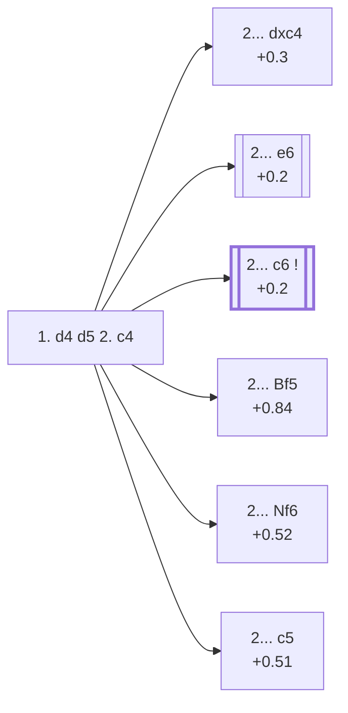

<a name="_TOP_"></a>

# D06 Queen's Gambit <br> 1. d4 d5 2. c4 #

**2. c4** is by far White's most tested try after 1... d5 (76.9% of masters games — see [A40 Queen's Pawn Game](https://github.com/onclemarcel/chess_flashcards/blob/main/d4_openings/A40_QPG.md)). It is not a "true" gambit: if Black simply takes the pawn (2... dxc4), White regains it with an extra tempo in almost every practical line, since ... b5 to hold onto c4 permanently weakens Black's queenside too much to be sound.

### Overview

*Quick map of every move covered on this card — text and evals match the candidate-move lists below exactly. Node shape is a data-driven category (master-safe / blitz trap / understudied / blunder); see the [shape key](https://github.com/onclemarcel/chess_flashcards/blob/main/start.md#content-diagram-optional) in start.md. Hover a node for its ECO code and variation name; click to jump to its section.*

<!-- content-diagram:start -->

<!-- content-diagram:end -->

<a name="_c4_"></a>

[](https://lichess.org/analysis/standard/rnbqkbnr/ppp1pppp/8/3p4/2PP4/8/PP2PPPP/RNBQKBNR_b_KQkq_c3_0_2)

*... 1. d4 d5 2. c4 — Queen's Gambit*

```
rnbqkbnr/ppp1pppp/8/3p4/2PP4/8/PP2PPPP/RNBQKBNR b KQkq c3 0 2
```

<!-- lichess-stats:start fen="rnbqkbnr/ppp1pppp/8/3p4/2PP4/8/PP2PPPP/RNBQKBNR b KQkq c3 0 2" db="lichess,masters" speeds="bullet,blitz" ratings="1800,2000,2200,2500" moves="8" -->
| Move | Online | W/D/B | Masters | W/D/B | |
| :--- | ---: | :--- | ---: | :--- | :-- |
| e6 | 29.1 M (31.1%) | ⬜⬜⬜⬜⬜🟫⬛⬛⬛⬛ 51/5/44 | 72 k (35.3%) | ⬜⬜⬜🟫🟫🟫🟫🟫⬛⬛ 33/47/19 |  |
| c6 | 25.3 M (27.0%) | ⬜⬜⬜⬜⬜🟫⬛⬛⬛⬛ 51/5/44 | 101 k (49.5%) | ⬜⬜⬜🟫🟫🟫🟫🟫⬛⬛ 30/52/17 |  |
| Nf6 | 14.0 M (15.0%) | ⬜⬜⬜⬜⬜🟫⬛⬛⬛⬛ 53/4/42 | 195 (0.1%) | ⬜⬜⬜⬜⬜🟫🟫🟫🟫⬛ 49/42/9 |  |
| dxc4 | 11.8 M (12.6%) | ⬜⬜⬜⬜⬜🟫⬛⬛⬛⬛ 52/5/43 | 24 k (11.8%) | ⬜⬜⬜🟫🟫🟫🟫🟫⬛⬛ 33/48/20 |  |
| e5 | 4.5 M (4.8%) | ⬜⬜⬜⬜⬜⬛⬛⬛⬛⬛ 49/5/47 | 1.5 k (0.7%) | ⬜⬜⬜⬜🟫🟫🟫⬛⬛⬛ 43/32/24 |  |
| Nc6 | 3.1 M (3.3%) | ⬜⬜⬜⬜⬜🟫⬛⬛⬛⬛ 52/4/43 | 3.8 k (1.8%) | ⬜⬜⬜⬜⬜🟫🟫🟫⬛⬛ 44/34/22 |  |
| Bf5 | 2.7 M (2.8%) | ⬜⬜⬜⬜⬜🟫⬛⬛⬛⬛ 53/4/43 | 1.1 k (0.5%) | ⬜⬜⬜⬜🟫🟫🟫🟫⬛⬛ 44/37/19 |  |
| c5 | 2.0 M (2.2%) | ⬜⬜⬜⬜⬜⬛⬛⬛⬛⬛ 50/5/45 | 385 (0.2%) | ⬜⬜⬜⬜🟫🟫🟫🟫⬛⬛ 38/45/17 |  |

*Online: bullet/blitz, 1800+ — 93.6 M games. Masters: 204 k games. [Open in the explorer](https://lichess.org/analysis/standard/rnbqkbnr/ppp1pppp/8/3p4/2PP4/8/PP2PPPP/RNBQKBNR_b_KQkq_c3_0_2#explorer) — updated 2026-09-06*
<!-- lichess-stats:end -->

> [!NOTE]
> Masters and online players disagree sharply here: at master level **2... c6** (the Slav, 49.5%) edges out **2... e6** (the Queen's Gambit Declined, 35.3%) — but online, **2... e6** actually leads (31.1% vs 27.0%). The Slav's reputation as a rock-solid, slightly technical defense fits a pattern seen throughout this repository: sound-but-quiet structures do better the stronger the players get.

### Candidate moves

* [**2... dxc4**](#_dxc4_) (+0.3): the [Queen's Gambit Accepted](#_dxc4_) — Black grabs the pawn and lets White regain it with a tempo
* [**2... e6**](#_e6_) (+0.2): the [Queen's Gambit Declined](#_e6_) — solid, at the cost of temporarily boxing in the light-squared bishop
* **2... c6** (+0.2): the *Slav Defense* — masters' actual top choice (49.5%), keeping the light-squared bishop free — its own code, [D10](https://github.com/onclemarcel/chess_flashcards/blob/main/d4_openings/D10_Slav_Defense.md)
* [**2... Bf5**](#_Bf5_) (+0.84, 0.5% masters): the *Grau Defence* — covered below
* [**2... Nf6**](#_Nf6d_) (+0.52, 0.1% masters): the *Marshall Defence* — covered below
* [**2... c5**](#_c5d_) (+0.51, 0.2% masters): the *Symmetrical Defence* — covered below

[*Back to TOP*](#_TOP_)

---

<a name="_Bf5_"></a>

## 2... Bf5 — Grau Defence

[](https://lichess.org/analysis/standard/rn1qkbnr/ppp1pppp/8/3p1b2/2PP4/8/PP2PPPP/RNBQKBNR_w_KQkq_-_1_3)

*... 2... Bf5 — live-tagged the Baltic Defense*

```
rn1qkbnr/ppp1pppp/8/3p1b2/2PP4/8/PP2PPPP/RNBQKBNR w KQkq - 1 3
```

|  | +0.84 |
| --- | --- |

`eco.md` calls this the *Grau Defence*; the live explorer tags it the ***Baltic Defense*** instead — a real, substantial name divergence. Develops the bishop outside the pawn chain before it can be shut in, the Slav's own idea a tempo early and without first supporting d5 with the c-pawn. Masters split between **3. cxd5** (48.3%) and **3. Nc3** (38.2%). Not built out further here (backlog).

[*Back to 1. d4 d5 2. c4*](#_c4_)
[*Back to TOP*](#_TOP_)

---

<a name="_Nf6d_"></a>

## 2... Nf6 — Marshall Defence

[](https://lichess.org/analysis/standard/rnbqkb1r/ppp1pppp/5n2/3p4/2PP4/8/PP2PPPP/RNBQKBNR_w_KQkq_-_1_3)

*... 2... Nf6 — Marshall Defence*

```
rnbqkb1r/ppp1pppp/5n2/3p4/2PP4/8/PP2PPPP/RNBQKBNR w KQkq - 1 3
```

|  | +0.52 |
| --- | --- |

Develops the king's knight immediately rather than deciding on a pawn structure first — a genuine database rarity (0.1% masters), and the engine already prefers White somewhat more than after the main tries. Masters' clear main try is **3. cxd5** (62.2%), simply grabbing the pawn since ...Nxd5 just re-routes the knight without solving Black's structural questions. Not built out further here (backlog).

[*Back to 1. d4 d5 2. c4*](#_c4_)
[*Back to TOP*](#_TOP_)

---

<a name="_c5d_"></a>

## 2... c5 — Symmetrical Defence

[](https://lichess.org/analysis/standard/rnbqkbnr/pp2pppp/8/2pp4/2PP4/8/PP2PPPP/RNBQKBNR_w_KQkq_c6_0_3)

*... 2... c5 — live-tagged the Austrian Defense*

```
rnbqkbnr/pp2pppp/8/2pp4/2PP4/8/PP2PPPP/RNBQKBNR w KQkq c6 0 3
```

|  | +0.51 |
| --- | --- |

`eco.md` calls this the *Symmetrical Defence*; the live explorer tags it the ***Austrian Defense*** instead — another real, substantial name divergence. Strikes back at the centre immediately rather than defending d5 — a genuine database rarity (0.2% masters). Masters' clear main try is **3. cxd5** (73.0%), resolving the tension at once. Not built out further here (backlog).

[*Back to 1. d4 d5 2. c4*](#_c4_)
[*Back to TOP*](#_TOP_)

---

> [!NOTE]
> **2... dxc4**, the Queen's Gambit Accepted, hands back the extra pawn in almost every sound line — Black's real point is simpler development and a freer game rather than holding onto material.
>
> <a name="_dxc4_"></a>
>
> ### 2... dxc4 — Queen's Gambit Accepted
>
> [](https://lichess.org/analysis/standard/rnbqkbnr/ppp1pppp/8/8/2pP4/8/PP2PPPP/RNBQKBNR_w_KQkq_-_0_3)
>
> *... 1. d4 d5 2. c4 dxc4 — Queen's Gambit Accepted*
>
> ```
> rnbqkbnr/ppp1pppp/8/8/2pP4/8/PP2PPPP/RNBQKBNR w KQkq - 0 3
> ```
>
> |  | +0.3 |
> | --- | --- |
>
> <!-- lichess-stats:start fen="rnbqkbnr/ppp1pppp/8/8/2pP4/8/PP2PPPP/RNBQKBNR w KQkq - 0 3" db="lichess,masters" speeds="bullet,blitz" ratings="1800,2000,2200,2500" moves="5" -->
> | Move | Online | W/D/B | Masters | W/D/B | |
> | :--- | ---: | :--- | ---: | :--- | :-- |
> | Nc3 | 5.3 M (44.4%) | ⬜⬜⬜⬜⬜🟫⬛⬛⬛⬛ 52/4/44 | 391 (1.6%) | ⬜⬜⬜🟫🟫🟫🟫⬛⬛⬛ 30/35/35 |  |
> | e3 | 2.5 M (21.0%) | ⬜⬜⬜⬜⬜🟫⬛⬛⬛⬛ 53/5/42 | 5.0 k (20.7%) | ⬜⬜⬜🟫🟫🟫🟫🟫⬛⬛ 33/49/19 |  |
> | Nf3 | 2.0 M (16.6%) | ⬜⬜⬜⬜⬜🟫⬛⬛⬛⬛ 54/5/41 | 13 k (51.7%) | ⬜⬜⬜🟫🟫🟫🟫🟫⬛⬛ 31/49/19 |  |
> | e4 | 1.8 M (15.5%) | ⬜⬜⬜⬜⬜🟫⬛⬛⬛⬛ 52/5/43 | 6.2 k (25.6%) | ⬜⬜⬜⬜🟫🟫🟫🟫⬛⬛ 35/45/20 |  |
> | Qa4+ | 110 k (0.9%) | ⬜⬜⬜⬜⬜⬛⬛⬛⬛⬛ 50/5/45 | 82 (0.3%) | ⬜⬜🟫🟫🟫🟫⬛⬛⬛⬛ 26/37/38 |  |
> 
> *Online: bullet/blitz, 1800+ — 11.8 M games. Masters: 24 k games. [Open in the explorer](https://lichess.org/analysis/standard/rnbqkbnr/ppp1pppp/8/8/2pP4/8/PP2PPPP/RNBQKBNR_w_KQkq_-_0_3#explorer) — updated 2026-09-06*
> <!-- lichess-stats:end -->
>
> [*Back to 1. d4 d5 2. c4*](#_c4_)
> [*Back to TOP*](#_TOP_)

---

> [!NOTE]
> **2... e6**, the Queen's Gambit Declined, keeps the centre solid but locks in the c8-bishop until Black finds a moment for ... b6 or ... Bd6/... Be7 followed by a later fianchetto or exchange.
>
> <a name="_e6_"></a>
>
> ### 2... e6 — Queen's Gambit Declined
>
> [](https://lichess.org/analysis/standard/rnbqkbnr/ppp2ppp/4p3/3p4/2PP4/8/PP2PPPP/RNBQKBNR_w_KQkq_-_0_3)
>
> *... 1. d4 d5 2. c4 e6 — Queen's Gambit Declined*
>
> ```
> rnbqkbnr/ppp2ppp/4p3/3p4/2PP4/8/PP2PPPP/RNBQKBNR w KQkq - 0 3
> ```
>
> |  | +0.2 |
> | --- | --- |
>
> <!-- lichess-stats:start fen="rnbqkbnr/ppp2ppp/4p3/3p4/2PP4/8/PP2PPPP/RNBQKBNR w KQkq - 0 3" db="lichess,masters" speeds="bullet,blitz" ratings="1800,2000,2200,2500" moves="5" -->
> | Move | Online | W/D/B | Masters | W/D/B | |
> | :--- | ---: | :--- | ---: | :--- | :-- |
> | Nc3 | 27.7 M (64.4%) | ⬜⬜⬜⬜⬜🟫⬛⬛⬛⬛ 51/5/44 | 45 k (58.9%) | ⬜⬜⬜🟫🟫🟫🟫🟫⬛⬛ 33/47/20 |  |
> | Nf3 | 7.9 M (18.4%) | ⬜⬜⬜⬜⬜🟫⬛⬛⬛⬛ 52/6/42 | 30 k (38.9%) | ⬜⬜⬜🟫🟫🟫🟫🟫⬛⬛ 35/47/18 |  |
> | cxd5 | 3.4 M (7.8%) | ⬜⬜⬜⬜⬜🟫⬛⬛⬛⬛ 51/5/44 | 710 (0.9%) | ⬜⬜🟫🟫🟫🟫🟫⬛⬛⬛ 23/52/25 |  |
> | e3 | 2.3 M (5.4%) | ⬜⬜⬜⬜⬜⬛⬛⬛⬛⬛ 49/5/45 | 131 (0.2%) | ⬜⬜⬜🟫🟫🟫🟫⬛⬛⬛ 27/44/28 |  |
> | g3 | 613 k (1.4%) | ⬜⬜⬜⬜⬜🟫⬛⬛⬛⬛ 52/6/42 | 815 (1.1%) | ⬜⬜⬜🟫🟫🟫🟫🟫⬛⬛ 28/52/20 |  |
> 
> *Online: bullet/blitz, 1800+ — 43.0 M games. Masters: 77 k games. [Open in the explorer](https://lichess.org/analysis/standard/rnbqkbnr/ppp2ppp/4p3/3p4/2PP4/8/PP2PPPP/RNBQKBNR_w_KQkq_-_0_3#explorer) — updated 2026-09-06*
> <!-- lichess-stats:end -->
>
> **3. Nc3** is masters' main try (58.9%), developing naturally before deciding between e4 and e3 setups; **3. Nf3** (38.9%) keeps similar flexibility while ruling out an early Nc3-... Bb4 pin.
>
> <a name="_e6_Nc3_"></a>
>
> #### 2... e6 3. Nc3
>
> [](https://lichess.org/analysis/standard/rnbqkbnr/ppp2ppp/4p3/3p4/2PP4/2N5/PP2PPPP/R1BQKBNR_b_KQkq_-_1_3)
>
> *... 2... e6 3. Nc3*
>
> ```
> rnbqkbnr/ppp2ppp/4p3/3p4/2PP4/2N5/PP2PPPP/R1BQKBNR b KQkq - 1 3
> ```
>
> <!-- lichess-stats:start fen="rnbqkbnr/ppp2ppp/4p3/3p4/2PP4/2N5/PP2PPPP/R1BQKBNR b KQkq - 1 3" db="lichess,masters" speeds="bullet,blitz" ratings="1800,2000,2200,2500" moves="6" -->
> | Move | Online | W/D/B | Masters | W/D/B | |
> | :--- | ---: | :--- | ---: | :--- | :-- |
> | Nf6 | 16.5 M (57.3%) | ⬜⬜⬜⬜⬜🟫⬛⬛⬛⬛ 51/5/44 | 21 k (40.7%) | ⬜⬜⬜🟫🟫🟫🟫🟫⬛⬛ 34/50/16 |  |
> | c6 | 4.5 M (15.7%) | ⬜⬜⬜⬜⬜🟫⬛⬛⬛⬛ 51/5/44 | 11 k (22.0%) | ⬜⬜⬜🟫🟫🟫🟫⬛⬛⬛ 30/43/27 |  |
> | dxc4 | 2.0 M (7.1%) | ⬜⬜⬜⬜⬜🟫⬛⬛⬛⬛ 54/4/42 | 0 | — | ⚠ |
> | c5 | 1.8 M (6.2%) | ⬜⬜⬜⬜⬜⬛⬛⬛⬛⬛ 47/5/48 | 5.2 k (10.0%) | ⬜⬜⬜⬜🟫🟫🟫🟫⬛⬛ 37/44/19 |  |
> | Bb4 | 1.3 M (4.5%) | ⬜⬜⬜⬜⬜🟫⬛⬛⬛⬛ 54/5/42 | 2.6 k (5.0%) | ⬜⬜⬜🟫🟫🟫🟫⬛⬛⬛ 31/42/27 |  |
> | f5 | 1.0 M (3.5%) | ⬜⬜⬜⬜⬜⬛⬛⬛⬛⬛ 47/5/47 | 0 | — | ⚠ |
> | Be7 | 0 | — | 8.7 k (16.7%) | ⬜⬜⬜🟫🟫🟫🟫🟫⬛⬛ 35/48/17 |  |
> | a6 | 0 | — | 1.9 k (3.6%) | ⬜⬜⬜🟫🟫🟫🟫⬛⬛⬛ 34/41/25 |  |
> 
> *Online: bullet/blitz, 1800+ — 28.8 M games. Masters: 52 k games. [Open in the explorer](https://lichess.org/analysis/standard/rnbqkbnr/ppp2ppp/4p3/3p4/2PP4/2N5/PP2PPPP/R1BQKBNR_b_KQkq_-_1_3#explorer) — updated 2026-09-06*
> <!-- lichess-stats:end -->
>
> **3... Nf6** is masters' clear main try (40.7%), heading toward the Orthodox/Classical Queen's Gambit Declined — not built out further here (backlog, a genuinely vast body of theory of its own). **3... c5** (10.0%) is the real second-most-tested try worth its own name.
>
> * **3... Nf6** (+0.2, 40.7% masters): Orthodox/Classical QGD, not covered further here.
> * [**3... c5**](https://github.com/onclemarcel/chess_flashcards/blob/main/d4_openings/D32_Tarrasch_Defense.md) (+0.3, 10.0% masters): the [**Tarrasch Defense**](https://github.com/onclemarcel/chess_flashcards/blob/main/d4_openings/D32_Tarrasch_Defense.md) — covered on its own card
>
> [*Back to 1. d4 d5 2. c4*](#_c4_)
> [*Back to TOP*](#_TOP_)

