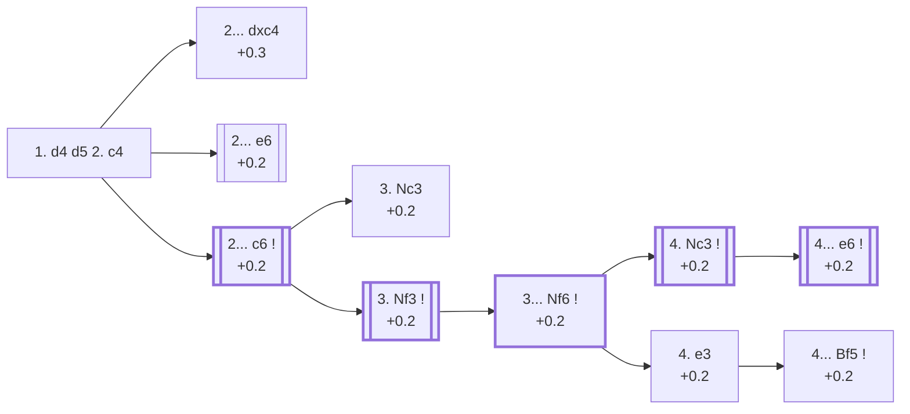

<a name="_TOP_"></a>

# D06 Queen's Gambit <br> 1. d4 d5 2. c4 #

**2. c4** is by far White's most tested try after 1... d5 (76.9% of masters games — see [A40 Queen's Pawn Game](https://github.com/onclemarcel/chess_flashcards/blob/main/d4_openings/A40_QPG.md)). It is not a "true" gambit: if Black simply takes the pawn (2... dxc4), White regains it with an extra tempo in almost every practical line, since ... b5 to hold onto c4 permanently weakens Black's queenside too much to be sound.

### Overview

*Quick map of every move covered on this card — text and evals match the candidate-move lists below exactly. Node shape is a data-driven category (master-safe / blitz trap / understudied / blunder); see the [shape key](https://github.com/onclemarcel/chess_flashcards/blob/main/start.md#content-diagram-optional) in start.md. Hover a node for its ECO code and variation name; click to jump to its section.*

<!-- content-diagram:start -->

<!-- content-diagram:end -->

<a name="_c4_"></a>

[](https://lichess.org/analysis/standard/rnbqkbnr/ppp1pppp/8/3p4/2PP4/8/PP2PPPP/RNBQKBNR_b_KQkq_c3_0_2)

*... 1. d4 d5 2. c4 — Queen's Gambit*

```
rnbqkbnr/ppp1pppp/8/3p4/2PP4/8/PP2PPPP/RNBQKBNR b KQkq c3 0 2
```

<!-- lichess-stats:start fen="rnbqkbnr/ppp1pppp/8/3p4/2PP4/8/PP2PPPP/RNBQKBNR b KQkq c3 0 2" db="lichess,masters" speeds="bullet,blitz" ratings="1800,2000,2200,2500" moves="8" -->
| Move | Online | W/D/B | Masters | W/D/B | |
| :--- | ---: | :--- | ---: | :--- | :-- |
| e6 | 29.1 M (31.1%) | ⬜⬜⬜⬜⬜🟫⬛⬛⬛⬛ 51/5/44 | 72 k (35.3%) | ⬜⬜⬜🟫🟫🟫🟫🟫⬛⬛ 33/47/19 |  |
| c6 | 25.3 M (27.0%) | ⬜⬜⬜⬜⬜🟫⬛⬛⬛⬛ 51/5/44 | 101 k (49.5%) | ⬜⬜⬜🟫🟫🟫🟫🟫⬛⬛ 30/52/17 |  |
| Nf6 | 14.0 M (15.0%) | ⬜⬜⬜⬜⬜🟫⬛⬛⬛⬛ 53/4/42 | 195 (0.1%) | ⬜⬜⬜⬜⬜🟫🟫🟫🟫⬛ 49/42/9 |  |
| dxc4 | 11.8 M (12.6%) | ⬜⬜⬜⬜⬜🟫⬛⬛⬛⬛ 52/5/43 | 24 k (11.8%) | ⬜⬜⬜🟫🟫🟫🟫🟫⬛⬛ 33/48/20 |  |
| e5 | 4.5 M (4.8%) | ⬜⬜⬜⬜⬜⬛⬛⬛⬛⬛ 49/5/47 | 1.5 k (0.7%) | ⬜⬜⬜⬜🟫🟫🟫⬛⬛⬛ 43/32/24 |  |
| Nc6 | 3.1 M (3.3%) | ⬜⬜⬜⬜⬜🟫⬛⬛⬛⬛ 52/4/43 | 3.8 k (1.8%) | ⬜⬜⬜⬜⬜🟫🟫🟫⬛⬛ 44/34/22 |  |
| Bf5 | 2.7 M (2.8%) | ⬜⬜⬜⬜⬜🟫⬛⬛⬛⬛ 53/4/43 | 1.1 k (0.5%) | ⬜⬜⬜⬜🟫🟫🟫🟫⬛⬛ 44/37/19 |  |
| c5 | 2.0 M (2.2%) | ⬜⬜⬜⬜⬜⬛⬛⬛⬛⬛ 50/5/45 | 385 (0.2%) | ⬜⬜⬜⬜🟫🟫🟫🟫⬛⬛ 38/45/17 |  |

*Online: bullet/blitz, 1800+ — 93.6 M games. Masters: 204 k games. [Open in the explorer](https://lichess.org/analysis/standard/rnbqkbnr/ppp1pppp/8/3p4/2PP4/8/PP2PPPP/RNBQKBNR_b_KQkq_c3_0_2#explorer) — updated 2026-09-02*
<!-- lichess-stats:end -->

> [!NOTE]
> Masters and online players disagree sharply here: at master level **2... c6** (the Slav, 49.5%) edges out **2... e6** (the Queen's Gambit Declined, 35.3%) — but online, **2... e6** actually leads (31.1% vs 27.0%). The Slav's reputation as a rock-solid, slightly technical defense fits a pattern seen throughout this repository: sound-but-quiet structures do better the stronger the players get.

### Candidate moves

* [**2... dxc4**](#_dxc4_) (+0.3): the [Queen's Gambit Accepted](#_dxc4_) — Black grabs the pawn and lets White regain it with a tempo
* [**2... e6**](#_e6_) (+0.2): the [Queen's Gambit Declined](#_e6_) — solid, at the cost of temporarily boxing in the light-squared bishop
* [**2... c6**](#_c6_) (+0.2): the [Slav Defense](#_c6_) — masters' actual top choice (49.5%), keeping the light-squared bishop free — covered below

[*Back to TOP*](#_TOP_)

---

> [!NOTE]
> **2... dxc4**, the Queen's Gambit Accepted, hands back the extra pawn in almost every sound line — Black's real point is simpler development and a freer game rather than holding onto material.
>
> <a name="_dxc4_"></a>
>
> ### 2... dxc4 — Queen's Gambit Accepted
>
> [](https://lichess.org/analysis/standard/rnbqkbnr/ppp1pppp/8/8/2pP4/8/PP2PPPP/RNBQKBNR_w_KQkq_-_0_3)
>
> *... 1. d4 d5 2. c4 dxc4 — Queen's Gambit Accepted*
>
> ```
> rnbqkbnr/ppp1pppp/8/8/2pP4/8/PP2PPPP/RNBQKBNR w KQkq - 0 3
> ```
>
> |  | +0.3 |
> | --- | --- |
>
> <!-- lichess-stats:start fen="rnbqkbnr/ppp1pppp/8/8/2pP4/8/PP2PPPP/RNBQKBNR w KQkq - 0 3" db="lichess,masters" speeds="bullet,blitz" ratings="1800,2000,2200,2500" moves="5" -->
> | Move | Online | W/D/B | Masters | W/D/B | |
> | :--- | ---: | :--- | ---: | :--- | :-- |
> | Nc3 | 5.3 M (44.4%) | ⬜⬜⬜⬜⬜🟫⬛⬛⬛⬛ 52/4/44 | 391 (1.6%) | ⬜⬜⬜🟫🟫🟫🟫⬛⬛⬛ 30/35/35 |  |
> | e3 | 2.5 M (21.0%) | ⬜⬜⬜⬜⬜🟫⬛⬛⬛⬛ 53/5/42 | 5.0 k (20.7%) | ⬜⬜⬜🟫🟫🟫🟫🟫⬛⬛ 33/49/19 |  |
> | Nf3 | 2.0 M (16.6%) | ⬜⬜⬜⬜⬜🟫⬛⬛⬛⬛ 54/5/41 | 13 k (51.7%) | ⬜⬜⬜🟫🟫🟫🟫🟫⬛⬛ 31/49/19 |  |
> | e4 | 1.8 M (15.5%) | ⬜⬜⬜⬜⬜🟫⬛⬛⬛⬛ 52/5/43 | 6.2 k (25.6%) | ⬜⬜⬜⬜🟫🟫🟫🟫⬛⬛ 35/45/20 |  |
> | Qa4+ | 110 k (0.9%) | ⬜⬜⬜⬜⬜⬛⬛⬛⬛⬛ 50/5/45 | 82 (0.3%) | ⬜⬜🟫🟫🟫🟫⬛⬛⬛⬛ 26/37/38 |  |
> 
> *Online: bullet/blitz, 1800+ — 11.8 M games. Masters: 24 k games. [Open in the explorer](https://lichess.org/analysis/standard/rnbqkbnr/ppp1pppp/8/8/2pP4/8/PP2PPPP/RNBQKBNR_w_KQkq_-_0_3#explorer) — updated 2026-09-02*
> <!-- lichess-stats:end -->
>
> [*Back to 1. d4 d5 2. c4*](#_c4_)
> [*Back to TOP*](#_TOP_)

---

> [!NOTE]
> **2... e6**, the Queen's Gambit Declined, keeps the centre solid but locks in the c8-bishop until Black finds a moment for ... b6 or ... Bd6/... Be7 followed by a later fianchetto or exchange.
>
> <a name="_e6_"></a>
>
> ### 2... e6 — Queen's Gambit Declined
>
> [](https://lichess.org/analysis/standard/rnbqkbnr/ppp2ppp/4p3/3p4/2PP4/8/PP2PPPP/RNBQKBNR_w_KQkq_-_0_3)
>
> *... 1. d4 d5 2. c4 e6 — Queen's Gambit Declined*
>
> ```
> rnbqkbnr/ppp2ppp/4p3/3p4/2PP4/8/PP2PPPP/RNBQKBNR w KQkq - 0 3
> ```
>
> |  | +0.2 |
> | --- | --- |
>
> <!-- lichess-stats:start fen="rnbqkbnr/ppp2ppp/4p3/3p4/2PP4/8/PP2PPPP/RNBQKBNR w KQkq - 0 3" db="lichess,masters" speeds="bullet,blitz" ratings="1800,2000,2200,2500" moves="5" -->
> | Move | Online | W/D/B | Masters | W/D/B | |
> | :--- | ---: | :--- | ---: | :--- | :-- |
> | Nc3 | 27.7 M (64.4%) | ⬜⬜⬜⬜⬜🟫⬛⬛⬛⬛ 51/5/44 | 45 k (58.9%) | ⬜⬜⬜🟫🟫🟫🟫🟫⬛⬛ 33/47/20 |  |
> | Nf3 | 7.9 M (18.4%) | ⬜⬜⬜⬜⬜🟫⬛⬛⬛⬛ 52/6/42 | 30 k (38.9%) | ⬜⬜⬜🟫🟫🟫🟫🟫⬛⬛ 35/47/18 |  |
> | cxd5 | 3.4 M (7.8%) | ⬜⬜⬜⬜⬜🟫⬛⬛⬛⬛ 51/5/44 | 710 (0.9%) | ⬜⬜🟫🟫🟫🟫🟫⬛⬛⬛ 23/52/25 |  |
> | e3 | 2.3 M (5.4%) | ⬜⬜⬜⬜⬜⬛⬛⬛⬛⬛ 49/5/45 | 131 (0.2%) | ⬜⬜⬜🟫🟫🟫🟫⬛⬛⬛ 27/44/28 |  |
> | g3 | 613 k (1.4%) | ⬜⬜⬜⬜⬜🟫⬛⬛⬛⬛ 52/6/42 | 815 (1.1%) | ⬜⬜⬜🟫🟫🟫🟫🟫⬛⬛ 28/52/20 |  |
> 
> *Online: bullet/blitz, 1800+ — 43.0 M games. Masters: 77 k games. [Open in the explorer](https://lichess.org/analysis/standard/rnbqkbnr/ppp2ppp/4p3/3p4/2PP4/8/PP2PPPP/RNBQKBNR_w_KQkq_-_0_3#explorer) — updated 2026-09-02*
> <!-- lichess-stats:end -->
>
> **3. Nc3** is masters' main try (58.9%), developing naturally before deciding between e4 and e3 setups; **3. Nf3** (38.9%) keeps similar flexibility while ruling out an early Nc3-... Bb4 pin.
>
> <a name="_e6_Nc3_"></a>
>
> #### 2... e6 3. Nc3
>
> [](https://lichess.org/analysis/standard/rnbqkbnr/ppp2ppp/4p3/3p4/2PP4/2N5/PP2PPPP/R1BQKBNR_b_KQkq_-_1_3)
>
> *... 2... e6 3. Nc3*
>
> ```
> rnbqkbnr/ppp2ppp/4p3/3p4/2PP4/2N5/PP2PPPP/R1BQKBNR b KQkq - 1 3
> ```
>
> <!-- lichess-stats:start fen="rnbqkbnr/ppp2ppp/4p3/3p4/2PP4/2N5/PP2PPPP/R1BQKBNR b KQkq - 1 3" db="lichess,masters" speeds="bullet,blitz" ratings="1800,2000,2200,2500" moves="6" -->
> | Move | Online | W/D/B | Masters | W/D/B | |
> | :--- | ---: | :--- | ---: | :--- | :-- |
> | Nf6 | 16.5 M (57.3%) | ⬜⬜⬜⬜⬜🟫⬛⬛⬛⬛ 51/5/44 | 21 k (40.7%) | ⬜⬜⬜🟫🟫🟫🟫🟫⬛⬛ 34/50/16 |  |
> | c6 | 4.5 M (15.7%) | ⬜⬜⬜⬜⬜🟫⬛⬛⬛⬛ 51/5/44 | 11 k (22.0%) | ⬜⬜⬜🟫🟫🟫🟫⬛⬛⬛ 30/43/27 |  |
> | dxc4 | 2.0 M (7.1%) | ⬜⬜⬜⬜⬜🟫⬛⬛⬛⬛ 54/4/42 | 0 | — | ⚠ |
> | c5 | 1.8 M (6.2%) | ⬜⬜⬜⬜⬜⬛⬛⬛⬛⬛ 47/5/48 | 5.2 k (10.0%) | ⬜⬜⬜⬜🟫🟫🟫🟫⬛⬛ 37/44/19 |  |
> | Bb4 | 1.3 M (4.5%) | ⬜⬜⬜⬜⬜🟫⬛⬛⬛⬛ 54/5/42 | 2.6 k (5.0%) | ⬜⬜⬜🟫🟫🟫🟫⬛⬛⬛ 31/42/27 |  |
> | f5 | 1.0 M (3.5%) | ⬜⬜⬜⬜⬜⬛⬛⬛⬛⬛ 47/5/47 | 0 | — | ⚠ |
> | Be7 | 0 | — | 8.7 k (16.7%) | ⬜⬜⬜🟫🟫🟫🟫🟫⬛⬛ 35/48/17 |  |
> | a6 | 0 | — | 1.9 k (3.6%) | ⬜⬜⬜🟫🟫🟫🟫⬛⬛⬛ 34/41/25 |  |
> 
> *Online: bullet/blitz, 1800+ — 28.8 M games. Masters: 52 k games. [Open in the explorer](https://lichess.org/analysis/standard/rnbqkbnr/ppp2ppp/4p3/3p4/2PP4/2N5/PP2PPPP/R1BQKBNR_b_KQkq_-_1_3#explorer) — updated 2026-09-02*
> <!-- lichess-stats:end -->
>
> **3... Nf6** is masters' clear main try (40.7%), heading toward the Orthodox/Classical Queen's Gambit Declined — not built out further here (backlog, a genuinely vast body of theory of its own). **3... c5** (10.0%) is the real second-most-tested try worth its own name.
>
> * **3... Nf6** (+0.2, 40.7% masters): Orthodox/Classical QGD, not covered further here.
> * [**3... c5**](https://github.com/onclemarcel/chess_flashcards/blob/main/d4_openings/D32_Tarrasch_Defense.md) (+0.3, 10.0% masters): the [**Tarrasch Defense**](https://github.com/onclemarcel/chess_flashcards/blob/main/d4_openings/D32_Tarrasch_Defense.md) — covered on its own card
>
> [*Back to 1. d4 d5 2. c4*](#_c4_)
> [*Back to TOP*](#_TOP_)

---

<a name="_c6_"></a>

## 2... c6 — Slav Defense

Masters' actual top choice (49.5%): Black defends d5 with a pawn instead of a piece, keeping the c8-bishop's diagonal open for ... Bf5 or ... Bg4 before playing ... e6.

[](https://lichess.org/analysis/standard/rnbqkbnr/pp2pppp/2p5/3p4/2PP4/8/PP2PPPP/RNBQKBNR_w_KQkq_-_0_3)

*... 1. d4 d5 2. c4 c6 — Slav Defense*

```
rnbqkbnr/pp2pppp/2p5/3p4/2PP4/8/PP2PPPP/RNBQKBNR w KQkq - 0 3
```

<!-- lichess-stats:start fen="rnbqkbnr/pp2pppp/2p5/3p4/2PP4/8/PP2PPPP/RNBQKBNR w KQkq - 0 3" db="lichess,masters" speeds="bullet,blitz" ratings="1800,2000,2200,2500" moves="8" -->
| Move | Online | W/D/B | Masters | W/D/B | |
| :--- | ---: | :--- | ---: | :--- | :-- |
| Nc3 | 20.7 M (56.1%) | ⬜⬜⬜⬜⬜🟫⬛⬛⬛⬛ 51/5/44 | 25 k (23.7%) | ⬜⬜⬜🟫🟫🟫🟫🟫⬛⬛ 35/46/19 |  |
| Nf3 | 7.7 M (21.0%) | ⬜⬜⬜⬜⬜🟫⬛⬛⬛⬛ 52/6/43 | 68 k (64.7%) | ⬜⬜⬜🟫🟫🟫🟫🟫⬛⬛ 30/54/16 |  |
| cxd5 | 5.1 M (13.8%) | ⬜⬜⬜⬜⬜🟫⬛⬛⬛⬛ 51/6/43 | 8.6 k (8.2%) | ⬜⬜🟫🟫🟫🟫🟫🟫⬛⬛ 22/61/17 |  |
| e3 | 2.3 M (6.2%) | ⬜⬜⬜⬜⬜⬛⬛⬛⬛⬛ 48/5/46 | 3.4 k (3.2%) | ⬜⬜⬜🟫🟫🟫🟫🟫⬛⬛ 34/47/19 |  |
| g3 | 318 k (0.9%) | ⬜⬜⬜⬜⬜🟫⬛⬛⬛⬛ 51/5/44 | 72 (0.1%) | ⬜🟫🟫🟫🟫🟫🟫🟫⬛⬛ 12/64/24 |  |
| Bf4 | 225 k (0.6%) | ⬜⬜⬜⬜⬜🟫⬛⬛⬛⬛ 50/5/45 | 62 (0.1%) | ⬜⬜⬜⬜🟫🟫🟫🟫⬛⬛ 40/39/21 |  |
| c5 | 190 k (0.5%) | ⬜⬜⬜⬜🟫⬛⬛⬛⬛⬛ 45/5/51 | 0 | — | ⚠ |
| e4 | 66 k (0.2%) | ⬜⬜⬜⬜⬜⬛⬛⬛⬛⬛ 48/4/48 | 0 | — | ⚠ |
| Qc2 | 0 | — | 69 (0.1%) | ⬜⬜⬜🟫🟫🟫🟫🟫⬛⬛ 29/54/17 |  |
| Nd2 | 0 | — | 33 (0.0%) | ⬜⬜⬜🟫🟫🟫⬛⬛⬛⬛ 30/33/36 |  |

*Online: bullet/blitz, 1800+ — 36.8 M games. Masters: 105 k games. [Open in the explorer](https://lichess.org/analysis/standard/rnbqkbnr/pp2pppp/2p5/3p4/2PP4/8/PP2PPPP/RNBQKBNR_w_KQkq_-_0_3#explorer) — updated 2026-09-02*
<!-- lichess-stats:end -->

* [**3. Nf3**](#_c6_Nf3_) (+0.2): masters' clear favourite (64.7%) — covered below
* [**3. Nc3**](#_c6_Nc3_) (+0.2): a sharper try (23.7% of masters games), inviting the Slav Gambit (3... dxc4 4. e4) if Black grabs the pawn

[*Back to 2... c6*](#_c6_)
[*Back to TOP*](#_TOP_)

---

> [!NOTE]
> **3. Nc3** keeps open the option of a quick e4 push if Black takes on c4, at the cost of allowing 3... dxc4 to be defended more actively than after 3. Nf3.
>
> <a name="_c6_Nc3_"></a>
>
> ### 2... c6 3. Nc3
>
> [](https://lichess.org/analysis/standard/rnbqkbnr/pp2pppp/2p5/3p4/2PP4/2N5/PP2PPPP/R1BQKBNR_b_KQkq_-_1_3)
>
> *... 1. d4 d5 2. c4 c6 3. Nc3*
>
> ```
> rnbqkbnr/pp2pppp/2p5/3p4/2PP4/2N5/PP2PPPP/R1BQKBNR b KQkq - 1 3
> ```
>
> |  | +0.2 |
> | --- | --- |
>
> [*Back to 2... c6*](#_c6_)
> [*Back to TOP*](#_TOP_)

---

<a name="_c6_Nf3_"></a>

### 2... c6 3. Nf3 — Slav Defense: Modern Line

Masters' clear favourite (64.7%): White develops naturally before deciding how to meet a future ... dxc4.

[](https://lichess.org/analysis/standard/rnbqkbnr/pp2pppp/2p5/3p4/2PP4/5N2/PP2PPPP/RNBQKB1R_b_KQkq_-_1_3)

*... 1. d4 d5 2. c4 c6 3. Nf3 — Slav Defense: Modern Line*

```
rnbqkbnr/pp2pppp/2p5/3p4/2PP4/5N2/PP2PPPP/RNBQKB1R b KQkq - 1 3
```

|  | +0.2 |
| --- | --- |

<!-- lichess-stats:start fen="rnbqkbnr/pp2pppp/2p5/3p4/2PP4/5N2/PP2PPPP/RNBQKB1R b KQkq - 1 3" db="lichess,masters" speeds="bullet,blitz" ratings="1800,2000,2200,2500" moves="4" -->
| Move | Online | W/D/B | Masters | W/D/B | |
| :--- | ---: | :--- | ---: | :--- | :-- |
| Nf6 | 8.0 M (63.6%) | ⬜⬜⬜⬜⬜🟫⬛⬛⬛⬛ 51/6/43 | 69 k (91.7%) | ⬜⬜⬜🟫🟫🟫🟫🟫⬛⬛ 30/54/16 |  |
| e6 | 1.9 M (15.3%) | ⬜⬜⬜⬜⬜🟫⬛⬛⬛⬛ 53/5/42 | 5.0 k (6.7%) | ⬜⬜⬜⬜🟫🟫🟫🟫⬛⬛ 35/45/19 |  |
| Bf5 | 872 k (6.9%) | ⬜⬜⬜⬜⬜🟫⬛⬛⬛⬛ 53/5/42 | 66 (0.1%) | ⬜⬜⬜⬜⬜🟫🟫🟫⬛⬛ 50/33/17 |  |
| dxc4 | 615 k (4.9%) | ⬜⬜⬜⬜⬜🟫⬛⬛⬛⬛ 54/4/42 | 1.1 k (1.4%) | ⬜⬜⬜⬜🟫🟫🟫🟫⬛⬛ 35/41/24 |  |

*Online: bullet/blitz, 1800+ — 12.6 M games. Masters: 75 k games. [Open in the explorer](https://lichess.org/analysis/standard/rnbqkbnr/pp2pppp/2p5/3p4/2PP4/5N2/PP2PPPP/RNBQKB1R_b_KQkq_-_1_3#explorer) — updated 2026-09-02*
<!-- lichess-stats:end -->

**3... Nf6** is close to automatic (91.7% of masters games) — completing development before deciding on a structure, the same logical order as 2... c6 itself.

* [**3... Nf6**](#_c6_Nf3_Nf6_) (+0.2): see below.

[*Back to 2... c6*](#_c6_)
[*Back to TOP*](#_TOP_)

---

<a name="_c6_Nf3_Nf6_"></a>

### 2... c6 3. Nf3 Nf6 — the Slav tabiya

[](https://lichess.org/analysis/standard/rnbqkb1r/pp2pppp/2p2n2/3p4/2PP4/5N2/PP2PPPP/RNBQKB1R_w_KQkq_-_2_4)

*... 1. d4 d5 2. c4 c6 3. Nf3 Nf6 — reaching the main Slav tabiya*

```
rnbqkb1r/pp2pppp/2p2n2/3p4/2PP4/5N2/PP2PPPP/RNBQKB1R w KQkq - 2 4
```

|  | +0.2 |
| --- | --- |

<!-- lichess-stats:start fen="rnbqkb1r/pp2pppp/2p2n2/3p4/2PP4/5N2/PP2PPPP/RNBQKB1R w KQkq - 2 4" db="lichess,masters" speeds="bullet,blitz" ratings="1800,2000,2200,2500" moves="4" -->
| Move | Online | W/D/B | Masters | W/D/B | |
| :--- | ---: | :--- | ---: | :--- | :-- |
| Nc3 | 6.3 M (55.1%) | ⬜⬜⬜⬜⬜🟫⬛⬛⬛⬛ 51/6/43 | 52 k (55.3%) | ⬜⬜⬜🟫🟫🟫🟫🟫⬛⬛ 30/53/17 |  |
| e3 | 1.4 M (12.7%) | ⬜⬜⬜⬜⬜🟫⬛⬛⬛⬛ 51/6/43 | 27 k (28.9%) | ⬜⬜⬜🟫🟫🟫🟫🟫⬛⬛ 29/55/16 |  |
| g3 | 1.3 M (11.6%) | ⬜⬜⬜⬜⬜🟫⬛⬛⬛⬛ 51/6/43 | 0 | — | ⚠ |
| cxd5 | 1.1 M (9.9%) | ⬜⬜⬜⬜⬜🟫⬛⬛⬛⬛ 51/6/43 | 3.7 k (3.9%) | ⬜⬜🟫🟫🟫🟫🟫🟫🟫⬛ 18/66/16 |  |
| Qc2 | 0 | — | 5.1 k (5.4%) | ⬜⬜⬜⬜🟫🟫🟫🟫⬛⬛ 35/45/20 |  |

*Online: bullet/blitz, 1800+ — 11.4 M games. Masters: 94 k games. [Open in the explorer](https://lichess.org/analysis/standard/rnbqkb1r/pp2pppp/2p2n2/3p4/2PP4/5N2/PP2PPPP/RNBQKB1R_w_KQkq_-_2_4#explorer) — updated 2026-09-02*
<!-- lichess-stats:end -->

White's 4th move splits the whole rest of Slav theory in two: **4. Nc3** develops naturally and heads toward the Semi-Slav or the main-line Slav Accepted, while **4. e3** (the *Quiet Variation*, also called the Chameleon or Central Slav in older sources) keeps the structure flexible a move longer.

* [**4. Nc3**](#_c6_Nf3_Nc3_) (+0.2): masters' clear main try (55.3%) — the *Three Knights Variation*, see below.
* [**4. e3**](#_c6_Nf3_e3_) (+0.2): a real second choice (28.9% masters) — the *Quiet Variation*, see below.

[*Back to 2... c6 3. Nf3*](#_c6_Nf3_)
[*Back to TOP*](#_TOP_)

---

> [!NOTE]
> **4. Nc3**, the *Three Knights Variation*, develops naturally before deciding between a quick e4 and a slower e3 build-up — this is the move order that actually leads to the Semi-Slav.
>
> <a name="_c6_Nf3_Nc3_"></a>
>
> ### 4. Nc3 — Three Knights Variation
>
> [](https://lichess.org/analysis/standard/rnbqkb1r/pp2pppp/2p2n2/3p4/2PP4/2N2N2/PP2PPPP/R1BQKB1R_b_KQkq_-_3_4)
>
> *... 4. Nc3 — Three Knights Variation*
>
> ```
> rnbqkb1r/pp2pppp/2p2n2/3p4/2PP4/2N2N2/PP2PPPP/R1BQKB1R b KQkq - 3 4
> ```
>
> |  | +0.2 |
> | --- | --- |
>
> <!-- lichess-stats:start fen="rnbqkb1r/pp2pppp/2p2n2/3p4/2PP4/2N2N2/PP2PPPP/R1BQKB1R b KQkq - 3 4" db="lichess,masters" speeds="bullet,blitz" ratings="1800,2000,2200,2500" moves="4" -->
> | Move | Online | W/D/B | Masters | W/D/B | |
> | :--- | ---: | :--- | ---: | :--- | :-- |
> | e6 | 4.6 M (33.3%) | ⬜⬜⬜⬜⬜🟫⬛⬛⬛⬛ 51/5/44 | 32 k (51.7%) | ⬜⬜⬜🟫🟫🟫🟫🟫🟫⬛ 26/59/15 |  |
> | Bf5 | 2.6 M (18.6%) | ⬜⬜⬜⬜⬜🟫⬛⬛⬛⬛ 51/5/44 | 0 | — | ⚠ |
> | Bg4 | 2.1 M (15.2%) | ⬜⬜⬜⬜⬜🟫⬛⬛⬛⬛ 53/5/43 | 0 | — | ⚠ |
> | dxc4 | 2.0 M (14.3%) | ⬜⬜⬜⬜⬜⬛⬛⬛⬛⬛ 48/5/46 | 18 k (29.2%) | ⬜⬜⬜🟫🟫🟫🟫🟫⬛⬛ 35/45/20 |  |
> | a6 | 0 | — | 10 k (16.4%) | ⬜⬜⬜⬜🟫🟫🟫🟫⬛⬛ 35/45/20 |  |
> | g6 | 0 | — | 1.2 k (1.9%) | ⬜⬜⬜⬜⬜🟫🟫🟫🟫⬛ 47/41/13 |  |
> 
> *Online: bullet/blitz, 1800+ — 13.9 M games. Masters: 63 k games. [Open in the explorer](https://lichess.org/analysis/standard/rnbqkb1r/pp2pppp/2p2n2/3p4/2PP4/2N2N2/PP2PPPP/R1BQKB1R_b_KQkq_-_3_4#explorer) — updated 2026-09-02*
> <!-- lichess-stats:end -->
>
> **4... e6** (+0.2) is masters' clear main try (51.7%) — the **Semi-Slav**, combining the Slav's ... c6 with the QGD's ... e6 for one of the most solid (and most heavily analysed) structures in all of chess. **4... dxc4** is a real second choice (29.2%), the *Slav Accepted*, while **4... a6** (16.4%, the *Chebanenko Variation*) delays the decision another move. Each of these is its own extensive body of theory, not covered further here.
>
> [*Back to 2... c6 3. Nf3 Nf6*](#_c6_Nf3_Nf6_)
> [*Back to TOP*](#_TOP_)

---

> [!NOTE]
> **4. e3**, the *Quiet Variation* (also called the Chameleon or Central Slav in older sources), keeps the position flexible — White delays Nc3 so a later cxd5/Nc3 or a Stonewall-style c5 push both stay available, at the cost of blocking in the c1-bishop for now.
>
> <a name="_c6_Nf3_e3_"></a>
>
> ### 4. e3 — Quiet Variation
>
> [](https://lichess.org/analysis/standard/rnbqkb1r/pp2pppp/2p2n2/3p4/2PP4/4PN2/PP3PPP/RNBQKB1R_b_KQkq_-_0_4)
>
> *... 4. e3 — Quiet Variation*
>
> ```
> rnbqkb1r/pp2pppp/2p2n2/3p4/2PP4/4PN2/PP3PPP/RNBQKB1R b KQkq - 0 4
> ```
>
> |  | +0.2 |
> | --- | --- |
>
> <!-- lichess-stats:start fen="rnbqkb1r/pp2pppp/2p2n2/3p4/2PP4/4PN2/PP3PPP/RNBQKB1R b KQkq - 0 4" db="lichess,masters" speeds="bullet,blitz" ratings="1800,2000,2200,2500" moves="5" -->
> | Move | Online | W/D/B | Masters | W/D/B | |
> | :--- | ---: | :--- | ---: | :--- | :-- |
> | Bg4 | 1.1 M (33.0%) | ⬜⬜⬜⬜⬜⬛⬛⬛⬛⬛ 49/6/46 | 4.3 k (14.7%) | ⬜⬜⬜🟫🟫🟫🟫🟫⬛⬛ 30/51/18 |  |
> | e6 | 840 k (24.9%) | ⬜⬜⬜⬜⬜🟫⬛⬛⬛⬛ 51/6/43 | 9.4 k (31.9%) | ⬜⬜⬜🟫🟫🟫🟫🟫🟫⬛ 28/61/12 |  |
> | Bf5 | 678 k (20.1%) | ⬜⬜⬜⬜⬜🟫⬛⬛⬛⬛ 48/6/46 | 11 k (36.0%) | ⬜⬜⬜🟫🟫🟫🟫🟫⬛⬛ 27/54/18 |  |
> | g6 | 345 k (10.2%) | ⬜⬜⬜⬜⬜🟫⬛⬛⬛⬛ 48/6/45 | 1.9 k (6.4%) | ⬜⬜⬜⬜🟫🟫🟫🟫🟫⬛ 37/48/16 |  |
> | a6 | 177 k (5.2%) | ⬜⬜⬜⬜⬜🟫⬛⬛⬛⬛ 48/7/45 | 3.2 k (10.8%) | ⬜⬜⬜🟫🟫🟫🟫🟫⬛⬛ 34/47/19 |  |
> 
> *Online: bullet/blitz, 1800+ — 3.4 M games. Masters: 29 k games. [Open in the explorer](https://lichess.org/analysis/standard/rnbqkb1r/pp2pppp/2p2n2/3p4/2PP4/4PN2/PP3PPP/RNBQKB1R_b_KQkq_-_0_4#explorer) — updated 2026-09-02*
> <!-- lichess-stats:end -->
>
> This is where the classical **main-line Slav** actually lives: **4... Bf5** (+0.2) is masters' clear main try (36.0%) — developing the light-squared bishop outside the pawn chain before it gets shut in, the single defining idea of the whole Slav complex. **4... e6** (31.9%) transposes toward Semi-Slav-flavoured structures instead, and **4... Bg4** (14.7%) develops the bishop actively rather than solidly. Each branch is its own extensive body of theory, not covered further here.
>
> [*Back to 2... c6 3. Nf3 Nf6*](#_c6_Nf3_Nf6_)
> [*Back to TOP*](#_TOP_)
