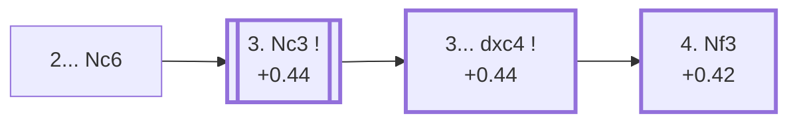

<a name="_TOP_"></a>

# D07 Queen's Gambit Declined: Chigorin Defense <br> 1. d4 d5 2. c4 Nc6 #

Spun off from [D06's own "2... Nc6" candidate bullet](https://github.com/onclemarcel/chess_flashcards/blob/main/d4_openings/D06_Queens_Gambit.md#_c4_) — a real minority try there (1.8% masters), already live-tagged its own code. Named after Mikhail Chigorin, the same 19th-century Russian master behind the Ruy Lopez's own Chigorin Defense (C97) — develops the queen's knight actively rather than defending d5 with a pawn or supporting it with ... e6, at the cost of blocking the c-pawn.

### Overview

*Quick map of every move covered on this card — see the [shape key](https://github.com/onclemarcel/chess_flashcards/blob/main/start.md#content-diagram-optional) in start.md.*

<!-- content-diagram:start -->

<!-- content-diagram:end -->

<a name="_initial_move_"></a>

[](https://lichess.org/analysis/standard/r1bqkbnr/ppp1pppp/2n5/3p4/2PP4/8/PP2PPPP/RNBQKBNR_w_KQkq_-_1_3)

*... 2... Nc6 — Chigorin Defense*

```
r1bqkbnr/ppp1pppp/2n5/3p4/2PP4/8/PP2PPPP/RNBQKBNR w KQkq - 1 3
```

|  | +0.44 |
| --- | --- |

<!-- lichess-stats:start fen="r1bqkbnr/ppp1pppp/2n5/3p4/2PP4/8/PP2PPPP/RNBQKBNR w KQkq - 1 3" db="lichess,masters" speeds="bullet,blitz" ratings="1800,2000,2200,2500" moves="4" -->
| Move | Online | W/D/B | Masters | W/D/B | |
| :--- | ---: | :--- | ---: | :--- | :-- |
| Nc3 | 1.6 M (45.6%) | ⬜⬜⬜⬜⬜🟫⬛⬛⬛⬛ 53/4/43 | 1.4 k (38.1%) | ⬜⬜⬜⬜⬜🟫🟫🟫⬛⬛ 49/32/19 |  |
| cxd5 | 828 k (23.2%) | ⬜⬜⬜⬜⬜🟫⬛⬛⬛⬛ 52/5/44 | 943 (24.9%) | ⬜⬜⬜⬜🟫🟫🟫🟫⬛⬛ 41/36/23 |  |
| Nf3 | 677 k (18.9%) | ⬜⬜⬜⬜⬜🟫⬛⬛⬛⬛ 52/5/43 | 1.2 k (30.8%) | ⬜⬜⬜⬜🟫🟫🟫⬛⬛⬛ 42/33/24 |  |
| e3 | 341 k (9.5%) | ⬜⬜⬜⬜⬜🟫⬛⬛⬛⬛ 51/5/44 | 209 (5.5%) | ⬜⬜⬜⬜🟫🟫🟫🟫⬛⬛ 39/38/23 |  |

*Online: bullet/blitz, 1800+ — 3.6 M games. Masters: 3.8 k games. [Open in the explorer](https://lichess.org/analysis/standard/r1bqkbnr/ppp1pppp/2n5/3p4/2PP4/8/PP2PPPP/RNBQKBNR_w_KQkq_-_1_3#explorer) — updated 2026-09-14*
<!-- lichess-stats:end -->

Masters' reply forks two ways: **3. Nc3** (38.1%) develops naturally before deciding on cxd5, while **3. Nf3** (30.8%) and **3. cxd5** (24.9%) are both real alternatives. **3. Nc3 dxc4 4. Nf3** reaches the named ***Janowski Variation***.

* [**3. Nc3**](#_Nc3_) (+0.44, 38.1% masters): heads toward the *Janowski Variation* — covered below.

[*Back to TOP*](#_TOP_)

---

<a name="_Nc3_"></a>

## 3. Nc3 dxc4 4. Nf3 — Janowski Variation

[](https://lichess.org/analysis/standard/r1bqkbnr/ppp1pppp/2n5/8/2pP4/2N2N2/PP2PPPP/R1BQKB1R_b_KQkq_-_1_4)

*... 4. Nf3 — Janowski Variation*

```
r1bqkbnr/ppp1pppp/2n5/8/2pP4/2N2N2/PP2PPPP/R1BQKB1R b KQkq - 1 4
```

|  | +0.42 |
| --- | --- |

<!-- lichess-stats:start fen="r1bqkbnr/ppp1pppp/2n5/8/2pP4/2N2N2/PP2PPPP/R1BQKB1R b KQkq - 1 4" db="lichess,masters" speeds="bullet,blitz" ratings="1800,2000,2200,2500" moves="5" -->
| Move | Online | W/D/B | Masters | W/D/B | |
| :--- | ---: | :--- | ---: | :--- | :-- |
| Bg4 | 287 k (48.1%) | ⬜⬜⬜⬜⬜🟫⬛⬛⬛⬛ 53/4/42 | 41 (7.7%) | ⬜⬜⬜⬜⬜⬜⬜⬜🟫⬛ 76/10/15 |  |
| e6 | 95 k (15.9%) | ⬜⬜⬜⬜⬜⬜⬛⬛⬛⬛ 59/4/37 | 13 (2.4%) | — |  |
| Nf6 | 94 k (15.8%) | ⬜⬜⬜⬜⬜⬜⬛⬛⬛⬛ 58/4/38 | 460 (86.5%) | ⬜⬜⬜⬜🟫🟫🟫🟫⬛⬛ 45/37/17 |  |
| e5 | 47 k (7.8%) | ⬜⬜⬜⬜⬜🟫⬛⬛⬛⬛ 54/4/42 | 2 (0.4%) | — | ⚠ |
| Bf5 | 28 k (4.7%) | ⬜⬜⬜⬜⬜⬜⬛⬛⬛⬛ 62/3/35 | 0 | — | ⚠ |
| a6 | 0 | — | 16 (3.0%) | — |  |

*Online: bullet/blitz, 1800+ — 597 k games. Masters: 532 games. [Open in the explorer](https://lichess.org/analysis/standard/r1bqkbnr/ppp1pppp/2n5/8/2pP4/2N2N2/PP2PPPP/R1BQKB1R_b_KQkq_-_1_4#explorer) — updated 2026-09-14*
<!-- lichess-stats:end -->

**3... dxc4** (+0.44) grabs the c4 pawn, and White develops the knight before regaining it — masters' clear main try at the 3rd-move fork (38.1% of the parent position), reaching this named tabiya. Masters' overwhelming reply is **4... Nf6** (86.5%), completing development before White can consolidate the extra central space. Not built out further here (backlog).

[*Back to 2... Nc6*](#_initial_move_)
[*Back to TOP*](#_TOP_)
