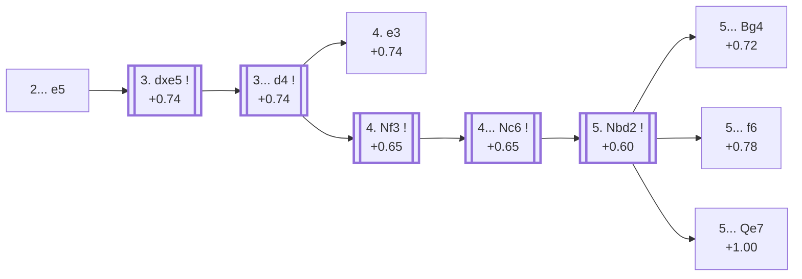

<a name="_TOP_"></a>

# D08 Queen's Gambit Declined: Albin Countergambit <br> 1. d4 d5 2. c4 e5 #

Spun off from [D06's own "2... e5" candidate bullet](https://github.com/onclemarcel/chess_flashcards/blob/main/d4_openings/D06_Queens_Gambit.md#_c4_) — a real minority try there (0.7% masters), already live-tagged its own code. Named after Austrian master Adolf Albin — rather than defend d5, Black offers a second central pawn immediately, aiming for quick piece activity and central space (... d4) if White accepts.

### Overview

*Quick map of every move covered on this card — see the [shape key](https://github.com/onclemarcel/chess_flashcards/blob/main/start.md#content-diagram-optional) in start.md.*

<!-- content-diagram:start -->

<!-- content-diagram:end -->

<a name="_initial_move_"></a>

[](https://lichess.org/analysis/standard/rnbqkbnr/ppp2ppp/8/3pp3/2PP4/8/PP2PPPP/RNBQKBNR_w_KQkq_e6_0_3)

*... 2... e5 — Albin Countergambit*

```
rnbqkbnr/ppp2ppp/8/3pp3/2PP4/8/PP2PPPP/RNBQKBNR w KQkq e6 0 3
```

|  | +0.74 |
| --- | --- |

<!-- lichess-stats:start fen="rnbqkbnr/ppp2ppp/8/3pp3/2PP4/8/PP2PPPP/RNBQKBNR w KQkq e6 0 3" db="lichess,masters" speeds="bullet,blitz" ratings="1800,2000,2200,2500" moves="4" -->
| Move | Online | W/D/B | Masters | W/D/B | |
| :--- | ---: | :--- | ---: | :--- | :-- |
| dxe5 | 2.2 M (48.1%) | ⬜⬜⬜⬜⬜⬛⬛⬛⬛⬛ 49/5/46 | 1.3 k (91.0%) | ⬜⬜⬜⬜🟫🟫🟫⬛⬛⬛ 43/32/25 |  |
| Nc3 | 1.1 M (23.1%) | ⬜⬜⬜⬜⬜⬛⬛⬛⬛⬛ 47/4/49 | 11 (0.8%) | — |  |
| cxd5 | 550 k (11.9%) | ⬜⬜⬜⬜⬜⬛⬛⬛⬛⬛ 49/5/46 | 13 (0.9%) | — |  |
| e3 | 460 k (10.0%) | ⬜⬜⬜⬜⬜⬛⬛⬛⬛⬛ 50/5/45 | 97 (6.6%) | ⬜⬜⬜⬜⬜🟫🟫🟫⬛⬛ 49/33/18 |  |

*Online: bullet/blitz, 1800+ — 4.6 M games. Masters: 1.5 k games. [Open in the explorer](https://lichess.org/analysis/standard/rnbqkbnr/ppp2ppp/8/3pp3/2PP4/8/PP2PPPP/RNBQKBNR_w_KQkq_e6_0_3#explorer) — updated 2026-09-14*
<!-- lichess-stats:end -->

Masters' overwhelming reply is **3. dxe5** (91.0%), simply accepting the offered pawn — declining with **3. e3** (6.6%) or **3. cxd5** (0.9%) is rare.

* [**3. dxe5**](#_dxe5_) (+0.74, 91.0% masters): the line this card follows.

[*Back to TOP*](#_TOP_)

---

<a name="_dxe5_"></a>

## 3. dxe5 d4

[](https://lichess.org/analysis/standard/rnbqkbnr/ppp2ppp/8/4P3/2Pp4/8/PP2PPPP/RNBQKBNR_w_KQkq_-_0_4)

*... 3... d4 — advancing the second central pawn*

```
rnbqkbnr/ppp2ppp/8/4P3/2Pp4/8/PP2PPPP/RNBQKBNR w KQkq - 0 4
```

|  | +0.74 |
| --- | --- |

<!-- lichess-stats:start fen="rnbqkbnr/ppp2ppp/8/4P3/2Pp4/8/PP2PPPP/RNBQKBNR w KQkq - 0 4" db="lichess,masters" speeds="bullet,blitz" ratings="1800,2000,2200,2500" moves="3" -->
| Move | Online | W/D/B | Masters | W/D/B | |
| :--- | ---: | :--- | ---: | :--- | :-- |
| Nf3 | 1.5 M (72.0%) | ⬜⬜⬜⬜⬜🟫⬛⬛⬛⬛ 50/5/45 | 1.2 k (92.1%) | ⬜⬜⬜⬜⬜🟫🟫🟫⬛⬛ 44/32/24 |  |
| a3 | 219 k (10.5%) | ⬜⬜⬜⬜⬜🟫⬛⬛⬛⬛ 50/5/44 | 61 (4.8%) | ⬜⬜⬜🟫🟫🟫🟫⬛⬛⬛ 33/43/25 |  |
| e3 | 157 k (7.5%) | ⬜⬜⬜⬜⬛⬛⬛⬛⬛⬛ 38/4/58 | 0 | — | ⚠ |
| e4 | 0 | — | 29 (2.3%) | ⬜⬜⬜🟫🟫⬛⬛⬛⬛⬛ 31/21/48 |  |

*Online: bullet/blitz, 1800+ — 2.1 M games. Masters: 1.3 k games. [Open in the explorer](https://lichess.org/analysis/standard/rnbqkbnr/ppp2ppp/8/4P3/2Pp4/8/PP2PPPP/RNBQKBNR_w_KQkq_-_0_4#explorer) — updated 2026-09-14*
<!-- lichess-stats:end -->

**3... d4** is close to forced (the whole point of the gambit — advancing rather than recapturing). White's 4th move is left untagged live at this exact node (`opening=None`), but masters overwhelmingly choose **4. Nf3** (+0.65, 92.1%), developing before committing the e-pawn; the rare **4. e3** (+0.74, leading to the named Lasker Trap below) stays genuinely playable too.

* [**4. e3**](#_Lasker_): heads toward the *Lasker Trap* — covered below.
* [**4. Nf3**](#_Nf3_) (92.1% masters): live-tagged the *Normal Line* — covered below.

[*Back to 2... e5*](#_initial_move_)
[*Back to TOP*](#_TOP_)

---

<a name="_Lasker_"></a>

### 4. e3 Bb4 5. Bd2 dxe3 — Lasker Trap

[](https://lichess.org/analysis/standard/rnbqk1nr/ppp2ppp/8/4P3/1bP5/4p3/PP1B1PPP/RN1QKBNR_w_KQkq_-_0_6)

*... 5... dxe3 — the Lasker Trap tabiya*

```
rnbqk1nr/ppp2ppp/8/4P3/1bP5/4p3/PP1B1PPP/RN1QKBNR w KQkq - 0 6
```

|  | −0.03 |
| --- | --- |

<!-- lichess-stats:start fen="rnbqk1nr/ppp2ppp/8/4P3/1bP5/4p3/PP1B1PPP/RN1QKBNR w KQkq - 0 6" db="lichess,masters" speeds="bullet,blitz" ratings="1800,2000,2200,2500" moves="3" -->
| Move | Online | W/D/B | Masters | W/D/B | |
| :--- | ---: | :--- | ---: | :--- | :-- |
| fxe3 | 58 k (61.2%) | ⬜⬜⬜⬜🟫⬛⬛⬛⬛⬛ 43/6/51 | 1 (50.0%) | — | ⚠ |
| Bxb4 | 31 k (32.7%) | ⬜⬛⬛⬛⬛⬛⬛⬛⬛⬛ 10/1/89 | 1 (50.0%) | — | ⚠ |
| Qa4+ | 5.6 k (5.9%) | ⬜⬜⬜⬜⬜⬛⬛⬛⬛⬛ 47/3/50 | 0 | — | ⚠ |

*Online: bullet/blitz, 1800+ — 95 k games. Masters: 2 games. [Open in the explorer](https://lichess.org/analysis/standard/rnbqk1nr/ppp2ppp/8/4P3/1bP5/4p3/PP1B1PPP/RN1QKBNR_w_KQkq_-_0_6#explorer) — updated 2026-09-14*
<!-- lichess-stats:end -->

Named for the mating pattern lurking here rather than any material win: if White greedily plays **6. Bxb4?? exf2+ 7. Ke2 fxg1=N+!**, an under-promotion forks king and rook, and Black ends up winning material. A genuine database rarity in the modern sample (only 2 masters games), and Stockfish already calls the position dead level (−0.03) regardless of the trap — the real, punishable mistake only happens if White actually plays into it. Not built out further here beyond this trap summary (backlog).

[*Back to 3. dxe5*](#_dxe5_)
[*Back to TOP*](#_TOP_)

---

<a name="_Nf3_"></a>

### 4. Nf3 Nc6 — Normal Line

[](https://lichess.org/analysis/standard/r1bqkbnr/ppp2ppp/2n5/4P3/2Pp4/5N2/PP2PPPP/RNBQKB1R_w_KQkq_-_2_5)

*... 4... Nc6 — live-tagged the Normal Line*

```
r1bqkbnr/ppp2ppp/2n5/4P3/2Pp4/5N2/PP2PPPP/RNBQKB1R w KQkq - 2 5
```

|  | +0.65 |
| --- | --- |

<!-- lichess-stats:start fen="r1bqkbnr/ppp2ppp/2n5/4P3/2Pp4/5N2/PP2PPPP/RNBQKB1R w KQkq - 2 5" db="lichess,masters" speeds="bullet,blitz" ratings="1800,2000,2200,2500" moves="3" -->
| Move | Online | W/D/B | Masters | W/D/B | |
| :--- | ---: | :--- | ---: | :--- | :-- |
| a3 | 371 k (29.2%) | ⬜⬜⬜⬜⬜🟫⬛⬛⬛⬛ 50/6/44 | 399 (33.6%) | ⬜⬜⬜⬜🟫🟫🟫🟫⬛⬛ 41/36/23 |  |
| g3 | 352 k (27.7%) | ⬜⬜⬜⬜⬜🟫⬛⬛⬛⬛ 52/5/43 | 609 (51.3%) | ⬜⬜⬜⬜⬜🟫🟫🟫⬛⬛ 46/28/25 |  |
| e3 | 175 k (13.8%) | ⬜⬜⬜⬜🟫⬛⬛⬛⬛⬛ 42/6/52 | 0 | — | ⚠ |
| Nbd2 | 0 | — | 155 (13.1%) | ⬜⬜⬜⬜🟫🟫🟫🟫⬛⬛ 43/36/21 |  |

*Online: bullet/blitz, 1800+ — 1.3 M games. Masters: 1.2 k games. [Open in the explorer](https://lichess.org/analysis/standard/r1bqkbnr/ppp2ppp/2n5/4P3/2Pp4/5N2/PP2PPPP/RNBQKB1R_w_KQkq_-_2_5#explorer) — updated 2026-09-14*
<!-- lichess-stats:end -->

`eco.md` leaves this bare tabiya untitled beyond "4. Nf3"; the live explorer independently names it the ***Normal Line***. Masters' near-unanimous reply is **4... Nc6** (99.7%), developing before deciding on the bishop's diagonal. White's 5th move genuinely forks: **5. Nbd2** heads for the *Modern Line* (`eco.md`: *Alapin Variation* — a real name divergence) below, while **5. g3**, its own code, [D09](https://github.com/onclemarcel/chess_flashcards/blob/main/d4_openings/D09_Albin_Countergambit_Fianchetto.md), fianchettoes instead.

* [**5. Nbd2**](#_Modern_): live-tagged the *Modern Line* (`eco.md`: *Alapin Variation*) — covered below.
* **5. g3**: its own code, [D09](https://github.com/onclemarcel/chess_flashcards/blob/main/d4_openings/D09_Albin_Countergambit_Fianchetto.md).

[*Back to 3. dxe5*](#_dxe5_)
[*Back to TOP*](#_TOP_)

---

<a name="_Modern_"></a>

### 5. Nbd2 — Modern Line

[](https://lichess.org/analysis/standard/r1bqkbnr/ppp2ppp/2n5/4P3/2Pp4/5N2/PP1NPPPP/R1BQKB1R_b_KQkq_-_3_5)

*... 5. Nbd2 — live-tagged the Modern Line*

```
r1bqkbnr/ppp2ppp/2n5/4P3/2Pp4/5N2/PP1NPPPP/R1BQKB1R b KQkq - 3 5
```

|  | +0.60 |
| --- | --- |

<!-- lichess-stats:start fen="r1bqkbnr/ppp2ppp/2n5/4P3/2Pp4/5N2/PP1NPPPP/R1BQKB1R b KQkq - 3 5" db="lichess,masters" speeds="bullet,blitz" ratings="1800,2000,2200,2500" moves="5" -->
| Move | Online | W/D/B | Masters | W/D/B | |
| :--- | ---: | :--- | ---: | :--- | :-- |
| Bg4 | 61 k (36.8%) | ⬜⬜⬜⬜⬜🟫⬛⬛⬛⬛ 52/5/43 | 32 (20.5%) | ⬜⬜⬜⬜⬜🟫🟫🟫⬛⬛ 53/25/22 |  |
| Nge7 | 45 k (27.4%) | ⬜⬜⬜⬜⬜🟫⬛⬛⬛⬛ 51/7/42 | 86 (55.1%) | ⬜⬜⬜🟫🟫🟫🟫🟫⬛⬛ 31/47/22 |  |
| Bb4 | 17 k (10.3%) | ⬜⬜⬜⬜⬜⬜⬛⬛⬛⬛ 56/5/39 | 0 | — | ⚠ |
| Be6 | 17 k (10.1%) | ⬜⬜⬜⬜⬜🟫⬛⬛⬛⬛ 52/5/42 | 19 (12.2%) | — |  |
| Bf5 | 9.6 k (5.8%) | ⬜⬜⬜⬜⬜⬜⬛⬛⬛⬛ 54/3/42 | 3 (1.9%) | — | ⚠ |
| Qe7 | 0 | — | 8 (5.1%) | — |  |

*Online: bullet/blitz, 1800+ — 166 k games. Masters: 156 games. [Open in the explorer](https://lichess.org/analysis/standard/r1bqkbnr/ppp2ppp/2n5/4P3/2Pp4/5N2/PP1NPPPP/R1BQKB1R_b_KQkq_-_3_5#explorer) — updated 2026-09-14*
<!-- lichess-stats:end -->

`eco.md` calls this the *Alapin Variation*; the live explorer tags it the ***Modern Line*** instead — a real name divergence. Reroutes the knight toward b3/c4 rather than fianchettoing, White's most flexible try at this exact node. Masters' clear main reply is **5... Nge7** (55.1%), developing the kingside knight to avoid blocking the f-pawn. Three further named lines fork from here:

* [**5... Bg4**](#_Krenosz_) (+0.72, 20.5% masters): heads toward the *Krenosz Variation* — covered below.
* [**5... f6**](#_Janowski08_) (a genuine database rarity): the *Janowski Variation* — a second, unrelated line reusing this exact name from D07's own "Janowski Variation" — covered below.
* [**5... Qe7**](#_Balogh_) (5.1% masters): the *Balogh Variation* — covered below.

[*Back to 4. Nf3*](#_Nf3_)
[*Back to TOP*](#_TOP_)

---

<a name="_Krenosz_"></a>

### 5... Bg4 6. h3 Bxf3 7. Nxf3 Bb4 8. Bd2 Qe7 — Krenosz Variation

[](https://lichess.org/analysis/standard/r3k1nr/ppp1qppp/2n5/4P3/1bPp4/5N1P/PP1BPPP1/R2QKB1R_w_KQkq_-_3_9)

*... 8... Qe7 — Krenosz Variation*

```
r3k1nr/ppp1qppp/2n5/4P3/1bPp4/5N1P/PP1BPPP1/R2QKB1R w KQkq - 3 9
```

|  | +0.72 |
| --- | --- |

<!-- lichess-stats:start fen="r3k1nr/ppp1qppp/2n5/4P3/1bPp4/5N1P/PP1BPPP1/R2QKB1R w KQkq - 3 9" db="lichess,masters" speeds="bullet,blitz" ratings="1800,2000,2200,2500" moves="4" -->
| Move | Online | W/D/B | Masters | W/D/B | |
| :--- | ---: | :--- | ---: | :--- | :-- |
| a3 | 580 (63.7%) | ⬜⬜⬜⬜🟫⬛⬛⬛⬛⬛ 39/7/54 | 1 (14.3%) | — | ⚠ |
| Bxb4 | 218 (23.9%) | ⬜⬜⬜⬜🟫⬛⬛⬛⬛⬛ 46/7/47 | 2 (28.6%) | — | ⚠ |
| g3 | 77 (8.5%) | ⬜⬜⬜⬜⬜🟫⬛⬛⬛⬛ 51/6/43 | 3 (42.9%) | — |  |
| Qa4 | 12 (1.3%) | — | 0 | — |  |
| Qc2 | 0 | — | 1 (14.3%) | — |  |

*Online: bullet/blitz, 1800+ — 911 games. Masters: 7 games. [Open in the explorer](https://lichess.org/analysis/standard/r3k1nr/ppp1qppp/2n5/4P3/1bPp4/5N1P/PP1BPPP1/R2QKB1R_w_KQkq_-_3_9#explorer) — updated 2026-09-14*
<!-- lichess-stats:end -->

A genuine database rarity (only 7 masters games) — Black trades off the light-squared bishop for the knight first, then pins the b3-bishop's future retreat square before castling long. Masters' clear main try is **9. g3**, preparing a Bg2 fianchetto of the last remaining bishop. Not built out further here (backlog).

[*Back to 5. Nbd2*](#_Modern_)
[*Back to TOP*](#_TOP_)

---

<a name="_Janowski08_"></a>

### 5... f6 — Janowski Variation

[](https://lichess.org/analysis/standard/r1bqkbnr/ppp3pp/2n2p2/4P3/2Pp4/5N2/PP1NPPPP/R1BQKB1R_w_KQkq_-_0_6)

*... 5... f6 — Janowski Variation*

```
r1bqkbnr/ppp3pp/2n2p2/4P3/2Pp4/5N2/PP1NPPPP/R1BQKB1R w KQkq - 0 6
```

|  | +0.78 |
| --- | --- |

<!-- lichess-stats:start fen="r1bqkbnr/ppp3pp/2n2p2/4P3/2Pp4/5N2/PP1NPPPP/R1BQKB1R w KQkq - 0 6" db="lichess,masters" speeds="bullet,blitz" ratings="1800,2000,2200,2500" moves="3" -->
| Move | Online | W/D/B | Masters | W/D/B | |
| :--- | ---: | :--- | ---: | :--- | :-- |
| exf6 | 5.7 k (84.3%) | ⬜⬜⬜⬜⬜⬛⬛⬛⬛⬛ 51/4/45 | 2 (100.0%) | — | ⚠ |
| Nb3 | 473 (6.9%) | ⬜⬜⬜⬜🟫⬛⬛⬛⬛⬛ 41/5/54 | 0 | — | ⚠ |
| g3 | 232 (3.4%) | ⬜⬜⬜⬜⬜🟫⬛⬛⬛⬛ 50/5/45 | 0 | — | ⚠ |

*Online: bullet/blitz, 1800+ — 6.8 k games. Masters: 2 games. [Open in the explorer](https://lichess.org/analysis/standard/r1bqkbnr/ppp3pp/2n2p2/4P3/2Pp4/5N2/PP1NPPPP/R1BQKB1R_w_KQkq_-_0_6#explorer) — updated 2026-09-14*
<!-- lichess-stats:end -->

Challenges the e5 pawn directly rather than developing another piece first — a genuine database rarity (only 2 masters games), reusing the same "Janowski Variation" name D07 already carries at a completely unrelated node (both named for the same early-20th-century master, Dawid Janowski). Masters' only recorded reply is **6. exf6**, simply resolving the tension. Not built out further here (backlog).

[*Back to 5. Nbd2*](#_Modern_)
[*Back to TOP*](#_TOP_)

---

<a name="_Balogh_"></a>

### 5... Qe7 — Balogh Variation

[](https://lichess.org/analysis/standard/r1b1kbnr/ppp1qppp/2n5/4P3/2Pp4/5N2/PP1NPPPP/R1BQKB1R_w_KQkq_-_4_6)

*... 5... Qe7 — Balogh Variation*

```
r1b1kbnr/ppp1qppp/2n5/4P3/2Pp4/5N2/PP1NPPPP/R1BQKB1R w KQkq - 4 6
```

|  | +1.00 |
| --- | --- |

<!-- lichess-stats:start fen="r1b1kbnr/ppp1qppp/2n5/4P3/2Pp4/5N2/PP1NPPPP/R1BQKB1R w KQkq - 4 6" db="lichess,masters" speeds="bullet,blitz" ratings="1800,2000,2200,2500" moves="3" -->
| Move | Online | W/D/B | Masters | W/D/B | |
| :--- | ---: | :--- | ---: | :--- | :-- |
| Nb3 | 1.1 k (66.5%) | ⬜⬜⬜⬜⬜⬛⬛⬛⬛⬛ 46/4/50 | 0 | — | ⚠ |
| g3 | 257 (15.3%) | ⬜⬜⬜⬜⬜⬜⬛⬛⬛⬛ 58/5/38 | 5 (62.5%) | — |  |
| a3 | 250 (14.9%) | ⬜⬜⬜⬜🟫⬛⬛⬛⬛⬛ 40/7/52 | 1 (12.5%) | — | ⚠ |
| Qb3 | 0 | — | 2 (25.0%) | — |  |

*Online: bullet/blitz, 1800+ — 1.7 k games. Masters: 8 games. [Open in the explorer](https://lichess.org/analysis/standard/r1b1kbnr/ppp1qppp/2n5/4P3/2Pp4/5N2/PP1NPPPP/R1BQKB1R_w_KQkq_-_4_6#explorer) — updated 2026-09-14*
<!-- lichess-stats:end -->

Pins the e5 pawn to recover it next move rather than developing a piece — a genuine database rarity (only 8 masters games), and the engine already prefers White by a full pawn. Masters' clear main try is **6. g3**, preparing to meet ...Qxe5 with a fianchettoed bishop already eyeing the long diagonal. Not built out further here (backlog).

[*Back to 5. Nbd2*](#_Modern_)
[*Back to TOP*](#_TOP_)
