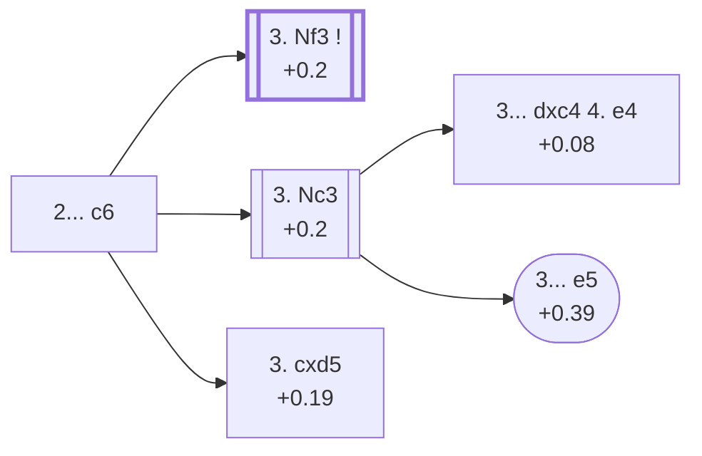

<a name="_TOP_"></a>

# D10 Queen's Gambit Declined: Slav Defense <br> 1. d4 d5 2. c4 c6 #

Spun off from [D06's own "2... c6" candidate bullet](https://github.com/onclemarcel/chess_flashcards/blob/main/d4_openings/D06_Queens_Gambit.md#_c4_) — masters' actual top choice after 2. c4 (49.5%), already live-tagged its own code. Black defends d5 with a pawn instead of a piece, keeping the c8-bishop's diagonal open for ... Bf5 or ... Bg4 before committing to ... e6.

### Overview

*Quick map of every move covered on this card — see the [shape key](https://github.com/onclemarcel/chess_flashcards/blob/main/start.md#content-diagram-optional) in start.md.*

<!-- content-diagram:start -->

<!-- content-diagram:end -->

<a name="_initial_move_"></a>

[](https://lichess.org/analysis/standard/rnbqkbnr/pp2pppp/2p5/3p4/2PP4/8/PP2PPPP/RNBQKBNR_w_KQkq_-_0_3)

*... 1. d4 d5 2. c4 c6 — Slav Defense*

```
rnbqkbnr/pp2pppp/2p5/3p4/2PP4/8/PP2PPPP/RNBQKBNR w KQkq - 0 3
```

|  | +0.2 |
| --- | --- |

<!-- lichess-stats:start fen="rnbqkbnr/pp2pppp/2p5/3p4/2PP4/8/PP2PPPP/RNBQKBNR w KQkq - 0 3" db="lichess,masters" speeds="bullet,blitz" ratings="1800,2000,2200,2500" moves="8" -->
| Move | Online | W/D/B | Masters | W/D/B | |
| :--- | ---: | :--- | ---: | :--- | :-- |
| Nc3 | 20.7 M (56.1%) | ⬜⬜⬜⬜⬜🟫⬛⬛⬛⬛ 51/5/44 | 25 k (23.7%) | ⬜⬜⬜🟫🟫🟫🟫🟫⬛⬛ 35/46/19 |  |
| Nf3 | 7.7 M (21.0%) | ⬜⬜⬜⬜⬜🟫⬛⬛⬛⬛ 52/6/43 | 68 k (64.7%) | ⬜⬜⬜🟫🟫🟫🟫🟫⬛⬛ 30/54/16 |  |
| cxd5 | 5.1 M (13.8%) | ⬜⬜⬜⬜⬜🟫⬛⬛⬛⬛ 51/6/43 | 8.6 k (8.2%) | ⬜⬜🟫🟫🟫🟫🟫🟫⬛⬛ 22/61/17 |  |
| e3 | 2.3 M (6.2%) | ⬜⬜⬜⬜⬜⬛⬛⬛⬛⬛ 48/5/46 | 3.4 k (3.2%) | ⬜⬜⬜🟫🟫🟫🟫🟫⬛⬛ 34/47/19 |  |
| g3 | 318 k (0.9%) | ⬜⬜⬜⬜⬜🟫⬛⬛⬛⬛ 51/5/44 | 72 (0.1%) | ⬜🟫🟫🟫🟫🟫🟫🟫⬛⬛ 12/64/24 |  |
| Bf4 | 225 k (0.6%) | ⬜⬜⬜⬜⬜🟫⬛⬛⬛⬛ 50/5/45 | 62 (0.1%) | ⬜⬜⬜⬜🟫🟫🟫🟫⬛⬛ 40/39/21 |  |
| c5 | 190 k (0.5%) | ⬜⬜⬜⬜🟫⬛⬛⬛⬛⬛ 45/5/51 | 0 | — | ⚠ |
| e4 | 66 k (0.2%) | ⬜⬜⬜⬜⬜⬛⬛⬛⬛⬛ 48/4/48 | 0 | — | ⚠ |
| Qc2 | 0 | — | 69 (0.1%) | ⬜⬜⬜🟫🟫🟫🟫🟫⬛⬛ 29/54/17 |  |
| Nd2 | 0 | — | 33 (0.0%) | ⬜⬜⬜🟫🟫🟫⬛⬛⬛⬛ 30/33/36 |  |

*Online: bullet/blitz, 1800+ — 36.8 M games. Masters: 105 k games. [Open in the explorer](https://lichess.org/analysis/standard/rnbqkbnr/pp2pppp/2p5/3p4/2PP4/8/PP2PPPP/RNBQKBNR_w_KQkq_-_0_3#explorer) — updated 2026-09-09*
<!-- lichess-stats:end -->

Masters' clear favourite is **3. Nf3** (+0.2, 64.7%) — its own code, [D11](https://github.com/onclemarcel/chess_flashcards/blob/main/d4_openings/D11_Slav_Defense_Modern_Line.md). **3. Nc3** (23.7%) is a real secondary try that stays D10, inviting a quick ... e5 or ... dxc4 counter; **3. cxd5** (+0.19, 8.2%) simplifies at once into the untagged *Exchange Variation*.

* **3. Nf3** (64.7% masters): its own code, [D11](https://github.com/onclemarcel/chess_flashcards/blob/main/d4_openings/D11_Slav_Defense_Modern_Line.md).
* [**3. Nc3**](#_Nc3_) (23.7% masters): a sharper try, inviting the Slav Gambit (3... dxc4 4. e4) if Black grabs the pawn — covered below.
* [**3. cxd5**](#_Exchange10_) (8.2% masters): the *Exchange Variation* — covered below.

[*Back to TOP*](#_TOP_)

---

<a name="_Nc3_"></a>

## 3. Nc3

[](https://lichess.org/analysis/standard/rnbqkbnr/pp2pppp/2p5/3p4/2PP4/2N5/PP2PPPP/R1BQKBNR_b_KQkq_-_1_3)

*... 1. d4 d5 2. c4 c6 3. Nc3*

```
rnbqkbnr/pp2pppp/2p5/3p4/2PP4/2N5/PP2PPPP/R1BQKBNR b KQkq - 1 3
```

|  | +0.2 |
| --- | --- |

<!-- lichess-stats:start fen="rnbqkbnr/pp2pppp/2p5/3p4/2PP4/2N5/PP2PPPP/R1BQKBNR b KQkq - 1 3" db="lichess,masters" speeds="bullet,blitz" ratings="1800,2000,2200,2500" moves="5" -->
| Move | Online | W/D/B | Masters | W/D/B | |
| :--- | ---: | :--- | ---: | :--- | :-- |
| Nf6 | 13.6 M (63.2%) | ⬜⬜⬜⬜⬜🟫⬛⬛⬛⬛ 50/5/45 | 22 k (88.6%) | ⬜⬜⬜🟫🟫🟫🟫🟫⬛⬛ 34/47/19 |  |
| e6 | 3.8 M (17.7%) | ⬜⬜⬜⬜⬜🟫⬛⬛⬛⬛ 52/5/44 | 1.1 k (4.5%) | ⬜⬜⬜⬜🟫🟫🟫🟫⬛⬛ 37/44/19 |  |
| dxc4 | 1.7 M (7.9%) | ⬜⬜⬜⬜⬜⬛⬛⬛⬛⬛ 51/4/45 | 1.4 k (5.4%) | ⬜⬜⬜⬜🟫🟫🟫🟫⬛⬛ 36/41/23 |  |
| Bf5 | 1.3 M (6.1%) | ⬜⬜⬜⬜⬜🟫⬛⬛⬛⬛ 54/5/42 | 0 | — | ⚠ |
| a6 | 262 k (1.2%) | ⬜⬜⬜⬜⬜⬛⬛⬛⬛⬛ 51/4/45 | 18 (0.1%) | — |  |
| e5 | 0 | — | 350 (1.4%) | ⬜⬜⬜⬜⬜🟫🟫🟫⬛⬛ 45/35/21 |  |

*Online: bullet/blitz, 1800+ — 21.5 M games. Masters: 25 k games. [Open in the explorer](https://lichess.org/analysis/standard/rnbqkbnr/pp2pppp/2p5/3p4/2PP4/2N5/PP2PPPP/R1BQKBNR_b_KQkq_-_1_3#explorer) — updated 2026-09-09*
<!-- lichess-stats:end -->

Keeps open the option of a quick e4 push if Black takes on c4, at the cost of allowing 3... dxc4 to be defended more actively than after 3. Nf3. Masters' clear main try transposes back to the main Slav (**3... Nf6**, 88.6%), but two real minority tries stay genuinely D10: **3... dxc4** (5.4%), heading toward 4. e4 below, and **3... e5** (1.4%), the *Winawer Countergambit*.

* [**3... dxc4 4. e4**](#_Alekhine10_) (+0.08, 5.4% masters): live-tagged the *Slav Gambit, Alekhine Attack* (`eco.md`: *Alekhine Variation*) — covered below.
* [**3... e5**](#_Winawer_) (1.4% masters): the *Winawer Countergambit* — covered below.

[*Back to 2... c6*](#_initial_move_)
[*Back to TOP*](#_TOP_)

---

<a name="_Alekhine10_"></a>

### 3... dxc4 4. e4 — Slav Gambit, Alekhine Attack

[](https://lichess.org/analysis/standard/rnbqkbnr/pp2pppp/2p5/8/2pPP3/2N5/PP3PPP/R1BQKBNR_b_KQkq_e3_0_4)

*... 4. e4 — live-tagged the Slav Gambit, Alekhine Attack*

```
rnbqkbnr/pp2pppp/2p5/8/2pPP3/2N5/PP3PPP/R1BQKBNR b KQkq e3 0 4
```

|  | +0.08 |
| --- | --- |

<!-- lichess-stats:start fen="rnbqkbnr/pp2pppp/2p5/8/2pPP3/2N5/PP3PPP/R1BQKBNR b KQkq e3 0 4" db="lichess,masters" speeds="bullet,blitz" ratings="1800,2000,2200,2500" moves="3" -->
| Move | Online | W/D/B | Masters | W/D/B | |
| :--- | ---: | :--- | ---: | :--- | :-- |
| b5 | 281 k (47.1%) | ⬜⬜⬜⬜⬜⬛⬛⬛⬛⬛ 48/4/48 | 612 (93.7%) | ⬜⬜⬜⬜🟫🟫🟫🟫⬛⬛ 37/42/21 |  |
| Nf6 | 167 k (28.1%) | ⬜⬜⬜⬜⬜🟫⬛⬛⬛⬛ 54/4/43 | 4 (0.6%) | — | ⚠ |
| e6 | 58 k (9.8%) | ⬜⬜⬜⬜⬜⬜⬛⬛⬛⬛ 56/4/40 | 0 | — | ⚠ |
| e5 | 0 | — | 37 (5.7%) | ⬜⬜⬜⬜🟫🟫🟫🟫⬛⬛ 43/41/16 |  |

*Online: bullet/blitz, 1800+ — 596 k games. Masters: 653 games. [Open in the explorer](https://lichess.org/analysis/standard/rnbqkbnr/pp2pppp/2p5/8/2pPP3/2N5/PP3PPP/R1BQKBNR_b_KQkq_e3_0_4#explorer) — updated 2026-09-09*
<!-- lichess-stats:end -->

`eco.md` calls this the *Alekhine Variation*; the live explorer tags it the ***Slav Gambit, Alekhine Attack*** instead — a real name divergence, and a genuine name-reuse besides: D15 (below, much deeper in the Slav Nf3/Nc3 tree) carries its own, completely unrelated **Slav Gambit** (4.Nc3 dxc4 5.e4). White grabs back the centre with tempo before Black can consolidate the extra pawn. Masters' overwhelming reply is **4... b5** (93.7%), defending c4 at once. Not built out further here (backlog).

[*Back to 3. Nc3*](#_Nc3_)
[*Back to TOP*](#_TOP_)

---

<a name="_Winawer_"></a>

### 3... e5 — Winawer Countergambit

[](https://lichess.org/analysis/standard/rnbqkbnr/pp3ppp/2p5/3pp3/2PP4/2N5/PP2PPPP/R1BQKBNR_w_KQkq_e6_0_4)

*... 3... e5 — Winawer Countergambit*

```
rnbqkbnr/pp3ppp/2p5/3pp3/2PP4/2N5/PP2PPPP/R1BQKBNR w KQkq e6 0 4
```

|  | +0.39 |
| --- | --- |

<!-- lichess-stats:start fen="rnbqkbnr/pp3ppp/2p5/3pp3/2PP4/2N5/PP2PPPP/R1BQKBNR w KQkq e6 0 4" db="lichess,masters" speeds="bullet,blitz" ratings="1800,2000,2200,2500" moves="4" -->
| Move | Online | W/D/B | Masters | W/D/B | |
| :--- | ---: | :--- | ---: | :--- | :-- |
| cxd5 | 84 k (34.2%) | ⬜⬜⬜⬜⬜⬛⬛⬛⬛⬛ 46/5/49 | 79 (22.6%) | ⬜⬜⬜⬜🟫🟫🟫⬛⬛⬛ 38/28/34 |  |
| dxe5 | 73 k (29.4%) | ⬜⬜⬜⬜⬜⬛⬛⬛⬛⬛ 46/4/50 | 177 (50.6%) | ⬜⬜⬜⬜🟫🟫🟫🟫⬛⬛ 44/37/19 |  |
| Nf3 | 45 k (18.4%) | ⬜⬜⬜⬜⬜⬛⬛⬛⬛⬛ 46/3/51 | 3 (0.9%) | — | ⚠ |
| e3 | 33 k (13.2%) | ⬜⬜⬜⬜⬜⬛⬛⬛⬛⬛ 48/4/48 | 91 (26.0%) | ⬜⬜⬜⬜⬜🟫🟫🟫🟫⬛ 52/35/13 |  |

*Online: bullet/blitz, 1800+ — 247 k games. Masters: 350 games. [Open in the explorer](https://lichess.org/analysis/standard/rnbqkbnr/pp3ppp/2p5/3pp3/2PP4/2N5/PP2PPPP/R1BQKBNR_w_KQkq_e6_0_4#explorer) — updated 2026-09-09*
<!-- lichess-stats:end -->

`eco.md`'s name matches the live explorer exactly here. A genuine counter-gambit: rather than just holding d5, Black offers a second central pawn back for quick piece activity. Masters split between **4. dxe5** (50.6%), **4. e3** (26.0%), and **4. cxd5** (22.6%) — a genuinely scattered choice. Not built out further here (backlog).

[*Back to 3. Nc3*](#_Nc3_)
[*Back to TOP*](#_TOP_)

---

<a name="_Exchange10_"></a>

## 3. cxd5 cxd5 — Exchange Variation

[](https://lichess.org/analysis/standard/rnbqkbnr/pp2pppp/8/3p4/3P4/8/PP2PPPP/RNBQKBNR_w_KQkq_-_0_4)

*... 3... cxd5 — Exchange Variation*

```
rnbqkbnr/pp2pppp/8/3p4/3P4/8/PP2PPPP/RNBQKBNR w KQkq - 0 4
```

|  | +0.19 |
| --- | --- |

<!-- lichess-stats:start fen="rnbqkbnr/pp2pppp/8/3p4/3P4/8/PP2PPPP/RNBQKBNR w KQkq - 0 4" db="lichess,masters" speeds="bullet,blitz" ratings="1800,2000,2200,2500" moves="4" -->
| Move | Online | W/D/B | Masters | W/D/B | |
| :--- | ---: | :--- | ---: | :--- | :-- |
| Nc3 | 3.9 M (65.5%) | ⬜⬜⬜⬜⬜🟫⬛⬛⬛⬛ 51/6/44 | 4.4 k (51.0%) | ⬜⬜🟫🟫🟫🟫🟫🟫⬛⬛ 20/62/18 |  |
| Nf3 | 914 k (15.5%) | ⬜⬜⬜⬜⬜🟫⬛⬛⬛⬛ 50/6/44 | 1.2 k (14.0%) | ⬜⬜🟫🟫🟫🟫🟫🟫⬛⬛ 20/65/16 |  |
| Bf4 | 649 k (11.0%) | ⬜⬜⬜⬜⬜🟫⬛⬛⬛⬛ 52/6/42 | 2.6 k (30.2%) | ⬜⬜🟫🟫🟫🟫🟫🟫⬛⬛ 25/58/16 |  |
| e3 | 212 k (3.6%) | ⬜⬜⬜⬜⬜⬛⬛⬛⬛⬛ 46/5/49 | 0 | — | ⚠ |
| Bg5 | 0 | — | 414 (4.8%) | ⬜⬜⬜🟫🟫🟫🟫🟫⬛⬛ 36/46/18 |  |

*Online: bullet/blitz, 1800+ — 5.9 M games. Masters: 8.7 k games. [Open in the explorer](https://lichess.org/analysis/standard/rnbqkbnr/pp2pppp/8/3p4/3P4/8/PP2PPPP/RNBQKBNR_w_KQkq_-_0_4#explorer) — updated 2026-09-09*
<!-- lichess-stats:end -->

Left completely untagged live (`opening=None`) despite carrying an `eco.md` name — too symmetrical and simplifying to register its own live identity. Trades off the central tension immediately; White's most common follow-up is **4. Nc3** (51.0%), developing toward an IQP-free, slightly drawish structure. Not built out further here (backlog).

[*Back to 2... c6*](#_initial_move_)
[*Back to TOP*](#_TOP_)
