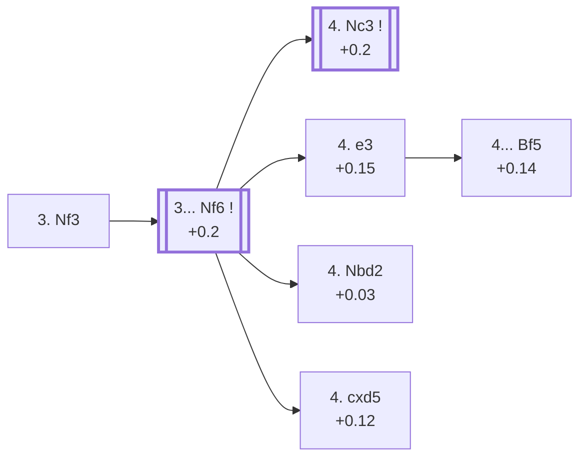

<a name="_TOP_"></a>

# D11 Queen's Gambit Declined: Slav Defense, Modern Line <br> 1. d4 d5 2. c4 c6 3. Nf3 #

Spun off from [D10's own "3. Nf3" candidate bullet](https://github.com/onclemarcel/chess_flashcards/blob/main/d4_openings/D10_Slav_Defense.md#_initial_move_) — masters' clear favourite there (64.7%), already live-tagged its own code. White develops naturally before deciding how to meet a future ... dxc4, the same move order that migrated most of its own deep theory out of D06's own "Queen's Gambit" card, where it had been built (incorrectly) as if it stayed there.

### Overview

*Quick map of every move covered on this card — see the [shape key](https://github.com/onclemarcel/chess_flashcards/blob/main/start.md#content-diagram-optional) in start.md.*

<!-- content-diagram:start -->

<!-- content-diagram:end -->

<a name="_initial_move_"></a>

[](https://lichess.org/analysis/standard/rnbqkbnr/pp2pppp/2p5/3p4/2PP4/5N2/PP2PPPP/RNBQKB1R_b_KQkq_-_1_3)

*... 1. d4 d5 2. c4 c6 3. Nf3 — Slav Defense: Modern Line*

```
rnbqkbnr/pp2pppp/2p5/3p4/2PP4/5N2/PP2PPPP/RNBQKB1R b KQkq - 1 3
```

|  | +0.2 |
| --- | --- |

<!-- lichess-stats:start fen="rnbqkbnr/pp2pppp/2p5/3p4/2PP4/5N2/PP2PPPP/RNBQKB1R b KQkq - 1 3" db="lichess,masters" speeds="bullet,blitz" ratings="1800,2000,2200,2500" moves="4" -->
| Move | Online | W/D/B | Masters | W/D/B | |
| :--- | ---: | :--- | ---: | :--- | :-- |
| Nf6 | 8.0 M (63.6%) | ⬜⬜⬜⬜⬜🟫⬛⬛⬛⬛ 51/6/43 | 69 k (91.7%) | ⬜⬜⬜🟫🟫🟫🟫🟫⬛⬛ 30/54/16 |  |
| e6 | 1.9 M (15.3%) | ⬜⬜⬜⬜⬜🟫⬛⬛⬛⬛ 53/5/42 | 5.0 k (6.7%) | ⬜⬜⬜⬜🟫🟫🟫🟫⬛⬛ 35/45/19 |  |
| Bf5 | 872 k (6.9%) | ⬜⬜⬜⬜⬜🟫⬛⬛⬛⬛ 53/5/42 | 66 (0.1%) | ⬜⬜⬜⬜⬜🟫🟫🟫⬛⬛ 50/33/17 |  |
| dxc4 | 615 k (4.9%) | ⬜⬜⬜⬜⬜🟫⬛⬛⬛⬛ 54/4/42 | 1.1 k (1.4%) | ⬜⬜⬜⬜🟫🟫🟫🟫⬛⬛ 35/41/24 |  |

*Online: bullet/blitz, 1800+ — 12.6 M games. Masters: 75 k games. [Open in the explorer](https://lichess.org/analysis/standard/rnbqkbnr/pp2pppp/2p5/3p4/2PP4/5N2/PP2PPPP/RNBQKB1R_b_KQkq_-_1_3#explorer) — updated 2026-09-15*
<!-- lichess-stats:end -->

Masters' clear favourite is **3... Nf6** (91.7%) — completing development before deciding on a structure, the same logical order as 2... c6 itself.

* [**3... Nf6**](#_Nf6_) (91.7% masters): see below.

[*Back to TOP*](#_TOP_)

---

<a name="_Nf6_"></a>

## 3... Nf6 — the Slav tabiya

[](https://lichess.org/analysis/standard/rnbqkb1r/pp2pppp/2p2n2/3p4/2PP4/5N2/PP2PPPP/RNBQKB1R_w_KQkq_-_2_4)

*... 3... Nf6 — reaching the main Slav tabiya*

```
rnbqkb1r/pp2pppp/2p2n2/3p4/2PP4/5N2/PP2PPPP/RNBQKB1R w KQkq - 2 4
```

|  | +0.2 |
| --- | --- |

<!-- lichess-stats:start fen="rnbqkb1r/pp2pppp/2p2n2/3p4/2PP4/5N2/PP2PPPP/RNBQKB1R w KQkq - 2 4" db="lichess,masters" speeds="bullet,blitz" ratings="1800,2000,2200,2500" moves="5" -->
| Move | Online | W/D/B | Masters | W/D/B | |
| :--- | ---: | :--- | ---: | :--- | :-- |
| Nc3 | 6.3 M (55.1%) | ⬜⬜⬜⬜⬜🟫⬛⬛⬛⬛ 51/6/43 | 52 k (55.3%) | ⬜⬜⬜🟫🟫🟫🟫🟫⬛⬛ 30/53/17 |  |
| e3 | 1.4 M (12.7%) | ⬜⬜⬜⬜⬜🟫⬛⬛⬛⬛ 51/6/43 | 27 k (28.9%) | ⬜⬜⬜🟫🟫🟫🟫🟫⬛⬛ 29/55/16 |  |
| g3 | 1.3 M (11.6%) | ⬜⬜⬜⬜⬜🟫⬛⬛⬛⬛ 51/6/43 | 0 | — | ⚠ |
| cxd5 | 1.1 M (9.9%) | ⬜⬜⬜⬜⬜🟫⬛⬛⬛⬛ 51/6/43 | 3.7 k (3.9%) | ⬜⬜🟫🟫🟫🟫🟫🟫🟫⬛ 18/66/16 |  |
| Qc2 | 428 k (3.8%) | ⬜⬜⬜⬜⬜🟫⬛⬛⬛⬛ 54/7/39 | 5.1 k (5.4%) | ⬜⬜⬜⬜🟫🟫🟫🟫⬛⬛ 35/45/20 |  |
| Qb3 | 0 | — | 2.8 k (3.0%) | ⬜⬜⬜⬜🟫🟫🟫🟫⬛⬛ 37/45/18 |  |

*Online: bullet/blitz, 1800+ — 11.4 M games. Masters: 94 k games. [Open in the explorer](https://lichess.org/analysis/standard/rnbqkb1r/pp2pppp/2p2n2/3p4/2PP4/5N2/PP2PPPP/RNBQKB1R_w_KQkq_-_2_4#explorer) — updated 2026-09-15*
<!-- lichess-stats:end -->

White's 4th move splits the whole rest of Slav theory: **4. Nc3** (+0.2) develops naturally toward the *Three Knights Variation* — its own code, [D15](https://github.com/onclemarcel/chess_flashcards/blob/main/d4_openings/D15_Slav_Defense_Three_Knights.md) — while **4. e3** (the *Quiet Variation*) and **4. Nbd2** (the *Breyer Variation*) both stay D11, and **4. cxd5** (+0.12) heads for its own *Exchange Variation* — a different code, [D13](https://github.com/onclemarcel/chess_flashcards/blob/main/d4_openings/D13_Slav_Defense_Exchange_Variation.md), from the one reached via 4.e3 Bf5 5.cxd5 (D12).

* **4. Nc3** (55.3% masters): the *Three Knights Variation* — its own code, [D15](https://github.com/onclemarcel/chess_flashcards/blob/main/d4_openings/D15_Slav_Defense_Three_Knights.md).
* [**4. e3**](#_e3_) (28.9% masters): the *Quiet Variation* — covered below.
* [**4. Nbd2**](#_Breyer_): the *Breyer Variation* — covered below.
* **4. cxd5**: its own *Exchange Variation*, a different code, [D13](https://github.com/onclemarcel/chess_flashcards/blob/main/d4_openings/D13_Slav_Defense_Exchange_Variation.md).

[*Back to 3. Nf3*](#_initial_move_)
[*Back to TOP*](#_TOP_)

---

<a name="_Breyer_"></a>

## 4. Nbd2 — Breyer Variation

[](https://lichess.org/analysis/standard/rnbqkb1r/pp2pppp/2p2n2/3p4/2PP4/5N2/PP1NPPPP/R1BQKB1R_b_KQkq_-_3_4)

*... 4. Nbd2 — Breyer Variation*

```
rnbqkb1r/pp2pppp/2p2n2/3p4/2PP4/5N2/PP1NPPPP/R1BQKB1R b KQkq - 3 4
```

|  | +0.03 |
| --- | --- |

<!-- lichess-stats:start fen="rnbqkb1r/pp2pppp/2p2n2/3p4/2PP4/5N2/PP1NPPPP/R1BQKB1R b KQkq - 3 4" db="lichess,masters" speeds="bullet,blitz" ratings="1800,2000,2200,2500" moves="5" -->
| Move | Online | W/D/B | Masters | W/D/B | |
| :--- | ---: | :--- | ---: | :--- | :-- |
| Bf5 | 73 k (35.6%) | ⬜⬜⬜⬜⬜🟫⬛⬛⬛⬛ 50/7/43 | 679 (61.0%) | ⬜⬜⬜🟫🟫🟫🟫⬛⬛⬛ 30/44/26 |  |
| e6 | 51 k (25.1%) | ⬜⬜⬜⬜⬜🟫⬛⬛⬛⬛ 55/6/38 | 161 (14.5%) | ⬜⬜⬜⬜⬜🟫🟫🟫🟫⬛ 48/37/14 |  |
| Bg4 | 29 k (14.1%) | ⬜⬜⬜⬜⬜🟫⬛⬛⬛⬛ 52/5/42 | 12 (1.1%) | — |  |
| g6 | 23 k (11.2%) | ⬜⬜⬜⬜⬜🟫⬛⬛⬛⬛ 50/7/43 | 215 (19.3%) | ⬜⬜⬜⬜🟫🟫🟫🟫⬛⬛ 41/41/18 |  |
| a6 | 13 k (6.1%) | ⬜⬜⬜⬜⬜🟫⬛⬛⬛⬛ 51/8/42 | 31 (2.8%) | ⬜⬜⬜⬜⬜🟫🟫⬛⬛⬛ 45/23/32 |  |

*Online: bullet/blitz, 1800+ — 205 k games. Masters: 1.1 k games. [Open in the explorer](https://lichess.org/analysis/standard/rnbqkb1r/pp2pppp/2p2n2/3p4/2PP4/5N2/PP1NPPPP/R1BQKB1R_b_KQkq_-_3_4#explorer) — updated 2026-09-15*
<!-- lichess-stats:end -->

`eco.md`'s name matches the live explorer exactly here. An unusual square for the queen's knight, keeping options flexible before deciding between e3/Bd3 or a quick cxd5. Masters' clear main try is **4... Bf5** (61.0%), developing the light-squared bishop before it can be shut in. Not built out further here (backlog).

[*Back to 3... Nf6*](#_Nf6_)
[*Back to TOP*](#_TOP_)

---

<a name="_e3_"></a>

## 4. e3 — Quiet Variation

[](https://lichess.org/analysis/standard/rnbqkb1r/pp2pppp/2p2n2/3p4/2PP4/4PN2/PP3PPP/RNBQKB1R_b_KQkq_-_0_4)

*... 4. e3 — Quiet Variation*

```
rnbqkb1r/pp2pppp/2p2n2/3p4/2PP4/4PN2/PP3PPP/RNBQKB1R b KQkq - 0 4
```

|  | +0.15 |
| --- | --- |

<!-- lichess-stats:start fen="rnbqkb1r/pp2pppp/2p2n2/3p4/2PP4/4PN2/PP3PPP/RNBQKB1R b KQkq - 0 4" db="lichess,masters" speeds="bullet,blitz" ratings="1800,2000,2200,2500" moves="5" -->
| Move | Online | W/D/B | Masters | W/D/B | |
| :--- | ---: | :--- | ---: | :--- | :-- |
| Bg4 | 1.1 M (33.0%) | ⬜⬜⬜⬜⬜⬛⬛⬛⬛⬛ 49/6/46 | 4.3 k (14.7%) | ⬜⬜⬜🟫🟫🟫🟫🟫⬛⬛ 30/51/18 |  |
| e6 | 840 k (24.9%) | ⬜⬜⬜⬜⬜🟫⬛⬛⬛⬛ 51/6/43 | 9.4 k (31.9%) | ⬜⬜⬜🟫🟫🟫🟫🟫🟫⬛ 28/61/12 |  |
| Bf5 | 678 k (20.1%) | ⬜⬜⬜⬜⬜🟫⬛⬛⬛⬛ 48/6/46 | 11 k (36.0%) | ⬜⬜⬜🟫🟫🟫🟫🟫⬛⬛ 27/54/18 |  |
| g6 | 345 k (10.2%) | ⬜⬜⬜⬜⬜🟫⬛⬛⬛⬛ 48/6/45 | 1.9 k (6.4%) | ⬜⬜⬜⬜🟫🟫🟫🟫🟫⬛ 37/48/16 |  |
| a6 | 177 k (5.2%) | ⬜⬜⬜⬜⬜🟫⬛⬛⬛⬛ 48/7/45 | 3.2 k (10.8%) | ⬜⬜⬜🟫🟫🟫🟫🟫⬛⬛ 34/47/19 |  |

*Online: bullet/blitz, 1800+ — 3.4 M games. Masters: 29 k games. [Open in the explorer](https://lichess.org/analysis/standard/rnbqkb1r/pp2pppp/2p2n2/3p4/2PP4/4PN2/PP3PPP/RNBQKB1R_b_KQkq_-_0_4#explorer) — updated 2026-09-15*
<!-- lichess-stats:end -->

`eco.md`'s bare "4.e3" and the live explorer's *Quiet Variation* refer to the same move — no divergence here. Keeps the position flexible, delaying Nc3 so a later cxd5/Nc3 or a Stonewall-style c5 push both stay available, at the cost of blocking in the c1-bishop for now. Masters' clear main try is **4... Bf5** (+0.14, 36.0%) — one ply deeper this becomes its own named code, the *Quiet Variation, Schallopp Defense*, [D12](https://github.com/onclemarcel/chess_flashcards/blob/main/d4_openings/D12_Slav_Defense_Schallopp_Defense.md).

* **4... Bf5** (36.0% masters): its own code, [D12](https://github.com/onclemarcel/chess_flashcards/blob/main/d4_openings/D12_Slav_Defense_Schallopp_Defense.md).

[*Back to 3... Nf6*](#_Nf6_)
[*Back to TOP*](#_TOP_)
