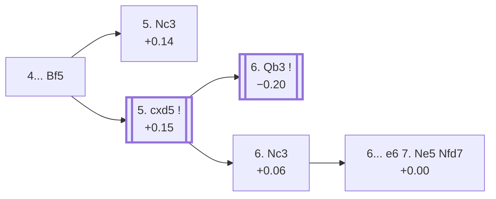

<a name="_TOP_"></a>

# D12 Queen's Gambit Declined: Slav Defense, Quiet Variation, Schallopp Defense <br> 1. d4 d5 2. c4 c6 3. Nf3 Nf6 4. e3 Bf5 #

Spun off from [D11's own "4. e3" card](https://github.com/onclemarcel/chess_flashcards/blob/main/d4_openings/D11_Slav_Defense_Modern_Line.md#_e3_) — masters' clear main try there (36.0%), already live-tagged its own code. `eco.md` leaves this exact tabiya unnamed beyond the move list; the live explorer independently names it the ***Quiet Variation, Schallopp Defense*** — a compound name inheriting D11's own "Quiet Variation" tag plus its own suffix.

### Overview

*Quick map of every move covered on this card — see the [shape key](https://github.com/onclemarcel/chess_flashcards/blob/main/start.md#content-diagram-optional) in start.md.*

<!-- content-diagram:start -->

<!-- content-diagram:end -->

<a name="_initial_move_"></a>

[](https://lichess.org/analysis/standard/rn1qkb1r/pp2pppp/2p2n2/3p1b2/2PP4/4PN2/PP3PPP/RNBQKB1R_w_KQkq_-_1_5)

*... 4... Bf5 — Quiet Variation, Schallopp Defense*

```
rn1qkb1r/pp2pppp/2p2n2/3p1b2/2PP4/4PN2/PP3PPP/RNBQKB1R w KQkq - 1 5
```

|  | +0.14 |
| --- | --- |

<!-- lichess-stats:start fen="rn1qkb1r/pp2pppp/2p2n2/3p1b2/2PP4/4PN2/PP3PPP/RNBQKB1R w KQkq - 1 5" db="lichess,masters" speeds="bullet,blitz" ratings="1800,2000,2200,2500" moves="6" -->
| Move | Online | W/D/B | Masters | W/D/B | |
| :--- | ---: | :--- | ---: | :--- | :-- |
| Nc3 | 475 k (53.0%) | ⬜⬜⬜⬜⬜🟫⬛⬛⬛⬛ 48/6/45 | 9.2 k (84.8%) | ⬜⬜⬜🟫🟫🟫🟫🟫⬛⬛ 28/54/18 |  |
| cxd5 | 167 k (18.7%) | ⬜⬜⬜⬜⬜🟫⬛⬛⬛⬛ 49/6/45 | 802 (7.4%) | ⬜⬜⬜🟫🟫🟫🟫🟫⬛⬛ 29/49/23 |  |
| Bd3 | 89 k (9.9%) | ⬜⬜⬜⬜⬜🟫⬛⬛⬛⬛ 47/7/46 | 602 (5.5%) | ⬜⬜🟫🟫🟫🟫🟫🟫⬛⬛ 19/61/20 |  |
| Qb3 | 47 k (5.3%) | ⬜⬜⬜⬜⬜🟫⬛⬛⬛⬛ 49/7/45 | 127 (1.2%) | ⬜⬜⬜🟫🟫🟫🟫⬛⬛⬛ 26/43/31 |  |
| Be2 | 36 k (4.0%) | ⬜⬜⬜⬜⬜⬛⬛⬛⬛⬛ 46/5/49 | 0 | — | ⚠ |
| Nbd2 | 33 k (3.7%) | ⬜⬜⬜⬜⬜⬛⬛⬛⬛⬛ 47/6/47 | 52 (0.5%) | ⬜⬜⬜⬜🟫🟫🟫🟫⬛⬛ 37/38/25 |  |
| Nh4 | 0 | — | 45 (0.4%) | ⬜⬜⬜🟫🟫🟫🟫🟫🟫⬛ 31/56/13 |  |

*Online: bullet/blitz, 1800+ — 896 k games. Masters: 11 k games. [Open in the explorer](https://lichess.org/analysis/standard/rn1qkb1r/pp2pppp/2p2n2/3p1b2/2PP4/4PN2/PP3PPP/RNBQKB1R_w_KQkq_-_1_5#explorer) — updated 2026-09-14*
<!-- lichess-stats:end -->

Masters' overwhelming reply is **5. Nc3** (+0.14, 84.8%), transposing back toward the main Slav complex and not covered further here (backlog). The real fork `eco.md` names lives one ply deeper, after **5. cxd5** (+0.15, only 7.4% masters but the source of every named line below): **5... cxd5** and White's 6th move splits into the *Landau Variation* and the *Exchange Variation*.

* **5. Nc3** (84.8% masters): transposes toward the main Slav complex — not covered further here.
* [**5. cxd5 cxd5**](#_cxd5_) (7.4% masters): forks the *Landau*/*Exchange Variations* — covered below.

[*Back to TOP*](#_TOP_)

---

<a name="_cxd5_"></a>

## 5. cxd5 cxd5

[](https://lichess.org/analysis/standard/rn1qkb1r/pp2pppp/5n2/3p1b2/3P4/4PN2/PP3PPP/RNBQKB1R_w_KQkq_-_0_6)

*... 5... cxd5*

```
rn1qkb1r/pp2pppp/5n2/3p1b2/3P4/4PN2/PP3PPP/RNBQKB1R w KQkq - 0 6
```

|  | +0.15 |
| --- | --- |

<!-- lichess-stats:start fen="rn1qkb1r/pp2pppp/5n2/3p1b2/3P4/4PN2/PP3PPP/RNBQKB1R w KQkq - 0 6" db="lichess,masters" speeds="bullet,blitz" ratings="1800,2000,2200,2500" moves="3" -->
| Move | Online | W/D/B | Masters | W/D/B | |
| :--- | ---: | :--- | ---: | :--- | :-- |
| Nc3 | 88 k (53.2%) | ⬜⬜⬜⬜⬜⬛⬛⬛⬛⬛ 49/5/46 | 214 (28.0%) | ⬜⬜⬜🟫🟫🟫🟫⬛⬛⬛ 30/41/29 |  |
| Bd3 | 36 k (21.6%) | ⬜⬜⬜⬜⬜⬛⬛⬛⬛⬛ 48/6/46 | 0 | — | ⚠ |
| Qb3 | 18 k (10.9%) | ⬜⬜⬜⬜⬜🟫⬛⬛⬛⬛ 54/8/38 | 536 (70.2%) | ⬜⬜⬜🟫🟫🟫🟫🟫⬛⬛ 27/52/21 |  |
| Bb5+ | 0 | — | 7 (0.9%) | — |  |

*Online: bullet/blitz, 1800+ — 166 k games. Masters: 764 games. [Open in the explorer](https://lichess.org/analysis/standard/rn1qkb1r/pp2pppp/5n2/3p1b2/3P4/4PN2/PP3PPP/RNBQKB1R_w_KQkq_-_0_6#explorer) — updated 2026-09-14*
<!-- lichess-stats:end -->

Left completely untagged live (`opening=None`) at this exact node despite forking two named `eco.md` entries. Masters split between **6. Qb3** (70.2%), attacking b7 and d5 at once and heading for the *Landau Variation* (−0.20 several moves later), and **6. Nc3** (28.0%), the simpler developing move that heads for the *Exchange Variation* — a different code, [D13](https://github.com/onclemarcel/chess_flashcards/blob/main/d4_openings/D13_Slav_Defense_Exchange_Variation.md), since the live explorer tags this exact 6.Nc3 line "Schallopp Variation" under D13 rather than D12 (`eco.md` itself lists it under D12 — a genuine eco.md-vs-live code divergence, not just a name one).

* [**6. Qb3 Qc8 7. Bd2 e6 8. Na3**](#_Landau_) (70.2% masters): the *Landau Variation* — covered below.
* [**6. Nc3**](#_Exchange12_) (28.0% masters): `eco.md`'s own D12 *Exchange Variation*, live-tagged D13's *Schallopp Variation* — covered below.

[*Back to 4... Bf5*](#_initial_move_)
[*Back to TOP*](#_TOP_)

---

<a name="_Landau_"></a>

## 6. Qb3 Qc8 7. Bd2 e6 8. Na3 — Landau Variation

[](https://lichess.org/analysis/standard/rnq1kb1r/pp3ppp/4pn2/3p1b2/3P4/NQ2PN2/PP1B1PPP/R3KB1R_b_KQkq_-_1_8)

*... 8. Na3 — Landau Variation*

```
rnq1kb1r/pp3ppp/4pn2/3p1b2/3P4/NQ2PN2/PP1B1PPP/R3KB1R b KQkq - 1 8
```

|  | −0.20 |
| --- | --- |

`eco.md`'s name matches the live explorer here. A specific, deeply analysed try: White routes the queen's knight to a3 rather than c3 to eye b5/c4 without blocking the b3-queen's own diagonal. A genuine database rarity at this exact depth; Stockfish already slightly prefers Black. Not built out further here (backlog).

[*Back to 5. cxd5 cxd5*](#_cxd5_)
[*Back to TOP*](#_TOP_)

---

<a name="_Exchange12_"></a>

## 6. Nc3 — Exchange Variation

[](https://lichess.org/analysis/standard/rn1qkb1r/pp2pppp/5n2/3p1b2/3P4/2N1PN2/PP3PPP/R1BQKB1R_b_KQkq_-_1_6)

*... 6. Nc3 — live-tagged the Exchange Variation, Schallopp Variation (D13)*

```
rn1qkb1r/pp2pppp/5n2/3p1b2/3P4/2N1PN2/PP3PPP/R1BQKB1R b KQkq - 1 6
```

|  | +0.06 |
| --- | --- |

<!-- lichess-stats:start fen="rn1qkb1r/pp2pppp/5n2/3p1b2/3P4/2N1PN2/PP3PPP/R1BQKB1R b KQkq - 1 6" db="lichess,masters" speeds="bullet,blitz" ratings="1800,2000,2200,2500" moves="4" -->
| Move | Online | W/D/B | Masters | W/D/B | |
| :--- | ---: | :--- | ---: | :--- | :-- |
| e6 | 144 k (60.3%) | ⬜⬜⬜⬜⬜⬛⬛⬛⬛⬛ 48/5/47 | 138 (63.3%) | ⬜⬜⬜🟫🟫🟫🟫⬛⬛⬛ 26/45/29 |  |
| Nc6 | 62 k (26.0%) | ⬜⬜⬜⬜⬜⬛⬛⬛⬛⬛ 48/5/47 | 63 (28.9%) | ⬜⬜⬜⬜🟫🟫🟫⬛⬛⬛ 37/37/27 |  |
| a6 | 16 k (6.5%) | ⬜⬜⬜⬜⬜⬛⬛⬛⬛⬛ 48/5/47 | 14 (6.4%) | — |  |
| Bg6 | 5.7 k (2.4%) | ⬜⬜⬜⬜⬜⬛⬛⬛⬛⬛ 45/5/51 | 0 | — | ⚠ |
| Qb6 | 0 | — | 3 (1.4%) | — |  |

*Online: bullet/blitz, 1800+ — 239 k games. Masters: 218 games. [Open in the explorer](https://lichess.org/analysis/standard/rn1qkb1r/pp2pppp/5n2/3p1b2/3P4/2N1PN2/PP3PPP/R1BQKB1R_b_KQkq_-_1_6#explorer) — updated 2026-09-14*
<!-- lichess-stats:end -->

`eco.md` files this exact line under D12's own "Exchange Variation" entry; the live explorer instead tags the position D13, "Schallopp Variation" — a real code discrepancy between the two sources, kept here (its eco.md-assigned code) rather than moved, since `eco.md` is this repo's own organizing reference. Masters' clear main try is **6... e6** (63.3%), reaching the *Amsterdam Variation* one fork further after 7. Ne5.

* [**6... e6 7. Ne5 Nfd7**](#_Amsterdam_) (+0.00, 63.3% masters): the *Amsterdam Variation* — covered below.

[*Back to 5. cxd5 cxd5*](#_cxd5_)
[*Back to TOP*](#_TOP_)

---

<a name="_Amsterdam_"></a>

## 6... e6 7. Ne5 Nfd7 — Amsterdam Variation

[](https://lichess.org/analysis/standard/rn1qkb1r/pp1n1ppp/4p3/3pNb2/3P4/2N1P3/PP3PPP/R1BQKB1R_w_KQkq_-_2_8)

*... 7... Nfd7 — Amsterdam Variation*

```
rn1qkb1r/pp1n1ppp/4p3/3pNb2/3P4/2N1P3/PP3PPP/R1BQKB1R w KQkq - 2 8
```

|  | +0.00 |
| --- | --- |

`eco.md`'s name matches the live explorer here. Black immediately challenges the e5 knight rather than developing further, dead level according to Stockfish. A specific, deeply analysed try; not built out further here (backlog).

[*Back to 6. Nc3*](#_Exchange12_)
[*Back to TOP*](#_TOP_)
