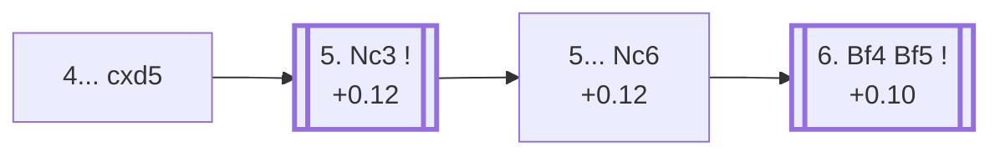

<a name="_TOP_"></a>

# D13 Queen's Gambit Declined: Slav Defense, Exchange Variation <br> 1. d4 d5 2. c4 c6 3. Nf3 Nf6 4. cxd5 cxd5 #

Spun off from [D11's own "3... Nf6" candidate bullet](https://github.com/onclemarcel/chess_flashcards/blob/main/d4_openings/D11_Slav_Defense_Modern_Line.md#_Nf6_) — a real secondary try there, already live-tagged its own code. A different move order from D12's own "Exchange Variation" line (4.e3 Bf5 5.cxd5 cxd5 6.Nc3): here White resolves the central tension immediately, before committing the e-pawn at all.

### Overview

*Quick map of every move covered on this card — see the [shape key](https://github.com/onclemarcel/chess_flashcards/blob/main/start.md#content-diagram-optional) in start.md.*

<!-- content-diagram:start -->

<!-- content-diagram:end -->

<a name="_initial_move_"></a>

[](https://lichess.org/analysis/standard/rnbqkb1r/pp2pppp/5n2/3p4/3P4/5N2/PP2PPPP/RNBQKB1R_w_KQkq_-_0_5)

*... 4... cxd5 — Exchange Variation*

```
rnbqkb1r/pp2pppp/5n2/3p4/3P4/5N2/PP2PPPP/RNBQKB1R w KQkq - 0 5
```

|  | +0.12 |
| --- | --- |

<!-- lichess-stats:start fen="rnbqkb1r/pp2pppp/5n2/3p4/3P4/5N2/PP2PPPP/RNBQKB1R w KQkq - 0 5" db="lichess,masters" speeds="bullet,blitz" ratings="1800,2000,2200,2500" moves="5" -->
| Move | Online | W/D/B | Masters | W/D/B | |
| :--- | ---: | :--- | ---: | :--- | :-- |
| Nc3 | 1.4 M (77.0%) | ⬜⬜⬜⬜⬜🟫⬛⬛⬛⬛ 51/6/43 | 4.7 k (97.8%) | ⬜⬜🟫🟫🟫🟫🟫🟫⬛⬛ 19/65/16 |  |
| Bf4 | 144 k (7.7%) | ⬜⬜⬜⬜⬜🟫⬛⬛⬛⬛ 49/7/45 | 83 (1.7%) | ⬜⬜🟫🟫🟫🟫🟫🟫🟫⬛ 16/69/16 |  |
| g3 | 92 k (4.9%) | ⬜⬜⬜⬜⬜⬛⬛⬛⬛⬛ 47/6/47 | 12 (0.3%) | — |  |
| e3 | 86 k (4.6%) | ⬜⬜⬜⬜🟫⬛⬛⬛⬛⬛ 45/6/49 | 4 (0.1%) | — | ⚠ |
| Bg5 | 69 k (3.7%) | ⬜⬜⬜⬜⬜⬛⬛⬛⬛⬛ 48/6/46 | 0 | — | ⚠ |
| Qb3 | 0 | — | 4 (0.1%) | — |  |

*Online: bullet/blitz, 1800+ — 1.9 M games. Masters: 4.8 k games. [Open in the explorer](https://lichess.org/analysis/standard/rnbqkb1r/pp2pppp/5n2/3p4/3P4/5N2/PP2PPPP/RNBQKB1R_w_KQkq_-_0_5#explorer) — updated 2026-09-06*
<!-- lichess-stats:end -->

`eco.md`'s name matches the live explorer here. A symmetrical pawn structure with no central tension left — historically considered one of the drier ways to meet the Slav, though modern theory has found real resources for both sides. Masters' overwhelming reply is **5. Nc3** (97.8%), developing naturally.

* [**5. Nc3**](#_Nc3_) (97.8% masters): see below.

[*Back to TOP*](#_TOP_)

---

<a name="_Nc3_"></a>

## 5. Nc3

[](https://lichess.org/analysis/standard/rnbqkb1r/pp2pppp/5n2/3p4/3P4/2N2N2/PP2PPPP/R1BQKB1R_b_KQkq_-_1_5)

*... 5. Nc3*

```
rnbqkb1r/pp2pppp/5n2/3p4/3P4/2N2N2/PP2PPPP/R1BQKB1R b KQkq - 1 5
```

|  | +0.12 |
| --- | --- |

Masters' main try is **5... Nc6** (+0.12), developing before deciding on the bishop's diagonal — this exact continuation (**6. Bf4 Bf5**, +0.10) escalates to its own code, the *Exchange Variation, Symmetrical Line*, [D14](https://github.com/onclemarcel/chess_flashcards/blob/main/d4_openings/D14_Slav_Defense_Symmetrical_Line.md). Not built out further here.

* **5... Nc6 6. Bf4 Bf5**: its own code, [D14](https://github.com/onclemarcel/chess_flashcards/blob/main/d4_openings/D14_Slav_Defense_Symmetrical_Line.md).

[*Back to 4... cxd5*](#_initial_move_)
[*Back to TOP*](#_TOP_)
