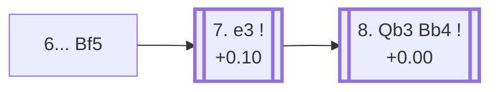

<a name="_TOP_"></a>

# D14 Queen's Gambit Declined: Slav Defense, Exchange Variation, Symmetrical Line <br> 1. d4 d5 2. c4 c6 3. Nf3 Nf6 4. cxd5 cxd5 5. Nc3 Nc6 6. Bf4 Bf5 #

Spun off from [D13's own "5. Nc3" card](https://github.com/onclemarcel/chess_flashcards/blob/main/d4_openings/D13_Slav_Defense_Exchange_Variation.md#_Nc3_) — masters' main try there, already live-tagged its own code. `eco.md` leaves this exact tabiya unnamed beyond the move list; the live explorer independently names it the ***Symmetrical Line***, both sides having developed their light-squared bishops to identical squares.

### Overview

*Quick map of every move covered on this card — see the [shape key](https://github.com/onclemarcel/chess_flashcards/blob/main/start.md#content-diagram-optional) in start.md.*

<!-- content-diagram:start -->

<!-- content-diagram:end -->

<a name="_initial_move_"></a>

[](https://lichess.org/analysis/standard/r2qkb1r/pp2pppp/2n2n2/3p1b2/3P1B2/2N2N2/PP2PPPP/R2QKB1R_w_KQkq_-_4_7)

*... 6... Bf5 — live-tagged the Symmetrical Line*

```
r2qkb1r/pp2pppp/2n2n2/3p1b2/3P1B2/2N2N2/PP2PPPP/R2QKB1R w KQkq - 4 7
```

|  | +0.10 |
| --- | --- |

<!-- lichess-stats:start fen="r2qkb1r/pp2pppp/2n2n2/3p1b2/3P1B2/2N2N2/PP2PPPP/R2QKB1R w KQkq - 4 7" db="lichess,masters" speeds="bullet,blitz" ratings="1800,2000,2200,2500" moves="5" -->
| Move | Online | W/D/B | Masters | W/D/B | |
| :--- | ---: | :--- | ---: | :--- | :-- |
| e3 | 352 k (78.8%) | ⬜⬜⬜⬜⬜🟫⬛⬛⬛⬛ 49/8/43 | 2.7 k (89.2%) | ⬜🟫🟫🟫🟫🟫🟫🟫🟫⬛ 12/76/11 |  |
| Qb3 | 38 k (8.6%) | ⬜⬜⬜⬜⬜🟫⬛⬛⬛⬛ 54/6/40 | 268 (8.7%) | ⬜⬜🟫🟫🟫🟫🟫🟫🟫⬛ 21/68/12 |  |
| a3 | 19 k (4.3%) | ⬜⬜⬜⬜🟫⬛⬛⬛⬛⬛ 44/8/48 | 10 (0.3%) | — |  |
| Rc1 | 12 k (2.7%) | ⬜⬜⬜⬜⬜🟫⬛⬛⬛⬛ 50/7/43 | 40 (1.3%) | ⬜⬜🟫🟫🟫🟫🟫🟫⬛⬛ 18/60/22 |  |
| Bg3 | 8.3 k (1.9%) | ⬜⬜⬜⬜⬜🟫⬛⬛⬛⬛ 50/6/44 | 0 | — | ⚠ |
| Ne5 | 0 | — | 11 (0.4%) | — |  |

*Online: bullet/blitz, 1800+ — 446 k games. Masters: 3.1 k games. [Open in the explorer](https://lichess.org/analysis/standard/r2qkb1r/pp2pppp/2n2n2/3p1b2/3P1B2/2N2N2/PP2PPPP/R2QKB1R_w_KQkq_-_4_7#explorer) — updated 2026-09-15*
<!-- lichess-stats:end -->

Masters' clear main try is **7. e3** (89.2%), preparing Bd3/Qb3 or a quick Rc1 without further delay.

* [**7. e3**](#_e3_) (89.2% masters): see below.

[*Back to TOP*](#_TOP_)

---

<a name="_e3_"></a>

## 7. e3

[](https://lichess.org/analysis/standard/r2qkb1r/pp2pppp/2n2n2/3p1b2/3P1B2/2N1PN2/PP3PPP/R2QKB1R_b_KQkq_-_0_7)

*... 7. e3*

```
r2qkb1r/pp2pppp/2n2n2/3p1b2/3P1B2/2N1PN2/PP3PPP/R2QKB1R b KQkq - 0 7
```

|  | +0.10 |
| --- | --- |

Masters' main try is **7... e6 8. Qb3**, attacking b7 and d5 at once — **8. Qb3 Bb4** (+0.00) here escalates to the named *Trifunovic Variation* (90.2% of masters games reaching this exact position). Not built out further here.

* [**7... e6 8. Qb3 Bb4**](#_Trifunovic_) (90.2% masters, reached from 8. Qb3): the *Trifunovic Variation* — covered below.

[*Back to 6... Bf5*](#_initial_move_)
[*Back to TOP*](#_TOP_)

---

<a name="_Trifunovic_"></a>

## 8. Qb3 Bb4 — Trifunovic Variation

[](https://lichess.org/analysis/standard/r2qk2r/pp3ppp/2n1pn2/3p1b2/1b1P1B2/1QN1PN2/PP3PPP/R3KB1R_w_KQkq_-_2_9)

*... 8... Bb4 — Trifunovic Variation*

```
r2qk2r/pp3ppp/2n1pn2/3p1b2/1b1P1B2/1QN1PN2/PP3PPP/R3KB1R w KQkq - 2 9
```

|  | +0.00 |
| --- | --- |

`eco.md`'s name matches the live explorer here. Black pins the c3 knight rather than retreating the attacked queen's-side pieces passively, dead level according to Stockfish. Not built out further here (backlog).

[*Back to 7. e3*](#_e3_)
[*Back to TOP*](#_TOP_)
