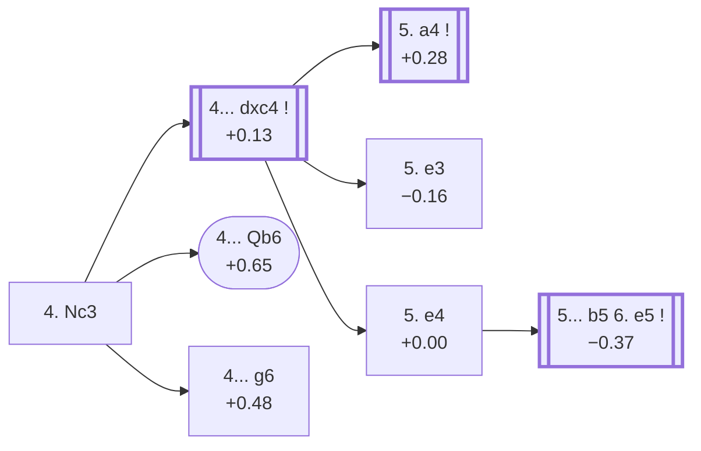

<a name="_TOP_"></a>

# D15 Queen's Gambit Declined: Slav Defense, Three Knights Variation <br> 1. d4 d5 2. c4 c6 3. Nf3 Nf6 4. Nc3 #

Spun off from [D11's own "3... Nf6" card](https://github.com/onclemarcel/chess_flashcards/blob/main/d4_openings/D11_Slav_Defense_Modern_Line.md#_Nf6_) — masters' clear main try there (55.3%), already live-tagged its own code (`eco.md` leaves it unnamed at this exact node beyond "4.Nc3"; the live explorer independently names it the *Three Knights Variation*, three knights already developed). This is the move order that actually leads to the Semi-Slav and the main-line Slav Accepted.

### Overview

*Quick map of every move covered on this card — see the [shape key](https://github.com/onclemarcel/chess_flashcards/blob/main/start.md#content-diagram-optional) in start.md.*

<!-- content-diagram:start -->

<!-- content-diagram:end -->

<a name="_initial_move_"></a>

[](https://lichess.org/analysis/standard/rnbqkb1r/pp2pppp/2p2n2/3p4/2PP4/2N2N2/PP2PPPP/R1BQKB1R_b_KQkq_-_3_4)

*... 4. Nc3 — live-tagged the Three Knights Variation*

```
rnbqkb1r/pp2pppp/2p2n2/3p4/2PP4/2N2N2/PP2PPPP/R1BQKB1R b KQkq - 3 4
```

|  | +0.20 |
| --- | --- |

<!-- lichess-stats:start fen="rnbqkb1r/pp2pppp/2p2n2/3p4/2PP4/2N2N2/PP2PPPP/R1BQKB1R b KQkq - 3 4" db="lichess,masters" speeds="bullet,blitz" ratings="1800,2000,2200,2500" moves="6" -->
| Move | Online | W/D/B | Masters | W/D/B | |
| :--- | ---: | :--- | ---: | :--- | :-- |
| e6 | 4.6 M (33.3%) | ⬜⬜⬜⬜⬜🟫⬛⬛⬛⬛ 51/5/44 | 32 k (51.7%) | ⬜⬜⬜🟫🟫🟫🟫🟫🟫⬛ 26/59/15 |  |
| Bf5 | 2.6 M (18.6%) | ⬜⬜⬜⬜⬜🟫⬛⬛⬛⬛ 51/5/44 | 306 (0.5%) | ⬜⬜⬜⬜⬜🟫🟫🟫🟫⬛ 44/42/14 |  |
| Bg4 | 2.1 M (15.2%) | ⬜⬜⬜⬜⬜🟫⬛⬛⬛⬛ 53/5/43 | 0 | — | ⚠ |
| dxc4 | 2.0 M (14.3%) | ⬜⬜⬜⬜⬜⬛⬛⬛⬛⬛ 48/5/46 | 18 k (29.2%) | ⬜⬜⬜🟫🟫🟫🟫🟫⬛⬛ 35/45/20 |  |
| g6 | 1.1 M (8.1%) | ⬜⬜⬜⬜⬜🟫⬛⬛⬛⬛ 51/6/44 | 1.2 k (1.9%) | ⬜⬜⬜⬜⬜🟫🟫🟫🟫⬛ 47/41/13 |  |
| a6 | 1.0 M (7.2%) | ⬜⬜⬜⬜⬜🟫⬛⬛⬛⬛ 48/6/46 | 10 k (16.4%) | ⬜⬜⬜⬜🟫🟫🟫🟫⬛⬛ 35/45/20 |  |
| Qb6 | 0 | — | 195 (0.3%) | ⬜⬜⬜⬜🟫🟫🟫🟫⬛⬛ 45/41/15 |  |

*Online: bullet/blitz, 1800+ — 13.9 M games. Masters: 63 k games. [Open in the explorer](https://lichess.org/analysis/standard/rnbqkb1r/pp2pppp/2p2n2/3p4/2PP4/2N2N2/PP2PPPP/R1BQKB1R_b_KQkq_-_3_4#explorer) — updated 2026-09-06*
<!-- lichess-stats:end -->

Masters' clear main try is **4... e6** (51.7%), the **Semi-Slav**, combining the Slav's ... c6 with the QGD's ... e6 for one of the most solid, heavily analysed structures in all of chess — its own extensive body of theory, an entirely different ECO range (D43-D49), not covered further here. **4... dxc4** (29.2%) is the real second choice, the *Slav Accepted*; **4... Qb6** (the *Suechting Variation*) and **4... g6** (the *Schlechter Variation*) are both genuine minority tries.

* **4... e6** (51.7% masters): the Semi-Slav — its own ECO range (D43-D49), not covered further here.
* [**4... dxc4**](#_Accepted_) (29.2% masters): the *Slav Accepted* — covered below.
* [**4... Qb6**](#_Suechting_) (0.3% masters): the *Suechting Variation* — covered below.
* [**4... g6**](#_Schlechter_) (1.9% masters): the *Schlechter Variation* — covered below.

[*Back to TOP*](#_TOP_)

---

<a name="_Suechting_"></a>

## 4... Qb6 — Suechting Variation

[](https://lichess.org/analysis/standard/rnb1kb1r/pp2pppp/1qp2n2/3p4/2PP4/2N2N2/PP2PPPP/R1BQKB1R_w_KQkq_-_4_5)

*... 4... Qb6 — Suechting Variation*

```
rnb1kb1r/pp2pppp/1qp2n2/3p4/2PP4/2N2N2/PP2PPPP/R1BQKB1R w KQkq - 4 5
```

|  | +0.65 |
| --- | --- |

`eco.md`'s name matches the live explorer here. Pressures b2 and d4 immediately rather than developing — a genuine database rarity (0.3% masters), and Stockfish already prefers White by more than half a pawn. Not built out further here (backlog).

[*Back to 4. Nc3*](#_initial_move_)
[*Back to TOP*](#_TOP_)

---

<a name="_Schlechter_"></a>

## 4... g6 — Schlechter Variation

[](https://lichess.org/analysis/standard/rnbqkb1r/pp2pp1p/2p2np1/3p4/2PP4/2N2N2/PP2PPPP/R1BQKB1R_w_KQkq_-_0_5)

*... 4... g6 — Schlechter Variation*

```
rnbqkb1r/pp2pp1p/2p2np1/3p4/2PP4/2N2N2/PP2PPPP/R1BQKB1R w KQkq - 0 5
```

|  | +0.48 |
| --- | --- |

`eco.md`'s name matches the live explorer here. Fianchettoes the king's bishop rather than committing the c8-bishop first — a real, if secondary, try (1.9% masters). Not built out further here (backlog).

[*Back to 4. Nc3*](#_initial_move_)
[*Back to TOP*](#_TOP_)

---

<a name="_Accepted_"></a>

## 4... dxc4 — Slav Accepted

[](https://lichess.org/analysis/standard/rnbqkb1r/pp2pppp/2p2n2/8/2pP4/2N2N2/PP2PPPP/R1BQKB1R_w_KQkq_-_0_5)

*... 4... dxc4 — live-tagged the Two Knights Attack*

```
rnbqkb1r/pp2pppp/2p2n2/8/2pP4/2N2N2/PP2PPPP/R1BQKB1R w KQkq - 0 5
```

|  | +0.13 |
| --- | --- |

<!-- lichess-stats:start fen="rnbqkb1r/pp2pppp/2p2n2/8/2pP4/2N2N2/PP2PPPP/R1BQKB1R w KQkq - 0 5" db="lichess,masters" speeds="bullet,blitz" ratings="1800,2000,2200,2500" moves="5" -->
| Move | Online | W/D/B | Masters | W/D/B | |
| :--- | ---: | :--- | ---: | :--- | :-- |
| a4 | 1.1 M (46.6%) | ⬜⬜⬜⬜⬜🟫⬛⬛⬛⬛ 48/6/46 | 17 k (90.7%) | ⬜⬜⬜🟫🟫🟫🟫🟫⬛⬛ 35/46/19 |  |
| e4 | 547 k (22.7%) | ⬜⬜⬜⬜⬜⬛⬛⬛⬛⬛ 50/4/46 | 886 (4.7%) | ⬜⬜⬜⬜🟫🟫🟫⬛⬛⬛ 39/29/33 |  |
| e3 | 263 k (10.9%) | ⬜⬜⬜⬜⬜⬛⬛⬛⬛⬛ 50/5/46 | 577 (3.1%) | ⬜⬜⬜🟫🟫🟫🟫⬛⬛⬛ 32/43/25 |  |
| Bg5 | 254 k (10.6%) | ⬜⬜⬜⬜⬜⬛⬛⬛⬛⬛ 50/4/46 | 0 | — | ⚠ |
| g3 | 99 k (4.1%) | ⬜⬜⬜⬜⬜🟫⬛⬛⬛⬛ 53/5/43 | 158 (0.8%) | ⬜⬜⬜⬜🟫🟫🟫⬛⬛⬛ 41/32/27 |  |
| Ne5 | 0 | — | 114 (0.6%) | ⬜⬜⬜⬜🟫🟫🟫⬛⬛⬛ 36/32/32 |  |

*Online: bullet/blitz, 1800+ — 2.4 M games. Masters: 19 k games. [Open in the explorer](https://lichess.org/analysis/standard/rnbqkb1r/pp2pppp/2p2n2/8/2pP4/2N2N2/PP2PPPP/R1BQKB1R_w_KQkq_-_0_5#explorer) — updated 2026-09-06*
<!-- lichess-stats:end -->

`eco.md` leaves this bare tabiya named only "Slav Defence Accepted"; the live explorer independently names it the ***Two Knights Attack*** — a real name divergence. Black grabs the c4 pawn, banking on regaining it or holding it with ... b5. Masters' overwhelming reply is **5. a4** (90.7%), preventing ... b5 outright — its own code, [D16](https://github.com/onclemarcel/chess_flashcards/blob/main/d4_openings/D16_Slav_Defense_Alapin_Variation.md). Two real secondary tries stay D15: **5. e3** (the *Alekhine Variation*) and **5. e4** (the *Slav Gambit*, live-tagged the *Geller Gambit*).

* **5. a4** (+0.28, 90.7% masters): the *Alapin Variation* — its own code, [D16](https://github.com/onclemarcel/chess_flashcards/blob/main/d4_openings/D16_Slav_Defense_Alapin_Variation.md).
* [**5. e3**](#_Alekhine15_): the *Alekhine Variation* — covered below.
* [**5. e4**](#_SlavGambit_): the *Slav Gambit* (live-tagged the *Geller Gambit*) — covered below.

[*Back to 4. Nc3*](#_initial_move_)
[*Back to TOP*](#_TOP_)

---

<a name="_Alekhine15_"></a>

## 5. e3 — Alekhine Variation

[](https://lichess.org/analysis/standard/rnbqkb1r/pp2pppp/2p2n2/8/2pP4/2N1PN2/PP3PPP/R1BQKB1R_b_KQkq_-_0_5)

*... 5. e3 — Alekhine Variation*

```
rnbqkb1r/pp2pppp/2p2n2/8/2pP4/2N1PN2/PP3PPP/R1BQKB1R b KQkq - 0 5
```

|  | −0.16 |
| --- | --- |

`eco.md`'s name matches the live explorer here — and note the reuse: D10 (much shallower, 3.Nc3 dxc4 4.e4) also carries an "Alekhine"-named line, live-tagged there the *Slav Gambit, Alekhine Attack*, a completely unrelated position. Simply prepares Bxc4 without committing to a4 first, at the cost of letting Black hold the pawn a move longer with ... b5. Not built out further here (backlog).

[*Back to 4... dxc4*](#_Accepted_)
[*Back to TOP*](#_TOP_)

---

<a name="_SlavGambit_"></a>

## 5. e4 — Slav Gambit

[](https://lichess.org/analysis/standard/rnbqkb1r/pp2pppp/2p2n2/8/2pPP3/2N2N2/PP3PPP/R1BQKB1R_b_KQkq_e3_0_5)

*... 5. e4 — live-tagged the Geller Gambit*

```
rnbqkb1r/pp2pppp/2p2n2/8/2pPP3/2N2N2/PP3PPP/R1BQKB1R b KQkq e3 0 5
```

|  | +0.00 |
| --- | --- |

<!-- lichess-stats:start fen="rnbqkb1r/pp2pppp/2p2n2/8/2pPP3/2N2N2/PP3PPP/R1BQKB1R b KQkq e3 0 5" db="lichess,masters" speeds="bullet,blitz" ratings="1800,2000,2200,2500" moves="4" -->
| Move | Online | W/D/B | Masters | W/D/B | |
| :--- | ---: | :--- | ---: | :--- | :-- |
| b5 | 351 k (62.2%) | ⬜⬜⬜⬜⬜⬛⬛⬛⬛⬛ 47/4/49 | 867 (97.6%) | ⬜⬜⬜⬜🟫🟫🟫⬛⬛⬛ 39/28/33 |  |
| Bg4 | 113 k (20.1%) | ⬜⬜⬜⬜⬜⬛⬛⬛⬛⬛ 51/4/45 | 17 (1.9%) | — |  |
| e6 | 54 k (9.6%) | ⬜⬜⬜⬜⬜⬜⬛⬛⬛⬛ 58/4/38 | 3 (0.3%) | — | ⚠ |
| g6 | 21 k (3.6%) | ⬜⬜⬜⬜⬜⬜⬛⬛⬛⬛ 56/4/40 | 0 | — | ⚠ |
| c5 | 0 | — | 1 (0.1%) | — |  |

*Online: bullet/blitz, 1800+ — 565 k games. Masters: 888 games. [Open in the explorer](https://lichess.org/analysis/standard/rnbqkb1r/pp2pppp/2p2n2/8/2pPP3/2N2N2/PP3PPP/R1BQKB1R_b_KQkq_e3_0_5#explorer) — updated 2026-09-06*
<!-- lichess-stats:end -->

`eco.md` calls this the *Slav Gambit*; the live explorer independently names it the ***Geller Gambit*** — a real name divergence, and a name-reuse besides: `eco.md`'s own one-ply-deeper entry (6.e5) is separately named the *Tolush-Geller Gambit*, reusing "Geller" for a second time at an adjacent node. Sacrifices a further tempo/structure for open lines rather than simply regaining the c4 pawn quietly. Masters' overwhelming reply is **5... b5** (97.6%), holding onto both extra pawns.

* [**5... b5 6. e5**](#_TolushGeller_) (−0.37, 97.6% masters): the *Tolush-Geller Gambit* — covered below.

[*Back to 4... dxc4*](#_Accepted_)
[*Back to TOP*](#_TOP_)

---

<a name="_TolushGeller_"></a>

## 5... b5 6. e5 — Tolush-Geller Gambit

[](https://lichess.org/analysis/standard/rnbqkb1r/p3pppp/2p2n2/1p2P3/2pP4/2N2N2/PP3PPP/R1BQKB1R_b_KQkq_-_0_6)

*... 6. e5 — Tolush-Geller Gambit*

```
rnbqkb1r/p3pppp/2p2n2/1p2P3/2pP4/2N2N2/PP3PPP/R1BQKB1R b KQkq - 0 6
```

|  | −0.37 |
| --- | --- |

`eco.md`'s name matches the live explorer here. Pushes past the attacked f6-knight rather than recapturing on b5, offering a further pawn for a strong attack — Stockfish already favours Black by more than a third of a pawn, reflecting this gambit's reputation as objectively dubious but practically dangerous. Not built out further here (backlog).

[*Back to 5. e4*](#_SlavGambit_)
[*Back to TOP*](#_TOP_)
