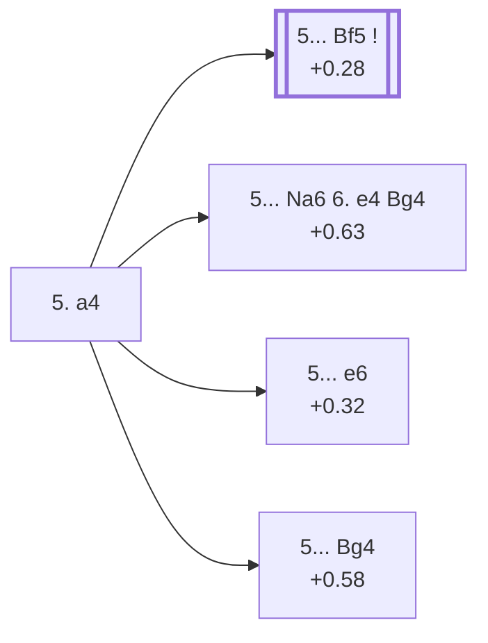

<a name="_TOP_"></a>

# D16 Queen's Gambit Declined: Slav Defense, Alapin Variation <br> 1. d4 d5 2. c4 c6 3. Nf3 Nf6 4. Nc3 dxc4 5. a4 #

Spun off from [D15's own "4... dxc4" card](https://github.com/onclemarcel/chess_flashcards/blob/main/d4_openings/D15_Slav_Defense_Three_Knights.md#_Accepted_) — masters' overwhelming reply there (90.7%), already live-tagged its own code. Rather than chase the c4 pawn, White simply rules out ... b5 forever, accepting a slightly weakened queenside in exchange for a free tempo.

### Overview

*Quick map of every move covered on this card — see the [shape key](https://github.com/onclemarcel/chess_flashcards/blob/main/start.md#content-diagram-optional) in start.md.*

<!-- content-diagram:start -->

<!-- content-diagram:end -->

<a name="_initial_move_"></a>

[](https://lichess.org/analysis/standard/rnbqkb1r/pp2pppp/2p2n2/8/P1pP4/2N2N2/1P2PPPP/R1BQKB1R_b_KQkq_a3_0_5)

*... 5. a4 — Alapin Variation*

```
rnbqkb1r/pp2pppp/2p2n2/8/P1pP4/2N2N2/1P2PPPP/R1BQKB1R b KQkq a3 0 5
```

|  | +0.28 |
| --- | --- |

<!-- lichess-stats:start fen="rnbqkb1r/pp2pppp/2p2n2/8/P1pP4/2N2N2/1P2PPPP/R1BQKB1R b KQkq a3 0 5" db="lichess,masters" speeds="bullet,blitz" ratings="1800,2000,2200,2500" moves="6" -->
| Move | Online | W/D/B | Masters | W/D/B | |
| :--- | ---: | :--- | ---: | :--- | :-- |
| Bf5 | 730 k (62.2%) | ⬜⬜⬜⬜⬜⬛⬛⬛⬛⬛ 47/7/47 | 14 k (82.2%) | ⬜⬜⬜🟫🟫🟫🟫🟫⬛⬛ 34/47/19 |  |
| Bg4 | 139 k (11.9%) | ⬜⬜⬜⬜⬜⬛⬛⬛⬛⬛ 49/5/47 | 822 (4.8%) | ⬜⬜⬜⬜🟫🟫🟫🟫⬛⬛ 43/35/22 |  |
| e6 | 98 k (8.4%) | ⬜⬜⬜⬜⬜🟫⬛⬛⬛⬛ 53/5/42 | 1.4 k (8.1%) | ⬜⬜⬜🟫🟫🟫🟫🟫⬛⬛ 29/53/19 |  |
| Nd5 | 56 k (4.8%) | ⬜⬜⬜⬜⬜⬛⬛⬛⬛⬛ 50/5/45 | 0 | — | ⚠ |
| g6 | 33 k (2.8%) | ⬜⬜⬜⬜⬜🟫⬛⬛⬛⬛ 53/5/42 | 0 | — | ⚠ |
| a6 | 23 k (1.9%) | ⬜⬜⬜⬜⬜⬜⬛⬛⬛⬛ 56/4/40 | 0 | — | ⚠ |
| Na6 | 0 | — | 511 (3.0%) | ⬜⬜⬜⬜🟫🟫🟫⬛⬛⬛ 42/33/25 |  |
| a5 | 0 | — | 195 (1.1%) | ⬜⬜⬜⬜🟫🟫🟫🟫⬛⬛ 39/39/22 |  |
| c5 | 0 | — | 73 (0.4%) | ⬜⬜⬜⬜⬜🟫🟫🟫⬛⬛ 49/27/23 |  |

*Online: bullet/blitz, 1800+ — 1.2 M games. Masters: 17 k games. [Open in the explorer](https://lichess.org/analysis/standard/rnbqkb1r/pp2pppp/2p2n2/8/P1pP4/2N2N2/1P2PPPP/R1BQKB1R_b_KQkq_a3_0_5#explorer) — updated 2026-09-06*
<!-- lichess-stats:end -->

`eco.md`'s name matches the live explorer here. Masters' clear main try is **5... Bf5** (+0.28, 82.2%), developing the bishop before ... e6 shuts it in — its own code, the *Czech Defence*, [D17](https://github.com/onclemarcel/chess_flashcards/blob/main/d4_openings/D17_Slav_Defense_Czech_Defence.md). Three real secondary tries stay D16: **5... Na6 6. e4 Bg4** (+0.63, heading for the *Smyslov Variation*), **5... e6** (the *Soultanbeieff Variation*), and **5... Bg4** (the *Steiner Variation*).

* **5... Bf5** (82.2% masters): the *Czech Defence* — its own code, [D17](https://github.com/onclemarcel/chess_flashcards/blob/main/d4_openings/D17_Slav_Defense_Czech_Defence.md).
* [**5... Na6 6. e4 Bg4**](#_Smyslov_) (3.0% masters): the *Smyslov Variation* — covered below.
* [**5... e6**](#_Soultanbeieff_) (8.1% masters): the *Soultanbeieff Variation* — covered below.
* [**5... Bg4**](#_Steiner_) (4.8% masters): the *Steiner Variation* — covered below.

[*Back to TOP*](#_TOP_)

---

<a name="_Smyslov_"></a>

## 5... Na6 6. e4 Bg4 — Smyslov Variation

[](https://lichess.org/analysis/standard/r2qkb1r/pp2pppp/n1p2n2/8/P1pPP1b1/2N2N2/1P3PPP/R1BQKB1R_w_KQkq_-_1_7)

*... 6... Bg4 — Smyslov Variation*

```
r2qkb1r/pp2pppp/n1p2n2/8/P1pPP1b1/2N2N2/1P3PPP/R1BQKB1R w KQkq - 1 7
```

|  | +0.63 |
| --- | --- |

`eco.md`'s name matches the live explorer here. Named for former world champion Vasily Smyslov: the knight heads to a6-b4/c5 while the bishop pins White's f3-knight, rather than developing to the more standard d7 square. A genuine minority try (3.0% masters). Not built out further here (backlog).

[*Back to 5. a4*](#_initial_move_)
[*Back to TOP*](#_TOP_)

---

<a name="_Soultanbeieff_"></a>

## 5... e6 — Soultanbeieff Variation

[](https://lichess.org/analysis/standard/rnbqkb1r/pp3ppp/2p1pn2/8/P1pP4/2N2N2/1P2PPPP/R1BQKB1R_w_KQkq_-_0_6)

*... 5... e6 — Soultanbeieff Variation*

```
rnbqkb1r/pp3ppp/2p1pn2/8/P1pP4/2N2N2/1P2PPPP/R1BQKB1R w KQkq - 0 6
```

|  | +0.32 |
| --- | --- |

`eco.md`'s name matches the live explorer here. Delays committing the light-squared bishop at all, ready to meet e4 with ... Bxc4 or ... c5 instead — a real secondary try (8.1% masters). Not built out further here (backlog).

[*Back to 5. a4*](#_initial_move_)
[*Back to TOP*](#_TOP_)

---

<a name="_Steiner_"></a>

## 5... Bg4 — Steiner Variation

[](https://lichess.org/analysis/standard/rn1qkb1r/pp2pppp/2p2n2/8/P1pP2b1/2N2N2/1P2PPPP/R1BQKB1R_w_KQkq_-_1_6)

*... 5... Bg4 — Steiner Variation*

```
rn1qkb1r/pp2pppp/2p2n2/8/P1pP2b1/2N2N2/1P2PPPP/R1BQKB1R w KQkq - 1 6
```

|  | +0.58 |
| --- | --- |

`eco.md`'s name matches the live explorer here. Pins the f3-knight immediately rather than developing the bishop to f5 — a real secondary try (4.8% masters). Not built out further here (backlog).

[*Back to 5. a4*](#_initial_move_)
[*Back to TOP*](#_TOP_)
