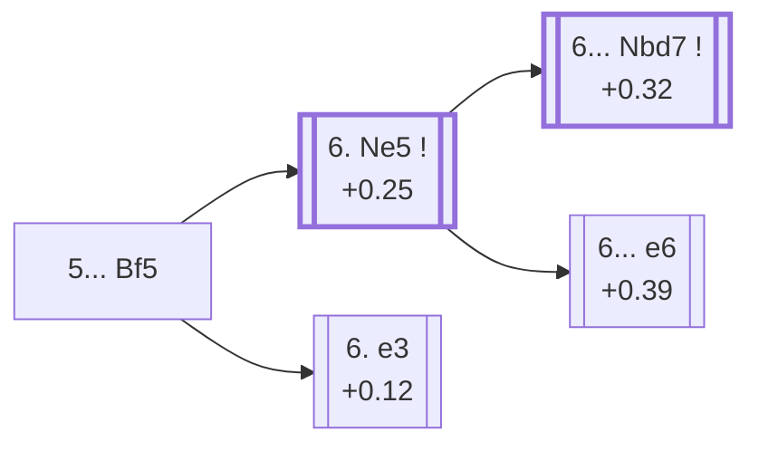

<a name="_TOP_"></a>

# D17 Queen's Gambit Declined: Slav Defense, Czech Defence <br> 1. d4 d5 2. c4 c6 3. Nf3 Nf6 4. Nc3 dxc4 5. a4 Bf5 #

Spun off from [D16's own "5. a4" card](https://github.com/onclemarcel/chess_flashcards/blob/main/d4_openings/D16_Slav_Defense_Alapin_Variation.md#_initial_move_) — masters' clear main try there (82.2%), already live-tagged its own code (the live explorer's own spelling is *Czech Variation*, a minor label difference from `eco.md`'s "Czech Defence"). Develops the light-squared bishop outside the pawn chain before ... e6 can shut it in — the single defining idea of the whole classical Slav.

### Overview

*Quick map of every move covered on this card — see the [shape key](https://github.com/onclemarcel/chess_flashcards/blob/main/start.md#content-diagram-optional) in start.md.*

<!-- content-diagram:start -->

<!-- content-diagram:end -->

<a name="_initial_move_"></a>

[](https://lichess.org/analysis/standard/rn1qkb1r/pp2pppp/2p2n2/5b2/P1pP4/2N2N2/1P2PPPP/R1BQKB1R_w_KQkq_-_1_6)

*... 5... Bf5 — live-tagged the Czech Variation*

```
rn1qkb1r/pp2pppp/2p2n2/5b2/P1pP4/2N2N2/1P2PPPP/R1BQKB1R w KQkq - 1 6
```

|  | +0.28 |
| --- | --- |

<!-- lichess-stats:start fen="rn1qkb1r/pp2pppp/2p2n2/5b2/P1pP4/2N2N2/1P2PPPP/R1BQKB1R w KQkq - 1 6" db="lichess,masters" speeds="bullet,blitz" ratings="1800,2000,2200,2500" moves="4" -->
| Move | Online | W/D/B | Masters | W/D/B | |
| :--- | ---: | :--- | ---: | :--- | :-- |
| e3 | 372 k (50.6%) | ⬜⬜⬜⬜🟫⬛⬛⬛⬛⬛ 46/7/47 | 6.2 k (43.8%) | ⬜⬜⬜🟫🟫🟫🟫🟫⬛⬛ 31/49/20 |  |
| Ne5 | 201 k (27.3%) | ⬜⬜⬜⬜⬜🟫⬛⬛⬛⬛ 47/7/46 | 6.6 k (47.0%) | ⬜⬜⬜🟫🟫🟫🟫🟫⬛⬛ 35/47/18 |  |
| Bg5 | 74 k (10.0%) | ⬜⬜⬜⬜⬜⬛⬛⬛⬛⬛ 46/5/49 | 0 | — | ⚠ |
| Bf4 | 33 k (4.5%) | ⬜⬜⬜⬜⬜⬛⬛⬛⬛⬛ 47/6/47 | 0 | — | ⚠ |
| Nh4 | 0 | — | 1.3 k (8.9%) | ⬜⬜⬜⬜🟫🟫🟫🟫⬛⬛ 42/38/20 |  |
| g3 | 0 | — | 33 (0.2%) | ⬜⬜⬜🟫🟫🟫⬛⬛⬛⬛ 27/30/42 |  |

*Online: bullet/blitz, 1800+ — 736 k games. Masters: 14 k games. [Open in the explorer](https://lichess.org/analysis/standard/rn1qkb1r/pp2pppp/2p2n2/5b2/P1pP4/2N2N2/1P2PPPP/R1BQKB1R_w_KQkq_-_1_6#explorer) — updated 2026-09-15*
<!-- lichess-stats:end -->

Masters split almost evenly between **6. Ne5** (47.0%), grabbing the c4 pawn back immediately and heading for the *Krause Attack*, and **6. e3** (+0.12, 43.8%), the quieter developing move that escalates to its own code, the *Classical System*, [D18](https://github.com/onclemarcel/chess_flashcards/blob/main/d4_openings/D18_Slav_Defense_Dutch_Variation.md).

* [**6. Ne5**](#_Krause_) (47.0% masters): the *Krause Attack* — covered below.
* **6. e3** (43.8% masters): its own code, [D18](https://github.com/onclemarcel/chess_flashcards/blob/main/d4_openings/D18_Slav_Defense_Dutch_Variation.md).

[*Back to TOP*](#_TOP_)

---

<a name="_Krause_"></a>

## 6. Ne5 — Krause Attack

[](https://lichess.org/analysis/standard/rn1qkb1r/pp2pppp/2p2n2/4Nb2/P1pP4/2N5/1P2PPPP/R1BQKB1R_b_KQkq_-_2_6)

*... 6. Ne5 — Krause Attack*

```
rn1qkb1r/pp2pppp/2p2n2/4Nb2/P1pP4/2N5/1P2PPPP/R1BQKB1R b KQkq - 2 6
```

|  | +0.25 |
| --- | --- |

<!-- lichess-stats:start fen="rn1qkb1r/pp2pppp/2p2n2/4Nb2/P1pP4/2N5/1P2PPPP/R1BQKB1R b KQkq - 2 6" db="lichess,masters" speeds="bullet,blitz" ratings="1800,2000,2200,2500" moves="4" -->
| Move | Online | W/D/B | Masters | W/D/B | |
| :--- | ---: | :--- | ---: | :--- | :-- |
| Nbd7 | 107 k (52.8%) | ⬜⬜⬜⬜⬜🟫⬛⬛⬛⬛ 47/7/47 | 4.6 k (68.9%) | ⬜⬜⬜🟫🟫🟫🟫🟫⬛⬛ 34/49/17 |  |
| e6 | 77 k (38.0%) | ⬜⬜⬜⬜⬜🟫⬛⬛⬛⬛ 49/6/44 | 1.7 k (25.1%) | ⬜⬜⬜⬜🟫🟫🟫🟫⬛⬛ 39/45/16 |  |
| Na6 | 13 k (6.6%) | ⬜⬜⬜⬜⬛⬛⬛⬛⬛⬛ 38/6/57 | 351 (5.3%) | ⬜⬜⬜⬜🟫🟫🟫⬛⬛⬛ 38/34/28 |  |
| c5 | 1.3 k (0.7%) | ⬜⬜⬜⬜🟫⬛⬛⬛⬛⬛ 40/7/53 | 19 (0.3%) | — |  |

*Online: bullet/blitz, 1800+ — 202 k games. Masters: 6.6 k games. [Open in the explorer](https://lichess.org/analysis/standard/rn1qkb1r/pp2pppp/2p2n2/4Nb2/P1pP4/2N5/1P2PPPP/R1BQKB1R_b_KQkq_-_2_6#explorer) — updated 2026-09-15*
<!-- lichess-stats:end -->

`eco.md`'s name matches the live explorer here. Recovers the c4 pawn at once rather than developing further first. Masters' clear main try is **6... Nbd7** (+0.32, 68.9%), challenging the e5 knight directly — the exact continuation escalating to the *Carlsbad Variation* below.

* [**6... Nbd7 7. Nxc4 Qc7 8. g3 e5**](#_Carlsbad_) (68.9% masters): the *Carlsbad Variation* — covered below.
* [**6... e6**](#_Wiesbaden_) (25.1% masters): the *Wiesbaden Variation* — covered below.

[*Back to 5... Bf5*](#_initial_move_)
[*Back to TOP*](#_TOP_)

---

<a name="_Carlsbad_"></a>

## 6... Nbd7 7. Nxc4 Qc7 8. g3 e5 — Carlsbad Variation

[](https://lichess.org/analysis/standard/r3kb1r/ppqn1ppp/2p2n2/4pb2/P1NP4/2N3P1/1P2PP1P/R1BQKB1R_w_KQkq_e6_0_9)

*... 8... e5 — Carlsbad Variation*

```
r3kb1r/ppqn1ppp/2p2n2/4pb2/P1NP4/2N3P1/1P2PP1P/R1BQKB1R w KQkq e6 0 9
```

|  | +0.32 |
| --- | --- |

`eco.md`'s name matches the live explorer here. Black strikes back in the centre at once, rather than finishing development first, in this heavily analysed tabiya named for the 1929 Carlsbad tournament. Not built out further here (backlog).

[*Back to 6. Ne5*](#_Krause_)
[*Back to TOP*](#_TOP_)

---

<a name="_Wiesbaden_"></a>

## 6... e6 — Wiesbaden Variation

[](https://lichess.org/analysis/standard/rn1qkb1r/pp3ppp/2p1pn2/4Nb2/P1pP4/2N5/1P2PPPP/R1BQKB1R_w_KQkq_-_0_7)

*... 6... e6 — Wiesbaden Variation*

```
rn1qkb1r/pp3ppp/2p1pn2/4Nb2/P1pP4/2N5/1P2PPPP/R1BQKB1R w KQkq - 0 7
```

|  | +0.39 |
| --- | --- |

`eco.md`'s name matches the live explorer here. Solidifies the centre rather than immediately challenging the e5 knight — a real secondary try (25.1% masters). Not built out further here (backlog).

[*Back to 6. Ne5*](#_Krause_)
[*Back to TOP*](#_TOP_)
