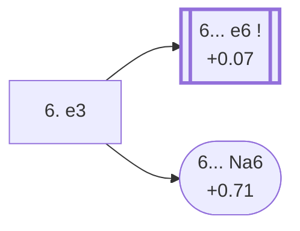

<a name="_TOP_"></a>

# D18 Queen's Gambit Declined: Slav Defense, Dutch Variation <br> 1. d4 d5 2. c4 c6 3. Nf3 Nf6 4. Nc3 dxc4 5. a4 Bf5 6. e3 #

Spun off from [D17's own "5... Bf5" card](https://github.com/onclemarcel/chess_flashcards/blob/main/d4_openings/D17_Slav_Defense_Czech_Defence.md#_initial_move_) — masters' near-even second choice there (43.8%), already live-tagged its own code. `eco.md` calls this the *Dutch Variation* (the first of three D10-D19 entries independently reusing that exact name at three different depths — a genuine eco.md-internal name reuse); the live explorer instead tags it the ***Classical System***. Simply finishes development before deciding how to recover the c4 pawn.

### Overview

*Quick map of every move covered on this card — see the [shape key](https://github.com/onclemarcel/chess_flashcards/blob/main/start.md#content-diagram-optional) in start.md.*

<!-- content-diagram:start -->

<!-- content-diagram:end -->

<a name="_initial_move_"></a>

[](https://lichess.org/analysis/standard/rn1qkb1r/pp2pppp/2p2n2/5b2/P1pP4/2N1PN2/1P3PPP/R1BQKB1R_b_KQkq_-_0_6)

*... 6. e3 — live-tagged the Czech Variation, Classical System*

```
rn1qkb1r/pp2pppp/2p2n2/5b2/P1pP4/2N1PN2/1P3PPP/R1BQKB1R b KQkq - 0 6
```

|  | +0.12 |
| --- | --- |

<!-- lichess-stats:start fen="rn1qkb1r/pp2pppp/2p2n2/5b2/P1pP4/2N1PN2/1P3PPP/R1BQKB1R b KQkq - 0 6" db="lichess,masters" speeds="bullet,blitz" ratings="1800,2000,2200,2500" moves="4" -->
| Move | Online | W/D/B | Masters | W/D/B | |
| :--- | ---: | :--- | ---: | :--- | :-- |
| e6 | 348 k (92.6%) | ⬜⬜⬜⬜🟫⬛⬛⬛⬛⬛ 46/7/47 | 6.1 k (98.0%) | ⬜⬜⬜🟫🟫🟫🟫🟫⬛⬛ 31/49/20 |  |
| Nbd7 | 14 k (3.6%) | ⬜⬜⬜⬜⬜🟫⬛⬛⬛⬛ 49/6/45 | 40 (0.6%) | ⬜⬜⬜⬜🟫🟫🟫🟫⬛⬛ 42/35/22 |  |
| Na6 | 4.5 k (1.2%) | ⬜⬜⬜⬜🟫⬛⬛⬛⬛⬛ 43/6/50 | 24 (0.4%) | ⬜⬜⬜⬜⬜⬜🟫⬛⬛⬛ 62/4/33 |  |
| Bd3 | 3.5 k (0.9%) | ⬜⬜⬜⬜⬜🟫⬛⬛⬛⬛ 48/7/44 | 51 (0.8%) | ⬜⬜⬜🟫🟫🟫🟫🟫🟫⬛ 29/59/12 |  |

*Online: bullet/blitz, 1800+ — 376 k games. Masters: 6.2 k games. [Open in the explorer](https://lichess.org/analysis/standard/rn1qkb1r/pp2pppp/2p2n2/5b2/P1pP4/2N1PN2/1P3PPP/R1BQKB1R_b_KQkq_-_0_6#explorer) — updated 2026-09-06*
<!-- lichess-stats:end -->

Masters' near-unanimous reply is **6... e6** (+0.07 a few moves later, 98.0%), reaching the deep, heavily analysed *Dutch Variation* tabiya one ply further — its own code, [D19](https://github.com/onclemarcel/chess_flashcards/blob/main/d4_openings/D19_Slav_Defense_Dutch_Variation_Main_Line.md). The rare **6... Na6** stays D18 as the *Lasker Variation*.

* **6... e6**: its own code, [D19](https://github.com/onclemarcel/chess_flashcards/blob/main/d4_openings/D19_Slav_Defense_Dutch_Variation_Main_Line.md).
* [**6... Na6**](#_Lasker_): the *Lasker Variation* — covered below.

[*Back to TOP*](#_TOP_)

---

<a name="_Lasker_"></a>

## 6... Na6 — Dutch, Lasker Variation

[](https://lichess.org/analysis/standard/r2qkb1r/pp2pppp/n1p2n2/5b2/P1pP4/2N1PN2/1P3PPP/R1BQKB1R_w_KQkq_-_1_7)

*... 6... Na6 — Lasker Variation*

```
r2qkb1r/pp2pppp/n1p2n2/5b2/P1pP4/2N1PN2/1P3PPP/R1BQKB1R w KQkq - 1 7
```

|  | +0.71 |
| --- | --- |

`eco.md`'s name matches the live explorer here — named for World Champion Emanuel Lasker, not to be confused with the unrelated Lasker Trap in D08's own Albin Countergambit tree. Develops the knight toward b4/c5 rather than solidifying with ... e6, and Stockfish already prefers White by more than half a pawn here. A genuine database rarity (0.4% masters). Not built out further here (backlog).

[*Back to 6. e3*](#_initial_move_)
[*Back to TOP*](#_TOP_)
