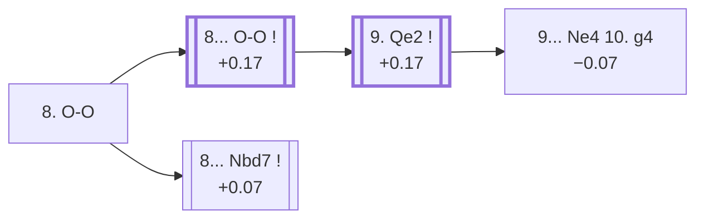

<a name="_TOP_"></a>

# D19 Queen's Gambit Declined: Slav Defense, Dutch Variation, Main Line <br> 1. d4 d5 2. c4 c6 3. Nf3 Nf6 4. Nc3 dxc4 5. a4 Bf5 6. e3 e6 7. Bxc4 Bb4 8. O-O #

Spun off from [D18's own "6. e3" card](https://github.com/onclemarcel/chess_flashcards/blob/main/d4_openings/D18_Slav_Defense_Dutch_Variation.md#_initial_move_) — masters' near-unanimous reply there (98.0%), already live-tagged its own code. `eco.md` reuses the name *Dutch Variation* here for the second and third time at three different depths (D18, and this card's own root and its "Main line" child both carry it too) — a genuine eco.md-internal name reuse; the live explorer instead tags this whole tree the ***Czech Variation, Dutch Variation***.

### Overview

*Quick map of every move covered on this card — see the [shape key](https://github.com/onclemarcel/chess_flashcards/blob/main/start.md#content-diagram-optional) in start.md.*

<!-- content-diagram:start -->

<!-- content-diagram:end -->

<a name="_initial_move_"></a>

[](https://lichess.org/analysis/standard/rn1qk2r/pp3ppp/2p1pn2/5b2/PbBP4/2N1PN2/1P3PPP/R1BQ1RK1_b_kq_-_2_8)

*... 8. O-O — live-tagged the Czech Variation, Dutch Variation*

```
rn1qk2r/pp3ppp/2p1pn2/5b2/PbBP4/2N1PN2/1P3PPP/R1BQ1RK1 b kq - 2 8
```

|  | +0.07 |
| --- | --- |

<!-- lichess-stats:start fen="rn1qk2r/pp3ppp/2p1pn2/5b2/PbBP4/2N1PN2/1P3PPP/R1BQ1RK1 b kq - 2 8" db="lichess,masters" speeds="bullet,blitz" ratings="1800,2000,2200,2500" moves="3" -->
| Move | Online | W/D/B | Masters | W/D/B | |
| :--- | ---: | :--- | ---: | :--- | :-- |
| O-O | 162 k (66.4%) | ⬜⬜⬜⬜🟫⬛⬛⬛⬛⬛ 45/7/48 | 2.7 k (50.6%) | ⬜⬜⬜🟫🟫🟫🟫🟫⬛⬛ 31/49/20 |  |
| Nbd7 | 69 k (28.4%) | ⬜⬜⬜⬜🟫⬛⬛⬛⬛⬛ 45/7/48 | 2.6 k (48.8%) | ⬜⬜⬜🟫🟫🟫🟫🟫⬛⬛ 30/50/19 |  |
| a5 | 5.0 k (2.0%) | ⬜⬜⬜⬜⬜🟫⬛⬛⬛⬛ 48/6/45 | 12 (0.2%) | — |  |

*Online: bullet/blitz, 1800+ — 244 k games. Masters: 5.4 k games. [Open in the explorer](https://lichess.org/analysis/standard/rn1qk2r/pp3ppp/2p1pn2/5b2/PbBP4/2N1PN2/1P3PPP/R1BQ1RK1_b_kq_-_2_8#explorer) — updated 2026-09-06*
<!-- lichess-stats:end -->

A genuinely scattered choice, matching the "system opening" flavour this whole tabiya has by now: masters split almost exactly between **8... O-O** (+0.17, 50.6%) and **8... Nbd7** (+0.07, 48.8%). Only the castling reply escalates one ply further into its own named code.

* [**8... O-O 9. Qe2**](#_MainLine_) (50.6% masters): the *Main Line* — covered below.
* **8... Nbd7** (48.8% masters): a real, equally-common alternative — not covered further here (backlog).

[*Back to TOP*](#_TOP_)

---

<a name="_MainLine_"></a>

## 8... O-O 9. Qe2 — Main Line

[](https://lichess.org/analysis/standard/rn1q1rk1/pp3ppp/2p1pn2/5b2/PbBP4/2N1PN2/1P2QPPP/R1B2RK1_b_-_-_4_9)

*... 9. Qe2 — Main Line*

```
rn1q1rk1/pp3ppp/2p1pn2/5b2/PbBP4/2N1PN2/1P2QPPP/R1B2RK1 b - - 4 9
```

|  | +0.17 |
| --- | --- |

<!-- lichess-stats:start fen="rn1q1rk1/pp3ppp/2p1pn2/5b2/PbBP4/2N1PN2/1P2QPPP/R1B2RK1 b - - 4 9" db="lichess,masters" speeds="bullet,blitz" ratings="1800,2000,2200,2500" moves="5" -->
| Move | Online | W/D/B | Masters | W/D/B | |
| :--- | ---: | :--- | ---: | :--- | :-- |
| Nbd7 | 23 k (34.6%) | ⬜⬜⬜⬜⬜🟫⬛⬛⬛⬛ 47/7/46 | 684 (40.3%) | ⬜⬜⬜🟫🟫🟫🟫🟫⬛⬛ 30/53/18 |  |
| Bg6 | 21 k (31.0%) | ⬜⬜⬜⬜🟫⬛⬛⬛⬛⬛ 41/9/50 | 629 (37.0%) | ⬜⬜⬜🟫🟫🟫🟫🟫⬛⬛ 27/50/23 |  |
| Bg4 | 9.4 k (14.1%) | ⬜⬜⬜⬜🟫⬛⬛⬛⬛⬛ 45/7/48 | 171 (10.1%) | ⬜⬜⬜🟫🟫🟫🟫🟫⬛⬛ 33/47/19 |  |
| Ne4 | 5.6 k (8.4%) | ⬜⬜⬜⬜🟫⬛⬛⬛⬛⬛ 45/9/46 | 171 (10.1%) | ⬜⬜⬜🟫🟫🟫🟫🟫⬛⬛ 29/53/18 |  |
| a5 | 1.9 k (2.9%) | ⬜⬜⬜⬜⬜🟫⬛⬛⬛⬛ 50/6/44 | 0 | — | ⚠ |
| h6 | 0 | — | 30 (1.8%) | ⬜⬜⬜🟫🟫🟫🟫🟫🟫⬛ 27/60/13 |  |

*Online: bullet/blitz, 1800+ — 66 k games. Masters: 1.7 k games. [Open in the explorer](https://lichess.org/analysis/standard/rn1q1rk1/pp3ppp/2p1pn2/5b2/PbBP4/2N1PN2/1P2QPPP/R1B2RK1_b_-_-_4_9#explorer) — updated 2026-09-06*
<!-- lichess-stats:end -->

`eco.md`'s name matches the live explorer here (compounded with its own "Classical System" ancestor tag). Prepares Rd1/e4 without committing the rook yet. Masters split between **9... Nbd7** (40.3%), **9... Bg6** (37.0%), **9... Bg4** (10.1%), and **9... Ne4** (10.1%) — a genuinely scattered choice at this depth. Only the last escalates to its own named line.

* [**9... Ne4 10. g4**](#_Saemisch_) (−0.07, 10.1% masters): the *Saemisch Variation* — covered below.

[*Back to 8. O-O*](#_initial_move_)
[*Back to TOP*](#_TOP_)

---

<a name="_Saemisch_"></a>

## 9... Ne4 10. g4 — Saemisch Variation

[](https://lichess.org/analysis/standard/rn1q1rk1/pp3ppp/2p1p3/5b2/PbBPn1P1/2N1PN2/1P2QP1P/R1B2RK1_b_-_g3_0_10)

*... 10. g4 — Saemisch Variation*

```
rn1q1rk1/pp3ppp/2p1p3/5b2/PbBPn1P1/2N1PN2/1P2QP1P/R1B2RK1 b - g3 0 10
```

|  | −0.07 |
| --- | --- |

`eco.md`'s name matches the live explorer here — named for grandmaster Fritz Sämisch, who lends his name to sharp, space-grabbing lines across several openings (see also the Sämisch Variation in the King's Indian and Nimzo-Indian). Lunges for kingside space, hitting the bishop and knight in one go, rather than a slower positional approach; Stockfish now gives Black a very slight nod. Not built out further here (backlog).

[*Back to 8... O-O 9. Qe2*](#_MainLine_)
[*Back to TOP*](#_TOP_)
