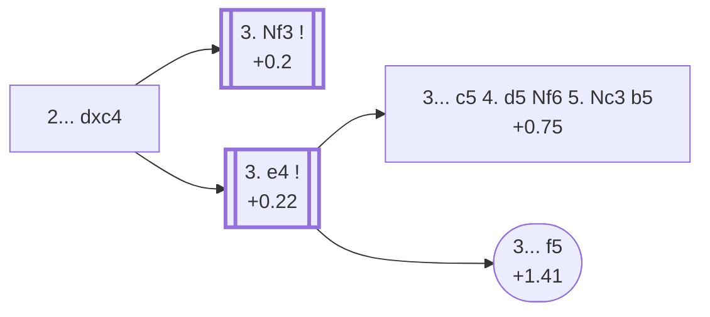

<a name="_TOP_"></a>

# D20 Queen's Gambit Accepted <br> 1. d4 d5 2. c4 dxc4 #

Spun off from [D06's own "2... dxc4" card](https://github.com/onclemarcel/chess_flashcards/blob/main/d4_openings/D06_Queens_Gambit.md#_c4_) — a real minority try there (11.8% masters), already live-tagged its own code. Black grabs the pawn immediately: not a "true" gambit, since White regains the pawn with an extra tempo in almost every practical line.

### Overview

*Quick map of every move covered on this card — see the [shape key](https://github.com/onclemarcel/chess_flashcards/blob/main/start.md#content-diagram-optional) in start.md.*

<!-- content-diagram:start -->

<!-- content-diagram:end -->

<a name="_initial_move_"></a>

[](https://lichess.org/analysis/standard/rnbqkbnr/ppp1pppp/8/8/2pP4/8/PP2PPPP/RNBQKBNR_w_KQkq_-_0_3)

*... 1. d4 d5 2. c4 dxc4 — Queen's Gambit Accepted*

```
rnbqkbnr/ppp1pppp/8/8/2pP4/8/PP2PPPP/RNBQKBNR w KQkq - 0 3
```

|  | +0.3 |
| --- | --- |

<!-- lichess-stats:start fen="rnbqkbnr/ppp1pppp/8/8/2pP4/8/PP2PPPP/RNBQKBNR w KQkq - 0 3" db="lichess,masters" speeds="bullet,blitz" ratings="1800,2000,2200,2500" moves="5" -->
| Move | Online | W/D/B | Masters | W/D/B | |
| :--- | ---: | :--- | ---: | :--- | :-- |
| Nc3 | 5.3 M (44.4%) | ⬜⬜⬜⬜⬜🟫⬛⬛⬛⬛ 52/4/44 | 391 (1.6%) | ⬜⬜⬜🟫🟫🟫🟫⬛⬛⬛ 30/35/35 |  |
| e3 | 2.5 M (21.0%) | ⬜⬜⬜⬜⬜🟫⬛⬛⬛⬛ 53/5/42 | 5.0 k (20.7%) | ⬜⬜⬜🟫🟫🟫🟫🟫⬛⬛ 33/49/19 |  |
| Nf3 | 2.0 M (16.6%) | ⬜⬜⬜⬜⬜🟫⬛⬛⬛⬛ 54/5/41 | 13 k (51.7%) | ⬜⬜⬜🟫🟫🟫🟫🟫⬛⬛ 31/49/19 |  |
| e4 | 1.8 M (15.5%) | ⬜⬜⬜⬜⬜🟫⬛⬛⬛⬛ 52/5/43 | 6.2 k (25.6%) | ⬜⬜⬜⬜🟫🟫🟫🟫⬛⬛ 35/45/20 |  |
| Qa4+ | 110 k (0.9%) | ⬜⬜⬜⬜⬜⬛⬛⬛⬛⬛ 50/5/45 | 82 (0.3%) | ⬜⬜🟫🟫🟫🟫⬛⬛⬛⬛ 26/37/38 |  |

*Online: bullet/blitz, 1800+ — 11.8 M games. Masters: 24 k games. [Open in the explorer](https://lichess.org/analysis/standard/rnbqkbnr/ppp1pppp/8/8/2pP4/8/PP2PPPP/RNBQKBNR_w_KQkq_-_0_3#explorer) — updated 2026-09-14*
<!-- lichess-stats:end -->

Masters' clear favourite is **3. Nf3** (+0.2, 51.7%) — its own code, [D21](https://github.com/onclemarcel/chess_flashcards/blob/main/d4_openings/D21_Queens_Gambit_Accepted_Normal_Variation.md). **3. e4** (+0.22, 25.6%) grabs the centre at once and stays D20. **3. e3** (20.7% masters) is a real secondary try too, but carries no code of its own anywhere in this D20-D29 range and is not covered further here.

* **3. Nf3** (51.7% masters): its own code, [D21](https://github.com/onclemarcel/chess_flashcards/blob/main/d4_openings/D21_Queens_Gambit_Accepted_Normal_Variation.md).
* [**3. e4**](#_e4_) (25.6% masters): covered below.
* **3. e3** (20.7% masters): a real secondary try, uncoded in this range — not covered further here.

[*Back to TOP*](#_TOP_)

---

<a name="_e4_"></a>

## 3. e4 — Saduleto Variation

[](https://lichess.org/analysis/standard/rnbqkbnr/ppp1pppp/8/8/2pPP3/8/PP3PPP/RNBQKBNR_b_KQkq_e3_0_3)

*... 3. e4 — live-tagged the Saduleto Variation*

```
rnbqkbnr/ppp1pppp/8/8/2pPP3/8/PP3PPP/RNBQKBNR b KQkq e3 0 3
```

|  | +0.22 |
| --- | --- |

<!-- lichess-stats:start fen="rnbqkbnr/ppp1pppp/8/8/2pPP3/8/PP3PPP/RNBQKBNR b KQkq e3 0 3" db="lichess,masters" speeds="bullet,blitz" ratings="1800,2000,2200,2500" moves="6" -->
| Move | Online | W/D/B | Masters | W/D/B | |
| :--- | ---: | :--- | ---: | :--- | :-- |
| e5 | 488 k (26.7%) | ⬜⬜⬜⬜⬜⬛⬛⬛⬛⬛ 49/5/46 | 2.6 k (41.3%) | ⬜⬜⬜🟫🟫🟫🟫🟫⬛⬛ 30/55/15 |  |
| Nf6 | 337 k (18.4%) | ⬜⬜⬜⬜⬜🟫⬛⬛⬛⬛ 52/4/43 | 1.7 k (27.0%) | ⬜⬜⬜⬜🟫🟫🟫🟫⬛⬛ 38/39/23 |  |
| e6 | 295 k (16.1%) | ⬜⬜⬜⬜⬜⬜⬛⬛⬛⬛ 56/4/40 | 12 (0.2%) | — |  |
| b5 | 206 k (11.3%) | ⬜⬜⬜⬜⬜⬛⬛⬛⬛⬛ 50/4/45 | 492 (7.9%) | ⬜⬜⬜🟫🟫🟫🟫🟫⬛⬛ 31/47/22 |  |
| Nc6 | 171 k (9.3%) | ⬜⬜⬜⬜⬜🟫⬛⬛⬛⬛ 52/5/43 | 914 (14.7%) | ⬜⬜⬜⬜🟫🟫🟫⬛⬛⬛ 40/34/26 |  |
| c5 | 129 k (7.0%) | ⬜⬜⬜⬜⬜🟫⬛⬛⬛⬛ 51/5/43 | 541 (8.7%) | ⬜⬜⬜⬜🟫🟫🟫🟫⬛⬛ 44/35/20 |  |

*Online: bullet/blitz, 1800+ — 1.8 M games. Masters: 6.2 k games. [Open in the explorer](https://lichess.org/analysis/standard/rnbqkbnr/ppp1pppp/8/8/2pPP3/8/PP3PPP/RNBQKBNR_b_KQkq_e3_0_3#explorer) — updated 2026-09-14*
<!-- lichess-stats:end -->

`eco.md` leaves this bare tabiya named only "3.e4"; the live explorer independently names it the ***Saduleto Variation*** — a real name divergence. Grabs the full centre immediately, banking on development speed to justify it. Masters' clear main try is **3... e5** (41.3%), striking back at once — not covered further here (backlog). Two real minority tries carry their own `eco.md` names: **3... c5** (8.7%) and **3... f5** (a genuine database rarity, 0 masters games).

* [**3... c5 4. d5 Nf6 5. Nc3 b5**](#_Linares_) (+0.75, 8.7% masters): the *Linares Variation* — covered below.
* [**3... f5**](#_Schwartz_): the *Schwartz Defense* — covered below.

[*Back to TOP*](#_TOP_)

---

<a name="_Linares_"></a>

## 3... c5 4. d5 Nf6 5. Nc3 b5 — Linares Variation

[](https://lichess.org/analysis/standard/rnbqkb1r/p3pppp/5n2/1ppP4/2p1P3/2N5/PP3PPP/R1BQKBNR_w_KQkq_b6_0_6)

*... 5... b5 — Linares Variation*

```
rnbqkb1r/p3pppp/5n2/1ppP4/2p1P3/2N5/PP3PPP/R1BQKBNR w KQkq b6 0 6
```

|  | +0.75 |
| --- | --- |

`eco.md`'s name matches the live explorer here. Black grabs central space with 3... c5 and, after White's own central d5 push, holds onto the extra c4 pawn a while longer with ... b5 rather than returning it. Masters' clear main try is **6. Bf4** (56.5%), developing before recapturing on c4. Not built out further here (backlog).

[*Back to 3. e4*](#_e4_)
[*Back to TOP*](#_TOP_)

---

<a name="_Schwartz_"></a>

## 3... f5 — Schwartz Defense

[](https://lichess.org/analysis/standard/rnbqkbnr/ppp1p1pp/8/5p2/2pPP3/8/PP3PPP/RNBQKBNR_w_KQkq_f6_0_4)

*... 3... f5 — Schwartz Defense*

```
rnbqkbnr/ppp1p1pp/8/5p2/2pPP3/8/PP3PPP/RNBQKBNR w KQkq f6 0 4
```

|  | +1.41 |
| --- | --- |

`eco.md` spells this the *Schwartz Defence*; the live explorer spells it *Schwartz Defense* (US/UK spelling only, not a substantive divergence). A genuine database rarity (0 masters games in the sample) — Black counterattacks the e4 pawn immediately rather than developing, and Stockfish already gives White well over a pawn's worth of advantage. Not built out further here (backlog).

[*Back to 3. e4*](#_e4_)
[*Back to TOP*](#_TOP_)
