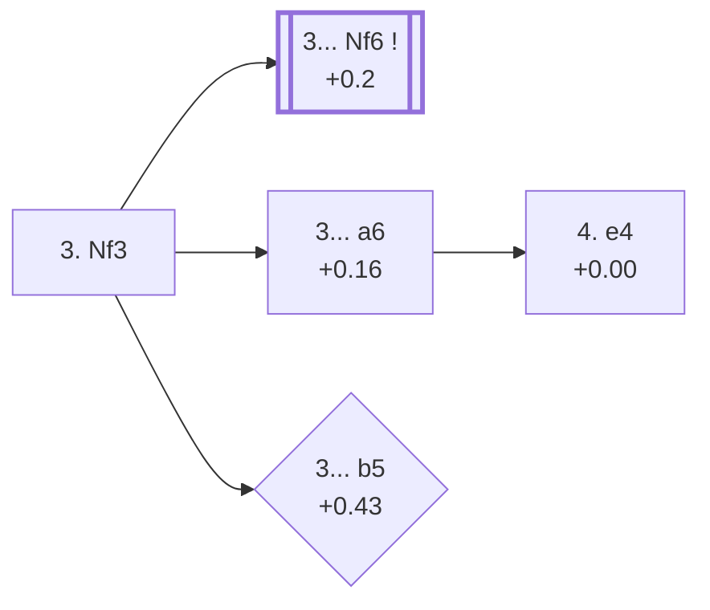

<a name="_TOP_"></a>

# D21 Queen's Gambit Accepted: Normal Variation <br> 1. d4 d5 2. c4 dxc4 3. Nf3 #

Spun off from [D20's own "2... dxc4" card](https://github.com/onclemarcel/chess_flashcards/blob/main/d4_openings/D20_Queens_Gambit_Accepted.md#_initial_move_) — masters' clear favourite there (51.7%), already live-tagged its own code. `eco.md` leaves this bare tabiya named only "3.Nf3"; the live explorer independently names it the ***Normal Variation*** — a name that recurs, unrelated, one ply further at D25's own 4.e3 node.

### Overview

*Quick map of every move covered on this card — see the [shape key](https://github.com/onclemarcel/chess_flashcards/blob/main/start.md#content-diagram-optional) in start.md.*

<!-- content-diagram:start -->

<!-- content-diagram:end -->

<a name="_initial_move_"></a>

[](https://lichess.org/analysis/standard/rnbqkbnr/ppp1pppp/8/8/2pP4/5N2/PP2PPPP/RNBQKB1R_b_KQkq_-_1_3)

*... 3. Nf3 — live-tagged the Normal Variation*

```
rnbqkbnr/ppp1pppp/8/8/2pP4/5N2/PP2PPPP/RNBQKB1R b KQkq - 1 3
```

|  | +0.2 |
| --- | --- |

<!-- lichess-stats:start fen="rnbqkbnr/ppp1pppp/8/8/2pP4/5N2/PP2PPPP/RNBQKB1R b KQkq - 1 3" db="lichess,masters" speeds="bullet,blitz" ratings="1800,2000,2200,2500" moves="5" -->
| Move | Online | W/D/B | Masters | W/D/B | |
| :--- | ---: | :--- | ---: | :--- | :-- |
| Nf6 | 786 k (40.1%) | ⬜⬜⬜⬜⬜🟫⬛⬛⬛⬛ 52/6/42 | 8.7 k (69.5%) | ⬜⬜⬜🟫🟫🟫🟫🟫⬛⬛ 32/49/18 |  |
| e6 | 254 k (13.0%) | ⬜⬜⬜⬜⬜⬜⬛⬛⬛⬛ 56/5/39 | 557 (4.4%) | ⬜⬜⬜🟫🟫🟫🟫🟫⬛⬛ 27/51/22 |  |
| c5 | 178 k (9.1%) | ⬜⬜⬜⬜⬜🟫⬛⬛⬛⬛ 51/6/43 | 831 (6.6%) | ⬜⬜⬜🟫🟫🟫🟫🟫⬛⬛ 32/49/19 |  |
| c6 | 134 k (6.8%) | ⬜⬜⬜⬜⬜⬜⬛⬛⬛⬛ 55/4/41 | 305 (2.4%) | ⬜⬜⬜🟫🟫🟫🟫⬛⬛⬛ 31/38/31 |  |
| a6 | 113 k (5.7%) | ⬜⬜⬜⬜⬜🟫⬛⬛⬛⬛ 49/6/45 | 2.1 k (16.5%) | ⬜⬜⬜🟫🟫🟫🟫🟫⬛⬛ 28/51/21 |  |

*Online: bullet/blitz, 1800+ — 2.0 M games. Masters: 13 k games. [Open in the explorer](https://lichess.org/analysis/standard/rnbqkbnr/ppp1pppp/8/8/2pP4/5N2/PP2PPPP/RNBQKB1R_b_KQkq_-_1_3#explorer) — updated 2026-09-09*
<!-- lichess-stats:end -->

Masters' clear favourite is **3... Nf6** (+0.2, 69.5%) — its own code, [D23](https://github.com/onclemarcel/chess_flashcards/blob/main/d4_openings/D23_Queens_Gambit_Accepted.md). **3... a6** (+0.16, 16.5%), the *Alekhine Defense*, is a real second choice — its own code, [D22](https://github.com/onclemarcel/chess_flashcards/blob/main/d4_openings/D22_Queens_Gambit_Accepted_Alekhine_Defense.md). **3... b5** stays D21, a genuine database rarity live-tagged the *Slav Gambit*.

* **3... Nf6** (69.5% masters): its own code, [D23](https://github.com/onclemarcel/chess_flashcards/blob/main/d4_openings/D23_Queens_Gambit_Accepted.md).
* **3... a6** (16.5% masters): the *Alekhine Defense* — its own code, [D22](https://github.com/onclemarcel/chess_flashcards/blob/main/d4_openings/D22_Queens_Gambit_Accepted_Alekhine_Defense.md).
* [**3... b5**](#_Ericson_) (0.1% masters): the *Ericson Variation* — covered below.

[*Back to TOP*](#_TOP_)

---

<a name="_Ericson_"></a>

## 3... b5 — Ericson Variation

[](https://lichess.org/analysis/standard/rnbqkbnr/p1p1pppp/8/1p6/2pP4/5N2/PP2PPPP/RNBQKB1R_w_KQkq_b6_0_4)

*... 3... b5 — live-tagged the Slav Gambit*

```
rnbqkbnr/p1p1pppp/8/1p6/2pP4/5N2/PP2PPPP/RNBQKB1R w KQkq b6 0 4
```

|  | +0.43 |
| --- | --- |

`eco.md` calls this the *Ericson Variation*; the live explorer independently names it the ***Slav Gambit*** — a real, striking name divergence, since `eco.md`'s own D15 entry down the entirely unrelated 4.Nc3 dxc4 5.e4 line is separately titled "Slav Gambit" too (live-tagged there the *Geller Gambit* instead) — the name "Slav Gambit" is effectively used by one source or the other at two completely different D-series positions. Holds onto the extra pawn at once rather than developing — a genuine blitz trap: barely played at masters level (0.1%) but a real online choice (3.8%, nearly 40× its masters share), the classic profile of a "natural-looking" move nobody has studied much below the top. Not built out further here (backlog).

[*Back to 3. Nf3*](#_initial_move_)
[*Back to TOP*](#_TOP_)

---

<a name="_BorisenkoFurman_"></a>

## 3... a6 4. e4 — Alekhine Defense, Borisenko-Furman Variation

[](https://lichess.org/analysis/standard/rnbqkbnr/1pp1pppp/p7/8/2pPP3/5N2/PP3PPP/RNBQKB1R_b_KQkq_e3_0_4)

*... 4. e4 — Borisenko-Furman Variation*

```
rnbqkbnr/1pp1pppp/p7/8/2pPP3/5N2/PP3PPP/RNBQKB1R b KQkq e3 0 4
```

|  | +0.00 |
| --- | --- |

`eco.md`'s name matches the live explorer here. Rather than the quieter 4. e3 (the Alekhine Defense's own main line, [D22](https://github.com/onclemarcel/chess_flashcards/blob/main/d4_openings/D22_Queens_Gambit_Accepted_Alekhine_Defense.md)), White grabs the full centre immediately. Masters' overwhelming reply is **4... b5** (93.1%), holding the extra pawn. Not built out further here (backlog).

[*Back to 3. Nf3*](#_initial_move_)
[*Back to TOP*](#_TOP_)
