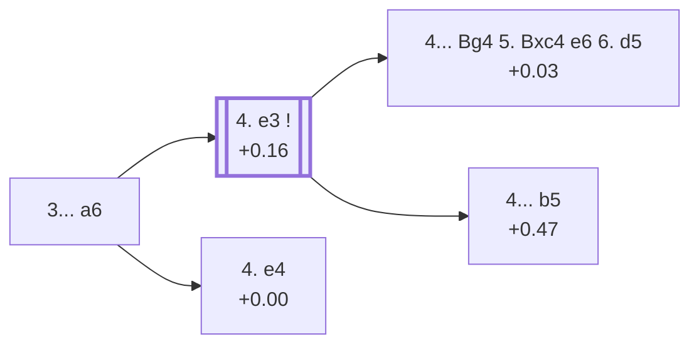

<a name="_TOP_"></a>

# D22 Queen's Gambit Accepted: Alekhine Defense <br> 1. d4 d5 2. c4 dxc4 3. Nf3 a6 #

Spun off from [D21's own "3. Nf3" card](https://github.com/onclemarcel/chess_flashcards/blob/main/d4_openings/D21_Queens_Gambit_Accepted_Normal_Variation.md#_initial_move_) — a real second choice there (16.5% masters), already live-tagged its own code. Named for World Champion Alexander Alekhine: Black prepares ... b5 to hold the extra pawn without allowing White's own a4 in reply.

### Overview

*Quick map of every move covered on this card — see the [shape key](https://github.com/onclemarcel/chess_flashcards/blob/main/start.md#content-diagram-optional) in start.md.*

<!-- content-diagram:start -->

<!-- content-diagram:end -->

<a name="_initial_move_"></a>

[](https://lichess.org/analysis/standard/rnbqkbnr/1pp1pppp/p7/8/2pP4/5N2/PP2PPPP/RNBQKB1R_w_KQkq_-_0_4)

*... 3... a6 — Alekhine Defense*

```
rnbqkbnr/1pp1pppp/p7/8/2pP4/5N2/PP2PPPP/RNBQKB1R w KQkq - 0 4
```

|  | +0.16 |
| --- | --- |

<!-- lichess-stats:start fen="rnbqkbnr/1pp1pppp/p7/8/2pP4/5N2/PP2PPPP/RNBQKB1R w KQkq - 0 4" db="lichess,masters" speeds="bullet,blitz" ratings="1800,2000,2200,2500" moves="5" -->
| Move | Online | W/D/B | Masters | W/D/B | |
| :--- | ---: | :--- | ---: | :--- | :-- |
| e3 | 44 k (35.9%) | ⬜⬜⬜⬜⬜🟫⬛⬛⬛⬛ 50/7/42 | 1.7 k (80.6%) | ⬜⬜⬜🟫🟫🟫🟫🟫⬛⬛ 28/53/19 |  |
| a4 | 41 k (33.6%) | ⬜⬜⬜⬜⬜⬛⬛⬛⬛⬛ 48/6/46 | 264 (12.6%) | ⬜⬜⬜🟫🟫🟫🟫⬛⬛⬛ 27/43/30 |  |
| Nc3 | 13 k (10.7%) | ⬜⬜⬜⬜⬜⬛⬛⬛⬛⬛ 50/4/46 | 25 (1.2%) | ⬜⬜⬜🟫🟫🟫🟫⬛⬛⬛ 28/40/32 |  |
| g3 | 11 k (8.8%) | ⬜⬜⬜⬜⬜🟫⬛⬛⬛⬛ 50/5/45 | 13 (0.6%) | — |  |
| e4 | 10 k (8.4%) | ⬜⬜⬜⬜⬜⬛⬛⬛⬛⬛ 48/5/47 | 102 (4.9%) | ⬜⬜⬜⬜🟫🟫🟫🟫⬛⬛ 37/37/25 |  |

*Online: bullet/blitz, 1800+ — 122 k games. Masters: 2.1 k games. [Open in the explorer](https://lichess.org/analysis/standard/rnbqkbnr/1pp1pppp/p7/8/2pP4/5N2/PP2PPPP/RNBQKB1R_w_KQkq_-_0_4#explorer) — updated 2026-09-15*
<!-- lichess-stats:end -->

`eco.md`'s name matches the live explorer here. Masters' clear main try is **4. e3** (80.6%), the quiet developing move that stays D22. **4. e4** (+0.00, 4.9%) grabs the centre at once instead, jumping back to its own code — the *Borisenko-Furman Variation*, [D21](https://github.com/onclemarcel/chess_flashcards/blob/main/d4_openings/D21_Queens_Gambit_Accepted_Normal_Variation.md#_BorisenkoFurman_).

* [**4. e3**](#_e3_) (80.6% masters): covered below.
* **4. e4** (4.9% masters): the *Borisenko-Furman Variation* — back to [D21](https://github.com/onclemarcel/chess_flashcards/blob/main/d4_openings/D21_Queens_Gambit_Accepted_Normal_Variation.md#_BorisenkoFurman_).

[*Back to TOP*](#_TOP_)

---

<a name="_e3_"></a>

## 4. e3

[](https://lichess.org/analysis/standard/rnbqkbnr/1pp1pppp/p7/8/2pP4/4PN2/PP3PPP/RNBQKB1R_b_KQkq_-_0_4)

*... 4. e3*

```
rnbqkbnr/1pp1pppp/p7/8/2pP4/4PN2/PP3PPP/RNBQKB1R b KQkq - 0 4
```

|  | +0.16 |
| --- | --- |

Prepares Bxc4 without committing further. Masters' clear main try transposes toward the main Alekhine Defense body (**4... b5**, holding the pawn), but two real minority tries carry their own `eco.md` names here: **4... Bg4** (heading for the *Alatortsev Variation*) and **4... b5** itself split further into the *Haberditz Variation*.

* [**4... Bg4 5. Bxc4 e6 6. d5**](#_Alatortsev_) (+0.03): the *Alatortsev Variation* — covered below.
* [**4... b5**](#_Haberditz_): the *Haberditz Variation* — covered below.

[*Back to 3... a6*](#_initial_move_)
[*Back to TOP*](#_TOP_)

---

<a name="_Alatortsev_"></a>

## 4... Bg4 5. Bxc4 e6 6. d5 — Alatortsev Variation

[](https://lichess.org/analysis/standard/rn1qkbnr/1pp2ppp/p3p3/3P4/2B3b1/4PN2/PP3PPP/RNBQK2R_b_KQkq_-_0_6)

*... 6. d5 — Alatortsev Variation*

```
rn1qkbnr/1pp2ppp/p3p3/3P4/2B3b1/4PN2/PP3PPP/RNBQK2R b KQkq - 0 6
```

|  | +0.03 |
| --- | --- |

`eco.md`'s name matches the live explorer here. Develops the bishop actively and strikes the centre with a quick d5 push rather than the calmer main line. A specific, deeply analysed try, dead level according to Stockfish. Not built out further here (backlog).

[*Back to 4. e3*](#_e3_)
[*Back to TOP*](#_TOP_)

---

<a name="_Haberditz_"></a>

## 4... b5 — Haberditz Variation

[](https://lichess.org/analysis/standard/rnbqkbnr/2p1pppp/p7/1p6/2pP4/4PN2/PP3PPP/RNBQKB1R_w_KQkq_b6_0_5)

*... 4... b5 — Haberditz Variation*

```
rnbqkbnr/2p1pppp/p7/1p6/2pP4/4PN2/PP3PPP/RNBQKB1R w KQkq b6 0 5
```

|  | +0.47 |
| --- | --- |

`eco.md`'s name matches the live explorer here. The Alekhine Defense's own main plan, holding the extra c4 pawn with ... b5 immediately. Not built out further here (backlog).

[*Back to 4. e3*](#_e3_)
[*Back to TOP*](#_TOP_)
