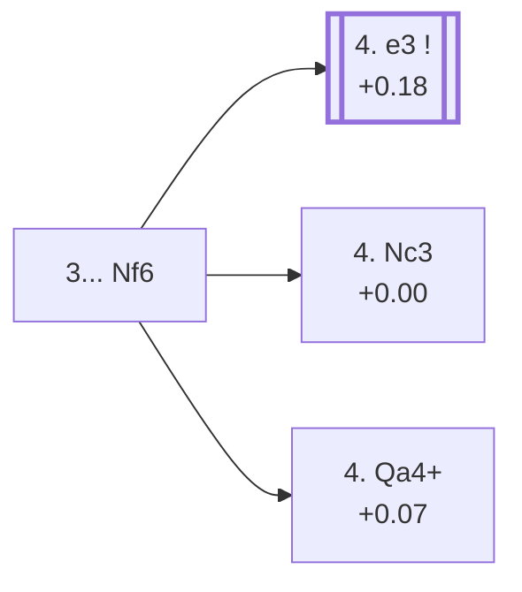

<a name="_TOP_"></a>

# D23 Queen's Gambit Accepted <br> 1. d4 d5 2. c4 dxc4 3. Nf3 Nf6 #

Spun off from [D21's own "3. Nf3" card](https://github.com/onclemarcel/chess_flashcards/blob/main/d4_openings/D21_Queens_Gambit_Accepted_Normal_Variation.md#_initial_move_) — masters' clear favourite there (69.5%), already live-tagged its own code. `eco.md` reuses the plain name "Queen's Gambit, Accepted" here, one ply deeper than the overall root card, D20 — not a repo bug, just `eco.md`'s own recurring habit of leaving well-travelled tabiyas generically named.

### Overview

*Quick map of every move covered on this card — see the [shape key](https://github.com/onclemarcel/chess_flashcards/blob/main/start.md#content-diagram-optional) in start.md.*

<!-- content-diagram:start -->

<!-- content-diagram:end -->

<a name="_initial_move_"></a>

[](https://lichess.org/analysis/standard/rnbqkb1r/ppp1pppp/5n2/8/2pP4/5N2/PP2PPPP/RNBQKB1R_w_KQkq_-_2_4)

*... 3... Nf6 — Queen's Gambit Accepted*

```
rnbqkb1r/ppp1pppp/5n2/8/2pP4/5N2/PP2PPPP/RNBQKB1R w KQkq - 2 4
```

|  | +0.28 |
| --- | --- |

<!-- lichess-stats:start fen="rnbqkb1r/ppp1pppp/5n2/8/2pP4/5N2/PP2PPPP/RNBQKB1R w KQkq - 2 4" db="lichess,masters" speeds="bullet,blitz" ratings="1800,2000,2200,2500" moves="5" -->
| Move | Online | W/D/B | Masters | W/D/B | |
| :--- | ---: | :--- | ---: | :--- | :-- |
| Nc3 | 791 k (41.0%) | ⬜⬜⬜⬜⬜🟫⬛⬛⬛⬛ 53/5/42 | 2.1 k (13.8%) | ⬜⬜⬜🟫🟫🟫🟫⬛⬛⬛ 35/39/26 |  |
| e3 | 766 k (39.7%) | ⬜⬜⬜⬜⬜🟫⬛⬛⬛⬛ 51/7/42 | 12 k (79.7%) | ⬜⬜⬜🟫🟫🟫🟫🟫⬛⬛ 31/51/17 |  |
| g3 | 192 k (9.9%) | ⬜⬜⬜⬜⬜🟫⬛⬛⬛⬛ 54/5/41 | 149 (1.0%) | ⬜⬜⬜🟫🟫🟫⬛⬛⬛⬛ 28/32/40 |  |
| Qa4+ | 55 k (2.9%) | ⬜⬜⬜⬜⬜🟫⬛⬛⬛⬛ 51/6/43 | 766 (5.1%) | ⬜⬜⬜⬜🟫🟫🟫🟫⬛⬛ 35/43/23 |  |
| Bg5 | 40 k (2.1%) | ⬜⬜⬜⬜⬜🟫⬛⬛⬛⬛ 51/5/44 | 0 | — | ⚠ |
| Na3 | 0 | — | 33 (0.2%) | ⬜⬜🟫🟫🟫🟫⬛⬛⬛⬛ 24/36/39 |  |

*Online: bullet/blitz, 1800+ — 1.9 M games. Masters: 15 k games. [Open in the explorer](https://lichess.org/analysis/standard/rnbqkb1r/ppp1pppp/5n2/8/2pP4/5N2/PP2PPPP/RNBQKB1R_w_KQkq_-_2_4#explorer) — updated 2026-09-07*
<!-- lichess-stats:end -->

Masters' clear main try is **4. e3** (+0.18, 79.7%), keeping the structure flexible — its own code, [D25](https://github.com/onclemarcel/chess_flashcards/blob/main/d4_openings/D25_Queens_Gambit_Accepted_Normal_Variation.md). **4. Nc3** (+0.00, 13.8%) develops naturally instead — its own code, [D24](https://github.com/onclemarcel/chess_flashcards/blob/main/d4_openings/D24_Queens_Gambit_Accepted_Showalter_Variation.md). **4. Qa4+** stays D23, a real secondary try (5.1%).

* **4. e3** (79.7% masters): its own code, [D25](https://github.com/onclemarcel/chess_flashcards/blob/main/d4_openings/D25_Queens_Gambit_Accepted_Normal_Variation.md).
* **4. Nc3** (13.8% masters): its own code, [D24](https://github.com/onclemarcel/chess_flashcards/blob/main/d4_openings/D24_Queens_Gambit_Accepted_Showalter_Variation.md).
* [**4. Qa4+**](#_Mannheim_) (5.1% masters): the *Mannheim Variation* — covered below.

[*Back to TOP*](#_TOP_)

---

<a name="_Mannheim_"></a>

## 4. Qa4+ — Mannheim Variation

[](https://lichess.org/analysis/standard/rnbqkb1r/ppp1pppp/5n2/8/Q1pP4/5N2/PP2PPPP/RNB1KB1R_b_KQkq_-_3_4)

*... 4. Qa4+ — Mannheim Variation*

```
rnbqkb1r/ppp1pppp/5n2/8/Q1pP4/5N2/PP2PPPP/RNB1KB1R b KQkq - 3 4
```

|  | +0.07 |
| --- | --- |

<!-- lichess-stats:start fen="rnbqkb1r/ppp1pppp/5n2/8/Q1pP4/5N2/PP2PPPP/RNB1KB1R b KQkq - 3 4" db="lichess,masters" speeds="bullet,blitz" ratings="1800,2000,2200,2500" moves="4" -->
| Move | Online | W/D/B | Masters | W/D/B | |
| :--- | ---: | :--- | ---: | :--- | :-- |
| c6 | 18 k (33.4%) | ⬜⬜⬜⬜⬜🟫⬛⬛⬛⬛ 50/7/43 | 321 (41.9%) | ⬜⬜⬜🟫🟫🟫🟫🟫⬛⬛ 32/45/23 |  |
| Bd7 | 15 k (28.1%) | ⬜⬜⬜⬜⬜⬜⬛⬛⬛⬛ 55/5/39 | 0 | — | ⚠ |
| Nc6 | 12 k (22.0%) | ⬜⬜⬜⬜⬜🟫⬛⬛⬛⬛ 50/6/44 | 206 (26.9%) | ⬜⬜⬜🟫🟫🟫🟫⬛⬛⬛ 31/43/26 |  |
| Nbd7 | 7.4 k (13.4%) | ⬜⬜⬜⬜🟫⬛⬛⬛⬛⬛ 45/8/47 | 201 (26.2%) | ⬜⬜⬜⬜🟫🟫🟫🟫⬛⬛ 41/38/21 |  |
| Qd7 | 0 | — | 23 (3.0%) | ⬜⬜⬜⬜⬜🟫🟫🟫🟫🟫 48/48/4 |  |

*Online: bullet/blitz, 1800+ — 55 k games. Masters: 766 games. [Open in the explorer](https://lichess.org/analysis/standard/rnbqkb1r/ppp1pppp/5n2/8/Q1pP4/5N2/PP2PPPP/RNB1KB1R_b_KQkq_-_3_4#explorer) — updated 2026-09-07*
<!-- lichess-stats:end -->

`eco.md`'s name matches the live explorer here. Regains the c4 pawn immediately with a check rather than developing first. Masters' clear main try is **4... c6** (41.9%), blocking the check while preparing ... b5. Not built out further here (backlog).

[*Back to 3... Nf6*](#_initial_move_)
[*Back to TOP*](#_TOP_)
