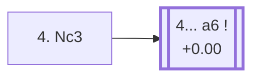

<a name="_TOP_"></a>

# D24 Queen's Gambit Accepted: Showalter Variation <br> 1. d4 d5 2. c4 dxc4 3. Nf3 Nf6 4. Nc3 #

Spun off from [D23's own "3... Nf6" card](https://github.com/onclemarcel/chess_flashcards/blob/main/d4_openings/D23_Queens_Gambit_Accepted.md#_initial_move_) — a real second choice there (13.8% masters), already live-tagged its own code. `eco.md` leaves this bare tabiya named only "4.Nc3"; the live explorer independently names it the ***Showalter Variation***, after 19th-century American champion Jackson Showalter.

### Overview

*Quick map of every move covered on this card — see the [shape key](https://github.com/onclemarcel/chess_flashcards/blob/main/start.md#content-diagram-optional) in start.md.*

<!-- content-diagram:start -->

<!-- content-diagram:end -->

<a name="_initial_move_"></a>

[](https://lichess.org/analysis/standard/rnbqkb1r/ppp1pppp/5n2/8/2pP4/2N2N2/PP2PPPP/R1BQKB1R_b_KQkq_-_3_4)

*... 4. Nc3 — live-tagged the Showalter Variation*

```
rnbqkb1r/ppp1pppp/5n2/8/2pP4/2N2N2/PP2PPPP/R1BQKB1R b KQkq - 3 4
```

|  | +0.00 |
| --- | --- |

<!-- lichess-stats:start fen="rnbqkb1r/ppp1pppp/5n2/8/2pP4/2N2N2/PP2PPPP/R1BQKB1R b KQkq - 3 4" db="lichess,masters" speeds="bullet,blitz" ratings="1800,2000,2200,2500" moves="5" -->
| Move | Online | W/D/B | Masters | W/D/B | |
| :--- | ---: | :--- | ---: | :--- | :-- |
| e6 | 535 k (33.9%) | ⬜⬜⬜⬜⬜🟫⬛⬛⬛⬛ 54/4/41 | 299 (14.1%) | ⬜⬜⬜⬜🟫🟫🟫🟫⬛⬛ 34/42/24 |  |
| a6 | 195 k (12.4%) | ⬜⬜⬜⬜⬜⬛⬛⬛⬛⬛ 47/5/48 | 1.0 k (48.4%) | ⬜⬜⬜🟫🟫🟫🟫⬛⬛⬛ 33/38/30 |  |
| Bg4 | 190 k (12.0%) | ⬜⬜⬜⬜⬜⬜⬛⬛⬛⬛ 54/4/41 | 0 | — | ⚠ |
| Nc6 | 130 k (8.3%) | ⬜⬜⬜⬜⬜⬜⬛⬛⬛⬛ 57/4/39 | 54 (2.6%) | ⬜⬜⬜🟫🟫🟫⬛⬛⬛⬛ 33/26/41 |  |
| c5 | 130 k (8.2%) | ⬜⬜⬜⬜⬜🟫⬛⬛⬛⬛ 50/6/44 | 256 (12.1%) | ⬜⬜⬜⬜🟫🟫🟫🟫⬛⬛ 42/38/20 |  |
| c6 | 0 | — | 383 (18.1%) | ⬜⬜⬜🟫🟫🟫🟫🟫⬛⬛ 31/46/22 |  |

*Online: bullet/blitz, 1800+ — 1.6 M games. Masters: 2.1 k games. [Open in the explorer](https://lichess.org/analysis/standard/rnbqkb1r/ppp1pppp/5n2/8/2pP4/2N2N2/PP2PPPP/R1BQKB1R_b_KQkq_-_3_4#explorer) — updated 2026-09-09*
<!-- lichess-stats:end -->

Masters' clear main try is **4... a6** (+0.00, 48.4%), heading for the *Bogolyubov Variation*.

* [**4... a6 5. e4**](#_Bogolyubov_) (48.4% masters): covered below.

[*Back to TOP*](#_TOP_)

---

<a name="_Bogolyubov_"></a>

## 4... a6 5. e4 — Bogolyubov Variation

[](https://lichess.org/analysis/standard/rnbqkb1r/1pp1pppp/p4n2/8/2pPP3/2N2N2/PP3PPP/R1BQKB1R_b_KQkq_e3_0_5)

*... 5. e4 — Bogolyubov Variation*

```
rnbqkb1r/1pp1pppp/p4n2/8/2pPP3/2N2N2/PP3PPP/R1BQKB1R b KQkq e3 0 5
```

|  | +0.00 |
| --- | --- |

`eco.md` spells this the *Bogolyubov Variation*; the live explorer spells it the ***Bogoljubow Defense*** — the same spelling divergence already seen at C91's own Bogoljubow-named line. Grabs the full centre before Black can consolidate the extra pawn — the same idea as D21's Borisenko-Furman Variation, a ply later. Masters' overwhelming reply is **5... b5** (98.0%), holding the pawn. Dead level according to Stockfish. Not built out further here (backlog).

[*Back to 4. Nc3*](#_initial_move_)
[*Back to TOP*](#_TOP_)
