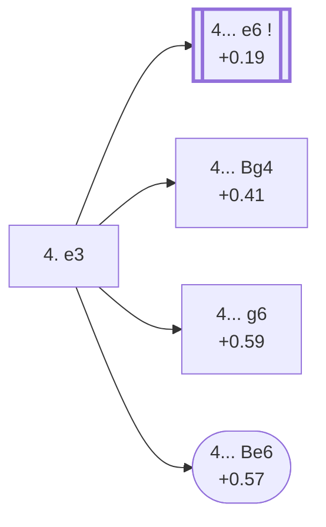

<a name="_TOP_"></a>

# D25 Queen's Gambit Accepted: Normal Variation <br> 1. d4 d5 2. c4 dxc4 3. Nf3 Nf6 4. e3 #

Spun off from [D23's own "3... Nf6" card](https://github.com/onclemarcel/chess_flashcards/blob/main/d4_openings/D23_Queens_Gambit_Accepted.md#_initial_move_) — masters' clear main try there (79.7%), already live-tagged its own code. `eco.md` leaves this bare tabiya named only "4.e3"; the live explorer independently names it the ***Normal Variation*** — reusing, unrelated, the exact name already carried by D21's own 3.Nf3 tabiya, three ply shallower.

### Overview

*Quick map of every move covered on this card — see the [shape key](https://github.com/onclemarcel/chess_flashcards/blob/main/start.md#content-diagram-optional) in start.md.*

<!-- content-diagram:start -->

<!-- content-diagram:end -->

<a name="_initial_move_"></a>

[](https://lichess.org/analysis/standard/rnbqkb1r/ppp1pppp/5n2/8/2pP4/4PN2/PP3PPP/RNBQKB1R_b_KQkq_-_0_4)

*... 4. e3 — live-tagged the Normal Variation*

```
rnbqkb1r/ppp1pppp/5n2/8/2pP4/4PN2/PP3PPP/RNBQKB1R b KQkq - 0 4
```

|  | +0.18 |
| --- | --- |

<!-- lichess-stats:start fen="rnbqkb1r/ppp1pppp/5n2/8/2pP4/4PN2/PP3PPP/RNBQKB1R b KQkq - 0 4" db="lichess,masters" speeds="bullet,blitz" ratings="1800,2000,2200,2500" moves="6" -->
| Move | Online | W/D/B | Masters | W/D/B | |
| :--- | ---: | :--- | ---: | :--- | :-- |
| e6 | 370 k (42.8%) | ⬜⬜⬜⬜⬜🟫⬛⬛⬛⬛ 50/8/43 | 8.4 k (70.0%) | ⬜⬜⬜🟫🟫🟫🟫🟫⬛⬛ 30/54/15 |  |
| Bg4 | 151 k (17.4%) | ⬜⬜⬜⬜⬜🟫⬛⬛⬛⬛ 51/6/43 | 1.8 k (15.0%) | ⬜⬜⬜⬜🟫🟫🟫🟫⬛⬛ 35/44/21 |  |
| a6 | 64 k (7.4%) | ⬜⬜⬜⬜⬜🟫⬛⬛⬛⬛ 47/8/45 | 810 (6.7%) | ⬜⬜⬜🟫🟫🟫🟫🟫⬛⬛ 29/48/23 |  |
| c5 | 63 k (7.3%) | ⬜⬜⬜⬜⬜🟫⬛⬛⬛⬛ 51/7/43 | 225 (1.9%) | ⬜⬜⬜🟫🟫🟫🟫🟫⬛⬛ 35/48/16 |  |
| b5 | 51 k (5.8%) | ⬜⬜⬜⬜⬜🟫⬛⬛⬛⬛ 55/5/40 | 296 (2.5%) | ⬜⬜⬜🟫🟫🟫🟫⬛⬛⬛ 33/38/29 |  |
| Bf5 | 33 k (3.8%) | ⬜⬜⬜⬜⬜🟫⬛⬛⬛⬛ 54/5/41 | 0 | — | ⚠ |
| g6 | 0 | — | 287 (2.4%) | ⬜⬜⬜⬜🟫🟫🟫🟫⬛⬛ 40/39/21 |  |

*Online: bullet/blitz, 1800+ — 865 k games. Masters: 12 k games. [Open in the explorer](https://lichess.org/analysis/standard/rnbqkb1r/ppp1pppp/5n2/8/2pP4/4PN2/PP3PPP/RNBQKB1R_b_KQkq_-_0_4#explorer) — updated 2026-09-14*
<!-- lichess-stats:end -->

Masters' clear main try is **4... e6** (70.0%) — its own code, [D26](https://github.com/onclemarcel/chess_flashcards/blob/main/d4_openings/D26_Queens_Gambit_Accepted_Traditional_System.md). **4... Bg4** (15.0%) is a real second choice and stays D25; **4... g6** (2.4%) and **4... Be6** (1.4%) are both genuine minority tries.

* **4... e6** (+0.19, 70.0% masters): its own code, [D26](https://github.com/onclemarcel/chess_flashcards/blob/main/d4_openings/D26_Queens_Gambit_Accepted_Traditional_System.md).
* [**4... Bg4**](#_JanowskyLarsen_) (15.0% masters): the *Janowsky-Larsen Variation* — covered below.
* [**4... g6**](#_Smyslov_) (2.4% masters): the *Smyslov Variation* — covered below.
* [**4... Be6**](#_Flohr_) (1.4% masters): the *Flohr Variation* — covered below.

[*Back to TOP*](#_TOP_)

---

<a name="_JanowskyLarsen_"></a>

## 4... Bg4 — Janowsky-Larsen Variation

[](https://lichess.org/analysis/standard/rn1qkb1r/ppp1pppp/5n2/8/2pP2b1/4PN2/PP3PPP/RNBQKB1R_w_KQkq_-_1_5)

*... 4... Bg4 — Janowsky-Larsen Variation*

```
rn1qkb1r/ppp1pppp/5n2/8/2pP2b1/4PN2/PP3PPP/RNBQKB1R w KQkq - 1 5
```

|  | +0.41 |
| --- | --- |

`eco.md`'s name matches the live explorer here. Pins the f3-knight before committing to a pawn structure — a real secondary try (15.0% masters). Not built out further here (backlog).

[*Back to 4. e3*](#_initial_move_)
[*Back to TOP*](#_TOP_)

---

<a name="_Smyslov_"></a>

## 4... g6 — Smyslov Variation

[](https://lichess.org/analysis/standard/rnbqkb1r/ppp1pp1p/5np1/8/2pP4/4PN2/PP3PPP/RNBQKB1R_w_KQkq_-_0_5)

*... 4... g6 — Smyslov Variation*

```
rnbqkb1r/ppp1pp1p/5np1/8/2pP4/4PN2/PP3PPP/RNBQKB1R w KQkq - 0 5
```

|  | +0.59 |
| --- | --- |

`eco.md`'s name matches the live explorer here — the same former world champion already lending his name to D16's own unrelated Smyslov Variation in the Slav complex. Fianchettoes rather than developing solidly — a genuine minority try (2.4% masters). Not built out further here (backlog).

[*Back to 4. e3*](#_initial_move_)
[*Back to TOP*](#_TOP_)

---

<a name="_Flohr_"></a>

## 4... Be6 — Flohr Variation

[](https://lichess.org/analysis/standard/rn1qkb1r/ppp1pppp/4bn2/8/2pP4/4PN2/PP3PPP/RNBQKB1R_w_KQkq_-_1_5)

*... 4... Be6 — Flohr Variation*

```
rn1qkb1r/ppp1pppp/4bn2/8/2pP4/4PN2/PP3PPP/RNBQKB1R w KQkq - 1 5
```

|  | +0.57 |
| --- | --- |

`eco.md`'s name matches the live explorer here — named after Salo Flohr, who separately lends his name to D28's own unrelated Classical, Flohr Variation much deeper in this same D20-D29 range. Develops outside the pawn chain to a less common square — a genuine minority try (1.4% masters). Not built out further here (backlog).

[*Back to 4. e3*](#_initial_move_)
[*Back to TOP*](#_TOP_)
