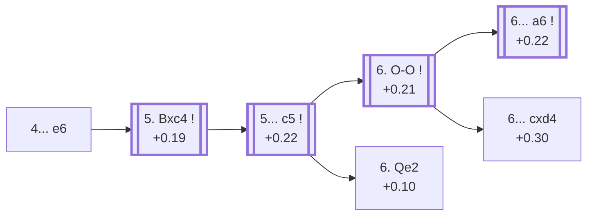

<a name="_TOP_"></a>

# D26 Queen's Gambit Accepted: Normal Variation, Traditional System <br> 1. d4 d5 2. c4 dxc4 3. Nf3 Nf6 4. e3 e6 #

Spun off from [D25's own "4. e3" card](https://github.com/onclemarcel/chess_flashcards/blob/main/d4_openings/D25_Queens_Gambit_Accepted_Normal_Variation.md#_initial_move_) — masters' clear main try there (70.0%), already live-tagged its own code. `eco.md` leaves this bare tabiya named only "4...e6"; the live explorer compounds it onto its parent's own name as the ***Normal Variation, Traditional System***.

### Overview

*Quick map of every move covered on this card — see the [shape key](https://github.com/onclemarcel/chess_flashcards/blob/main/start.md#content-diagram-optional) in start.md.*

<!-- content-diagram:start -->

<!-- content-diagram:end -->

<a name="_initial_move_"></a>

[](https://lichess.org/analysis/standard/rnbqkb1r/ppp2ppp/4pn2/8/2pP4/4PN2/PP3PPP/RNBQKB1R_w_KQkq_-_0_5)

*... 4... e6 — live-tagged the Normal Variation, Traditional System*

```
rnbqkb1r/ppp2ppp/4pn2/8/2pP4/4PN2/PP3PPP/RNBQKB1R w KQkq - 0 5
```

|  | +0.19 |
| --- | --- |

<!-- lichess-stats:start fen="rnbqkb1r/ppp2ppp/4pn2/8/2pP4/4PN2/PP3PPP/RNBQKB1R w KQkq - 0 5" db="lichess,masters" speeds="bullet,blitz" ratings="1800,2000,2200,2500" moves="4" -->
| Move | Online | W/D/B | Masters | W/D/B | |
| :--- | ---: | :--- | ---: | :--- | :-- |
| Bxc4 | 734 k (84.4%) | ⬜⬜⬜⬜⬜🟫⬛⬛⬛⬛ 50/6/43 | 9.0 k (99.8%) | ⬜⬜⬜🟫🟫🟫🟫🟫⬛⬛ 30/54/15 |  |
| Nc3 | 104 k (11.9%) | ⬜⬜⬜⬜⬜🟫⬛⬛⬛⬛ 54/4/42 | 15 (0.2%) | — |  |
| Be2 | 12 k (1.4%) | ⬜⬜⬜⬜⬜🟫⬛⬛⬛⬛ 50/6/45 | 0 | — | ⚠ |
| Nbd2 | 7.9 k (0.9%) | ⬜⬜⬜⬜⬜🟫⬛⬛⬛⬛ 53/5/42 | 1 (0.0%) | — | ⚠ |
| Qa4+ | 0 | — | 1 (0.0%) | — |  |

*Online: bullet/blitz, 1800+ — 870 k games. Masters: 9.0 k games. [Open in the explorer](https://lichess.org/analysis/standard/rnbqkb1r/ppp2ppp/4pn2/8/2pP4/4PN2/PP3PPP/RNBQKB1R_w_KQkq_-_0_5#explorer) — updated 2026-09-07*
<!-- lichess-stats:end -->

Masters' near-forced reply is **5. Bxc4** (99.8%), finally regaining the pawn.

* [**5. Bxc4**](#_Bxc4_) (99.8% masters): see below.

[*Back to TOP*](#_TOP_)

---

<a name="_Bxc4_"></a>

## 5. Bxc4

[](https://lichess.org/analysis/standard/rnbqkb1r/ppp2ppp/4pn2/8/2BP4/4PN2/PP3PPP/RNBQK2R_b_KQkq_-_0_5)

*... 5. Bxc4 — the pawn regained*

```
rnbqkb1r/ppp2ppp/4pn2/8/2BP4/4PN2/PP3PPP/RNBQK2R b KQkq - 0 5
```

|  | +0.19 |
| --- | --- |

Masters' clear main try is **5... c5** (the *Classical Defense*), striking back in the centre at once.

* [**5... c5**](#_Classical_): the *Classical Defense* — covered below.

[*Back to 4... e6*](#_initial_move_)
[*Back to TOP*](#_TOP_)

---

<a name="_Classical_"></a>

## 5... c5 — Classical Defense

[](https://lichess.org/analysis/standard/rnbqkb1r/pp3ppp/4pn2/2p5/2BP4/4PN2/PP3PPP/RNBQK2R_w_KQkq_c6_0_6)

*... 5... c5 — live-tagged the Classical Defense*

```
rnbqkb1r/pp3ppp/4pn2/2p5/2BP4/4PN2/PP3PPP/RNBQK2R w KQkq c6 0 6
```

|  | +0.22 |
| --- | --- |

<!-- lichess-stats:start fen="rnbqkb1r/pp3ppp/4pn2/2p5/2BP4/4PN2/PP3PPP/RNBQK2R w KQkq c6 0 6" db="lichess,masters" speeds="bullet,blitz" ratings="1800,2000,2200,2500" moves="4" -->
| Move | Online | W/D/B | Masters | W/D/B | |
| :--- | ---: | :--- | ---: | :--- | :-- |
| O-O | 279 k (75.4%) | ⬜⬜⬜⬜⬜🟫⬛⬛⬛⬛ 46/9/44 | 8.4 k (90.4%) | ⬜⬜⬜🟫🟫🟫🟫🟫🟫⬛ 29/56/14 |  |
| Nc3 | 56 k (15.1%) | ⬜⬜⬜⬜🟫⬛⬛⬛⬛⬛ 45/7/48 | 135 (1.5%) | ⬜⬜🟫🟫🟫🟫🟫🟫⬛⬛ 16/60/24 |  |
| dxc5 | 5.8 k (1.6%) | ⬜⬜⬜⬜🟫⬛⬛⬛⬛⬛ 43/11/46 | 86 (0.9%) | ⬜🟫🟫🟫🟫🟫🟫🟫🟫⬛ 6/83/12 |  |
| Bd3 | 5.0 k (1.3%) | ⬜⬜⬜⬜⬜⬛⬛⬛⬛⬛ 47/5/48 | 0 | — | ⚠ |
| Qe2 | 0 | — | 660 (7.1%) | ⬜⬜⬜⬜🟫🟫🟫🟫🟫⬛ 41/45/14 |  |

*Online: bullet/blitz, 1800+ — 370 k games. Masters: 9.3 k games. [Open in the explorer](https://lichess.org/analysis/standard/rnbqkb1r/pp3ppp/4pn2/2p5/2BP4/4PN2/PP3PPP/RNBQK2R_w_KQkq_c6_0_6#explorer) — updated 2026-09-07*
<!-- lichess-stats:end -->

`eco.md` calls this the *Classical Variation*; the live explorer spells it the ***Classical Defense*** (a minor naming difference, not substantive). Masters' overwhelming reply is **6. O-O** (90.4%), castling before deciding on the centre. **6. Qe2** (+0.10, 7.1%) is a real, if secondary, immediate try that this card follows down to the *Furman Variation*.

* [**6. O-O**](#_6OO_) (90.4% masters): covered below.
* [**6. Qe2**](#_Furman_) (7.1% masters): heads toward the *Furman Variation* — covered below.

[*Back to 5. Bxc4*](#_Bxc4_)
[*Back to TOP*](#_TOP_)

---

<a name="_Furman_"></a>

## 6. Qe2 a6 7. dxc5 Bxc5 8. O-O Nc6 9. e4 b5 10. e5 — Furman Variation

[](https://lichess.org/analysis/standard/r1bqk2r/5ppp/p1n1pn2/1pb1P3/2B5/5N2/PP2QPPP/RNB2RK1_b_kq_-_0_10)

*... 10. e5 — Furman Variation*

```
r1bqk2r/5ppp/p1n1pn2/1pb1P3/2B5/5N2/PP2QPPP/RNB2RK1 b kq - 0 10
```

|  | −0.10 |
| --- | --- |

`eco.md`'s name matches the live explorer here. A specific, deeply analysed alternative move-order to the main 6. O-O tabiya, pushing the knight from f6 immediately with a further central advance. Not built out further here (backlog).

[*Back to 5... c5*](#_Classical_)
[*Back to TOP*](#_TOP_)

---

<a name="_6OO_"></a>

## 6. O-O — Classical Defense, Normal Line

[](https://lichess.org/analysis/standard/rnbqkb1r/pp3ppp/4pn2/2p5/2BP4/4PN2/PP3PPP/RNBQ1RK1_b_kq_-_1_6)

*... 6. O-O — live-tagged the Classical Defense, Normal Line*

```
rnbqkb1r/pp3ppp/4pn2/2p5/2BP4/4PN2/PP3PPP/RNBQ1RK1 b kq - 1 6
```

|  | +0.21 |
| --- | --- |

<!-- lichess-stats:start fen="rnbqkb1r/pp3ppp/4pn2/2p5/2BP4/4PN2/PP3PPP/RNBQ1RK1 b kq - 1 6" db="lichess,masters" speeds="bullet,blitz" ratings="1800,2000,2200,2500" moves="4" -->
| Move | Online | W/D/B | Masters | W/D/B | |
| :--- | ---: | :--- | ---: | :--- | :-- |
| a6 | 147 k (51.8%) | ⬜⬜⬜⬜⬜🟫⬛⬛⬛⬛ 46/10/45 | 7.1 k (84.0%) | ⬜⬜⬜🟫🟫🟫🟫🟫🟫⬛ 28/57/14 |  |
| Nc6 | 61 k (21.4%) | ⬜⬜⬜⬜⬜🟫⬛⬛⬛⬛ 46/10/44 | 1.1 k (12.8%) | ⬜⬜⬜🟫🟫🟫🟫🟫⬛⬛ 31/52/17 |  |
| cxd4 | 57 k (20.1%) | ⬜⬜⬜⬜⬜🟫⬛⬛⬛⬛ 47/8/45 | 190 (2.2%) | ⬜⬜⬜⬜⬜🟫🟫🟫🟫⬛ 44/43/13 |  |
| Be7 | 14 k (4.9%) | ⬜⬜⬜⬜⬜🟫⬛⬛⬛⬛ 48/8/44 | 50 (0.6%) | ⬜⬜⬜⬜⬜⬜🟫🟫🟫⬛ 60/32/8 |  |

*Online: bullet/blitz, 1800+ — 284 k games. Masters: 8.5 k games. [Open in the explorer](https://lichess.org/analysis/standard/rnbqkb1r/pp3ppp/4pn2/2p5/2BP4/4PN2/PP3PPP/RNBQ1RK1_b_kq_-_1_6#explorer) — updated 2026-09-07*
<!-- lichess-stats:end -->

Masters' clear main try is **6... a6** (+0.22 a move later, 84.0%) — its own code, [D27](https://github.com/onclemarcel/chess_flashcards/blob/main/d4_openings/D27_Queens_Gambit_Accepted_Classical_Main_Line.md). **6... cxd4** stays D26, a genuine minority try (2.2%).

* **6... a6** (84.0% masters): its own code, [D27](https://github.com/onclemarcel/chess_flashcards/blob/main/d4_openings/D27_Queens_Gambit_Accepted_Classical_Main_Line.md).
* [**6... cxd4**](#_Steinitz_) (2.2% masters): the *Steinitz Variation* — covered below.

[*Back to 5... c5*](#_Classical_)
[*Back to TOP*](#_TOP_)

---

<a name="_Steinitz_"></a>

## 6... cxd4 — Steinitz Variation

[](https://lichess.org/analysis/standard/rnbqkb1r/pp3ppp/4pn2/8/2Bp4/4PN2/PP3PPP/RNBQ1RK1_w_kq_-_0_7)

*... 6... cxd4 — Steinitz Variation*

```
rnbqkb1r/pp3ppp/4pn2/8/2Bp4/4PN2/PP3PPP/RNBQ1RK1 w kq - 0 7
```

|  | +0.30 |
| --- | --- |

`eco.md`'s name matches the live explorer here — named after first World Champion Wilhelm Steinitz. Resolves the central tension immediately rather than developing further — a genuine minority try (2.2% masters). Not built out further here (backlog).

[*Back to 6. O-O*](#_6OO_)
[*Back to TOP*](#_TOP_)
