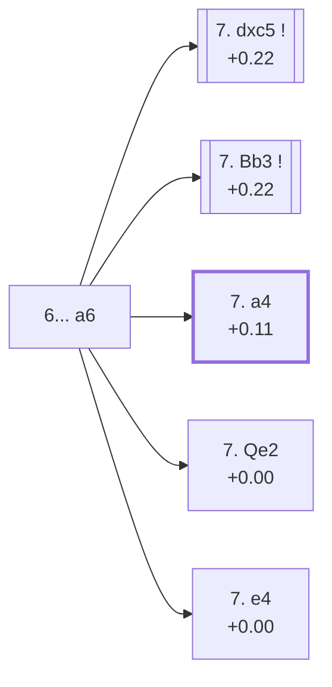

<a name="_TOP_"></a>

# D27 Queen's Gambit Accepted: Classical Defense, Main Line <br> 1. d4 d5 2. c4 dxc4 3. Nf3 Nf6 4. e3 e6 5. Bxc4 c5 6. O-O a6 #

Spun off from [D26's own "6. O-O" card](https://github.com/onclemarcel/chess_flashcards/blob/main/d4_openings/D26_Queens_Gambit_Accepted_Traditional_System.md#_6OO_) — masters' clear main try there (84.0%), already live-tagged its own code. `eco.md` leaves this bare tabiya named only "6...a6"; the live explorer compounds it onto its parent's own name as the ***Classical Defense, Main Line***.

### Overview

*Quick map of every move covered on this card — see the [shape key](https://github.com/onclemarcel/chess_flashcards/blob/main/start.md#content-diagram-optional) in start.md.*

<!-- content-diagram:start -->

<!-- content-diagram:end -->

<a name="_initial_move_"></a>

[](https://lichess.org/analysis/standard/rnbqkb1r/1p3ppp/p3pn2/2p5/2BP4/4PN2/PP3PPP/RNBQ1RK1_w_kq_-_0_7)

*... 6... a6 — live-tagged the Classical Defense, Main Line*

```
rnbqkb1r/1p3ppp/p3pn2/2p5/2BP4/4PN2/PP3PPP/RNBQ1RK1 w kq - 0 7
```

|  | +0.22 |
| --- | --- |

<!-- lichess-stats:start fen="rnbqkb1r/1p3ppp/p3pn2/2p5/2BP4/4PN2/PP3PPP/RNBQ1RK1 w kq - 0 7" db="lichess,masters" speeds="bullet,blitz" ratings="1800,2000,2200,2500" moves="5" -->
| Move | Online | W/D/B | Masters | W/D/B | |
| :--- | ---: | :--- | ---: | :--- | :-- |
| a4 | 61 k (29.0%) | ⬜⬜⬜⬜🟫⬛⬛⬛⬛⬛ 44/9/47 | 1.5 k (14.8%) | ⬜⬜⬜🟫🟫🟫🟫🟫⬛⬛ 28/53/18 |  |
| dxc5 | 37 k (17.6%) | ⬜⬜⬜⬜⬜🟫⬛⬛⬛⬛ 45/15/40 | 2.4 k (22.9%) | ⬜⬜🟫🟫🟫🟫🟫🟫🟫⬛ 20/71/9 |  |
| Qe2 | 30 k (14.2%) | ⬜⬜⬜⬜⬜🟫⬛⬛⬛⬛ 47/7/46 | 1.2 k (11.6%) | ⬜⬜⬜🟫🟫🟫🟫⬛⬛⬛ 30/44/26 |  |
| Nc3 | 30 k (14.1%) | ⬜⬜⬜⬜🟫⬛⬛⬛⬛⬛ 44/8/48 | 0 | — | ⚠ |
| b3 | 12 k (5.9%) | ⬜⬜⬜⬜⬜🟫⬛⬛⬛⬛ 49/11/40 | 1.1 k (10.9%) | ⬜⬜🟫🟫🟫🟫🟫🟫🟫⬛ 22/69/9 |  |
| Bb3 | 0 | — | 2.2 k (21.6%) | ⬜⬜⬜🟫🟫🟫🟫🟫🟫⬛ 33/54/14 |  |

*Online: bullet/blitz, 1800+ — 211 k games. Masters: 10 k games. [Open in the explorer](https://lichess.org/analysis/standard/rnbqkb1r/1p3ppp/p3pn2/2p5/2BP4/4PN2/PP3PPP/RNBQ1RK1_w_kq_-_0_7#explorer) — updated 2026-09-07*
<!-- lichess-stats:end -->

A genuinely scattered choice for White at this famous tabiya, matching the "system opening" character of the whole Classical Defense: **7. dxc5** (+0.22, 22.9%) simplifies at once, **7. Bb3** (+0.22, 21.6%) tucks the bishop away first, **7. a4** (+0.11, 14.8%) is the *Rubinstein Variation*, **7. Qe2** (+0.00, 11.6%) is its own code, and **7. e4** (2.4%) is the real minority *Geller Variation*. None of the top three clears even a quarter of masters games.

* **7. dxc5** (22.9% masters): a real, secondary immediate simplification — not covered further here (backlog).
* **7. Bb3** (21.6% masters): a real, secondary quiet retreat — not covered further here (backlog).
* [**7. a4**](#_Rubinstein_) (14.8% masters): the *Rubinstein Variation* — covered below.
* **7. Qe2** (11.6% masters): its own code, [D28](https://github.com/onclemarcel/chess_flashcards/blob/main/d4_openings/D28_Queens_Gambit_Accepted_Classical_Alekhine_System.md).
* [**7. e4**](#_Geller_) (2.4% masters): the *Geller Variation* — covered below.

[*Back to TOP*](#_TOP_)

---

<a name="_Rubinstein_"></a>

## 7. a4 — Rubinstein Variation

[](https://lichess.org/analysis/standard/rnbqkb1r/1p3ppp/p3pn2/2p5/P1BP4/4PN2/1P3PPP/RNBQ1RK1_b_kq_a3_0_7)

*... 7. a4 — Rubinstein Variation*

```
rnbqkb1r/1p3ppp/p3pn2/2p5/P1BP4/4PN2/1P3PPP/RNBQ1RK1 b kq a3 0 7
```

|  | +0.11 |
| --- | --- |

`eco.md`'s name matches the live explorer here — named after Akiba Rubinstein. Rules out ... b5 permanently, the same idea seen throughout this whole D-series (compare D16's own Alapin Variation). A real, secondary try (14.8% masters). Not built out further here (backlog).

[*Back to 6... a6*](#_initial_move_)
[*Back to TOP*](#_TOP_)

---

<a name="_Geller_"></a>

## 7. e4 — Geller Variation

[](https://lichess.org/analysis/standard/rnbqkb1r/1p3ppp/p3pn2/2p5/2BPP3/5N2/PP3PPP/RNBQ1RK1_b_kq_-_0_7)

*... 7. e4 — Geller Variation*

```
rnbqkb1r/1p3ppp/p3pn2/2p5/2BPP3/5N2/PP3PPP/RNBQ1RK1 b kq - 0 7
```

|  | +0.00 |
| --- | --- |

`eco.md`'s name matches the live explorer here — named after Efim Geller, who separately lends his name to D15's own unrelated Geller Gambit and D15's Tolush-Geller Gambit much shallower in this D-series. Grabs the full centre immediately rather than the quieter queenside plans. A genuine minority try (2.4% masters). Not built out further here (backlog).

[*Back to 6... a6*](#_initial_move_)
[*Back to TOP*](#_TOP_)
