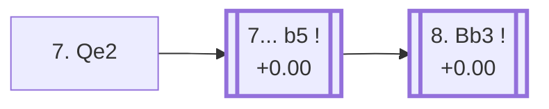

<a name="_TOP_"></a>

# D28 Queen's Gambit Accepted: Classical Defense, Alekhine System <br> 1. d4 d5 2. c4 dxc4 3. Nf3 Nf6 4. e3 e6 5. Bxc4 c5 6. O-O a6 7. Qe2 #

Spun off from [D27's own "6... a6" card](https://github.com/onclemarcel/chess_flashcards/blob/main/d4_openings/D27_Queens_Gambit_Accepted_Classical_Main_Line.md#_initial_move_) — a real secondary try there (11.6% masters), already live-tagged its own code. `eco.md` leaves this bare tabiya named only "7.Qe2"; the live explorer independently names it the ***Alekhine System*** — named, like D22's own Alekhine Defense, after the fourth World Champion, but an otherwise unrelated position.

### Overview

*Quick map of every move covered on this card — see the [shape key](https://github.com/onclemarcel/chess_flashcards/blob/main/start.md#content-diagram-optional) in start.md.*

<!-- content-diagram:start -->

<!-- content-diagram:end -->

<a name="_initial_move_"></a>

[](https://lichess.org/analysis/standard/rnbqkb1r/1p3ppp/p3pn2/2p5/2BP4/4PN2/PP2QPPP/RNB2RK1_b_kq_-_1_7)

*... 7. Qe2 — live-tagged the Alekhine System*

```
rnbqkb1r/1p3ppp/p3pn2/2p5/2BP4/4PN2/PP2QPPP/RNB2RK1 b kq - 1 7
```

|  | +0.00 |
| --- | --- |

<!-- lichess-stats:start fen="rnbqkb1r/1p3ppp/p3pn2/2p5/2BP4/4PN2/PP2QPPP/RNB2RK1 b kq - 1 7" db="lichess,masters" speeds="bullet,blitz" ratings="1800,2000,2200,2500" moves="4" -->
| Move | Online | W/D/B | Masters | W/D/B | |
| :--- | ---: | :--- | ---: | :--- | :-- |
| b5 | 20 k (64.4%) | ⬜⬜⬜⬜⬜⬛⬛⬛⬛⬛ 47/7/47 | 1.0 k (79.2%) | ⬜⬜⬜🟫🟫🟫🟫⬛⬛⬛ 28/46/26 |  |
| Nc6 | 6.5 k (20.5%) | ⬜⬜⬜⬜⬜🟫⬛⬛⬛⬛ 46/8/45 | 177 (13.9%) | ⬜⬜⬜⬜🟫🟫🟫🟫⬛⬛ 40/37/23 |  |
| cxd4 | 2.1 k (6.6%) | ⬜⬜⬜⬜⬜🟫⬛⬛⬛⬛ 48/7/45 | 54 (4.2%) | ⬜⬜⬜⬜🟫🟫🟫🟫⬛⬛ 41/43/17 |  |
| Nbd7 | 1.2 k (3.8%) | ⬜⬜⬜⬜⬜🟫⬛⬛⬛⬛ 47/7/45 | 20 (1.6%) | ⬜⬜⬜⬜⬜🟫🟫🟫🟫⬛ 45/40/15 |  |

*Online: bullet/blitz, 1800+ — 32 k games. Masters: 1.3 k games. [Open in the explorer](https://lichess.org/analysis/standard/rnbqkb1r/1p3ppp/p3pn2/2p5/2BP4/4PN2/PP2QPPP/RNB2RK1_b_kq_-_1_7#explorer) — updated 2026-09-07*
<!-- lichess-stats:end -->

Prepares Rd1 without committing the bishop yet. Masters' clear main try is **7... b5** (79.2%), grabbing queenside space at once.

* [**7... b5**](#_b5_) (79.2% masters): see below.

[*Back to TOP*](#_TOP_)

---

<a name="_b5_"></a>

## 7... b5

[](https://lichess.org/analysis/standard/rnbqkb1r/5ppp/p3pn2/1pp5/2BP4/4PN2/PP2QPPP/RNB2RK1_w_kq_b6_0_8)

*... 7... b5*

```
rnbqkb1r/5ppp/p3pn2/1pp5/2BP4/4PN2/PP2QPPP/RNB2RK1 w kq b6 0 8
```

|  | +0.00 |
| --- | --- |

<!-- lichess-stats:start fen="rnbqkb1r/5ppp/p3pn2/1pp5/2BP4/4PN2/PP2QPPP/RNB2RK1 w kq b6 0 8" db="lichess,masters" speeds="bullet,blitz" ratings="1800,2000,2200,2500" moves="2" -->
| Move | Online | W/D/B | Masters | W/D/B | |
| :--- | ---: | :--- | ---: | :--- | :-- |
| Bb3 | 12 k (60.1%) | ⬜⬜⬜⬜⬜🟫⬛⬛⬛⬛ 47/7/47 | 618 (61.1%) | ⬜⬜⬜🟫🟫🟫🟫⬛⬛⬛ 27/43/29 |  |
| Bd3 | 8.1 k (39.8%) | ⬜⬜⬜⬜⬜⬛⬛⬛⬛⬛ 47/6/47 | 393 (38.9%) | ⬜⬜⬜🟫🟫🟫🟫🟫⬛⬛ 28/50/22 |  |

*Online: bullet/blitz, 1800+ — 20 k games. Masters: 1.0 k games. [Open in the explorer](https://lichess.org/analysis/standard/rnbqkb1r/5ppp/p3pn2/1pp5/2BP4/4PN2/PP2QPPP/RNB2RK1_w_kq_b6_0_8#explorer) — updated 2026-09-07*
<!-- lichess-stats:end -->

Masters split between **8. Bb3** (+0.00, 61.1%), tucking the bishop away from a future ... c4 or ... b4 tempo, and **8. Bd3** (38.9%) — a genuinely scattered choice. The Bb3 branch leads to the deeply analysed *Flohr Variation*.

* [**8. Bb3 Nc6 9. Rd1 c4 10. Bc2 Nb4 11. Nc3 Nxc2 12. Qxc2 Bb7 13. d5 Qc7**](#_Flohr_) (61.1% masters): the *Flohr Variation* — covered below.

[*Back to 7. Qe2*](#_initial_move_)
[*Back to TOP*](#_TOP_)

---

<a name="_Flohr_"></a>

## 8. Bb3 Nc6 9. Rd1 c4 10. Bc2 Nb4 11. Nc3 Nxc2 12. Qxc2 Bb7 13. d5 Qc7 — Flohr Variation

[](https://lichess.org/analysis/standard/r3kb1r/1bq2ppp/p3pn2/1p1P4/2p5/2N1PN2/PPQ2PPP/R1BR2K1_w_kq_-_1_14)

*... 13... Qc7 — Flohr Variation*

```
r3kb1r/1bq2ppp/p3pn2/1p1P4/2p5/2N1PN2/PPQ2PPP/R1BR2K1 w kq - 1 14
```

|  | +0.00 |
| --- | --- |

`eco.md`'s name matches the live explorer here — the same Salo Flohr already lending his name to D25's own unrelated 4...Be6 line, seven ply shallower. One of the deepest named lines in this entire D-series sweep (13 moves), a heavily analysed race between White's queenside space grab (d5) and Black's own counterplay on the c-file. Dead level according to Stockfish. Not built out further here (backlog).

[*Back to 7... b5*](#_b5_)
[*Back to TOP*](#_TOP_)
