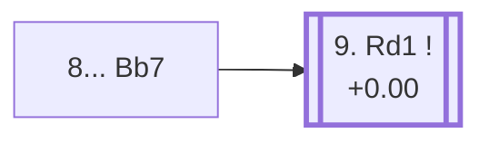

<a name="_TOP_"></a>

# D29 Queen's Gambit Accepted: Classical Defense, Alekhine System, Main Line <br> 1. d4 d5 2. c4 dxc4 3. Nf3 Nf6 4. e3 e6 5. Bxc4 c5 6. O-O a6 7. Qe2 b5 8. Bb3 Bb7 #

Spun off from [D28's own "7... b5" card](https://github.com/onclemarcel/chess_flashcards/blob/main/d4_openings/D28_Queens_Gambit_Accepted_Classical_Alekhine_System.md#_b5_) — a real secondary try there (38.9% masters, via 8. Bd3, transposing) alongside the main 8. Bb3, both reaching this bare "8...Bb7" tabiya, already live-tagged its own code. `eco.md` leaves this bare tabiya named only "8...Bb7"; the live explorer compounds it onto its parents' own names as the ***Classical Defense, Alekhine System, Main Line***.

### Overview

*Quick map of every move covered on this card — see the [shape key](https://github.com/onclemarcel/chess_flashcards/blob/main/start.md#content-diagram-optional) in start.md.*

<!-- content-diagram:start -->

<!-- content-diagram:end -->

<a name="_initial_move_"></a>

[](https://lichess.org/analysis/standard/rn1qkb1r/1b3ppp/p3pn2/1pp5/3P4/1B2PN2/PP2QPPP/RNB2RK1_w_kq_-_2_9)

*... 8... Bb7 — live-tagged the Classical Defense, Alekhine System, Main Line*

```
rn1qkb1r/1b3ppp/p3pn2/1pp5/3P4/1B2PN2/PP2QPPP/RNB2RK1 w kq - 2 9
```

|  | +0.00 |
| --- | --- |

<!-- lichess-stats:start fen="rn1qkb1r/1b3ppp/p3pn2/1pp5/3P4/1B2PN2/PP2QPPP/RNB2RK1 w kq - 2 9" db="lichess,masters" speeds="bullet,blitz" ratings="1800,2000,2200,2500" moves="4" -->
| Move | Online | W/D/B | Masters | W/D/B | |
| :--- | ---: | :--- | ---: | :--- | :-- |
| Rd1 | 9.8 k (72.3%) | ⬜⬜⬜⬜⬜🟫⬛⬛⬛⬛ 47/7/46 | 348 (53.8%) | ⬜⬜⬜🟫🟫🟫🟫⬛⬛⬛ 24/42/34 |  |
| dxc5 | 1.3 k (9.8%) | ⬜⬜⬜⬜⬜🟫⬛⬛⬛⬛ 47/7/46 | 11 (1.7%) | — |  |
| a4 | 1.3 k (9.6%) | ⬜⬜⬜⬜⬜🟫⬛⬛⬛⬛ 48/7/45 | 229 (35.4%) | ⬜⬜⬜🟫🟫🟫🟫⬛⬛⬛ 30/45/25 |  |
| Nc3 | 940 (6.9%) | ⬜⬜⬜⬜⬜⬛⬛⬛⬛⬛ 47/6/48 | 56 (8.7%) | ⬜⬜🟫🟫🟫🟫⬛⬛⬛⬛ 23/39/38 |  |

*Online: bullet/blitz, 1800+ — 14 k games. Masters: 647 games. [Open in the explorer](https://lichess.org/analysis/standard/rn1qkb1r/1b3ppp/p3pn2/1pp5/3P4/1B2PN2/PP2QPPP/RNB2RK1_w_kq_-_2_9#explorer) — updated 2026-09-07*
<!-- lichess-stats:end -->

Masters' clear main try is **9. Rd1** (+0.00, 53.8%), adding pressure down the d-file before deciding on the centre.

* [**9. Rd1 Nbd7 10. Nc3 Bd6**](#_Smyslov_) (53.8% masters): the *Smyslov Variation* — covered below.

[*Back to TOP*](#_TOP_)

---

<a name="_Smyslov_"></a>

## 9. Rd1 Nbd7 10. Nc3 Bd6 — Smyslov Variation

[](https://lichess.org/analysis/standard/r2qk2r/1b1n1ppp/p2bpn2/1pp5/3P4/1BN1PN2/PP2QPPP/R1BR2K1_w_kq_-_6_11)

*... 10... Bd6 — Smyslov Variation*

```
r2qk2r/1b1n1ppp/p2bpn2/1pp5/3P4/1BN1PN2/PP2QPPP/R1BR2K1 w kq - 6 11
```

|  | +0.00 |
| --- | --- |

`eco.md`'s name matches the live explorer here — the same Vasily Smyslov already lending his name to D16's own unrelated Alapin-tree variation and D25's own unrelated Normal-Variation line, both elsewhere in this D-series. Finishes development and aims the bishop at White's kingside rather than a queenside plan. Dead level according to Stockfish. Not built out further here (backlog).

[*Back to 8... Bb7*](#_initial_move_)
[*Back to TOP*](#_TOP_)
