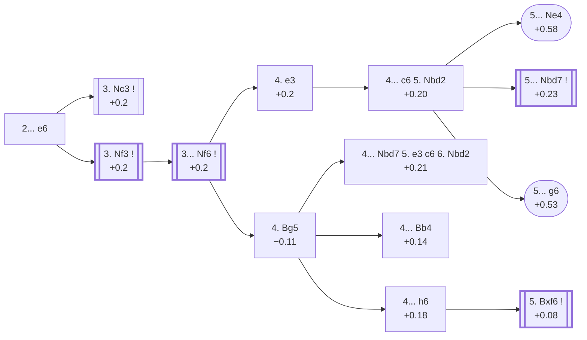

<a name="_TOP_"></a>

# D30 Queen's Gambit Declined <br> 1. d4 d5 2. c4 e6 #

Spun off from [D06's own "2... e6" card](https://github.com/onclemarcel/chess_flashcards/blob/main/d4_openings/D06_Queens_Gambit.md#_e6_) — masters' clear main try there (35.3%), already live-tagged its own code. This card carries White's entire **3. Nf3** system (masters' real second choice at 38.9%, behind 3. Nc3's own code, [D31](https://github.com/onclemarcel/chess_flashcards/blob/main/d4_openings/D31_Queens_Gambit_Declined_Queens_Knight_Variation.md)) — a genuinely large, separate ECO subtree from D31's own 3. Nc3 branch, even though both start from the same "2... e6" tabiya.

### Overview

*Quick map of every move covered on this card — see the [shape key](https://github.com/onclemarcel/chess_flashcards/blob/main/start.md#content-diagram-optional) in start.md.*

<!-- content-diagram:start -->

<!-- content-diagram:end -->

<a name="_initial_move_"></a>

[](https://lichess.org/analysis/standard/rnbqkbnr/ppp2ppp/4p3/3p4/2PP4/8/PP2PPPP/RNBQKBNR_w_KQkq_-_0_3)

*... 1. d4 d5 2. c4 e6 — Queen's Gambit Declined*

```
rnbqkbnr/ppp2ppp/4p3/3p4/2PP4/8/PP2PPPP/RNBQKBNR w KQkq - 0 3
```

|  | +0.2 |
| --- | --- |

<!-- lichess-stats:start fen="rnbqkbnr/ppp2ppp/4p3/3p4/2PP4/8/PP2PPPP/RNBQKBNR w KQkq - 0 3" db="lichess,masters" speeds="bullet,blitz" ratings="1800,2000,2200,2500" moves="5" -->
| Move | Online | W/D/B | Masters | W/D/B | |
| :--- | ---: | :--- | ---: | :--- | :-- |
| Nc3 | 27.7 M (64.4%) | ⬜⬜⬜⬜⬜🟫⬛⬛⬛⬛ 51/5/44 | 45 k (58.9%) | ⬜⬜⬜🟫🟫🟫🟫🟫⬛⬛ 33/47/20 |  |
| Nf3 | 7.9 M (18.4%) | ⬜⬜⬜⬜⬜🟫⬛⬛⬛⬛ 52/6/42 | 30 k (38.9%) | ⬜⬜⬜🟫🟫🟫🟫🟫⬛⬛ 35/47/18 |  |
| cxd5 | 3.4 M (7.8%) | ⬜⬜⬜⬜⬜🟫⬛⬛⬛⬛ 51/5/44 | 710 (0.9%) | ⬜⬜🟫🟫🟫🟫🟫⬛⬛⬛ 23/52/25 |  |
| e3 | 2.3 M (5.4%) | ⬜⬜⬜⬜⬜⬛⬛⬛⬛⬛ 49/5/45 | 131 (0.2%) | ⬜⬜⬜🟫🟫🟫🟫⬛⬛⬛ 27/44/28 |  |
| g3 | 613 k (1.4%) | ⬜⬜⬜⬜⬜🟫⬛⬛⬛⬛ 52/6/42 | 815 (1.1%) | ⬜⬜⬜🟫🟫🟫🟫🟫⬛⬛ 28/52/20 |  |

*Online: bullet/blitz, 1800+ — 43.0 M games. Masters: 77 k games. [Open in the explorer](https://lichess.org/analysis/standard/rnbqkbnr/ppp2ppp/4p3/3p4/2PP4/8/PP2PPPP/RNBQKBNR_w_KQkq_-_0_3#explorer) — updated 2026-09-15*
<!-- lichess-stats:end -->

Masters' clear main try is **3. Nc3** (+0.2, 58.9%) — its own code, [D31](https://github.com/onclemarcel/chess_flashcards/blob/main/d4_openings/D31_Queens_Gambit_Declined_Queens_Knight_Variation.md). **3. Nf3** (38.9%) is masters' real second choice, keeping similar flexibility while ruling out an early Nc3-... Bb4 pin — and stays this card's own subject.

* **3. Nc3** (58.9% masters): its own code, [D31](https://github.com/onclemarcel/chess_flashcards/blob/main/d4_openings/D31_Queens_Gambit_Declined_Queens_Knight_Variation.md).
* [**3. Nf3**](#_Nf3_) (38.9% masters): covered below.

[*Back to TOP*](#_TOP_)

---

<a name="_Nf3_"></a>

## 3. Nf3

[](https://lichess.org/analysis/standard/rnbqkbnr/ppp2ppp/4p3/3p4/2PP4/5N2/PP2PPPP/RNBQKB1R_b_KQkq_-_1_3)

*... 3. Nf3*

```
rnbqkbnr/ppp2ppp/4p3/3p4/2PP4/5N2/PP2PPPP/RNBQKB1R b KQkq - 1 3
```

|  | +0.2 |
| --- | --- |

Masters' clear main try is **3... Nf6**, completing development before committing to a structure.

* [**3... Nf6**](#_Nf6_): see below.

[*Back to 2... e6*](#_initial_move_)
[*Back to TOP*](#_TOP_)

---

<a name="_Nf6_"></a>

## 3... Nf6

[](https://lichess.org/analysis/standard/rnbqkb1r/ppp2ppp/4pn2/3p4/2PP4/5N2/PP2PPPP/RNBQKB1R_w_KQkq_-_2_4)

*... 3... Nf6*

```
rnbqkb1r/ppp2ppp/4pn2/3p4/2PP4/5N2/PP2PPPP/RNBQKB1R w KQkq - 2 4
```

|  | +0.2 |
| --- | --- |

<!-- lichess-stats:start fen="rnbqkb1r/ppp2ppp/4pn2/3p4/2PP4/5N2/PP2PPPP/RNBQKB1R w KQkq - 2 4" db="lichess,masters" speeds="bullet,blitz" ratings="1800,2000,2200,2500" moves="4" -->
| Move | Online | W/D/B | Masters | W/D/B | |
| :--- | ---: | :--- | ---: | :--- | :-- |
| Nc3 | 8.3 M (51.3%) | ⬜⬜⬜⬜⬜🟫⬛⬛⬛⬛ 52/6/43 | 65 k (61.7%) | ⬜⬜🟫🟫🟫🟫🟫🟫⬛⬛ 25/58/17 |  |
| g3 | 3.8 M (23.6%) | ⬜⬜⬜⬜⬜🟫⬛⬛⬛⬛ 53/6/40 | 30 k (28.6%) | ⬜⬜⬜🟫🟫🟫🟫🟫⬛⬛ 28/54/18 |  |
| Bg5 | 1.3 M (8.1%) | ⬜⬜⬜⬜⬜🟫⬛⬛⬛⬛ 50/6/44 | 4.2 k (4.0%) | ⬜⬜⬜🟫🟫🟫🟫🟫⬛⬛ 31/47/22 |  |
| e3 | 1.1 M (7.0%) | ⬜⬜⬜⬜⬜🟫⬛⬛⬛⬛ 50/6/45 | 4.2 k (4.0%) | ⬜⬜⬜🟫🟫🟫🟫🟫⬛⬛ 26/51/22 |  |

*Online: bullet/blitz, 1800+ — 16.2 M games. Masters: 106 k games. [Open in the explorer](https://lichess.org/analysis/standard/rnbqkb1r/ppp2ppp/4pn2/3p4/2PP4/5N2/PP2PPPP/RNBQKB1R_w_KQkq_-_2_4#explorer) — updated 2026-09-15*
<!-- lichess-stats:end -->

Masters' actual main tries here transpose elsewhere: **4. Nc3** (61.7%) merges into the 3.Nc3-first move order (D35/D37's own territory), and **4. g3** (28.6%) heads for the Catalan Opening — neither carries its own code in this D30-D39 range. `eco.md`'s own two D30 entries are both real, if statistically minor, ties: **4. e3** (4.0%) keeps the structure flexible, while **4. Bg5** (4.0%) pins the knight immediately — `eco.md` reuses the card's own bare "Queen's Gambit, Declined" name here, one ply deeper; the live explorer instead tags it the ***Traditional Variation***.

* **4. Nc3** (61.7% masters): transposes toward D35/D37's own 3.Nc3-first territory — not covered further here.
* **4. g3** (28.6% masters): the Catalan Opening — not covered further here.
* [**4. e3**](#_e3_) (4.0% masters): covered below.
* [**4. Bg5**](#_Bg5_) (4.0% masters): live-tagged the *Traditional Variation* — covered below.

[*Back to 3. Nf3*](#_Nf3_)
[*Back to TOP*](#_TOP_)

---

<a name="_e3_"></a>

## 4. e3

[](https://lichess.org/analysis/standard/rnbqkb1r/ppp2ppp/4pn2/3p4/2PP4/4PN2/PP3PPP/RNBQKB1R_b_KQkq_-_0_4)

*... 4. e3*

```
rnbqkb1r/ppp2ppp/4pn2/3p4/2PP4/4PN2/PP3PPP/RNBQKB1R b KQkq - 0 4
```

|  | +0.2 |
| --- | --- |

Black's most natural continuation heads for a Slav-flavoured setup with ... c6 — the same structure `eco.md` reuses the "Slav Defence" name for, twice, despite the transposed move order (via 2... e6, not 2... c6).

* **4... c6 5. Nbd2** (+0.20): covered below.

[*Back to 3... Nf6*](#_Nf6_)
[*Back to TOP*](#_TOP_)

---

<a name="_Nbd2_"></a>

## 4... c6 5. Nbd2 — Slav Defence

[](https://lichess.org/analysis/standard/rnbqkb1r/pp3ppp/2p1pn2/3p4/2PP4/4PN2/PP1N1PPP/R1BQKB1R_b_KQkq_-_1_5)

*... 5. Nbd2 — live-tagged the Semi-Slav Defense: Quiet Variation*

```
rnbqkb1r/pp3ppp/2p1pn2/3p4/2PP4/4PN2/PP1N1PPP/R1BQKB1R b KQkq - 1 5
```

|  | +0.20 |
| --- | --- |

<!-- lichess-stats:start fen="rnbqkb1r/pp3ppp/2p1pn2/3p4/2PP4/4PN2/PP1N1PPP/R1BQKB1R b KQkq - 1 5" db="lichess,masters" speeds="bullet,blitz" ratings="1800,2000,2200,2500" moves="5" -->
| Move | Online | W/D/B | Masters | W/D/B | |
| :--- | ---: | :--- | ---: | :--- | :-- |
| Nbd7 | 80 k (31.4%) | ⬜⬜⬜⬜⬜🟫⬛⬛⬛⬛ 54/7/39 | 1.6 k (62.3%) | ⬜⬜⬜🟫🟫🟫🟫🟫🟫⬛ 32/56/12 |  |
| Be7 | 66 k (26.0%) | ⬜⬜⬜⬜⬜🟫⬛⬛⬛⬛ 55/5/39 | 201 (7.7%) | ⬜⬜⬜🟫🟫🟫🟫🟫🟫⬛ 26/63/10 |  |
| Bd6 | 61 k (24.0%) | ⬜⬜⬜⬜⬜🟫⬛⬛⬛⬛ 55/6/39 | 94 (3.6%) | ⬜⬜⬜⬜🟫🟫🟫🟫🟫⬛ 41/46/13 |  |
| Bb4 | 21 k (8.1%) | ⬜⬜⬜⬜⬜⬜⬛⬛⬛⬛ 57/5/38 | 0 | — | ⚠ |
| dxc4 | 5.5 k (2.2%) | ⬜⬜⬜⬜⬜⬜⬛⬛⬛⬛ 55/4/40 | 0 | — | ⚠ |
| c5 | 0 | — | 580 (22.2%) | ⬜⬜🟫🟫🟫🟫🟫🟫⬛⬛ 24/57/19 |  |
| b6 | 0 | — | 41 (1.6%) | ⬜🟫🟫🟫🟫🟫🟫🟫🟫⬛ 7/85/7 |  |

*Online: bullet/blitz, 1800+ — 253 k games. Masters: 2.6 k games. [Open in the explorer](https://lichess.org/analysis/standard/rnbqkb1r/pp3ppp/2p1pn2/3p4/2PP4/4PN2/PP1N1PPP/R1BQKB1R_b_KQkq_-_1_5#explorer) — updated 2026-09-15*
<!-- lichess-stats:end -->

`eco.md` names this exact tabiya the *Slav Defence*, reusing the D10-D19 complex's own family name for a transposed structure reached via 2... e6 instead; the live explorer independently tags it the ***Semi-Slav Defense: Quiet Variation*** instead — technically correct, since e6 has already been played, but a real, substantial name divergence from `eco.md`'s own choice. Masters' clear main try is **5... Nbd7** (62.3%) — the exact same `eco.md` name is reused a second time here. **5... Ne4** (0.8%) heads for the historic *Stonewall Variation*; **5... g6** is the rarer *Spielmann Variation*.

* [**5... Ne4 6. Bd3 f5**](#_Stonewall_) (+0.58, 0.8% masters): the *Stonewall Variation* — covered below.
* [**5... Nbd7**](#_Nbd7_) (62.3% masters): covered below.
* [**5... g6**](#_Spielmann_): the *Spielmann Variation* — covered below.

[*Back to 4. e3*](#_e3_)
[*Back to TOP*](#_TOP_)

---

<a name="_Stonewall_"></a>

## 5... Ne4 6. Bd3 f5 — Stonewall Variation

[](https://lichess.org/analysis/standard/rnbqkb1r/pp4pp/2p1p3/3p1p2/2PPn3/3BPN2/PP1N1PPP/R1BQK2R_w_KQkq_f6_0_7)

*... 6... f5 — Stonewall Variation*

```
rnbqkb1r/pp4pp/2p1p3/3p1p2/2PPn3/3BPN2/PP1N1PPP/R1BQK2R w KQkq f6 0 7
```

|  | +0.58 |
| --- | --- |

`eco.md`'s name matches the live explorer here. Black locks the centre with the classic Stonewall pawn chain (c6/d5/e6/f5) rather than developing normally — a genuine database rarity at this exact node (0.8% masters). Not built out further here (backlog).

[*Back to 4... c6 5. Nbd2*](#_Nbd2_)
[*Back to TOP*](#_TOP_)

---

<a name="_Nbd7_"></a>

## 5... Nbd7 — Slav Defence

[](https://lichess.org/analysis/standard/r1bqkb1r/pp1n1ppp/2p1pn2/3p4/2PP4/4PN2/PP1N1PPP/R1BQKB1R_w_KQkq_-_2_6)

*... 5... Nbd7 — live-tagged the Semi-Slav Defense: Quiet Variation*

```
r1bqkb1r/pp1n1ppp/2p1pn2/3p4/2PP4/4PN2/PP1N1PPP/R1BQKB1R w KQkq - 2 6
```

|  | +0.23 |
| --- | --- |

`eco.md` calls this the *Slav Defence* — the same reused name as its own parent node, one ply shallower. Masters split between **6. Bd3** (59.3%) and **6. b3** (39.0%); the Bd3 branch, followed by ... c5, is the named *Semmering Variation* below.

* [**6. Bd3 c5**](#_Semmering_): the *Semmering Variation* — covered below.

[*Back to 4... c6 5. Nbd2*](#_Nbd2_)
[*Back to TOP*](#_TOP_)

---

<a name="_Semmering_"></a>

## 6. Bd3 c5 — Semmering Variation

[](https://lichess.org/analysis/standard/r1bqkb1r/pp1n1ppp/4pn2/2pp4/2PP4/3BPN2/PP1N1PPP/R1BQK2R_w_KQkq_-_0_7)

*... 6... c5 — Semmering Variation*

```
r1bqkb1r/pp1n1ppp/4pn2/2pp4/2PP4/3BPN2/PP1N1PPP/R1BQK2R w KQkq - 0 7
```

|  | +0.38 |
| --- | --- |

`eco.md`'s name matches the live explorer here — named for the 1926 Semmering tournament. Strikes back in the centre immediately rather than developing further. Not built out further here (backlog).

[*Back to 5... Nbd7*](#_Nbd7_)
[*Back to TOP*](#_TOP_)

---

<a name="_Spielmann_"></a>

## 5... g6 — Spielmann Variation

[](https://lichess.org/analysis/standard/rnbqkb1r/pp3p1p/2p1pnp1/3p4/2PP4/4PN2/PP1N1PPP/R1BQKB1R_w_KQkq_-_0_6)

*... 5... g6 — Spielmann Variation*

```
rnbqkb1r/pp3p1p/2p1pnp1/3p4/2PP4/4PN2/PP1N1PPP/R1BQKB1R w KQkq - 0 6
```

|  | +0.53 |
| --- | --- |

`eco.md`'s name matches the live explorer here. Fianchettoes the king's bishop, an unusual plan in this structure. A genuine database rarity. Not built out further here (backlog).

[*Back to 4... c6 5. Nbd2*](#_Nbd2_)
[*Back to TOP*](#_TOP_)

---

<a name="_Bg5_"></a>

## 4. Bg5 — Traditional Variation

[](https://lichess.org/analysis/standard/rnbqkb1r/ppp2ppp/4pn2/3p2B1/2PP4/5N2/PP2PPPP/RN1QKB1R_b_KQkq_-_3_4)

*... 4. Bg5 — live-tagged the Traditional Variation*

```
rnbqkb1r/ppp2ppp/4pn2/3p2B1/2PP4/5N2/PP2PPPP/RN1QKB1R b KQkq - 3 4
```

|  | −0.11 |
| --- | --- |

<!-- lichess-stats:start fen="rnbqkb1r/ppp2ppp/4pn2/3p2B1/2PP4/5N2/PP2PPPP/RN1QKB1R b KQkq - 3 4" db="lichess,masters" speeds="bullet,blitz" ratings="1800,2000,2200,2500" moves="6" -->
| Move | Online | W/D/B | Masters | W/D/B | |
| :--- | ---: | :--- | ---: | :--- | :-- |
| Be7 | 908 k (62.8%) | ⬜⬜⬜⬜⬜🟫⬛⬛⬛⬛ 50/6/44 | 1.6 k (37.3%) | ⬜⬜⬜🟫🟫🟫🟫🟫⬛⬛ 33/50/17 |  |
| c6 | 132 k (9.1%) | ⬜⬜⬜⬜⬜🟫⬛⬛⬛⬛ 49/5/45 | 291 (6.8%) | ⬜⬜⬜⬜🟫🟫🟫🟫⬛⬛ 37/42/21 |  |
| Nbd7 | 94 k (6.5%) | ⬜⬜⬜⬜⬜🟫⬛⬛⬛⬛ 49/6/45 | 375 (8.8%) | ⬜⬜⬜⬜🟫🟫🟫🟫⬛⬛ 39/43/18 |  |
| Bb4+ | 92 k (6.4%) | ⬜⬜⬜⬜⬜🟫⬛⬛⬛⬛ 50/6/45 | 530 (12.4%) | ⬜⬜⬜🟫🟫🟫🟫⬛⬛⬛ 33/42/25 |  |
| dxc4 | 81 k (5.6%) | ⬜⬜⬜⬜⬜⬛⬛⬛⬛⬛ 46/6/48 | 757 (17.7%) | ⬜⬜🟫🟫🟫🟫🟫⬛⬛⬛ 23/52/25 |  |
| h6 | 54 k (3.8%) | ⬜⬜⬜⬜⬜🟫⬛⬛⬛⬛ 50/6/44 | 694 (16.3%) | ⬜⬜⬜🟫🟫🟫🟫⬛⬛⬛ 28/44/28 |  |

*Online: bullet/blitz, 1800+ — 1.4 M games. Masters: 4.3 k games. [Open in the explorer](https://lichess.org/analysis/standard/rnbqkb1r/ppp2ppp/4pn2/3p2B1/2PP4/5N2/PP2PPPP/RN1QKB1R_b_KQkq_-_3_4#explorer) — updated 2026-09-15*
<!-- lichess-stats:end -->

`eco.md` leaves this bare tabiya named only "Queen's Gambit, Declined", the card's own root name reused; the live explorer independently names it the ***Traditional Variation***. Masters' clear main try is **4... Be7** (37.3%), the Orthodox tabiya, not covered further here — its own vast body of theory. **4... Nbd7** (8.8%) heads for the *Capablanca Variation*, **4... Bb4** (12.4%) for the *Vienna Variation*, and **4... h6** (16.3%) transposes into the same *Capablanca Variation* one ply later.

* **4... Be7** (37.3% masters): the Orthodox tabiya — not covered further here.
* [**4... Nbd7 5. e3 c6 6. Nbd2**](#_Capablanca_) (+0.21, 8.8% masters): the *Capablanca Variation* — covered below.
* [**4... Bb4**](#_Vienna_) (12.4% masters): the *Vienna Variation* — covered below.
* [**4... h6**](#_CapablancaDuras_) (16.3% masters): live-tagged the same *Capablanca Variation* — covered below.

[*Back to 3... Nf6*](#_Nf6_)
[*Back to TOP*](#_TOP_)

---

<a name="_Capablanca_"></a>

## 4... Nbd7 5. e3 c6 6. Nbd2 — Capablanca Variation

[](https://lichess.org/analysis/standard/r1bqkb1r/pp1n1ppp/2p1pn2/3p2B1/2PP4/4PN2/PP1N1PPP/R2QKB1R_b_KQkq_-_1_6)

*... 6. Nbd2 — Capablanca Variation*

```
r1bqkb1r/pp1n1ppp/2p1pn2/3p2B1/2PP4/4PN2/PP1N1PPP/R2QKB1R b KQkq - 1 6
```

|  | +0.21 |
| --- | --- |

`eco.md`'s name matches the live explorer here — named for former World Champion José Raúl Capablanca. Masters' clear main try is **6... Be7** (64.5%). Not built out further here (backlog).

[*Back to 4. Bg5*](#_Bg5_)
[*Back to TOP*](#_TOP_)

---

<a name="_Vienna_"></a>

## 4... Bb4 — Vienna Variation

[](https://lichess.org/analysis/standard/rnbqk2r/ppp2ppp/4pn2/3p2B1/1bPP4/5N2/PP2PPPP/RN1QKB1R_w_KQkq_-_4_5)

*... 4... Bb4 — Vienna Variation*

```
rnbqk2r/ppp2ppp/4pn2/3p2B1/1bPP4/5N2/PP2PPPP/RN1QKB1R w KQkq - 4 5
```

|  | +0.14 |
| --- | --- |

`eco.md`'s name matches the live explorer here — unrelated to D39's own, much deeper "Vienna Variation" in the Ragozin tree, despite both featuring a Bg5/Bb4 pin-and-counter-pin idea. Pins the c3-knight before committing to a structure. Not built out further here (backlog).

[*Back to 4. Bg5*](#_Bg5_)
[*Back to TOP*](#_TOP_)

---

<a name="_CapablancaDuras_"></a>

## 4... h6 — Capablanca Variation

[](https://lichess.org/analysis/standard/rnbqkb1r/ppp2pp1/4pn1p/3p2B1/2PP4/5N2/PP2PPPP/RN1QKB1R_w_KQkq_-_0_5)

*... 4... h6 — live-tagged the Capablanca Variation*

```
rnbqkb1r/ppp2pp1/4pn1p/3p2B1/2PP4/5N2/PP2PPPP/RN1QKB1R w KQkq - 0 5
```

|  | +0.18 |
| --- | --- |

<!-- lichess-stats:start fen="rnbqkb1r/ppp2pp1/4pn1p/3p2B1/2PP4/5N2/PP2PPPP/RN1QKB1R w KQkq - 0 5" db="lichess,masters" speeds="bullet,blitz" ratings="1800,2000,2200,2500" moves="3" -->
| Move | Online | W/D/B | Masters | W/D/B | |
| :--- | ---: | :--- | ---: | :--- | :-- |
| Bh4 | 35 k (64.0%) | ⬜⬜⬜⬜⬜🟫⬛⬛⬛⬛ 51/5/44 | 136 (19.6%) | ⬜⬜⬜🟫🟫🟫⬛⬛⬛⬛ 26/32/43 |  |
| Bxf6 | 16 k (29.4%) | ⬜⬜⬜⬜⬜🟫⬛⬛⬛⬛ 51/7/43 | 554 (79.8%) | ⬜⬜⬜🟫🟫🟫🟫🟫⬛⬛ 28/47/24 |  |
| Bf4 | 1.6 k (3.0%) | ⬜⬜⬜⬜⬜⬛⬛⬛⬛⬛ 47/5/47 | 4 (0.6%) | — | ⚠ |

*Online: bullet/blitz, 1800+ — 54 k games. Masters: 694 games. [Open in the explorer](https://lichess.org/analysis/standard/rnbqkb1r/ppp2pp1/4pn1p/3p2B1/2PP4/5N2/PP2PPPP/RN1QKB1R_w_KQkq_-_0_5#explorer) — updated 2026-09-15*
<!-- lichess-stats:end -->

`eco.md` calls this the *Capablanca-Duras Variation* — a distinct name from the 4...Nbd7 node above; the live explorer tags both positions identically, just the *Capablanca Variation* — a real name divergence. Masters' clear main try is **5. Bxf6** (+0.08, 79.8%), trading immediately rather than retreating to h4 — the exact continuation escalating to the *Hastings Variation*.

* [**5. Bxf6 Qxf6 6. Nc3 c6 7. Qb3**](#_Hastings_) (79.8% masters): the *Hastings Variation* — covered below.

[*Back to 4. Bg5*](#_Bg5_)
[*Back to TOP*](#_TOP_)

---

<a name="_Hastings_"></a>

## 5. Bxf6 Qxf6 6. Nc3 c6 7. Qb3 — Hastings Variation

[](https://lichess.org/analysis/standard/rnb1kb1r/pp3pp1/2p1pq1p/3p4/2PP4/1QN2N2/PP2PPPP/R3KB1R_b_KQkq_-_1_7)

*... 7. Qb3 — Hastings Variation*

```
rnb1kb1r/pp3pp1/2p1pq1p/3p4/2PP4/1QN2N2/PP2PPPP/R3KB1R b KQkq - 1 7
```

|  | +0.08 |
| --- | --- |

`eco.md`'s name matches the live explorer here — but the live database tags this exact position **D43**, "Semi-Slav Defense: Hastings Variation" — a genuine eco.md-vs-live **code** discrepancy, kept here at its eco.md-assigned D30 per this repo's own convention (the same pattern already seen at D12's own Exchange Variation). Attacks b7 and d5 at once before Black finishes development. Not built out further here (backlog).

[*Back to 4... h6*](#_CapablancaDuras_)
[*Back to TOP*](#_TOP_)
