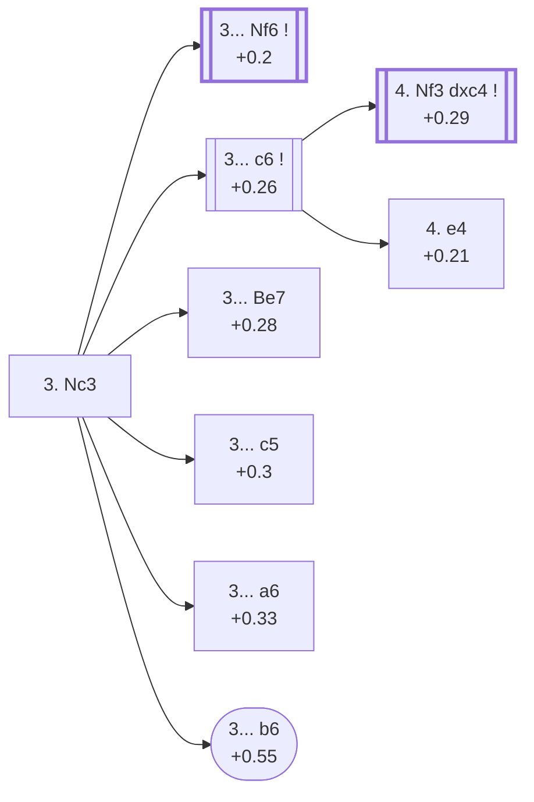

<a name="_TOP_"></a>

# D31 Queen's Gambit Declined: Queen's Knight Variation <br> 1. d4 d5 2. c4 e6 3. Nc3 #

Spun off from [D30's own "2... e6" card](https://github.com/onclemarcel/chess_flashcards/blob/main/d4_openings/D30_Queens_Gambit_Declined.md#_initial_move_) — masters' clear main try there (58.9%), already live-tagged its own code. `eco.md` leaves this bare tabiya named only "3.Nc3"; the live explorer independently names it the ***Queen's Knight Variation***. This is the true main road of the whole QGD complex, migrated out of D06's own "Queen's Gambit" card, where it had been built (thinly) as if it stayed there.

### Overview

*Quick map of every move covered on this card — see the [shape key](https://github.com/onclemarcel/chess_flashcards/blob/main/start.md#content-diagram-optional) in start.md.*

<!-- content-diagram:start -->

<!-- content-diagram:end -->

<a name="_initial_move_"></a>

[](https://lichess.org/analysis/standard/rnbqkbnr/ppp2ppp/4p3/3p4/2PP4/2N5/PP2PPPP/R1BQKBNR_b_KQkq_-_1_3)

*... 3. Nc3 — live-tagged the Queen's Knight Variation*

```
rnbqkbnr/ppp2ppp/4p3/3p4/2PP4/2N5/PP2PPPP/R1BQKBNR b KQkq - 1 3
```

|  | +0.2 |
| --- | --- |

<!-- lichess-stats:start fen="rnbqkbnr/ppp2ppp/4p3/3p4/2PP4/2N5/PP2PPPP/R1BQKBNR b KQkq - 1 3" db="lichess,masters" speeds="bullet,blitz" ratings="1800,2000,2200,2500" moves="6" -->
| Move | Online | W/D/B | Masters | W/D/B | |
| :--- | ---: | :--- | ---: | :--- | :-- |
| Nf6 | 16.5 M (57.3%) | ⬜⬜⬜⬜⬜🟫⬛⬛⬛⬛ 51/5/44 | 21 k (40.7%) | ⬜⬜⬜🟫🟫🟫🟫🟫⬛⬛ 34/50/16 |  |
| c6 | 4.5 M (15.7%) | ⬜⬜⬜⬜⬜🟫⬛⬛⬛⬛ 51/5/44 | 11 k (22.0%) | ⬜⬜⬜🟫🟫🟫🟫⬛⬛⬛ 30/43/27 |  |
| dxc4 | 2.0 M (7.1%) | ⬜⬜⬜⬜⬜🟫⬛⬛⬛⬛ 54/4/42 | 0 | — | ⚠ |
| c5 | 1.8 M (6.2%) | ⬜⬜⬜⬜⬜⬛⬛⬛⬛⬛ 47/5/48 | 5.2 k (10.0%) | ⬜⬜⬜⬜🟫🟫🟫🟫⬛⬛ 37/44/19 |  |
| Bb4 | 1.3 M (4.5%) | ⬜⬜⬜⬜⬜🟫⬛⬛⬛⬛ 54/5/42 | 2.6 k (5.0%) | ⬜⬜⬜🟫🟫🟫🟫⬛⬛⬛ 31/42/27 |  |
| f5 | 1.0 M (3.5%) | ⬜⬜⬜⬜⬜⬛⬛⬛⬛⬛ 47/5/47 | 0 | — | ⚠ |
| Be7 | 0 | — | 8.7 k (16.7%) | ⬜⬜⬜🟫🟫🟫🟫🟫⬛⬛ 35/48/17 |  |
| a6 | 0 | — | 1.9 k (3.6%) | ⬜⬜⬜🟫🟫🟫🟫⬛⬛⬛ 34/41/25 |  |

*Online: bullet/blitz, 1800+ — 28.8 M games. Masters: 52 k games. [Open in the explorer](https://lichess.org/analysis/standard/rnbqkbnr/ppp2ppp/4p3/3p4/2PP4/2N5/PP2PPPP/R1BQKBNR_b_KQkq_-_1_3#explorer) — updated 2026-09-07*
<!-- lichess-stats:end -->

Masters' clear main try is **3... Nf6** (40.7%) — its own code, [D35](https://github.com/onclemarcel/chess_flashcards/blob/main/d4_openings/D35_Queens_Gambit_Declined_Normal_Defense.md). **3... c6** (22.0%), the *Semi-Slav*, and **3... Be7** (16.7%), the *Charousek Variation*, both stay D31. **3... c5** (10.0%) is the *Tarrasch Defense*, its own code, [D32](https://github.com/onclemarcel/chess_flashcards/blob/main/d4_openings/D32_Tarrasch_Defense.md). **3... Bb4** (5.0%) is a real, if secondary, try left unmentioned in `eco.md`'s own D31-D39 listing, transposing toward Nimzo/Ragozin-flavoured lines elsewhere. **3... a6**, the *Janowski Variation*, is a genuine database rarity (3.6%), and **3... b6**, the *Alapin Variation*, is rarer still (7 masters games in the entire sample).

* **3... Nf6** (+0.2, 40.7% masters): its own code, [D35](https://github.com/onclemarcel/chess_flashcards/blob/main/d4_openings/D35_Queens_Gambit_Declined_Normal_Defense.md).
* [**3... c6**](#_SemiSlav_) (22.0% masters): the *Semi-Slav* — covered below.
* [**3... Be7**](#_Charousek_) (16.7% masters): the *Charousek Variation* — covered below.
* **3... c5** (+0.3, 10.0% masters): the *Tarrasch Defense* — its own code, [D32](https://github.com/onclemarcel/chess_flashcards/blob/main/d4_openings/D32_Tarrasch_Defense.md).
* **3... Bb4** (5.0% masters): a real secondary try, uncoded in this range — not covered further here.
* [**3... a6**](#_Janowski_) (3.6% masters): the *Janowski Variation* — covered below.
* [**3... b6**](#_Alapin31_): the *Alapin Variation* — covered below.

[*Back to TOP*](#_TOP_)

---

<a name="_Janowski_"></a>

## 3... a6 — Janowski Variation

[](https://lichess.org/analysis/standard/rnbqkbnr/1pp2ppp/p3p3/3p4/2PP4/2N5/PP2PPPP/R1BQKBNR_w_KQkq_-_0_4)

*... 3... a6 — Janowski Variation*

```
rnbqkbnr/1pp2ppp/p3p3/3p4/2PP4/2N5/PP2PPPP/R1BQKBNR w KQkq - 0 4
```

|  | +0.33 |
| --- | --- |

`eco.md`'s name matches the live explorer here — a third, unrelated "Janowski"-named line in this repo, alongside D07's Chigorin Defense fork and D08's Albin Countergambit sideline, all named for the same early-20th-century master Dawid Janowski. Prepares ... b5 without first developing — a genuine database rarity. Not built out further here (backlog).

[*Back to 3. Nc3*](#_initial_move_)
[*Back to TOP*](#_TOP_)

---

<a name="_Alapin31_"></a>

## 3... b6 — Alapin Variation

[](https://lichess.org/analysis/standard/rnbqkbnr/p1p2ppp/1p2p3/3p4/2PP4/2N5/PP2PPPP/R1BQKBNR_w_KQkq_-_0_4)

*... 3... b6 — Alapin Variation*

```
rnbqkbnr/p1p2ppp/1p2p3/3p4/2PP4/2N5/PP2PPPP/R1BQKBNR w KQkq - 0 4
```

|  | +0.55 |
| --- | --- |

`eco.md`'s name matches the live explorer here — the same Semyon Alapin already lending his name to unrelated lines elsewhere in this repo (e.g. the Sicilian's own Alapin Variation, 2.c3). An extreme database rarity: only 7 masters games in the entire sample. Prepares a queenside fianchetto rather than developing normally. Not built out further here (backlog).

[*Back to 3. Nc3*](#_initial_move_)
[*Back to TOP*](#_TOP_)

---

<a name="_Charousek_"></a>

## 3... Be7 — Charousek Variation

[](https://lichess.org/analysis/standard/rnbqk1nr/ppp1bppp/4p3/3p4/2PP4/2N5/PP2PPPP/R1BQKBNR_w_KQkq_-_2_4)

*... 3... Be7 — Charousek Variation*

```
rnbqk1nr/ppp1bppp/4p3/3p4/2PP4/2N5/PP2PPPP/R1BQKBNR w KQkq - 2 4
```

|  | +0.28 |
| --- | --- |

`eco.md`'s name matches the live explorer here — named for 19th-century Hungarian master Rudolf Charousek. Develops the bishop before the knight, sidestepping any future Bg5 pin. A real, if secondary, try (16.7% masters). Not built out further here (backlog).

[*Back to 3. Nc3*](#_initial_move_)
[*Back to TOP*](#_TOP_)

---

<a name="_SemiSlav_"></a>

## 3... c6 — Semi-Slav

[](https://lichess.org/analysis/standard/rnbqkbnr/pp3ppp/2p1p3/3p4/2PP4/2N5/PP2PPPP/R1BQKBNR_w_KQkq_-_0_4)

*... 3... c6 — live-tagged the Semi-Slav Defense: Accelerated Move Order*

```
rnbqkbnr/pp3ppp/2p1p3/3p4/2PP4/2N5/PP2PPPP/R1BQKBNR w KQkq - 0 4
```

|  | +0.26 |
| --- | --- |

<!-- lichess-stats:start fen="rnbqkbnr/pp3ppp/2p1p3/3p4/2PP4/2N5/PP2PPPP/R1BQKBNR w KQkq - 0 4" db="lichess,masters" speeds="bullet,blitz" ratings="1800,2000,2200,2500" moves="4" -->
| Move | Online | W/D/B | Masters | W/D/B | |
| :--- | ---: | :--- | ---: | :--- | :-- |
| Nf3 | 4.1 M (45.2%) | ⬜⬜⬜⬜⬜⬛⬛⬛⬛⬛ 51/5/45 | 3.7 k (29.6%) | ⬜⬜⬜🟫🟫🟫🟫⬛⬛⬛ 29/43/28 |  |
| cxd5 | 1.3 M (14.7%) | ⬜⬜⬜⬜⬜🟫⬛⬛⬛⬛ 51/5/44 | 1.2 k (9.2%) | ⬜⬜🟫🟫🟫🟫⬛⬛⬛⬛ 22/44/34 |  |
| e3 | 1.1 M (11.8%) | ⬜⬜⬜⬜⬜🟫⬛⬛⬛⬛ 51/5/44 | 5.1 k (40.2%) | ⬜⬜⬜🟫🟫🟫🟫⬛⬛⬛ 32/42/26 |  |
| e4 | 992 k (11.0%) | ⬜⬜⬜⬜⬜⬜⬛⬛⬛⬛ 55/5/40 | 2.4 k (19.4%) | ⬜⬜⬜⬜🟫🟫🟫🟫⬛⬛ 34/44/21 |  |

*Online: bullet/blitz, 1800+ — 9.0 M games. Masters: 13 k games. [Open in the explorer](https://lichess.org/analysis/standard/rnbqkbnr/pp3ppp/2p1p3/3p4/2PP4/2N5/PP2PPPP/R1BQKBNR_w_KQkq_-_0_4#explorer) — updated 2026-09-07*
<!-- lichess-stats:end -->

`eco.md` calls this the bare *Semi-Slav*; the live explorer independently names it the ***Accelerated Move Order*** — a real name divergence, and a fitting one: Black holds off ... Nf6 a move, ready to answer 4. Nf3 with an immediate ... dxc4. Masters' clear main try is **4. e3** (40.2%), transposing back toward the main Semi-Slav (out of this D31-coded range). **4. Nf3** (29.6%) heads for the named *Noteboom Variation*; **4. e4** (19.4%) is the direct *Marshall Gambit*.

* **4. e3** (40.2% masters): transposes toward the main Semi-Slav — not covered further here.
* [**4. Nf3 dxc4**](#_Noteboom_) (+0.29, 29.6% masters): the *Noteboom Variation* — covered below.
* [**4. e4**](#_MarshallGambit31_) (19.4% masters): the *Marshall Gambit* — covered below.

[*Back to 3. Nc3*](#_initial_move_)
[*Back to TOP*](#_TOP_)

---

<a name="_Noteboom_"></a>

## 4. Nf3 dxc4 — Noteboom Variation

[](https://lichess.org/analysis/standard/rnbqkbnr/pp3ppp/2p1p3/8/2pP4/2N2N2/PP2PPPP/R1BQKB1R_w_KQkq_-_0_5)

*... 4... dxc4 — Noteboom Variation*

```
rnbqkbnr/pp3ppp/2p1p3/8/2pP4/2N2N2/PP2PPPP/R1BQKB1R w KQkq - 0 5
```

|  | +0.29 |
| --- | --- |

<!-- lichess-stats:start fen="rnbqkbnr/pp3ppp/2p1p3/8/2pP4/2N2N2/PP2PPPP/R1BQKB1R w KQkq - 0 5" db="lichess,masters" speeds="bullet,blitz" ratings="1800,2000,2200,2500" moves="3" -->
| Move | Online | W/D/B | Masters | W/D/B | |
| :--- | ---: | :--- | ---: | :--- | :-- |
| a4 | 455 k (41.9%) | ⬜⬜⬜⬜⬜⬛⬛⬛⬛⬛ 48/4/47 | 1.7 k (62.0%) | ⬜⬜⬜🟫🟫🟫🟫⬛⬛⬛ 29/40/32 |  |
| e4 | 271 k (24.9%) | ⬜⬜⬜⬜⬜⬛⬛⬛⬛⬛ 48/4/48 | 0 | — | ⚠ |
| e3 | 139 k (12.8%) | ⬜⬜⬜⬜⬜⬛⬛⬛⬛⬛ 49/4/47 | 513 (19.1%) | ⬜⬜⬜🟫🟫🟫🟫⬛⬛⬛ 29/37/34 |  |
| Bg5 | 0 | — | 187 (7.0%) | ⬜⬜⬜⬜🟫🟫🟫🟫🟫⬛ 40/46/14 |  |

*Online: bullet/blitz, 1800+ — 1.1 M games. Masters: 2.7 k games. [Open in the explorer](https://lichess.org/analysis/standard/rnbqkbnr/pp3ppp/2p1p3/8/2pP4/2N2N2/PP2PPPP/R1BQKB1R_w_KQkq_-_0_5#explorer) — updated 2026-09-07*
<!-- lichess-stats:end -->

`eco.md`'s name matches the live explorer here — named for Dutch correspondence player Daniel Noteboom, one of the sharpest gambit lines in the whole QGD complex. Masters' clear main try is **5. a4** (62.0%), preventing ... b5 outright and heading for the deep fork below.

* [**5. a4 Bb4 6. e3 b5 7. Bd2**](#_ForkPoint_) (62.0% masters): forks the *Koomen*/*Junge*/*Abrahams Variations* — covered below.

[*Back to 3... c6*](#_SemiSlav_)
[*Back to TOP*](#_TOP_)

---

<a name="_ForkPoint_"></a>

## 5. a4 Bb4 6. e3 b5 7. Bd2

[](https://lichess.org/analysis/standard/rnbqk1nr/p4ppp/2p1p3/1p6/PbpP4/2N1PN2/1P1B1PPP/R2QKB1R_b_KQkq_-_1_7)

*... 7. Bd2*

```
rnbqk1nr/p4ppp/2p1p3/1p6/PbpP4/2N1PN2/1P1B1PPP/R2QKB1R b KQkq - 1 7
```

|  | +0.27 |
| --- | --- |

Left completely untagged live (`opening=None`) at this exact node despite forking three named `eco.md` entries. Masters' overwhelming reply is **7... a5** (86.2%) — itself the *Abrahams Variation*; **7... Qe7** (the *Koomen Variation*) and **7... Qb6** (the *Junge Variation*) are both genuine minority tries.

* [**7... Qe7**](#_Koomen_) (2.9% masters): the *Koomen Variation* — covered below.
* [**7... Qb6**](#_Junge_) (1.6% masters): the *Junge Variation* — covered below.
* [**7... a5**](#_Abrahams_) (86.2% masters): the *Abrahams Variation* — covered below.

[*Back to 4. Nf3 dxc4*](#_Noteboom_)
[*Back to TOP*](#_TOP_)

---

<a name="_Koomen_"></a>

## 7... Qe7 — Koomen Variation

[](https://lichess.org/analysis/standard/rnb1k1nr/p3qppp/2p1p3/1p6/PbpP4/2N1PN2/1P1B1PPP/R2QKB1R_w_KQkq_-_2_8)

*... 7... Qe7 — Koomen Variation*

```
rnb1k1nr/p3qppp/2p1p3/1p6/PbpP4/2N1PN2/1P1B1PPP/R2QKB1R w KQkq - 2 8
```

|  | +0.38 |
| --- | --- |

`eco.md`'s name matches the live explorer here. Prepares ... Rb8/... Bb7 while keeping the queen flexible — a genuine minority try (2.9% masters). Not built out further here (backlog).

[*Back to 5. a4 Bb4 6. e3 b5 7. Bd2*](#_ForkPoint_)
[*Back to TOP*](#_TOP_)

---

<a name="_Junge_"></a>

## 7... Qb6 — Junge Variation

[](https://lichess.org/analysis/standard/rnb1k1nr/p4ppp/1qp1p3/1p6/PbpP4/2N1PN2/1P1B1PPP/R2QKB1R_w_KQkq_-_2_8)

*... 7... Qb6 — Junge Variation*

```
rnb1k1nr/p4ppp/1qp1p3/1p6/PbpP4/2N1PN2/1P1B1PPP/R2QKB1R w KQkq - 2 8
```

|  | +0.52 |
| --- | --- |

`eco.md`'s name matches the live explorer here — named for German master Klaus Junge. Eyes b2 and d4 immediately — a genuine minority try (1.6% masters). Not built out further here (backlog).

[*Back to 5. a4 Bb4 6. e3 b5 7. Bd2*](#_ForkPoint_)
[*Back to TOP*](#_TOP_)

---

<a name="_Abrahams_"></a>

## 7... a5 — Abrahams Variation

[](https://lichess.org/analysis/standard/rnbqk1nr/5ppp/2p1p3/pp6/PbpP4/2N1PN2/1P1B1PPP/R2QKB1R_w_KQkq_a6_0_8)

*... 7... a5 — Abrahams Variation*

```
rnbqk1nr/5ppp/2p1p3/pp6/PbpP4/2N1PN2/1P1B1PPP/R2QKB1R w KQkq a6 0 8
```

|  | +0.33 |
| --- | --- |

`eco.md`'s name matches the live explorer here — named for English master Gerald Abrahams. Fixes the queenside pawn structure before White can play a5 first, masters' overwhelming choice (86.2%) at this fork — the true main line of the whole Noteboom complex. Not built out further here (backlog).

[*Back to 5. a4 Bb4 6. e3 b5 7. Bd2*](#_ForkPoint_)
[*Back to TOP*](#_TOP_)

---

<a name="_MarshallGambit31_"></a>

## 3... c6 4. e4 — Marshall Gambit

[](https://lichess.org/analysis/standard/rnbqkbnr/pp3ppp/2p1p3/3p4/2PPP3/2N5/PP3PPP/R1BQKBNR_b_KQkq_e3_0_4)

*... 4. e4 — Marshall Gambit*

```
rnbqkbnr/pp3ppp/2p1p3/3p4/2PPP3/2N5/PP3PPP/R1BQKBNR b KQkq e3 0 4
```

|  | +0.21 |
| --- | --- |

`eco.md`'s name matches the live explorer here — named for Frank Marshall, and a completely unrelated gambit from D32's own, much deeper "Tarrasch, Marshall Gambit" (5.e4 in that tree), despite sharing both the namesake and the pawn-sacrifice idea. Grabs the full centre immediately, banking on rapid development to outweigh the structural risk. Masters' overwhelming reply is **4... dxe4** (86.4%). Not built out further here (backlog).

[*Back to 3... c6*](#_SemiSlav_)
[*Back to TOP*](#_TOP_)
