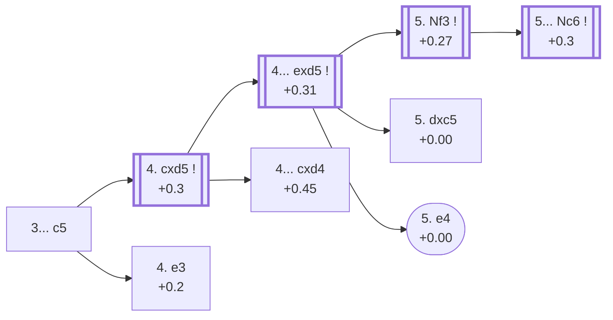

<a name="_TOP_"></a>

# D32 Tarrasch Defense <br> 1. d4 d5 2. c4 e6 3. Nc3 c5 #

Spun off from [D31's own "3. Nc3" candidate bullet](https://github.com/onclemarcel/chess_flashcards/blob/main/d4_openings/D31_Queens_Gambit_Declined_Queens_Knight_Variation.md#_initial_move_), which showed White's 3rd-move split but had no candidate bullets pointing anywhere past it — a genuine zero-coverage gap surfaced by a full A00-E99 ECO-code audit. **Almost missed by a naive text search**: this repo already covers an *unrelated* "Tarrasch Variation" on the French (3. Nd2) and Caro-Kann (3. Nd2) cards, sharing the same 19th-century namesake (Siegbert Tarrasch) but nothing else — this is the actual Tarrasch **Defense**, a QGD system where Black strikes back at the centre with ... c5 immediately rather than developing quietly. It accepts an isolated queen's pawn after the near-inevitable cxd5/exd5 trade in exchange for active piece play — one of the most heavily analysed structures in chess, championed by Tarrasch himself against the "always keep pawns healthy" dogma of his era.

### Overview

*Quick map of every move covered on this card — see the [shape key](https://github.com/onclemarcel/chess_flashcards/blob/main/start.md#content-diagram-optional) in start.md.*

<!-- content-diagram:start -->

<!-- content-diagram:end -->

<a name="_initial_move_"></a>

[](https://lichess.org/analysis/standard/rnbqkbnr/pp3ppp/4p3/2pp4/2PP4/2N5/PP2PPPP/R1BQKBNR_w_KQkq_c6_0_4)

*... 1. d4 d5 2. c4 e6 3. Nc3 c5 — Tarrasch Defense*

```
rnbqkbnr/pp3ppp/4p3/2pp4/2PP4/2N5/PP2PPPP/R1BQKBNR w KQkq c6 0 4
```

|  | +0.3 |
| --- | --- |

<!-- lichess-stats:start fen="rnbqkbnr/pp3ppp/4p3/2pp4/2PP4/2N5/PP2PPPP/R1BQKBNR w KQkq c6 0 4" db="lichess,masters" speeds="bullet,blitz" ratings="1800,2000,2200,2500" moves="4" -->
| Move | Online | W/D/B | Masters | W/D/B | |
| :--- | ---: | :--- | ---: | :--- | :-- |
| cxd5 | 800 k (42.1%) | ⬜⬜⬜⬜⬜⬛⬛⬛⬛⬛ 47/6/47 | 4.4 k (84.1%) | ⬜⬜⬜⬜🟫🟫🟫🟫⬛⬛ 37/44/18 |  |
| Nf3 | 493 k (25.9%) | ⬜⬜⬜⬜⬜⬛⬛⬛⬛⬛ 47/5/48 | 136 (2.6%) | ⬜⬜⬜🟫🟫🟫🟫⬛⬛⬛ 35/36/29 |  |
| e3 | 354 k (18.6%) | ⬜⬜⬜⬜⬜⬛⬛⬛⬛⬛ 48/5/47 | 674 (13.0%) | ⬜⬜⬜⬜🟫🟫🟫🟫⬛⬛ 37/42/21 |  |
| dxc5 | 134 k (7.0%) | ⬜⬜⬜⬜⬜⬛⬛⬛⬛⬛ 48/5/47 | 14 (0.3%) | — |  |

*Online: bullet/blitz, 1800+ — 1.9 M games. Masters: 5.2 k games. [Open in the explorer](https://lichess.org/analysis/standard/rnbqkbnr/pp3ppp/4p3/2pp4/2PP4/2N5/PP2PPPP/R1BQKBNR_w_KQkq_c6_0_4#explorer) — updated 2026-09-09*
<!-- lichess-stats:end -->

**4. cxd5** is masters' clear main try (84.1%) — trading immediately before Black can support the centre further. **4. e3** (13.0%) declines the trade for now, keeping options flexible a move longer. Not built out further here.

### Candidate moves

* [**4. cxd5**](#_cxd5_) (+0.3, 84.1% masters): the line this card follows.
* **4. e3** (+0.2, 13.0% masters): a real, solid alternative — declines the trade a move longer.

[*Back to TOP*](#_TOP_)

---

<a name="_cxd5_"></a>

## 4. cxd5

[](https://lichess.org/analysis/standard/rnbqkbnr/pp3ppp/4p3/2pP4/3P4/2N5/PP2PPPP/R1BQKBNR_b_KQkq_-_0_4)

*... 4. cxd5*

```
rnbqkbnr/pp3ppp/4p3/2pP4/3P4/2N5/PP2PPPP/R1BQKBNR b KQkq - 0 4
```

|  | +0.31 |
| --- | --- |

<!-- lichess-stats:start fen="rnbqkbnr/pp3ppp/4p3/2pP4/3P4/2N5/PP2PPPP/R1BQKBNR b KQkq - 0 4" db="lichess,masters" speeds="bullet,blitz" ratings="1800,2000,2200,2500" moves="3" -->
| Move | Online | W/D/B | Masters | W/D/B | |
| :--- | ---: | :--- | ---: | :--- | :-- |
| exd5 | 520 k (64.0%) | ⬜⬜⬜⬜⬜🟫⬛⬛⬛⬛ 48/6/46 | 3.5 k (80.2%) | ⬜⬜⬜🟫🟫🟫🟫🟫⬛⬛ 36/48/16 |  |
| cxd4 | 277 k (34.1%) | ⬜⬜⬜⬜🟫⬛⬛⬛⬛⬛ 44/5/50 | 862 (19.8%) | ⬜⬜⬜⬜🟫🟫🟫⬛⬛⬛ 41/32/27 |  |
| Nf6 | 11 k (1.4%) | ⬜⬜⬜⬜⬜⬛⬛⬛⬛⬛ 49/4/46 | 0 | — | ⚠ |
| a5 | 0 | — | 1 (0.0%) | — |  |

*Online: bullet/blitz, 1800+ — 813 k games. Masters: 4.4 k games. [Open in the explorer](https://lichess.org/analysis/standard/rnbqkbnr/pp3ppp/4p3/2pP4/3P4/2N5/PP2PPPP/R1BQKBNR_b_KQkq_-_0_4#explorer) — updated 2026-09-09*
<!-- lichess-stats:end -->

Left completely untagged live (`opening=None`) at this exact node. Masters recapture with the pawn (**4... exd5**, 80.2%) to keep the isolated d-pawn mobile and central rather than doubled, but **4... cxd4** is a real, secondary try (19.8%) — the *Schara Gambit* (`eco.md`: von Hennig-Schara Gambit).

* [**4... exd5**](#_exd5_) (+0.31, 80.2% masters): the line this card follows.
* [**4... cxd4**](#_Schara_) (19.8% masters): the *Schara Gambit* — covered below.

[*Back to 3... c5*](#_initial_move_)
[*Back to TOP*](#_TOP_)

---

<a name="_Schara_"></a>

## 4... cxd4 — Schara Gambit

[](https://lichess.org/analysis/standard/rnbqkbnr/pp3ppp/4p3/3P4/3p4/2N5/PP2PPPP/R1BQKBNR_w_KQkq_-_0_5)

*... 4... cxd4 — live-tagged the Schara Gambit*

```
rnbqkbnr/pp3ppp/4p3/3P4/3p4/2N5/PP2PPPP/R1BQKBNR w KQkq - 0 5
```

|  | +0.45 |
| --- | --- |

`eco.md` calls this the *von Hennig-Schara Gambit*; the live explorer drops the "von Hennig" half, tagging it just the ***Schara Gambit*** — a real, partial name divergence. Black offers the c-pawn back to keep the d-file open and White's own d-pawn advanced and exposed rather than recapturing. Masters split between **5. Qa4+** (68.2%) and **5. Qxd4** (31.8%). Not built out further here (backlog).

[*Back to 4. cxd5*](#_cxd5_)
[*Back to TOP*](#_TOP_)

---

<a name="_exd5_"></a>

## 4... exd5

[](https://lichess.org/analysis/standard/rnbqkbnr/pp3ppp/8/2pp4/3P4/2N5/PP2PPPP/R1BQKBNR_w_KQkq_-_0_5)

*... 4... exd5 — Tarrasch Defense*

```
rnbqkbnr/pp3ppp/8/2pp4/3P4/2N5/PP2PPPP/R1BQKBNR w KQkq - 0 5
```

|  | +0.27 |
| --- | --- |

<!-- lichess-stats:start fen="rnbqkbnr/pp3ppp/8/2pp4/3P4/2N5/PP2PPPP/R1BQKBNR w KQkq - 0 5" db="lichess,masters" speeds="bullet,blitz" ratings="1800,2000,2200,2500" moves="3" -->
| Move | Online | W/D/B | Masters | W/D/B | |
| :--- | ---: | :--- | ---: | :--- | :-- |
| Nf3 | 387 k (56.4%) | ⬜⬜⬜⬜⬜🟫⬛⬛⬛⬛ 49/7/45 | 3.5 k (96.6%) | ⬜⬜⬜⬜🟫🟫🟫🟫🟫⬛ 36/48/16 |  |
| dxc5 | 168 k (24.4%) | ⬜⬜⬜⬜⬜⬛⬛⬛⬛⬛ 45/5/50 | 77 (2.1%) | ⬜⬜⬜🟫🟫🟫🟫🟫⬛⬛ 34/48/18 |  |
| e3 | 75 k (10.9%) | ⬜⬜⬜⬜⬜⬛⬛⬛⬛⬛ 47/5/48 | 0 | — | ⚠ |
| e4 | 0 | — | 37 (1.0%) | ⬜⬜⬜⬜⬜🟫🟫⬛⬛⬛ 49/22/30 |  |

*Online: bullet/blitz, 1800+ — 686 k games. Masters: 3.6 k games. [Open in the explorer](https://lichess.org/analysis/standard/rnbqkbnr/pp3ppp/8/2pp4/3P4/2N5/PP2PPPP/R1BQKBNR_w_KQkq_-_0_5#explorer) — updated 2026-09-09*
<!-- lichess-stats:end -->

`eco.md` reuses this card's own root name here, "Tarrasch Defence" (live matches). Masters' overwhelming reply is **5. Nf3** (96.6%), developing naturally before deciding how to meet Black's own development. Two real minority tries carry their own `eco.md` names: **5. dxc5** (2.1%), the *Tarrasch Gambit*, and **5. e4** (1.0%), the *Marshall Gambit* — unrelated to D31's own Semi-Slav Marshall Gambit.

* [**5. Nf3**](#_Nf3_) (+0.27, 96.6% masters): the line this card follows.
* [**5. dxc5 d4 6. Na4 b5**](#_TarraschGambit_) (+0.00, 2.1% masters): the *Tarrasch Gambit* — covered below.
* [**5. e4**](#_MarshallGambit32_) (1.0% masters): the *Marshall Gambit* — covered below.

[*Back to 4. cxd5*](#_cxd5_)
[*Back to TOP*](#_TOP_)

---

<a name="_TarraschGambit_"></a>

## 5. dxc5 d4 6. Na4 b5 — Tarrasch Gambit

[](https://lichess.org/analysis/standard/rnbqkbnr/p4ppp/8/1pP5/N2p4/8/PP2PPPP/R1BQKBNR_w_KQkq_b6_0_7)

*... 6... b5 — Tarrasch Gambit*

```
rnbqkbnr/p4ppp/8/1pP5/N2p4/8/PP2PPPP/R1BQKBNR w KQkq b6 0 7
```

|  | +0.00 |
| --- | --- |

`eco.md`'s name matches the live explorer here. White grabs the c5 pawn instead of developing normally, and Black offers a further pawn to keep the a4-knight offside and the d4 pawn cramping White's own position. A genuine database rarity (2.1% masters), dead level according to Stockfish. Masters' overwhelming reply is **7. cxb6**, accepting the second pawn. Not built out further here (backlog).

[*Back to 4... exd5*](#_exd5_)
[*Back to TOP*](#_TOP_)

---

<a name="_MarshallGambit32_"></a>

## 5. e4 — Marshall Gambit

[](https://lichess.org/analysis/standard/rnbqkbnr/pp3ppp/8/2pp4/3PP3/2N5/PP3PPP/R1BQKBNR_b_KQkq_e3_0_5)

*... 5. e4 — Marshall Gambit*

```
rnbqkbnr/pp3ppp/8/2pp4/3PP3/2N5/PP3PPP/R1BQKBNR b KQkq e3 0 5
```

|  | +0.00 |
| --- | --- |

`eco.md`'s name matches the live explorer here — a completely unrelated gambit from D31's own, much shallower "Semi-Slav, Marshall Gambit" (3...c6 4.e4), despite sharing both the namesake (Frank Marshall) and the pawn-sacrifice idea. Grabs the centre before recapturing on c5, banking on rapid development. Masters' overwhelming reply is **5... dxe4**. A genuine database rarity at this exact node (1.0% masters). Not built out further here (backlog).

[*Back to 4... exd5*](#_exd5_)
[*Back to TOP*](#_TOP_)

---

<a name="_Nf3_"></a>

## 5. Nf3

Masters' overwhelming reply is **5... Nc6** (92.8%) — developing the queenside knight to its most natural square before committing the kingside one, matching the isolated-pawn plan of active piece play over structural purity.

[](https://lichess.org/analysis/standard/r1bqkbnr/pp3ppp/2n5/2pp4/3P4/2N2N2/PP2PPPP/R1BQKB1R_w_KQkq_-_1_6)

*... 5... Nc6 — Tarrasch Defense*

```
r1bqkbnr/pp3ppp/2n5/2pp4/3P4/2N2N2/PP2PPPP/R1BQKB1R w KQkq - 1 6
```

|  | +0.3 |
| --- | --- |

<!-- lichess-stats:start fen="r1bqkbnr/pp3ppp/2n5/2pp4/3P4/2N2N2/PP2PPPP/R1BQKB1R w KQkq - 1 6" db="lichess,masters" speeds="bullet,blitz" ratings="1800,2000,2200,2500" moves="3" -->
| Move | Online | W/D/B | Masters | W/D/B | |
| :--- | ---: | :--- | ---: | :--- | :-- |
| g3 | 180 k (41.3%) | ⬜⬜⬜⬜⬜🟫⬛⬛⬛⬛ 47/8/45 | 3.4 k (74.1%) | ⬜⬜⬜⬜🟫🟫🟫🟫⬛⬛ 37/45/17 |  |
| e3 | 78 k (17.9%) | ⬜⬜⬜⬜⬜⬛⬛⬛⬛⬛ 47/6/47 | 0 | — | ⚠ |
| dxc5 | 74 k (16.9%) | ⬜⬜⬜⬜🟫⬛⬛⬛⬛⬛ 46/7/47 | 560 (12.4%) | ⬜⬜⬜🟫🟫🟫🟫🟫🟫⬛ 33/61/6 |  |
| Bg5 | 0 | — | 250 (5.5%) | ⬜⬜⬜🟫🟫🟫🟫🟫⬛⬛ 34/45/21 |  |

*Online: bullet/blitz, 1800+ — 435 k games. Masters: 4.5 k games. [Open in the explorer](https://lichess.org/analysis/standard/r1bqkbnr/pp3ppp/2n5/2pp4/3P4/2N2N2/PP2PPPP/R1BQKB1R_w_KQkq_-_1_6#explorer) — updated 2026-09-09*
<!-- lichess-stats:end -->

**5... Nc6** heads for the *Rubinstein System* — its own code, [D33](https://github.com/onclemarcel/chess_flashcards/blob/main/d4_openings/D33_Tarrasch_Defense_Rubinstein_System.md).

* **5... Nc6**: its own code, [D33](https://github.com/onclemarcel/chess_flashcards/blob/main/d4_openings/D33_Tarrasch_Defense_Rubinstein_System.md).

[*Back to 4... exd5*](#_exd5_)
[*Back to TOP*](#_TOP_)
