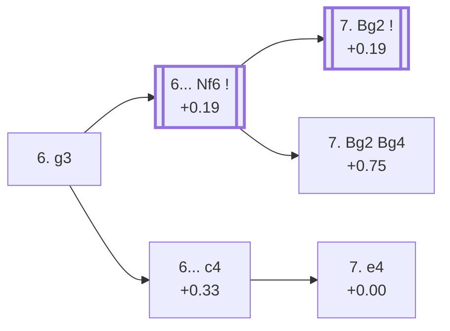

<a name="_TOP_"></a>

# D33 Tarrasch Defense: Rubinstein System <br> 1. d4 d5 2. c4 e6 3. Nc3 c5 4. cxd5 exd5 5. Nf3 Nc6 6. g3 #

Spun off from [D32's own "5. Nf3" card](https://github.com/onclemarcel/chess_flashcards/blob/main/d4_openings/D32_Tarrasch_Defense.md#_Nf3_) — masters' overwhelming reply there (92.8%), already live-tagged its own code. **6. g3** is masters' clear main try (74.1%) — fianchettoing to pressure d5 from a distance rather than blocking it with a piece, the modern main plan against the Tarrasch's isolated pawn.

### Overview

*Quick map of every move covered on this card — see the [shape key](https://github.com/onclemarcel/chess_flashcards/blob/main/start.md#content-diagram-optional) in start.md.*

<!-- content-diagram:start -->

<!-- content-diagram:end -->

<a name="_initial_move_"></a>

[](https://lichess.org/analysis/standard/r1bqkbnr/pp3ppp/2n5/2pp4/3P4/2N2NP1/PP2PP1P/R1BQKB1R_b_KQkq_-_0_6)

*... 6. g3 — Rubinstein System*

```
r1bqkbnr/pp3ppp/2n5/2pp4/3P4/2N2NP1/PP2PP1P/R1BQKB1R b KQkq - 0 6
```

|  | +0.29 |
| --- | --- |

<!-- lichess-stats:start fen="r1bqkbnr/pp3ppp/2n5/2pp4/3P4/2N2NP1/PP2PP1P/R1BQKB1R b KQkq - 0 6" db="lichess,masters" speeds="bullet,blitz" ratings="1800,2000,2200,2500" moves="3" -->
| Move | Online | W/D/B | Masters | W/D/B | |
| :--- | ---: | :--- | ---: | :--- | :-- |
| Nf6 | 165 k (81.1%) | ⬜⬜⬜⬜⬜🟫⬛⬛⬛⬛ 46/9/46 | 3.1 k (90.4%) | ⬜⬜⬜⬜🟫🟫🟫🟫⬛⬛ 37/46/17 |  |
| c4 | 14 k (6.8%) | ⬜⬜⬜⬜⬜🟫⬛⬛⬛⬛ 49/6/45 | 294 (8.5%) | ⬜⬜⬜⬜🟫🟫🟫🟫⬛⬛ 37/38/25 |  |
| cxd4 | 11 k (5.5%) | ⬜⬜⬜⬜⬜🟫⬛⬛⬛⬛ 53/6/40 | 17 (0.5%) | — |  |

*Online: bullet/blitz, 1800+ — 203 k games. Masters: 3.5 k games. [Open in the explorer](https://lichess.org/analysis/standard/r1bqkbnr/pp3ppp/2n5/2pp4/3P4/2N2NP1/PP2PP1P/R1BQKB1R_b_KQkq_-_0_6#explorer) — updated 2026-09-07*
<!-- lichess-stats:end -->

Masters' overwhelming choice is **6... Nf6** (90.4%), completing development before deciding on the bishop's diagonal. **6... c4** (8.5%) stakes out queenside space immediately instead, the named *Folkestone (Swedish) Variation*.

* [**6... Nf6**](#_Prague_) (90.4% masters): the *Prague Variation* — covered below.
* [**6... c4**](#_Folkestone_) (8.5% masters): the *Folkestone (Swedish) Variation* — covered below.

[*Back to TOP*](#_TOP_)

---

<a name="_Folkestone_"></a>

## 6... c4 — Folkestone (Swedish) Variation

[](https://lichess.org/analysis/standard/r1bqkbnr/pp3ppp/2n5/3p4/2pP4/2N2NP1/PP2PP1P/R1BQKB1R_w_KQkq_-_0_7)

*... 6... c4 — Folkestone (Swedish) Variation*

```
r1bqkbnr/pp3ppp/2n5/3p4/2pP4/2N2NP1/PP2PP1P/R1BQKB1R w KQkq - 0 7
```

|  | +0.33 |
| --- | --- |

`eco.md`'s name matches the live explorer here — named for the 1933 Folkestone Olympiad. Fixes the queenside pawn structure and gains space rather than allowing White's own dxc5-style resolutions. A real, secondary try (8.5% masters). Masters' clear main try in reply is **7. e4** — the named *Rey Ardid Variation*.

* [**7. e4**](#_ReyArdid_): the *Rey Ardid Variation* — covered below.

[*Back to 6. g3*](#_initial_move_)
[*Back to TOP*](#_TOP_)

---

<a name="_ReyArdid_"></a>

## 7. e4 — Schlechter-Rubinstein System, Rey Ardid Variation

[](https://lichess.org/analysis/standard/r1bqkbnr/pp3ppp/2n5/3p4/2pPP3/2N2NP1/PP3P1P/R1BQKB1R_b_KQkq_e3_0_7)

*... 7. e4 — Rey Ardid Variation*

```
r1bqkbnr/pp3ppp/2n5/3p4/2pPP3/2N2NP1/PP3P1P/R1BQKB1R b KQkq e3 0 7
```

|  | +0.00 |
| --- | --- |

`eco.md`'s name matches the live explorer here — named for Spanish master Ramón Rey Ardid. Strikes back in the centre immediately, challenging Black's own space grab rather than fianchettoing further. Dead level according to Stockfish. Not built out further here (backlog).

[*Back to 6... c4*](#_Folkestone_)
[*Back to TOP*](#_TOP_)

---

<a name="_Prague_"></a>

## 6... Nf6 — Prague Variation

[](https://lichess.org/analysis/standard/r1bqkb1r/pp3ppp/2n2n2/2pp4/3P4/2N2NP1/PP2PP1P/R1BQKB1R_w_KQkq_-_1_7)

*... 6... Nf6 — Prague Variation*

```
r1bqkb1r/pp3ppp/2n2n2/2pp4/3P4/2N2NP1/PP2PP1P/R1BQKB1R w KQkq - 1 7
```

|  | +0.19 |
| --- | --- |

<!-- lichess-stats:start fen="r1bqkb1r/pp3ppp/2n2n2/2pp4/3P4/2N2NP1/PP2PP1P/R1BQKB1R w KQkq - 1 7" db="lichess,masters" speeds="bullet,blitz" ratings="1800,2000,2200,2500" moves="3" -->
| Move | Online | W/D/B | Masters | W/D/B | |
| :--- | ---: | :--- | ---: | :--- | :-- |
| Bg2 | 292 k (95.8%) | ⬜⬜⬜⬜⬜🟫⬛⬛⬛⬛ 48/8/44 | 3.9 k (98.7%) | ⬜⬜⬜🟫🟫🟫🟫🟫⬛⬛ 36/48/16 |  |
| Bg5 | 5.6 k (1.8%) | ⬜⬜⬜⬜🟫⬛⬛⬛⬛⬛ 45/7/48 | 10 (0.3%) | — |  |
| dxc5 | 4.7 k (1.5%) | ⬜⬜⬜⬜🟫⬛⬛⬛⬛⬛ 45/6/49 | 0 | — | ⚠ |
| a3 | 0 | — | 36 (0.9%) | ⬜⬜⬜⬜⬜🟫🟫🟫🟫🟫 47/47/6 |  |

*Online: bullet/blitz, 1800+ — 305 k games. Masters: 4.0 k games. [Open in the explorer](https://lichess.org/analysis/standard/r1bqkb1r/pp3ppp/2n2n2/2pp4/3P4/2N2NP1/PP2PP1P/R1BQKB1R_w_KQkq_-_1_7#explorer) — updated 2026-09-07*
<!-- lichess-stats:end -->

`eco.md`'s name matches the live explorer here — named for the 1908 Prague masters tournament. Masters' near-unanimous reply is **7. Bg2** (+0.19, 98.7%), completing the fianchetto — its own deeper code, [D34](https://github.com/onclemarcel/chess_flashcards/blob/main/d4_openings/D34_Tarrasch_Defense_Prague_Main_Line.md), reached via 7...Be7. The rarer **7... Bg2 Bg4** stays D33 as the *Wagner Variation*.

* **7. Bg2 Be7**: its own code, [D34](https://github.com/onclemarcel/chess_flashcards/blob/main/d4_openings/D34_Tarrasch_Defense_Prague_Main_Line.md).
* [**7. Bg2 Bg4**](#_Wagner_): the *Wagner Variation* — covered below.

[*Back to 6. g3*](#_initial_move_)
[*Back to TOP*](#_TOP_)

---

<a name="_Wagner_"></a>

## 7. Bg2 Bg4 — Wagner Variation

[](https://lichess.org/analysis/standard/r2qkb1r/pp3ppp/2n2n2/2pp4/3P2b1/2N2NP1/PP2PPBP/R1BQK2R_w_KQkq_-_3_8)

*... 7... Bg4 — Wagner Variation*

```
r2qkb1r/pp3ppp/2n2n2/2pp4/3P2b1/2N2NP1/PP2PPBP/R1BQK2R w KQkq - 3 8
```

|  | +0.75 |
| --- | --- |

`eco.md`'s name matches the live explorer here. **7. Bg2 Bg4** (+0.75) pins the f3-knight rather than developing the bishop to e7 — a real, if secondary, try, and Stockfish already gives White a clear edge. Not built out further here (backlog).

[*Back to 6... Nf6*](#_Prague_)
[*Back to TOP*](#_TOP_)
