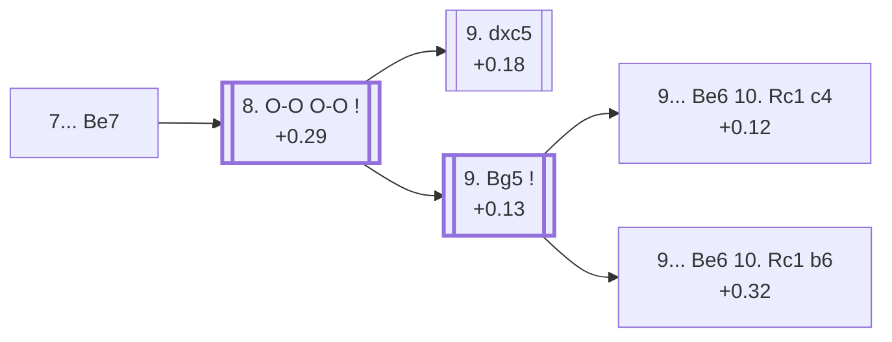

<a name="_TOP_"></a>

# D34 Tarrasch Defense: Prague Variation, Main Line <br> 1. d4 d5 2. c4 e6 3. Nc3 c5 4. cxd5 exd5 5. Nf3 Nc6 6. g3 Nf6 7. Bg2 Be7 #

Spun off from [D33's own "6... Nf6" card](https://github.com/onclemarcel/chess_flashcards/blob/main/d4_openings/D33_Tarrasch_Defense_Rubinstein_System.md#_Prague_) — masters' near-unanimous reply there (98.7%), already live-tagged its own code. `eco.md` leaves this exact tabiya named only "Prague Variation, 7...Be7"; the live explorer compounds the name a step further, already calling it the ***Prague Variation, Main Line*** here, before Black has even castled.

### Overview

*Quick map of every move covered on this card — see the [shape key](https://github.com/onclemarcel/chess_flashcards/blob/main/start.md#content-diagram-optional) in start.md.*

<!-- content-diagram:start -->

<!-- content-diagram:end -->

<a name="_initial_move_"></a>

[](https://lichess.org/analysis/standard/r1bqk2r/pp2bppp/2n2n2/2pp4/3P4/2N2NP1/PP2PPBP/R1BQK2R_w_KQkq_-_3_8)

*... 7... Be7 — live-tagged the Prague Variation, Main Line*

```
r1bqk2r/pp2bppp/2n2n2/2pp4/3P4/2N2NP1/PP2PPBP/R1BQK2R w KQkq - 3 8
```

|  | +0.29 |
| --- | --- |

<!-- lichess-stats:start fen="r1bqk2r/pp2bppp/2n2n2/2pp4/3P4/2N2NP1/PP2PPBP/R1BQK2R w KQkq - 3 8" db="lichess,masters" speeds="bullet,blitz" ratings="1800,2000,2200,2500" moves="3" -->
| Move | Online | W/D/B | Masters | W/D/B | |
| :--- | ---: | :--- | ---: | :--- | :-- |
| O-O | 150 k (89.6%) | ⬜⬜⬜⬜⬜🟫⬛⬛⬛⬛ 48/8/44 | 3.6 k (98.7%) | ⬜⬜⬜⬜🟫🟫🟫🟫⬛⬛ 37/46/17 |  |
| dxc5 | 10 k (6.2%) | ⬜⬜⬜⬜⬜🟫⬛⬛⬛⬛ 47/7/46 | 28 (0.8%) | ⬜⬜⬜⬜🟫🟫🟫🟫🟫⬛ 39/50/11 |  |
| Bg5 | 4.5 k (2.7%) | ⬜⬜⬜⬜🟫⬛⬛⬛⬛⬛ 45/8/47 | 16 (0.4%) | — |  |

*Online: bullet/blitz, 1800+ — 168 k games. Masters: 3.7 k games. [Open in the explorer](https://lichess.org/analysis/standard/r1bqk2r/pp2bppp/2n2n2/2pp4/3P4/2N2NP1/PP2PPBP/R1BQK2R_w_KQkq_-_3_8#explorer) — updated 2026-09-07*
<!-- lichess-stats:end -->

Masters' near-unanimous reply is **8. O-O** (98.7%), and Black castles right back.

* [**8. O-O O-O**](#_Normal_) (+0.29, 98.7% masters): see below.

[*Back to TOP*](#_TOP_)

---

<a name="_Normal_"></a>

## 8. O-O O-O — Classical Variation

[](https://lichess.org/analysis/standard/r1bq1rk1/pp2bppp/2n2n2/2pp4/3P4/2N2NP1/PP2PPBP/R1BQ1RK1_w_-_-_5_9)

*... 8... O-O — live-tagged the Classical Variation*

```
r1bq1rk1/pp2bppp/2n2n2/2pp4/3P4/2N2NP1/PP2PPBP/R1BQ1RK1 w - - 5 9
```

|  | +0.29 |
| --- | --- |

<!-- lichess-stats:start fen="r1bq1rk1/pp2bppp/2n2n2/2pp4/3P4/2N2NP1/PP2PPBP/R1BQ1RK1 w - - 5 9" db="lichess,masters" speeds="bullet,blitz" ratings="1800,2000,2200,2500" moves="5" -->
| Move | Online | W/D/B | Masters | W/D/B | |
| :--- | ---: | :--- | ---: | :--- | :-- |
| Bg5 | 151 k (36.6%) | ⬜⬜⬜⬜⬜🟫⬛⬛⬛⬛ 48/8/44 | 3.4 k (53.4%) | ⬜⬜⬜⬜🟫🟫🟫🟫🟫⬛ 38/47/15 |  |
| dxc5 | 132 k (32.0%) | ⬜⬜⬜⬜⬜🟫⬛⬛⬛⬛ 50/8/42 | 1.9 k (30.5%) | ⬜⬜⬜⬜🟫🟫🟫🟫🟫⬛ 39/46/15 |  |
| Bf4 | 40 k (9.7%) | ⬜⬜⬜⬜⬜🟫⬛⬛⬛⬛ 51/6/43 | 181 (2.8%) | ⬜⬜⬜⬜🟫🟫🟫⬛⬛⬛ 45/29/26 |  |
| b3 | 35 k (8.4%) | ⬜⬜⬜⬜⬜🟫⬛⬛⬛⬛ 51/8/41 | 573 (9.0%) | ⬜⬜⬜⬜🟫🟫🟫🟫⬛⬛ 40/43/17 |  |
| Be3 | 14 k (3.5%) | ⬜⬜⬜⬜⬜🟫⬛⬛⬛⬛ 53/7/40 | 219 (3.4%) | ⬜⬜⬜⬜🟫🟫🟫🟫⬛⬛ 44/37/20 |  |

*Online: bullet/blitz, 1800+ — 412 k games. Masters: 6.4 k games. [Open in the explorer](https://lichess.org/analysis/standard/r1bq1rk1/pp2bppp/2n2n2/2pp4/3P4/2N2NP1/PP2PPBP/R1BQ1RK1_w_-_-_5_9#explorer) — updated 2026-09-07*
<!-- lichess-stats:end -->

`eco.md` calls this the *Prague Variation, Normal position*; the live explorer independently names it the ***Classical Variation*** instead — a real, substantial name divergence. This is the true Tarrasch middlegame tabiya, both sides' development complete. Masters split between **9. Bg5** (53.4%) and **9. dxc5** (30.5%) — both real, named tries.

* [**9. dxc5**](#_Reti_) (+0.18, 30.5% masters): the *Reti Variation* — covered below.
* [**9. Bg5**](#_Prague9Bg5_) (53.4% masters): covered below.

[*Back to 7... Be7*](#_initial_move_)
[*Back to TOP*](#_TOP_)

---

<a name="_Reti_"></a>

## 9. dxc5 Bxc5 10. Na4 — Reti Variation

[](https://lichess.org/analysis/standard/r1bq1rk1/pp3ppp/2n2n2/2bp4/N7/5NP1/PP2PPBP/R1BQ1RK1_b_-_-_1_10)

*... 10. Na4 — Reti Variation*

```
r1bq1rk1/pp3ppp/2n2n2/2bp4/N7/5NP1/PP2PPBP/R1BQ1RK1 b - - 1 10
```

|  | +0.18 |
| --- | --- |

`eco.md`'s name matches the live explorer here — named for Richard Réti. Trades off the isolated pawn's blockading bishop for the knight before Black can consolidate, attacking the c5-bishop from the rim. A real, secondary try (30.5% masters). Not built out further here (backlog).

[*Back to 8. O-O O-O*](#_Normal_)
[*Back to TOP*](#_TOP_)

---

<a name="_Prague9Bg5_"></a>

## 9. Bg5 — Classical Variation, Carlsbad Variation

[](https://lichess.org/analysis/standard/r1bq1rk1/pp2bppp/2n2n2/2pp2B1/3P4/2N2NP1/PP2PPBP/R2Q1RK1_b_-_-_6_9)

*... 9. Bg5 — live-tagged the Classical Variation, Carlsbad Variation*

```
r1bq1rk1/pp2bppp/2n2n2/2pp2B1/3P4/2N2NP1/PP2PPBP/R2Q1RK1 b - - 6 9
```

|  | +0.13 |
| --- | --- |

<!-- lichess-stats:start fen="r1bq1rk1/pp2bppp/2n2n2/2pp2B1/3P4/2N2NP1/PP2PPBP/R2Q1RK1 b - - 6 9" db="lichess,masters" speeds="bullet,blitz" ratings="1800,2000,2200,2500" moves="4" -->
| Move | Online | W/D/B | Masters | W/D/B | |
| :--- | ---: | :--- | ---: | :--- | :-- |
| cxd4 | 51 k (31.6%) | ⬜⬜⬜⬜⬜🟫⬛⬛⬛⬛ 47/9/44 | 2.0 k (57.5%) | ⬜⬜⬜⬜🟫🟫🟫🟫⬛⬛ 41/43/16 |  |
| c4 | 49 k (30.3%) | ⬜⬜⬜⬜🟫⬛⬛⬛⬛⬛ 44/9/47 | 1.2 k (34.8%) | ⬜⬜⬜🟫🟫🟫🟫🟫⬛⬛ 33/52/14 |  |
| Be6 | 29 k (18.4%) | ⬜⬜⬜⬜⬜🟫⬛⬛⬛⬛ 49/8/43 | 213 (6.2%) | ⬜⬜⬜⬜🟫🟫🟫🟫🟫⬛ 39/50/11 |  |
| h6 | 17 k (10.4%) | ⬜⬜⬜⬜⬜🟫⬛⬛⬛⬛ 52/7/41 | 18 (0.5%) | — |  |

*Online: bullet/blitz, 1800+ — 160 k games. Masters: 3.4 k games. [Open in the explorer](https://lichess.org/analysis/standard/r1bq1rk1/pp2bppp/2n2n2/2pp2B1/3P4/2N2NP1/PP2PPBP/R2Q1RK1_b_-_-_6_9#explorer) — updated 2026-09-07*
<!-- lichess-stats:end -->

`eco.md` names this "Prague Variation, 9.Bg5", still reusing the Prague family name a third time; the live explorer instead tags it the ***Classical Variation, Carlsbad Variation*** — a real, substantial name divergence, and unrelated to D17's own Slav Carlsbad Variation. Masters' actual main tries are **9... cxd4** (57.5%) and **9... c4** (34.8%); `eco.md`'s own **9... Be6** is a real but statistically minor pick (6.2%) that forks the *Bogolyubov*/*Stoltz Variations*.

* [**9... Be6 10. Rc1 c4**](#_Bogolyubov_) (+0.12, 6.2% masters): the *Bogolyubov Variation* — covered below.
* [**9... Be6 10. Rc1 b6**](#_Stoltz_) (+0.32): the *Stoltz Variation* — covered below.

[*Back to 8. O-O O-O*](#_Normal_)
[*Back to TOP*](#_TOP_)

---

<a name="_Bogolyubov_"></a>

## 9... Be6 10. Rc1 c4 — Bogolyubov Variation

[](https://lichess.org/analysis/standard/r2q1rk1/pp2bppp/2n1bn2/3p2B1/2pP4/2N2NP1/PP2PPBP/2RQ1RK1_w_-_-_0_11)

*... 10... c4 — Bogolyubov Variation*

```
r2q1rk1/pp2bppp/2n1bn2/3p2B1/2pP4/2N2NP1/PP2PPBP/2RQ1RK1 w - - 0 11
```

|  | +0.12 |
| --- | --- |

`eco.md`'s name matches the live explorer here — the same spelling `eco.md` uses (not the live-preferred "Bogoljubow" seen elsewhere in this repo, e.g. D24's own Showalter-tree line). Fixes the queenside pawn chain and gains space rather than developing further. Not built out further here (backlog).

[*Back to 9. Bg5*](#_Prague9Bg5_)
[*Back to TOP*](#_TOP_)

---

<a name="_Stoltz_"></a>

## 9... Be6 10. Rc1 b6 — Stoltz Variation

[](https://lichess.org/analysis/standard/r2q1rk1/p3bppp/1pn1bn2/2pp2B1/3P4/2N2NP1/PP2PPBP/2RQ1RK1_w_-_-_0_11)

*... 10... b6 — Stoltz Variation*

```
r2q1rk1/p3bppp/1pn1bn2/2pp2B1/3P4/2N2NP1/PP2PPBP/2RQ1RK1 w - - 0 11
```

|  | +0.32 |
| --- | --- |

`eco.md`'s name matches the live explorer here — named for Swedish master Gösta Stoltz. Prepares to meet a future d5 push with the bishop already retreated, keeping the pawn structure flexible rather than committing to ... c4. Not built out further here (backlog).

[*Back to 9. Bg5*](#_Prague9Bg5_)
[*Back to TOP*](#_TOP_)
