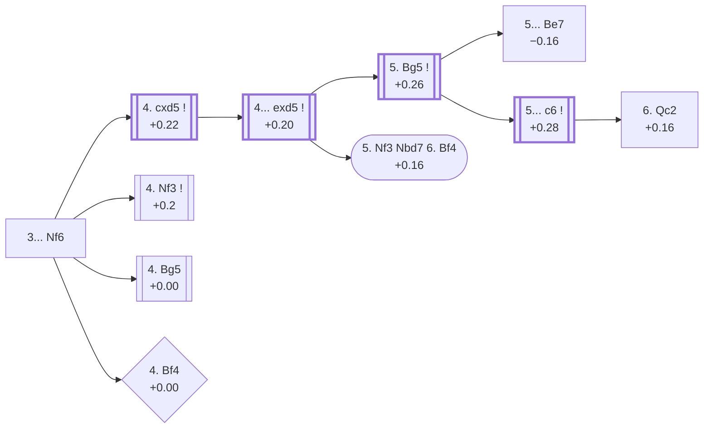

<a name="_TOP_"></a>

# D35 Queen's Gambit Declined: Normal Defense <br> 1. d4 d5 2. c4 e6 3. Nc3 Nf6 #

Spun off from [D31's own "3. Nc3" card](https://github.com/onclemarcel/chess_flashcards/blob/main/d4_openings/D31_Queens_Gambit_Declined_Queens_Knight_Variation.md#_initial_move_) — masters' clear main try there (40.7%), already live-tagged its own code. `eco.md` leaves this bare tabiya named only "3...Nf6"; the live explorer independently names it the ***Normal Defense***.

### Overview

*Quick map of every move covered on this card — see the [shape key](https://github.com/onclemarcel/chess_flashcards/blob/main/start.md#content-diagram-optional) in start.md.*

<!-- content-diagram:start -->

<!-- content-diagram:end -->

<a name="_initial_move_"></a>

[](https://lichess.org/analysis/standard/rnbqkb1r/ppp2ppp/4pn2/3p4/2PP4/2N5/PP2PPPP/R1BQKBNR_w_KQkq_-_2_4)

*... 3... Nf6 — live-tagged the Normal Defense*

```
rnbqkb1r/ppp2ppp/4pn2/3p4/2PP4/2N5/PP2PPPP/R1BQKBNR w KQkq - 2 4
```

|  | +0.24 |
| --- | --- |

<!-- lichess-stats:start fen="rnbqkb1r/ppp2ppp/4pn2/3p4/2PP4/2N5/PP2PPPP/R1BQKBNR w KQkq - 2 4" db="lichess,masters" speeds="bullet,blitz" ratings="1800,2000,2200,2500" moves="5" -->
| Move | Online | W/D/B | Masters | W/D/B | |
| :--- | ---: | :--- | ---: | :--- | :-- |
| Nf3 | 8.9 M (32.4%) | ⬜⬜⬜⬜⬜🟫⬛⬛⬛⬛ 51/5/44 | 7.7 k (22.4%) | ⬜⬜⬜🟫🟫🟫🟫🟫⬛⬛ 31/52/17 |  |
| Bg5 | 6.7 M (24.3%) | ⬜⬜⬜⬜⬜🟫⬛⬛⬛⬛ 50/6/44 | 7.9 k (23.0%) | ⬜⬜⬜🟫🟫🟫🟫🟫⬛⬛ 32/50/17 |  |
| cxd5 | 6.3 M (22.9%) | ⬜⬜⬜⬜⬜🟫⬛⬛⬛⬛ 52/5/43 | 18 k (53.7%) | ⬜⬜⬜🟫🟫🟫🟫🟫⬛⬛ 36/48/17 |  |
| e3 | 2.3 M (8.4%) | ⬜⬜⬜⬜⬜⬛⬛⬛⬛⬛ 49/5/46 | 126 (0.4%) | ⬜⬜🟫🟫🟫🟫🟫⬛⬛⬛ 21/52/28 |  |
| Bf4 | 1.5 M (5.5%) | ⬜⬜⬜⬜⬜🟫⬛⬛⬛⬛ 51/5/44 | 166 (0.5%) | ⬜⬜⬜⬜🟫🟫🟫🟫🟫⬛ 37/46/16 |  |

*Online: bullet/blitz, 1800+ — 27.6 M games. Masters: 34 k games. [Open in the explorer](https://lichess.org/analysis/standard/rnbqkb1r/ppp2ppp/4pn2/3p4/2PP4/2N5/PP2PPPP/R1BQKBNR_w_KQkq_-_2_4#explorer) — updated 2026-09-15*
<!-- lichess-stats:end -->

Masters' clear main try is **4. cxd5** (53.7%), resolving the central tension immediately. **4. Bg5** (23.0%) pins the knight instead — its own code, [D50](https://github.com/onclemarcel/chess_flashcards/blob/main/d4_openings/D50_Queens_Gambit_Declined_Bg5.md), covered there. *Correction to a claim this card carried before this batch*: 4. Bg5 was previously described here as transposing toward D30's own Traditional Variation tree; `apply_san.py` confirms that's wrong — D30's own 4.Bg5 arrives via 3.Nf3 (the knight on f3), while this position arrives via 3.Nc3 (the knight on c3) — a genuinely distinct position, not a transposition, and now built out as its own card, D50. **4. Nf3** (22.4%) develops naturally — its own code, [D37](https://github.com/onclemarcel/chess_flashcards/blob/main/d4_openings/D37_Queens_Gambit_Declined_Three_Knights_Variation.md). **4. Bf4** is a genuine rarity, the *Harrwitz Attack*.

* [**4. cxd5**](#_Exchange_) (53.7% masters): the *Exchange Variation* — covered below.
* **4. Bg5** (+0.00, 23.0% masters): its own code, [D50](https://github.com/onclemarcel/chess_flashcards/blob/main/d4_openings/D50_Queens_Gambit_Declined_Bg5.md) — not a transposition into D30 as this card previously (incorrectly) claimed.
* **4. Nf3** (+0.2, 22.4% masters): its own code, [D37](https://github.com/onclemarcel/chess_flashcards/blob/main/d4_openings/D37_Queens_Gambit_Declined_Three_Knights_Variation.md).
* [**4. Bf4**](#_Harrwitz_) (+0.00, 0.5% masters): the *Harrwitz Attack* — covered below.

[*Back to TOP*](#_TOP_)

---

<a name="_Harrwitz_"></a>

## 4. Bf4 — Harrwitz Attack

[](https://lichess.org/analysis/standard/rnbqkb1r/ppp2ppp/4pn2/3p4/2PP1B2/2N5/PP2PPPP/R2QKBNR_b_KQkq_-_3_4)

*... 4. Bf4 — Harrwitz Attack*

```
rnbqkb1r/ppp2ppp/4pn2/3p4/2PP1B2/2N5/PP2PPPP/R2QKBNR b KQkq - 3 4
```

|  | +0.00 |
| --- | --- |

`eco.md`'s name matches the live explorer here — named for 19th-century master Daniel Harrwitz. Develops the bishop outside the pawn chain immediately, sidestepping the whole Bg5-pin complex. A genuine blitz trap: barely played at masters level (0.5%) but a real online choice (5.5%, eleven times its masters share). Dead level according to Stockfish. Not built out further here (backlog).

[*Back to 3... Nf6*](#_initial_move_)
[*Back to TOP*](#_TOP_)

---

<a name="_Exchange_"></a>

## 4. cxd5 — Exchange Variation

[](https://lichess.org/analysis/standard/rnbqkb1r/ppp2ppp/4pn2/3P4/3P4/2N5/PP2PPPP/R1BQKBNR_b_KQkq_-_0_4)

*... 4. cxd5 — Exchange Variation*

```
rnbqkb1r/ppp2ppp/4pn2/3P4/3P4/2N5/PP2PPPP/R1BQKBNR b KQkq - 0 4
```

|  | +0.22 |
| --- | --- |

<!-- lichess-stats:start fen="rnbqkb1r/ppp2ppp/4pn2/3P4/3P4/2N5/PP2PPPP/R1BQKBNR b KQkq - 0 4" db="lichess,masters" speeds="bullet,blitz" ratings="1800,2000,2200,2500" moves="3" -->
| Move | Online | W/D/B | Masters | W/D/B | |
| :--- | ---: | :--- | ---: | :--- | :-- |
| exd5 | 5.1 M (78.0%) | ⬜⬜⬜⬜⬜🟫⬛⬛⬛⬛ 51/5/43 | 17 k (92.3%) | ⬜⬜⬜🟫🟫🟫🟫🟫⬛⬛ 36/48/17 |  |
| Nxd5 | 1.1 M (17.3%) | ⬜⬜⬜⬜⬜🟫⬛⬛⬛⬛ 52/5/42 | 1.4 k (7.7%) | ⬜⬜⬜⬜🟫🟫🟫🟫🟫⬛ 37/47/16 |  |
| Be7 | 101 k (1.5%) | ⬜⬜⬜⬜⬜⬜⬛⬛⬛⬛ 57/4/39 | 0 | — | ⚠ |
| a6 | 0 | — | 1 (0.0%) | — |  |

*Online: bullet/blitz, 1800+ — 6.5 M games. Masters: 18 k games. [Open in the explorer](https://lichess.org/analysis/standard/rnbqkb1r/ppp2ppp/4pn2/3P4/3P4/2N5/PP2PPPP/R1BQKBNR_b_KQkq_-_0_4#explorer) — updated 2026-09-15*
<!-- lichess-stats:end -->

`eco.md`'s name matches the live explorer here. Masters' overwhelming reply is **4... exd5** (92.3%), keeping the pawn structure symmetrical and the position free of immediate tension.

* [**4... exd5**](#_exd5_) (92.3% masters): see below.

[*Back to 3... Nf6*](#_initial_move_)
[*Back to TOP*](#_TOP_)

---

<a name="_exd5_"></a>

## 4... exd5

[](https://lichess.org/analysis/standard/rnbqkb1r/ppp2ppp/5n2/3p4/3P4/2N5/PP2PPPP/R1BQKBNR_w_KQkq_-_0_5)

*... 4... exd5*

```
rnbqkb1r/ppp2ppp/5n2/3p4/3P4/2N5/PP2PPPP/R1BQKBNR w KQkq - 0 5
```

|  | +0.20 |
| --- | --- |

Left completely untagged live (`opening=None`) at this exact node. Masters' overwhelming reply is **5. Bg5** (98.1%), pinning the knight immediately — the true main line, covered below. **5. Nf3**, heading for the named *Sämisch Variation* below via 5...Nbd7 6.Bf4, is a genuine database rarity (0.5% masters) at this exact node.

* [**5. Bg5**](#_Positional_) (98.1% masters): covered below.
* [**5. Nf3 Nbd7 6. Bf4**](#_Saemisch_) (+0.16, 0.5% masters): the *Sämisch Variation* — covered below.

[*Back to 4. cxd5*](#_Exchange_)
[*Back to TOP*](#_TOP_)

---

<a name="_Saemisch_"></a>

## 4... exd5 5. Nf3 Nbd7 6. Bf4 — Exchange Variation, Sämisch Variation

[](https://lichess.org/analysis/standard/r1bqkb1r/pppn1ppp/5n2/3p4/3P1B2/2N2N2/PP2PPPP/R2QKB1R_b_KQkq_-_3_6)

*... 6. Bf4 — Sämisch Variation*

```
r1bqkb1r/pppn1ppp/5n2/3p4/3P1B2/2N2N2/PP2PPPP/R2QKB1R b KQkq - 3 6
```

|  | +0.16 |
| --- | --- |

`eco.md` spells this the *Saemisch Variation*; the live explorer uses the umlauted ***Sämisch Variation*** — the same transliteration difference already seen elsewhere in this repo (e.g. D01's own Richter-Veresov). Develops the bishop actively before deciding on a plan, a specific move-order sibling to the more common 5.Bg5. Masters' clear main try is **6... c6** (74.7%). Not built out further here (backlog).

[*Back to 4... exd5*](#_exd5_)
[*Back to TOP*](#_TOP_)

---

<a name="_Positional_"></a>

## 4... exd5 5. Bg5 — Exchange Variation, Positional Variation

[](https://lichess.org/analysis/standard/rnbqkb1r/ppp2ppp/5n2/3p2B1/3P4/2N5/PP2PPPP/R2QKBNR_b_KQkq_-_1_5)

*... 5. Bg5 — live-tagged the Positional Variation*

```
rnbqkb1r/ppp2ppp/5n2/3p2B1/3P4/2N5/PP2PPPP/R2QKBNR b KQkq - 1 5
```

|  | +0.26 |
| --- | --- |

<!-- lichess-stats:start fen="rnbqkb1r/ppp2ppp/5n2/3p2B1/3P4/2N5/PP2PPPP/R2QKBNR b KQkq - 1 5" db="lichess,masters" speeds="bullet,blitz" ratings="1800,2000,2200,2500" moves="4" -->
| Move | Online | W/D/B | Masters | W/D/B | |
| :--- | ---: | :--- | ---: | :--- | :-- |
| Be7 | 1.9 M (44.8%) | ⬜⬜⬜⬜⬜🟫⬛⬛⬛⬛ 52/6/42 | 6.9 k (40.8%) | ⬜⬜⬜⬜🟫🟫🟫🟫🟫⬛ 39/46/15 |  |
| c6 | 1.5 M (34.8%) | ⬜⬜⬜⬜⬜🟫⬛⬛⬛⬛ 51/6/43 | 8.1 k (47.8%) | ⬜⬜⬜🟫🟫🟫🟫🟫⬛⬛ 32/51/17 |  |
| Bb4 | 296 k (7.0%) | ⬜⬜⬜⬜⬜🟫⬛⬛⬛⬛ 54/5/41 | 881 (5.2%) | ⬜⬜⬜⬜🟫🟫🟫🟫⬛⬛ 35/42/23 |  |
| Nbd7 | 228 k (5.4%) | ⬜⬜⬜⬜⬜🟫⬛⬛⬛⬛ 51/6/43 | 850 (5.0%) | ⬜⬜⬜⬜🟫🟫🟫🟫⬛⬛ 45/39/17 |  |

*Online: bullet/blitz, 1800+ — 4.2 M games. Masters: 17 k games. [Open in the explorer](https://lichess.org/analysis/standard/rnbqkb1r/ppp2ppp/5n2/3p2B1/3P4/2N5/PP2PPPP/R2QKBNR_b_KQkq_-_1_5#explorer) — updated 2026-09-15*
<!-- lichess-stats:end -->

`eco.md` calls this the *positional line*; the live explorer independently spells it the ***Positional Variation*** — essentially the same name, no real divergence. Masters split between **5... c6** (47.8%), the card's own D36-forking continuation, and **5... Be7** (−0.16, 40.8%), which reaches the named *Chameleon Variation*.

* [**5... Be7**](#_Chameleon_): the *Chameleon Variation* — covered below.
* [**5... c6**](#_Positional5c6_) (47.8% masters): covered below.

[*Back to 4... exd5*](#_exd5_)
[*Back to TOP*](#_TOP_)

---

<a name="_Chameleon_"></a>

## 5... Be7 6. e3 O-O 7. Bd3 Nbd7 8. Qc2 Re8 9. Nge2 Nf8 10. O-O-O — Chameleon Variation

[](https://lichess.org/analysis/standard/r1bqrnk1/ppp1bppp/5n2/3p2B1/3P4/2NBP3/PPQ1NPPP/2KR3R_b_-_-_8_10)

*... 10. O-O-O — Chameleon Variation*

```
r1bqrnk1/ppp1bppp/5n2/3p2B1/3P4/2NBP3/PPQ1NPPP/2KR3R b - - 8 10
```

|  | −0.16 |
| --- | --- |

`eco.md`'s name matches the live explorer here. Named for White's own flexible plan: after castling opposite Black, the whole attacking setup (Nge2-g3-h5 or f3/g4) can shift shape depending on Black's own defensive choices — a genuine, deeply specific move-order line. Not built out further here (backlog).

[*Back to 4... exd5 5. Bg5*](#_Positional_)
[*Back to TOP*](#_TOP_)

---

<a name="_Positional5c6_"></a>

## 5... c6 — Exchange Variation, Positional Variation

[](https://lichess.org/analysis/standard/rnbqkb1r/pp3ppp/2p2n2/3p2B1/3P4/2N5/PP2PPPP/R2QKBNR_w_KQkq_-_0_6)

*... 5... c6 — live-tagged the Positional Variation*

```
rnbqkb1r/pp3ppp/2p2n2/3p2B1/3P4/2N5/PP2PPPP/R2QKBNR w KQkq - 0 6
```

|  | +0.28 |
| --- | --- |

<!-- lichess-stats:start fen="rnbqkb1r/pp3ppp/2p2n2/3p2B1/3P4/2N5/PP2PPPP/R2QKBNR w KQkq - 0 6" db="lichess,masters" speeds="bullet,blitz" ratings="1800,2000,2200,2500" moves="3" -->
| Move | Online | W/D/B | Masters | W/D/B | |
| :--- | ---: | :--- | ---: | :--- | :-- |
| e3 | 1.1 M (68.3%) | ⬜⬜⬜⬜⬜🟫⬛⬛⬛⬛ 51/6/43 | 6.4 k (78.3%) | ⬜⬜⬜🟫🟫🟫🟫🟫⬛⬛ 32/51/17 |  |
| Qc2 | 294 k (19.0%) | ⬜⬜⬜⬜⬜🟫⬛⬛⬛⬛ 53/5/42 | 1.7 k (21.4%) | ⬜⬜⬜🟫🟫🟫🟫🟫⬛⬛ 32/48/19 |  |
| Nf3 | 113 k (7.3%) | ⬜⬜⬜⬜⬜⬛⬛⬛⬛⬛ 46/6/48 | 24 (0.3%) | ⬜🟫🟫🟫🟫🟫🟫⬛⬛⬛ 12/58/29 |  |

*Online: bullet/blitz, 1800+ — 1.5 M games. Masters: 8.1 k games. [Open in the explorer](https://lichess.org/analysis/standard/rnbqkb1r/pp3ppp/2p2n2/3p2B1/3P4/2N5/PP2PPPP/R2QKBNR_w_KQkq_-_0_6#explorer) — updated 2026-09-15*
<!-- lichess-stats:end -->

Masters' clear main try is **6. e3** (78.3%), transposing toward the main Carlsbad structure — no code of its own in this range. **6. Qc2** (21.4%) heads for its own code, [D36](https://github.com/onclemarcel/chess_flashcards/blob/main/d4_openings/D36_Queens_Gambit_Declined_Exchange_Positional_Qc2.md).

* **6. e3** (78.3% masters): transposes toward the main Carlsbad structure — not covered further here.
* **6. Qc2** (+0.16, 21.4% masters): its own code, [D36](https://github.com/onclemarcel/chess_flashcards/blob/main/d4_openings/D36_Queens_Gambit_Declined_Exchange_Positional_Qc2.md).

[*Back to 4... exd5 5. Bg5*](#_Positional_)
[*Back to TOP*](#_TOP_)
