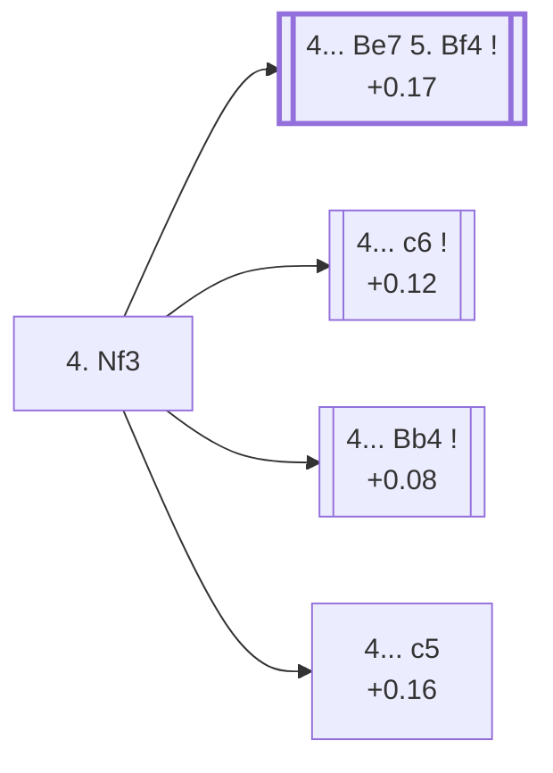

<a name="_TOP_"></a>

# D37 Queen's Gambit Declined: Three Knights Variation <br> 1. d4 d5 2. c4 e6 3. Nc3 Nf6 4. Nf3 #

Spun off from [D35's own "3... Nf6" card](https://github.com/onclemarcel/chess_flashcards/blob/main/d4_openings/D35_Queens_Gambit_Declined_Normal_Defense.md#_initial_move_) — a real secondary try there (22.4% masters), already live-tagged its own code — the same generic naming pattern already seen at D15's own Slav Three Knights Variation, both marking the point where three of White's four minor pieces have developed.

### Overview

*Quick map of every move covered on this card — see the [shape key](https://github.com/onclemarcel/chess_flashcards/blob/main/start.md#content-diagram-optional) in start.md.*

<!-- content-diagram:start -->

<!-- content-diagram:end -->

<a name="_initial_move_"></a>

[](https://lichess.org/analysis/standard/rnbqkb1r/ppp2ppp/4pn2/3p4/2PP4/2N2N2/PP2PPPP/R1BQKB1R_b_KQkq_-_3_4)

*... 4. Nf3 — live-tagged the Three Knights Variation*

```
rnbqkb1r/ppp2ppp/4pn2/3p4/2PP4/2N2N2/PP2PPPP/R1BQKB1R b KQkq - 3 4
```

|  | +0.08 |
| --- | --- |

<!-- lichess-stats:start fen="rnbqkb1r/ppp2ppp/4pn2/3p4/2PP4/2N2N2/PP2PPPP/R1BQKB1R b KQkq - 3 4" db="lichess,masters" speeds="bullet,blitz" ratings="1800,2000,2200,2500" moves="6" -->
| Move | Online | W/D/B | Masters | W/D/B | |
| :--- | ---: | :--- | ---: | :--- | :-- |
| Be7 | 5.6 M (31.8%) | ⬜⬜⬜⬜⬜🟫⬛⬛⬛⬛ 50/6/44 | 22 k (28.5%) | ⬜⬜⬜🟫🟫🟫🟫🟫🟫⬛ 31/56/14 |  |
| Bb4 | 3.4 M (19.6%) | ⬜⬜⬜⬜⬜🟫⬛⬛⬛⬛ 54/5/42 | 17 k (21.2%) | ⬜⬜🟫🟫🟫🟫🟫🟫⬛⬛ 23/60/17 |  |
| c6 | 3.0 M (17.1%) | ⬜⬜⬜⬜⬜🟫⬛⬛⬛⬛ 51/5/44 | 20 k (25.3%) | ⬜⬜🟫🟫🟫🟫🟫🟫⬛⬛ 21/62/17 |  |
| c5 | 1.8 M (10.1%) | ⬜⬜⬜⬜⬜🟫⬛⬛⬛⬛ 49/6/45 | 5.2 k (6.6%) | ⬜⬜⬜🟫🟫🟫🟫🟫🟫⬛ 28/58/13 |  |
| dxc4 | 1.4 M (7.9%) | ⬜⬜⬜⬜⬜🟫⬛⬛⬛⬛ 52/5/43 | 6.2 k (7.9%) | ⬜⬜⬜🟫🟫🟫🟫🟫⬛⬛ 27/50/23 |  |
| Nbd7 | 673 k (3.8%) | ⬜⬜⬜⬜⬜🟫⬛⬛⬛⬛ 50/6/45 | 5.9 k (7.5%) | ⬜⬜⬜🟫🟫🟫🟫🟫⬛⬛ 32/46/22 |  |

*Online: bullet/blitz, 1800+ — 17.5 M games. Masters: 79 k games. [Open in the explorer](https://lichess.org/analysis/standard/rnbqkb1r/ppp2ppp/4pn2/3p4/2PP4/2N2N2/PP2PPPP/R1BQKB1R_b_KQkq_-_3_4#explorer) — updated 2026-09-07*
<!-- lichess-stats:end -->

Masters' clear main try is **4... Be7** (28.5%), completing development toward the Orthodox tabiya — the exact continuation escalating to the named *Classical Variation* below. **4... c6** (25.3%), the *Semi-Slav*, is its own code, [D43](https://github.com/onclemarcel/chess_flashcards/blob/main/d4_openings/D43_Semi_Slav_Defense.md). **4... Bb4** (21.2%) heads for its own code, the *Ragozin Defense*, [D38](https://github.com/onclemarcel/chess_flashcards/blob/main/d4_openings/D38_Queens_Gambit_Declined_Ragozin_Defense.md). **4... c5**, the *Semi-Tarrasch Defense*, is a real, secondary try, also its own code.

* [**4... Be7 5. Bf4**](#_Classical_) (+0.17, 28.5% masters): the *Classical Variation* — covered below.
* **4... c6** (+0.12, 25.3% masters): the *Semi-Slav* — its own code, [D43](https://github.com/onclemarcel/chess_flashcards/blob/main/d4_openings/D43_Semi_Slav_Defense.md).
* **4... Bb4** (+0.08, 21.2% masters): the *Ragozin Defense* — its own code, [D38](https://github.com/onclemarcel/chess_flashcards/blob/main/d4_openings/D38_Queens_Gambit_Declined_Ragozin_Defense.md).
* **4... c5** (+0.16, 6.6% masters): the *Semi-Tarrasch Defense* — its own code, [D40](https://github.com/onclemarcel/chess_flashcards/blob/main/d4_openings/D40_Semi_Tarrasch_Defense.md).

[*Back to TOP*](#_TOP_)

---

<a name="_Classical_"></a>

## 4... Be7 5. Bf4 — Classical Variation (5.Bf4)

[](https://lichess.org/analysis/standard/rnbqk2r/ppp1bppp/4pn2/3p4/2PP1B2/2N2N2/PP2PPPP/R2QKB1R_b_KQkq_-_5_5)

*... 5. Bf4 — Classical Variation*

```
rnbqk2r/ppp1bppp/4pn2/3p4/2PP1B2/2N2N2/PP2PPPP/R2QKB1R b KQkq - 5 5
```

|  | +0.17 |
| --- | --- |

`eco.md`'s name matches the live explorer here — although this exact SAN move order (4...Be7 5.Bf4) is itself left completely untagged live (0 games at this precise node in the sample, both masters and online), almost certainly because it's normally reached by transposition via 4.Bf4 or 5.Bg5-first orders instead. Develops the dark-squared bishop outside the pawn chain before committing to e3, one of White's two classical set-ups against the Orthodox Defense (the other being 5.Bg5). Not built out further here (backlog).

[*Back to 4. Nf3*](#_initial_move_)
[*Back to TOP*](#_TOP_)
