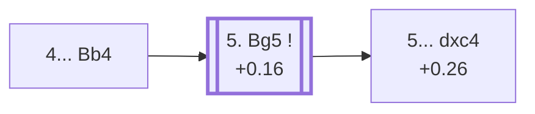

<a name="_TOP_"></a>

# D38 Queen's Gambit Declined: Ragozin Defense <br> 1. d4 d5 2. c4 e6 3. Nc3 Nf6 4. Nf3 Bb4 #

Spun off from [D37's own "4. Nf3" card](https://github.com/onclemarcel/chess_flashcards/blob/main/d4_openings/D37_Queens_Gambit_Declined_Three_Knights_Variation.md#_initial_move_) — a real, secondary try there (21.2% masters), already live-tagged its own code. `eco.md` calls this the *Ragozin Variation*; the live explorer spells it the ***Ragozin Defense*** — a minor naming difference, not substantive. Named for Soviet grandmaster Viacheslav Ragozin: Black pins the c3-knight in true Nimzo-Indian style, but with the central pawn tension (d5 vs c4) still very much alive, unlike the pure Nimzo where ... d5 hasn't been played yet.

### Overview

*Quick map of every move covered on this card — see the [shape key](https://github.com/onclemarcel/chess_flashcards/blob/main/start.md#content-diagram-optional) in start.md.*

<!-- content-diagram:start -->

<!-- content-diagram:end -->

<a name="_initial_move_"></a>

[](https://lichess.org/analysis/standard/rnbqk2r/ppp2ppp/4pn2/3p4/1bPP4/2N2N2/PP2PPPP/R1BQKB1R_w_KQkq_-_4_5)

*... 4... Bb4 — live-tagged the Ragozin Defense*

```
rnbqk2r/ppp2ppp/4pn2/3p4/1bPP4/2N2N2/PP2PPPP/R1BQKB1R w KQkq - 4 5
```

|  | +0.16 |
| --- | --- |

<!-- lichess-stats:start fen="rnbqk2r/ppp2ppp/4pn2/3p4/1bPP4/2N2N2/PP2PPPP/R1BQKB1R w KQkq - 4 5" db="lichess,masters" speeds="bullet,blitz" ratings="1800,2000,2200,2500" moves="4" -->
| Move | Online | W/D/B | Masters | W/D/B | |
| :--- | ---: | :--- | ---: | :--- | :-- |
| Bg5 | 1.6 M (41.6%) | ⬜⬜⬜⬜⬜🟫⬛⬛⬛⬛ 54/5/41 | 6.8 k (37.0%) | ⬜⬜🟫🟫🟫🟫🟫🟫🟫⬛ 19/67/14 |  |
| e3 | 549 k (14.1%) | ⬜⬜⬜⬜⬜🟫⬛⬛⬛⬛ 53/5/43 | 1.8 k (9.8%) | ⬜⬜⬜🟫🟫🟫🟫🟫⬛⬛ 28/51/21 |  |
| cxd5 | 368 k (9.5%) | ⬜⬜⬜⬜⬜🟫⬛⬛⬛⬛ 54/5/41 | 5.1 k (28.1%) | ⬜⬜⬜🟫🟫🟫🟫🟫⬛⬛ 26/56/18 |  |
| Bd2 | 245 k (6.3%) | ⬜⬜⬜⬜⬜🟫⬛⬛⬛⬛ 50/5/44 | 0 | — | ⚠ |
| Qa4+ | 0 | — | 3.5 k (19.4%) | ⬜⬜🟫🟫🟫🟫🟫🟫⬛⬛ 25/56/19 |  |

*Online: bullet/blitz, 1800+ — 3.9 M games. Masters: 18 k games. [Open in the explorer](https://lichess.org/analysis/standard/rnbqk2r/ppp2ppp/4pn2/3p4/1bPP4/2N2N2/PP2PPPP/R1BQKB1R_w_KQkq_-_4_5#explorer) — updated 2026-09-07*
<!-- lichess-stats:end -->

Masters' clear main try is **5. Bg5** (37.0%), pinning right back rather than resolving the central tension first.

* [**5. Bg5**](#_Bg5_) (37.0% masters): see below.

[*Back to TOP*](#_TOP_)

---

<a name="_Bg5_"></a>

## 5. Bg5

[](https://lichess.org/analysis/standard/rnbqk2r/ppp2ppp/4pn2/3p2B1/1bPP4/2N2N2/PP2PPPP/R2QKB1R_b_KQkq_-_5_5)

*... 5. Bg5*

```
rnbqk2r/ppp2ppp/4pn2/3p2B1/1bPP4/2N2N2/PP2PPPP/R2QKB1R b KQkq - 5 5
```

|  | +0.16 |
| --- | --- |

Left completely untagged live (`opening=None`) at this exact node. Masters' clear main try is **5... h6** (63.4%), inserting the useful in-between move before deciding on a structure — a real, secondary body of theory uncoded in this range. **5... dxc4** (15.6%) is a real, secondary try of its own, escalating to its own code, the *Vienna Variation*, [D39](https://github.com/onclemarcel/chess_flashcards/blob/main/d4_openings/D39_Queens_Gambit_Declined_Ragozin_Vienna_Variation.md) — a name completely unrelated to D30's own, much shallower "Vienna Variation" (4.Bg5 Bb4 in the 3.Nf3-first move order), despite both featuring a Bg5/Bb4 pin-and-counter-pin idea.

* **5... h6** (63.4% masters): a real, secondary line, uncoded in this range — not covered further here.
* **5... dxc4** (+0.26, 15.6% masters): its own code, [D39](https://github.com/onclemarcel/chess_flashcards/blob/main/d4_openings/D39_Queens_Gambit_Declined_Ragozin_Vienna_Variation.md).

[*Back to 4... Bb4*](#_initial_move_)
[*Back to TOP*](#_TOP_)
