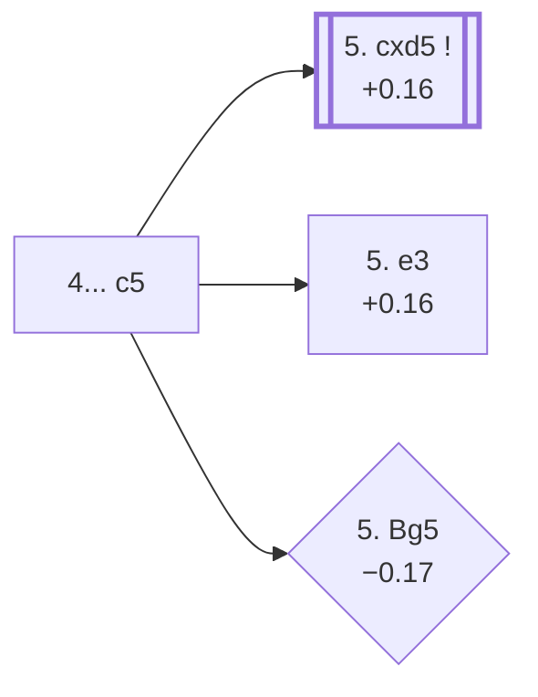

<a name="_TOP_"></a>

# D40 Queen's Gambit Declined: Semi-Tarrasch Defense <br> 1. d4 d5 2. c4 e6 3. Nc3 Nf6 4. Nf3 c5 #

Spun off from [D37's own "4. Nf3" card](https://github.com/onclemarcel/chess_flashcards/blob/main/d4_openings/D37_Queens_Gambit_Declined_Three_Knights_Variation.md#_initial_move_) — a real, secondary try there (6.6% masters), already live-tagged its own code. `eco.md`'s name matches the live explorer exactly: a hybrid of the Tarrasch's central strike and the Semi-Slav's own knight development, striking at d4 without first committing to the isolated-pawn structure the pure Tarrasch (3...c5) accepts.

### Overview

*Quick map of every move covered on this card — see the [shape key](https://github.com/onclemarcel/chess_flashcards/blob/main/start.md#content-diagram-optional) in start.md.*

<!-- content-diagram:start -->

<!-- content-diagram:end -->

<a name="_initial_move_"></a>

[](https://lichess.org/analysis/standard/rnbqkb1r/pp3ppp/4pn2/2pp4/2PP4/2N2N2/PP2PPPP/R1BQKB1R_w_KQkq_c6_0_5)

*... 4... c5 — Semi-Tarrasch Defense*

```
rnbqkb1r/pp3ppp/4pn2/2pp4/2PP4/2N2N2/PP2PPPP/R1BQKB1R w KQkq c6 0 5
```

|  | +0.16 |
| --- | --- |

<!-- lichess-stats:start fen="rnbqkb1r/pp3ppp/4pn2/2pp4/2PP4/2N2N2/PP2PPPP/R1BQKB1R w KQkq c6 0 5" db="lichess,masters" speeds="bullet,blitz" ratings="1800,2000,2200,2500" moves="7" -->
| Move | Online | W/D/B | Masters | W/D/B | |
| :--- | ---: | :--- | ---: | :--- | :-- |
| cxd5 | 681 k (32.8%) | ⬜⬜⬜⬜⬜🟫⬛⬛⬛⬛ 49/7/44 | 4.6 k (85.1%) | ⬜⬜⬜🟫🟫🟫🟫🟫🟫⬛ 28/59/13 |  |
| Bg5 | 633 k (30.4%) | ⬜⬜⬜⬜⬜🟫⬛⬛⬛⬛ 49/5/45 | 38 (0.7%) | ⬜⬜🟫🟫🟫🟫🟫🟫⬛⬛ 21/58/21 |  |
| e3 | 456 k (21.9%) | ⬜⬜⬜⬜⬜🟫⬛⬛⬛⬛ 49/5/45 | 731 (13.5%) | ⬜⬜⬜🟫🟫🟫🟫🟫⬛⬛ 35/51/15 |  |
| dxc5 | 113 k (5.4%) | ⬜⬜⬜⬜⬜⬛⬛⬛⬛⬛ 47/6/46 | 12 (0.2%) | — |  |
| Bf4 | 98 k (4.7%) | ⬜⬜⬜⬜⬜⬛⬛⬛⬛⬛ 49/5/46 | 16 (0.3%) | — |  |
| g3 | 71 k (3.4%) | ⬜⬜⬜⬜⬜🟫⬛⬛⬛⬛ 51/5/44 | 5 (0.1%) | — |  |
| a3 | 6.1 k (0.3%) | ⬜⬜⬜⬜⬜⬛⬛⬛⬛⬛ 46/5/49 | 0 | — | ⚠ |
| Be3 | 0 | — | 3 (0.1%) | — |  |

*Online: bullet/blitz, 1800+ — 2.1 M games. Masters: 5.4 k games. [Open in the explorer](https://lichess.org/analysis/standard/rnbqkb1r/pp3ppp/4pn2/2pp4/2PP4/2N2N2/PP2PPPP/R1BQKB1R_w_KQkq_c6_0_5#explorer) — updated 2026-09-15*
<!-- lichess-stats:end -->

Masters' clear main try is **5. cxd5** (+0.16, 85.1%) — its own code, [D41](https://github.com/onclemarcel/chess_flashcards/blob/main/d4_openings/D41_Semi_Tarrasch_cxd5.md). **5. e3** (+0.16, 13.5%) declines the trade a move longer and stays D40; **5. Bg5** (−0.17) is a genuine rarity, the *Pillsbury Variation*.

* **5. cxd5**: its own code, [D41](https://github.com/onclemarcel/chess_flashcards/blob/main/d4_openings/D41_Semi_Tarrasch_cxd5.md).
* [**5. e3**](#_Symmetrical_) (13.5% masters): heads for the *Symmetrical Variation* — covered below.
* [**5. Bg5**](#_Pillsbury_) (0.7% masters): the *Pillsbury Variation* — covered below.

[*Back to TOP*](#_TOP_)

---

<a name="_Symmetrical_"></a>

## 5. e3 Nc6 6. Bd3 Bd6 7. O-O O-O — Symmetrical Variation

[](https://lichess.org/analysis/standard/r1bq1rk1/pp3ppp/2nbpn2/2pp4/2PP4/2NBPN2/PP3PPP/R1BQ1RK1_w_-_-_5_8)

*... 7... O-O — Symmetrical Variation*

```
r1bq1rk1/pp3ppp/2nbpn2/2pp4/2PP4/2NBPN2/PP3PPP/R1BQ1RK1 w - - 5 8
```

|  | +0.37 |
| --- | --- |

`eco.md`'s name matches the live explorer here — a genuine database rarity at this exact SAN move order (only 3 masters games), reflecting how quickly this whole line transposes elsewhere in practice. Both sides develop identically before the central tension resolves, the "symmetrical" idea of the name. Masters' clear main try in the sample is **8. a3**, preparing b4. The exact continuation escalating to the *Levenfish Variation* below.

* [**8. Qe2 Qe7 9. dxc5 Bxc5 10. e4**](#_Levenfish_): the *Levenfish Variation* — covered below.

[*Back to 4... c5*](#_initial_move_)
[*Back to TOP*](#_TOP_)

---

<a name="_Levenfish_"></a>

## 8. Qe2 Qe7 9. dxc5 Bxc5 10. e4 — Levenfish Variation

[](https://lichess.org/analysis/standard/r1b2rk1/pp2qppp/2n1pn2/2bp4/2P1P3/2NB1N2/PP2QPPP/R1B2RK1_b_-_-_0_10)

*... 10. e4 — Levenfish Variation*

```
r1b2rk1/pp2qppp/2n1pn2/2bp4/2P1P3/2NB1N2/PP2QPPP/R1B2RK1 b - - 0 10
```

|  | +0.00 |
| --- | --- |

`eco.md`'s name matches the live explorer here — named after Soviet master Grigory Levenfish. White finally resolves the central tension in the sharpest way, grabbing full central space rather than the slower Rd1/b3 build-up. Dead level according to Stockfish. Not built out further here (backlog).

[*Back to 5. e3*](#_Symmetrical_)
[*Back to TOP*](#_TOP_)

---

<a name="_Pillsbury_"></a>

## 5. Bg5 — Pillsbury Variation

[](https://lichess.org/analysis/standard/rnbqkb1r/pp3ppp/4pn2/2pp2B1/2PP4/2N2N2/PP2PPPP/R2QKB1R_b_KQkq_-_1_5)

*... 5. Bg5 — Pillsbury Variation*

```
rnbqkb1r/pp3ppp/4pn2/2pp2B1/2PP4/2N2N2/PP2PPPP/R2QKB1R b KQkq - 1 5
```

|  | −0.17 |
| --- | --- |

`eco.md`'s name matches the live explorer here — named after 19th-century American master Harry Nelson Pillsbury. Pins the knight before deciding on the central structure — a genuine blitz trap: barely played at masters level (0.7%) but a real online choice (30.4%, over 40 times its masters share). Masters' clear main try in reply is **5... cxd4** (80.0%). Not built out further here (backlog).

[*Back to 4... c5*](#_initial_move_)
[*Back to TOP*](#_TOP_)
