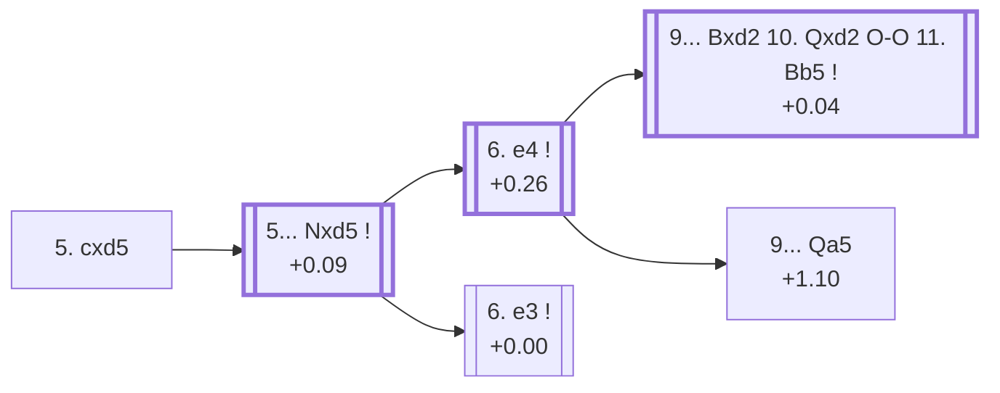

<a name="_TOP_"></a>

# D41 Queen's Gambit Declined: Semi-Tarrasch Defense, 5. cxd5 <br> 1. d4 d5 2. c4 e6 3. Nc3 Nf6 4. Nf3 c5 5. cxd5 #

Spun off from [D40's own "4... c5" card](https://github.com/onclemarcel/chess_flashcards/blob/main/d4_openings/D40_Semi_Tarrasch_Defense.md#_initial_move_) — masters' clear main try there (85.1%), already live-tagged its own code, reusing the same "Semi-Tarrasch Defense" name as its parent.

### Overview

*Quick map of every move covered on this card — see the [shape key](https://github.com/onclemarcel/chess_flashcards/blob/main/start.md#content-diagram-optional) in start.md.*

<!-- content-diagram:start -->

<!-- content-diagram:end -->

<a name="_initial_move_"></a>

[](https://lichess.org/analysis/standard/rnbqkb1r/pp3ppp/4pn2/2pP4/3P4/2N2N2/PP2PPPP/R1BQKB1R_b_KQkq_-_0_5)

*... 5. cxd5 — Semi-Tarrasch Defense*

```
rnbqkb1r/pp3ppp/4pn2/2pP4/3P4/2N2N2/PP2PPPP/R1BQKB1R b KQkq - 0 5
```

|  | +0.09 |
| --- | --- |

<!-- lichess-stats:start fen="rnbqkb1r/pp3ppp/4pn2/2pP4/3P4/2N2N2/PP2PPPP/R1BQKB1R b KQkq - 0 5" db="lichess,masters" speeds="bullet,blitz" ratings="1800,2000,2200,2500" moves="4" -->
| Move | Online | W/D/B | Masters | W/D/B | |
| :--- | ---: | :--- | ---: | :--- | :-- |
| exd5 | 332 k (47.9%) | ⬜⬜⬜⬜⬜🟫⬛⬛⬛⬛ 51/6/43 | 456 (9.9%) | ⬜⬜⬜⬜🟫🟫🟫🟫⬛⬛ 37/45/18 |  |
| Nxd5 | 221 k (31.9%) | ⬜⬜⬜⬜⬜🟫⬛⬛⬛⬛ 48/9/43 | 2.7 k (58.8%) | ⬜⬜⬜🟫🟫🟫🟫🟫⬛⬛ 30/55/15 |  |
| cxd4 | 133 k (19.3%) | ⬜⬜⬜⬜🟫⬛⬛⬛⬛⬛ 46/7/47 | 1.4 k (31.3%) | ⬜⬜🟫🟫🟫🟫🟫🟫🟫⬛ 20/71/8 |  |
| Nc6 | 2.9 k (0.4%) | ⬜⬜⬜⬜⬜⬜⬜⬛⬛⬛ 70/3/26 | 0 | — | ⚠ |
| c4 | 0 | — | 1 (0.0%) | — |  |

*Online: bullet/blitz, 1800+ — 692 k games. Masters: 4.6 k games. [Open in the explorer](https://lichess.org/analysis/standard/rnbqkb1r/pp3ppp/4pn2/2pP4/3P4/2N2N2/PP2PPPP/R1BQKB1R_b_KQkq_-_0_5#explorer) — updated 2026-09-14*
<!-- lichess-stats:end -->

Masters' clear main try is **5... Nxd5** (+0.09, 58.8%), recapturing with the knight to keep the position dynamic and central.

* [**5... Nxd5**](#_Nxd5_) (58.8% masters): see below.

[*Back to TOP*](#_TOP_)

---

<a name="_Nxd5_"></a>

## 5... Nxd5

[](https://lichess.org/analysis/standard/rnbqkb1r/pp3ppp/4p3/2pn4/3P4/2N2N2/PP2PPPP/R1BQKB1R_w_KQkq_-_0_6)

*... 5... Nxd5*

```
rnbqkb1r/pp3ppp/4p3/2pn4/3P4/2N2N2/PP2PPPP/R1BQKB1R w KQkq - 0 6
```

|  | +0.26 |
| --- | --- |

Left completely untagged live (`opening=None`) at this exact node. Masters' clear main try is **6. e4** (+0.26, 69.6%), grabbing the full centre and offering the c3-knight for a rich, sharp middlegame. **6. e3** (+0.00, 21.0%) declines the complications and stays D41 as the *Semi-Tarrasch With e3*.

* [**6. e4**](#_e4_) (69.6% masters): see below.
* [**6. e3**](#_e3_) (21.0% masters): the *Semi-Tarrasch With e3* — covered below.

[*Back to 5. cxd5*](#_initial_move_)
[*Back to TOP*](#_TOP_)

---

<a name="_e4_"></a>

## 6. e4 Nxc3 7. bxc3 cxd4 8. cxd4 Bb4 9. Bd2

[](https://lichess.org/analysis/standard/rnbqk2r/pp3ppp/4p3/8/1b1PP3/5N2/P2B1PPP/R2QKB1R_b_KQkq_-_2_9)

*... 9. Bd2*

```
rnbqk2r/pp3ppp/4p3/8/1b1PP3/5N2/P2B1PPP/R2QKB1R b KQkq - 2 9
```

|  | +0.04 |
| --- | --- |

The forcing main line: Black trades the extra knight for White's queenside structure, then strikes at d4 immediately. **9... Bxd2** transposes into the deeply analysed *Kmoch Variation*; **9... Qa5** stays a pin instead, the *San Sebastian Variation*.

* [**9... Bxd2 10. Qxd2 O-O 11. Bb5**](#_Kmoch_) (+0.04): the *Kmoch Variation* — covered below.
* [**9... Qa5**](#_SanSebastian_) (+1.10): the *San Sebastian Variation* — covered below.

[*Back to 5... Nxd5*](#_Nxd5_)
[*Back to TOP*](#_TOP_)

---

<a name="_Kmoch_"></a>

## 9... Bxd2 10. Qxd2 O-O 11. Bb5 — Kmoch Variation

[](https://lichess.org/analysis/standard/rnbq1rk1/pp3ppp/4p3/1B6/3PP3/5N2/P2Q1PPP/R3K2R_b_KQ_-_2_11)

*... 11. Bb5 — Kmoch Variation*

```
rnbq1rk1/pp3ppp/4p3/1B6/3PP3/5N2/P2Q1PPP/R3K2R b KQ - 2 11
```

|  | +0.04 |
| --- | --- |

`eco.md`'s name matches the live explorer here — named for Austrian-American master Hans Kmoch, one of the deepest and most heavily analysed forcing lines in the whole Semi-Tarrasch complex. Pins the c6-knight before it can develop, hitting at Black's own queenside structure. Not built out further here (backlog).

[*Back to 6. e4*](#_e4_)
[*Back to TOP*](#_TOP_)

---

<a name="_SanSebastian_"></a>

## 9... Qa5 — San Sebastian Variation

[](https://lichess.org/analysis/standard/rnb1k2r/pp3ppp/4p3/q7/1b1PP3/5N2/P2B1PPP/R2QKB1R_w_KQkq_-_3_10)

*... 9... Qa5 — San Sebastian Variation*

```
rnb1k2r/pp3ppp/4p3/q7/1b1PP3/5N2/P2B1PPP/R2QKB1R w KQkq - 3 10
```

|  | +1.10 |
| --- | --- |

`eco.md`'s name matches the live explorer here — named for the 1911 San Sebastian tournament. Keeps the pin alive with tempo rather than trading it off, though modern engine analysis already prefers White by more than a pawn here. Not built out further here (backlog).

[*Back to 6. e4*](#_e4_)
[*Back to TOP*](#_TOP_)

---

<a name="_e3_"></a>

## 6. e3 — Semi-Tarrasch With e3

[](https://lichess.org/analysis/standard/rnbqkb1r/pp3ppp/4p3/2pn4/3P4/2N1PN2/PP3PPP/R1BQKB1R_b_KQkq_-_0_6)

*... 6. e3 — Semi-Tarrasch With e3*

```
rnbqkb1r/pp3ppp/4p3/2pn4/3P4/2N1PN2/PP3PPP/R1BQKB1R b KQkq - 0 6
```

|  | +0.00 |
| --- | --- |

`eco.md`'s name matches the live explorer's own inherited tag here (this exact node carries no independent name live, reusing the nearest-ancestor "Pillsbury Variation" tag instead). Keeps the structure calmer than 6.e4, developing before deciding on the centre. Masters' clear main try is **6... Nc6** (59.3%), heading for its own deeper code, [D42](https://github.com/onclemarcel/chess_flashcards/blob/main/d4_openings/D42_Semi_Tarrasch_Main_Line.md).

* **6... Nc6 7. Bd3**: its own code, [D42](https://github.com/onclemarcel/chess_flashcards/blob/main/d4_openings/D42_Semi_Tarrasch_Main_Line.md).

[*Back to 5... Nxd5*](#_Nxd5_)
[*Back to TOP*](#_TOP_)
