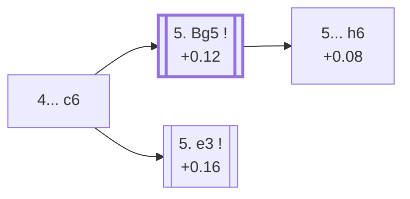

<a name="_TOP_"></a>

# D43 Queen's Gambit Declined: Semi-Slav <br> 1. d4 d5 2. c4 e6 3. Nc3 Nf6 4. Nf3 c6 #

Spun off from [D37's own "4. Nf3" card](https://github.com/onclemarcel/chess_flashcards/blob/main/d4_openings/D37_Queens_Gambit_Declined_Three_Knights_Variation.md#_initial_move_) — masters' real second choice there (25.3%), already live-tagged its own code (D37's own prose originally, incorrectly, said this move carried "no code of its own in this range" — corrected now that this card exists). Combines the Slav's own ... c6 with the QGD's own ... e6, the single most heavily analysed structure in this entire D-series sweep.

### Overview

*Quick map of every move covered on this card — see the [shape key](https://github.com/onclemarcel/chess_flashcards/blob/main/start.md#content-diagram-optional) in start.md.*

<!-- content-diagram:start -->

<!-- content-diagram:end -->

<a name="_initial_move_"></a>

[](https://lichess.org/analysis/standard/rnbqkb1r/pp3ppp/2p1pn2/3p4/2PP4/2N2N2/PP2PPPP/R1BQKB1R_w_KQkq_-_0_5)

*... 4... c6 — Semi-Slav Defense*

```
rnbqkb1r/pp3ppp/2p1pn2/3p4/2PP4/2N2N2/PP2PPPP/R1BQKB1R w KQkq - 0 5
```

|  | +0.12 |
| --- | --- |

<!-- lichess-stats:start fen="rnbqkb1r/pp3ppp/2p1pn2/3p4/2PP4/2N2N2/PP2PPPP/R1BQKB1R w KQkq - 0 5" db="lichess,masters" speeds="bullet,blitz" ratings="1800,2000,2200,2500" moves="6" -->
| Move | Online | W/D/B | Masters | W/D/B | |
| :--- | ---: | :--- | ---: | :--- | :-- |
| Bg5 | 5.4 M (52.5%) | ⬜⬜⬜⬜⬜🟫⬛⬛⬛⬛ 51/5/44 | 26 k (47.2%) | ⬜⬜⬜🟫🟫🟫🟫🟫🟫⬛ 24/62/14 |  |
| e3 | 1.9 M (18.2%) | ⬜⬜⬜⬜⬜🟫⬛⬛⬛⬛ 52/5/43 | 23 k (41.8%) | ⬜⬜🟫🟫🟫🟫🟫🟫⬛⬛ 23/59/17 |  |
| Bf4 | 982 k (9.5%) | ⬜⬜⬜⬜⬜🟫⬛⬛⬛⬛ 52/5/44 | 0 | — | ⚠ |
| cxd5 | 810 k (7.8%) | ⬜⬜⬜⬜⬜🟫⬛⬛⬛⬛ 51/6/43 | 2.4 k (4.4%) | ⬜⬜🟫🟫🟫🟫🟫⬛⬛⬛ 22/52/26 |  |
| g3 | 765 k (7.4%) | ⬜⬜⬜⬜⬜🟫⬛⬛⬛⬛ 54/5/41 | 2.3 k (4.1%) | ⬜⬜⬜🟫🟫🟫🟫🟫⬛⬛ 31/48/20 |  |
| Qc2 | 125 k (1.2%) | ⬜⬜⬜⬜⬜🟫⬛⬛⬛⬛ 54/4/42 | 0 | — | ⚠ |
| Qb3 | 0 | — | 735 (1.3%) | ⬜⬜⬜🟫🟫🟫🟫🟫⬛⬛ 33/47/21 |  |
| Qd3 | 0 | — | 463 (0.8%) | ⬜⬜⬜⬜🟫🟫🟫🟫⬛⬛ 35/43/22 |  |

*Online: bullet/blitz, 1800+ — 10.3 M games. Masters: 55 k games. [Open in the explorer](https://lichess.org/analysis/standard/rnbqkb1r/pp3ppp/2p1pn2/3p4/2PP4/2N2N2/PP2PPPP/R1BQKB1R_w_KQkq_-_0_5#explorer) — updated 2026-09-07*
<!-- lichess-stats:end -->

Masters split between **5. Bg5** (+0.12, 47.2%), pinning immediately, and **5. e3** (+0.16, 41.8%), the calmer structural approach — both real, roughly even main tries, each its own code. **5. Bg5**, met by **5... h6** (+0.08), reaches the named *Hastings Variation* below.

* **5. Bg5**: the *Semi-Slav Defense Accepted*'s own gateway — its own code, [D44](https://github.com/onclemarcel/chess_flashcards/blob/main/d4_openings/D44_Semi_Slav_Accepted.md).
* **5. e3**: its own code, [D45](https://github.com/onclemarcel/chess_flashcards/blob/main/d4_openings/D45_Semi_Slav_Main_Line.md).

[*Back to TOP*](#_TOP_)

---

<a name="_Hastings_"></a>

## 5. Bg5 h6 6. Bxf6 Qxf6 7. Qb3 — Hastings Variation

[](https://lichess.org/analysis/standard/rnb1kb1r/pp3pp1/2p1pq1p/3p4/2PP4/1QN2N2/PP2PPPP/R3KB1R_b_KQkq_-_1_7)

*... 7. Qb3 — Hastings Variation*

```
rnb1kb1r/pp3pp1/2p1pq1p/3p4/2PP4/1QN2N2/PP2PPPP/R3KB1R b KQkq - 1 7
```

|  | +0.08 |
| --- | --- |

`eco.md`'s name matches the live explorer here — and this exact position is reached, by transposition, from D30's own 3.Nf3-first move order too (2...e6 3.Nf3 Nf6 4.Bg5 h6 5.Bxf6 Qxf6 6.Nc3 c6 7.Qb3), which the live explorer tags *this* code, D43, rather than D30's own — a genuine eco.md-vs-live code discrepancy already flagged there. Not built out further here (backlog).

[*Back to 4... c6*](#_initial_move_)
[*Back to TOP*](#_TOP_)
