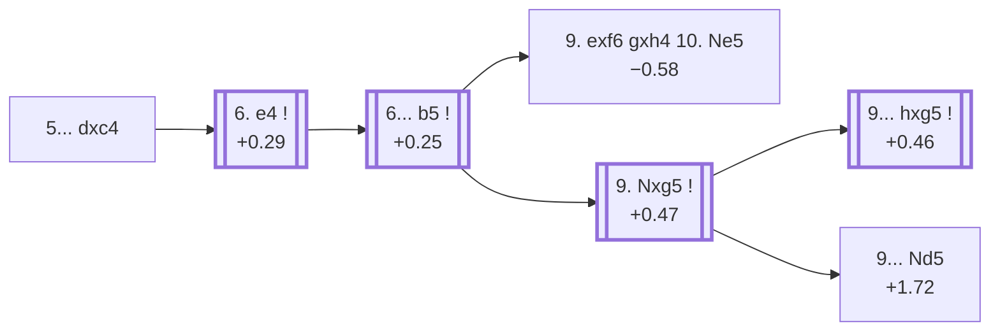

<a name="_TOP_"></a>

# D44 Queen's Gambit Declined: Semi-Slav Defense Accepted <br> 1. d4 d5 2. c4 e6 3. Nc3 Nf6 4. Nf3 c6 5. Bg5 dxc4 #

Spun off from [D43's own "4... c6" card](https://github.com/onclemarcel/chess_flashcards/blob/main/d4_openings/D43_Semi_Slav_Defense.md#_initial_move_) — masters' real main try there (47.2%), already live-tagged its own code. `eco.md` leaves this bare tabiya named only "5.Bg5 dc"; the live explorer independently names it the ***Semi-Slav Defense Accepted***.

### Overview

*Quick map of every move covered on this card — see the [shape key](https://github.com/onclemarcel/chess_flashcards/blob/main/start.md#content-diagram-optional) in start.md.*

<!-- content-diagram:start -->

<!-- content-diagram:end -->

<a name="_initial_move_"></a>

[](https://lichess.org/analysis/standard/rnbqkb1r/pp3ppp/2p1pn2/6B1/2pP4/2N2N2/PP2PPPP/R2QKB1R_w_KQkq_-_0_6)

*... 5... dxc4 — Semi-Slav Defense Accepted*

```
rnbqkb1r/pp3ppp/2p1pn2/6B1/2pP4/2N2N2/PP2PPPP/R2QKB1R w KQkq - 0 6
```

|  | +0.29 |
| --- | --- |

<!-- lichess-stats:start fen="rnbqkb1r/pp3ppp/2p1pn2/6B1/2pP4/2N2N2/PP2PPPP/R2QKB1R w KQkq - 0 6" db="lichess,masters" speeds="bullet,blitz" ratings="1800,2000,2200,2500" moves="4" -->
| Move | Online | W/D/B | Masters | W/D/B | |
| :--- | ---: | :--- | ---: | :--- | :-- |
| e4 | 305 k (51.5%) | ⬜⬜⬜⬜⬜⬛⬛⬛⬛⬛ 48/4/47 | 3.9 k (88.4%) | ⬜⬜⬜🟫🟫🟫🟫🟫⬛⬛ 33/48/18 |  |
| a4 | 139 k (23.5%) | ⬜⬜⬜⬜⬜⬛⬛⬛⬛⬛ 47/5/48 | 459 (10.3%) | ⬜⬜⬜⬜🟫🟫🟫🟫⬛⬛ 38/42/20 |  |
| e3 | 111 k (18.7%) | ⬜⬜⬜⬜⬜⬛⬛⬛⬛⬛ 47/4/48 | 40 (0.9%) | ⬜⬜🟫🟫⬛⬛⬛⬛⬛⬛ 15/25/60 |  |
| Bxf6 | 28 k (4.8%) | ⬜⬜⬜⬜⬜🟫⬛⬛⬛⬛ 51/5/44 | 0 | — | ⚠ |
| g3 | 0 | — | 16 (0.4%) | — |  |

*Online: bullet/blitz, 1800+ — 593 k games. Masters: 4.5 k games. [Open in the explorer](https://lichess.org/analysis/standard/rnbqkb1r/pp3ppp/2p1pn2/6B1/2pP4/2N2N2/PP2PPPP/R2QKB1R_w_KQkq_-_0_6#explorer) — updated 2026-09-15*
<!-- lichess-stats:end -->

Masters' overwhelming reply is **6. e4** (+0.29, 88.4%), grabbing the full centre before Black can consolidate the extra pawn.

* [**6. e4**](#_Botvinnik_) (88.4% masters): the *Botvinnik System* — covered below.

[*Back to TOP*](#_TOP_)

---

<a name="_Botvinnik_"></a>

## 6. e4 — Botvinnik System

[](https://lichess.org/analysis/standard/rnbqkb1r/pp3ppp/2p1pn2/6B1/2pPP3/2N2N2/PP3PPP/R2QKB1R_b_KQkq_e3_0_6)

*... 6. e4 — live-tagged the Botvinnik Variation*

```
rnbqkb1r/pp3ppp/2p1pn2/6B1/2pPP3/2N2N2/PP3PPP/R2QKB1R b KQkq e3 0 6
```

|  | +0.25 |
| --- | --- |

<!-- lichess-stats:start fen="rnbqkb1r/pp3ppp/2p1pn2/6B1/2pPP3/2N2N2/PP3PPP/R2QKB1R b KQkq e3 0 6" db="lichess,masters" speeds="bullet,blitz" ratings="1800,2000,2200,2500" moves="4" -->
| Move | Online | W/D/B | Masters | W/D/B | |
| :--- | ---: | :--- | ---: | :--- | :-- |
| b5 | 238 k (75.9%) | ⬜⬜⬜⬜⬜⬛⬛⬛⬛⬛ 46/4/49 | 3.9 k (99.4%) | ⬜⬜⬜🟫🟫🟫🟫🟫⬛⬛ 33/48/18 |  |
| Be7 | 54 k (17.2%) | ⬜⬜⬜⬜⬜⬜⬛⬛⬛⬛ 55/4/41 | 0 | — | ⚠ |
| h6 | 13 k (4.3%) | ⬜⬜⬜⬜⬜⬜⬛⬛⬛⬛ 55/4/41 | 13 (0.3%) | — |  |
| Bb4 | 3.6 k (1.1%) | ⬜⬜⬜⬜⬜⬜⬛⬛⬛⬛ 54/4/42 | 0 | — | ⚠ |
| Nbd7 | 0 | — | 2 (0.1%) | — |  |
| Qa5 | 0 | — | 2 (0.1%) | — |  |

*Online: bullet/blitz, 1800+ — 314 k games. Masters: 3.9 k games. [Open in the explorer](https://lichess.org/analysis/standard/rnbqkb1r/pp3ppp/2p1pn2/6B1/2pPP3/2N2N2/PP3PPP/R2QKB1R_b_KQkq_e3_0_6#explorer) — updated 2026-09-15*
<!-- lichess-stats:end -->

`eco.md` calls this the *Botvinnik System*; the live explorer spells it the ***Botvinnik Variation*** — a minor naming difference, not substantive, named for the sixth World Champion. Masters' near-forced reply is **6... b5** (+0.25, 99.4%), holding the extra pawn.

* [**6... b5**](#_b5_) (99.4% masters): see below.

[*Back to TOP*](#_TOP_)

---

<a name="_b5_"></a>

## 6... b5 7. e5 h6 8. Bh4 g5

[](https://lichess.org/analysis/standard/rnbqkb1r/p4p2/2p1pn1p/1p2P1p1/2pP3B/2N2N2/PP3PPP/R2QKB1R_w_KQkq_g6_0_9)

*... 8... g5 — the Anti-Meran/Ekstroem tabiya*

```
rnbqkb1r/p4p2/2p1pn1p/1p2P1p1/2pP3B/2N2N2/PP3PPP/R2QKB1R w KQkq g6 0 9
```

|  | +0.37 |
| --- | --- |

Left completely untagged live (`opening=None`) at this exact node, one of the most heavily analysed tabiyas in the whole Semi-Slav complex: the knight is attacked and White must choose how to meet the counterattack. Masters' clear main try is **9. Nxg5** (88.8%), grabbing the pawn back at once and heading for the *Anti-Meran Gambit*; **9. exf6** (8.3%) is the real, if secondary, *Ekstroem Variation*.

* [**9. exf6 gxh4 10. Ne5**](#_Ekstroem_) (−0.58, 8.3% masters): the *Ekstroem Variation* — covered below.
* [**9. Nxg5**](#_AntiMeranGambit_) (88.8% masters): the *Anti-Meran Gambit* — covered below.

[*Back to 6. e4*](#_Botvinnik_)
[*Back to TOP*](#_TOP_)

---

<a name="_Ekstroem_"></a>

## 9. exf6 gxh4 10. Ne5 — Ekstroem Variation

[](https://lichess.org/analysis/standard/rnbqkb1r/p4p2/2p1pP1p/1p2N3/2pP3p/2N5/PP3PPP/R2QKB1R_b_KQkq_-_1_10)

*... 10. Ne5 — Ekstroem Variation*

```
rnbqkb1r/p4p2/2p1pP1p/1p2N3/2pP3p/2N5/PP3PPP/R2QKB1R b KQkq - 1 10
```

|  | −0.58 |
| --- | --- |

`eco.md`'s name matches the live explorer's own inherited tag here (no independent name live at this exact node). Rather than recapture the gambit pawn, White pushes past and grabs the f6-pawn instead, banking on the advanced e5-knight — Stockfish already prefers Black here by over half a pawn, a real minority try (8.3% masters) at the fork above. Not built out further here (backlog).

[*Back to 6... b5*](#_b5_)
[*Back to TOP*](#_TOP_)

---

<a name="_AntiMeranGambit_"></a>

## 9. Nxg5 — Anti-Meran Gambit

[](https://lichess.org/analysis/standard/rnbqkb1r/p4p2/2p1pn1p/1p2P1N1/2pP3B/2N5/PP3PPP/R2QKB1R_b_KQkq_-_0_9)

*... 9. Nxg5 — live-tagged the Botvinnik Variation*

```
rnbqkb1r/p4p2/2p1pn1p/1p2P1N1/2pP3B/2N5/PP3PPP/R2QKB1R b KQkq - 0 9
```

|  | +0.47 |
| --- | --- |

`eco.md`'s name matches the live explorer's own inherited tag (this exact node carries no independent name live either, inheriting the Botvinnik Variation tag from its ancestor). Masters' near-forced reply is **9... hxg5** (97.5%), recapturing before White's own bishop can escape; **9... Nd5** stays put instead, the real minority *Alatortsev System*.

* [**9... hxg5 10. Bxg5 Nbd7**](#_Lilienthal_) (+0.46, 97.5% masters): forks the *Lilienthal*/*Szabo Variations* — covered below.
* [**9... Nd5**](#_Alatortsev_) (2.5% masters): the *Alatortsev System* — covered below.

[*Back to 6... b5*](#_b5_)
[*Back to TOP*](#_TOP_)

---

<a name="_Lilienthal_"></a>

## 9... hxg5 10. Bxg5 Nbd7 11. g3 — Lilienthal Variation

[](https://lichess.org/analysis/standard/r1bqkb1r/p2n1p2/2p1pn2/1p2P1B1/2pP4/2N3P1/PP3P1P/R2QKB1R_b_KQkq_-_0_11)

*... 11. g3 — Lilienthal Variation*

```
r1bqkb1r/p2n1p2/2p1pn2/1p2P1B1/2pP4/2N3P1/PP3P1P/R2QKB1R b KQkq - 0 11
```

|  | +0.46 |
| --- | --- |

`eco.md`'s name matches the live explorer here — named for Soviet grandmaster Andor Lilienthal. Fianchettoes the king's bishop before deciding on the queen's own placement, one of two named tries at this exact fork.

* [**11. Qf3**](#_Szabo_): the *Szabo Variation* — covered below.

[*Back to 9. Nxg5*](#_AntiMeranGambit_)
[*Back to TOP*](#_TOP_)

---

<a name="_Szabo_"></a>

## 9... hxg5 10. Bxg5 Nbd7 11. Qf3 — Szabo Variation

[](https://lichess.org/analysis/standard/r1bqkb1r/p2n1p2/2p1pn2/1p2P1B1/2pP4/2N2Q2/PP3PPP/R3KB1R_b_KQkq_-_2_11)

*... 11. Qf3 — Szabo Variation*

```
r1bqkb1r/p2n1p2/2p1pn2/1p2P1B1/2pP4/2N2Q2/PP3PPP/R3KB1R b KQkq - 2 11
```

|  | +0.00 |
| --- | --- |

`eco.md`'s name matches the live explorer here — named for Hungarian grandmaster László Szabó. Develops the queen actively toward the kingside instead of fianchettoing, dead level according to Stockfish. Not built out further here (backlog).

[*Back to 9. Nxg5*](#_AntiMeranGambit_)
[*Back to TOP*](#_TOP_)

---

<a name="_Alatortsev_"></a>

## 9... Nd5 — Alatortsev System

[](https://lichess.org/analysis/standard/rnbqkb1r/p4p2/2p1p2p/1p1nP1N1/2pP3B/2N5/PP3PPP/R2QKB1R_w_KQkq_-_1_10)

*... 9... Nd5 — Alatortsev System*

```
rnbqkb1r/p4p2/2p1p2p/1p1nP1N1/2pP3B/2N5/PP3PPP/R2QKB1R w KQkq - 1 10
```

|  | +1.72 |
| --- | --- |

`eco.md`'s name matches the live explorer's own inherited tag here — the same Alatortsev already lending his name to D22's own unrelated Alekhine Defense line. Sidesteps the recapture entirely, rerouting the knight instead — a genuine database rarity (2.5% masters), and Stockfish already gives White a very large advantage. Not built out further here (backlog).

[*Back to 9. Nxg5*](#_AntiMeranGambit_)
[*Back to TOP*](#_TOP_)
